**\[MS-PST\]:**

**Outlook Personal Folders (.pst) File Format**

Intellectual Property Rights Notice for Open Specifications
Documentation

- **Technical Documentation.** Microsoft publishes Open Specifications
  documentation (“this documentation”) for protocols, file formats, data
  portability, computer languages, and standards support. Additionally,
  overview documents cover inter-protocol relationships and
  interactions.

- **Copyrights**. This documentation is covered by Microsoft copyrights.
  Regardless of any other terms that are contained in the terms of use
  for the Microsoft website that hosts this documentation, you can make
  copies of it in order to develop implementations of the technologies
  that are described in this documentation and can distribute portions
  of it in your implementations that use these technologies or in your
  documentation as necessary to properly document the implementation.
  You can also distribute in your implementation, with or without
  modification, any schemas, IDLs, or code samples that are included in
  the documentation. This permission also applies to any documents that
  are referenced in the Open Specifications documentation.

- **No Trade Secrets**. Microsoft does not claim any trade secret rights
  in this documentation.

- **Patents**. Microsoft has patents that might cover your
  implementations of the technologies described in the Open
  Specifications documentation. Neither this notice nor Microsoft's
  delivery of this documentation grants any licenses under those patents
  or any other Microsoft patents. However, a given Open Specifications
  document might be covered by the Microsoft Open Specifications Promise
  or the Microsoft Community Promise. If you would prefer a written
  license, or if the technologies described in this documentation are
  not covered by the Open Specifications Promise or Community Promise,
  as applicable, patent licenses are available by contacting
  iplg@microsoft.com.

- **License Programs**. To see all of the protocols in scope under a
  specific license program and the associated patents, visit the Patent
  Map.

- **Trademarks**. The names of companies and products contained in this
  documentation might be covered by trademarks or similar intellectual
  property rights. This notice does not grant any licenses under those
  rights. For a list of Microsoft trademarks, visit
  www.microsoft.com/trademarks.

- **Fictitious Names**. The example companies, organizations, products,
  domain names, email addresses, logos, people, places, and events that
  are depicted in this documentation are fictitious. No association with
  any real company, organization, product, domain name, email address,
  logo, person, place, or event is intended or should be inferred.

**Reservation of Rights**. All other rights are reserved, and this
notice does not grant any rights other than as specifically described
above, whether by implication, estoppel, or otherwise.

**Tools**. The Open Specifications documentation does not require the
use of Microsoft programming tools or programming environments in order
for you to develop an implementation. If you have access to Microsoft
programming tools and environments, you are free to take advantage of
them. Certain Open Specifications documents are intended for use in
conjunction with publicly available standards specifications and network
programming art and, as such, assume that the reader either is familiar
with the aforementioned material or has immediate access to it.

**Support.** For questions and support, please contact
dochelp@microsoft.com.

**Revision Summary**

| Date       | Revision History | Revision Class | Comments                                                                     |
|------------|------------------|----------------|------------------------------------------------------------------------------|
| 2/19/2010  | 1.0              | Major          | Initial Availability                                                         |
| 3/31/2010  | 1.01             | Editorial      | Revised and edited the technical content                                     |
| 4/30/2010  | 1.02             | Editorial      | Revised and edited the technical content                                     |
| 6/7/2010   | 1.03             | Editorial      | Revised and edited the technical content                                     |
| 6/29/2010  | 1.04             | Editorial      | Changed language and formatting in the technical content.                    |
| 7/23/2010  | 1.05             | Minor          | Clarified the meaning of the technical content.                              |
| 9/27/2010  | 1.05             | None           | No changes to the meaning, language, or formatting of the technical content. |
| 11/15/2010 | 1.05             | None           | No changes to the meaning, language, or formatting of the technical content. |
| 12/17/2010 | 1.06             | Editorial      | Changed language and formatting in the technical content.                    |
| 3/18/2011  | 1.06             | None           | No changes to the meaning, language, or formatting of the technical content. |
| 6/10/2011  | 1.06             | None           | No changes to the meaning, language, or formatting of the technical content. |
| 1/20/2012  | 1.7              | Minor          | Clarified the meaning of the technical content.                              |
| 4/11/2012  | 1.7              | None           | No changes to the meaning, language, or formatting of the technical content. |
| 7/16/2012  | 1.7              | None           | No changes to the meaning, language, or formatting of the technical content. |
| 10/8/2012  | 1.8              | Minor          | Clarified the meaning of the technical content.                              |
| 2/11/2013  | 1.8              | None           | No changes to the meaning, language, or formatting of the technical content. |
| 7/30/2013  | 1.8              | None           | No changes to the meaning, language, or formatting of the technical content. |
| 11/18/2013 | 2.0              | Major          | Significantly changed the technical content.                                 |
| 2/10/2014  | 2.1              | Minor          | Clarified the meaning of the technical content.                              |
| 4/30/2014  | 3.0              | Major          | Significantly changed the technical content.                                 |
| 7/31/2014  | 3.1              | Minor          | Clarified the meaning of the technical content.                              |
| 10/30/2014 | 3.1              | None           | No changes to the meaning, language, or formatting of the technical content. |
| 3/16/2015  | 4.0              | Major          | Significantly changed the technical content.                                 |
| 9/4/2015   | 5.0              | Major          | Significantly changed the technical content.                                 |
| 7/15/2016  | 5.1              | Minor          | Clarified the meaning of the technical content.                              |
| 9/14/2016  | 5.2              | Minor          | Clarified the meaning of the technical content.                              |
| 5/9/2017   | 5.3              | Minor          | Clarified the meaning of the technical content.                              |
| 9/19/2017  | 5.4              | Minor          | Clarified the meaning of the technical content.                              |
| 12/12/2017 | 5.4              | None           | No changes to the meaning, language, or formatting of the technical content. |
| 4/27/2018  | 6.0              | Major          | Significantly changed the technical content.                                 |
| 8/28/2018  | 7.0              | Major          | Significantly changed the technical content.                                 |
| 3/19/2019  | 7.1              | Minor          | Clarified the meaning of the technical content.                              |
| 9/24/2019  | 7.2              | Minor          | Clarified the meaning of the technical content.                              |
| 5/19/2020  | 7.3              | Minor          | Clarified the meaning of the technical content.                              |
| 8/18/2020  | 7.4              | Minor          | Clarified the meaning of the technical content.                              |
| 11/17/2020 | 7.5              | Minor          | Clarified the meaning of the technical content.                              |
| 2/16/2021  | 7.6              | Minor          | Clarified the meaning of the technical content.                              |
| 4/22/2021  | 8.0              | Major          | Significantly changed the technical content.                                 |
| 8/17/2021  | 9.0              | Major          | Significantly changed the technical content.                                 |
| 11/16/2021 | 9.1              | Minor          | Clarified the meaning of the technical content.                              |
| 2/15/2022  | 9.2              | Minor          | Clarified the meaning of the technical content.                              |

Table of Contents

[1 Introduction 10](#introduction)

[1.1 Glossary 10](#glossary)

[1.2 References 11](#references)

[1.2.1 Normative References 11](#normative-references)

[1.2.2 Informative References 11](#informative-references)

[1.3 Structure Overview 11](#structure-overview)

[1.3.1 Logical Architecture of a PST File
11](#logical-architecture-of-a-pst-file)

[1.3.1.1 Node Database (NDB) Layer 12](#node-database-ndb-layer)

[1.3.1.2 Lists, Tables, and Properties (LTP) Layer
13](#lists-tables-and-properties-ltp-layer)

[1.3.1.2.1 Heap-on-Node (HN) 13](#heap-on-node-hn)

[1.3.1.2.2 BTree-on-Heap (BTH) 13](#btree-on-heap-bth)

[1.3.1.3 Messaging Layer 13](#messaging-layer)

[1.3.2 Physical Organization of the PST File Format
14](#physical-organization-of-the-pst-file-format)

[1.3.2.1 Header 14](#header)

[1.3.2.1.1 Metadata and State of the PST File
14](#metadata-and-state-of-the-pst-file)

[1.3.2.1.2 Root Record 14](#root-record)

[1.3.2.1.3 Initial Free Map (FMap) and Free Page Map (FPMap)
15](#initial-free-map-fmap-and-free-page-map-fpmap)

[1.3.2.2 Reserved Data 15](#reserved-data)

[1.3.2.3 Density List (DList) 15](#density-list-dlist)

[1.3.2.4 Allocation Map (AMap) 15](#allocation-map-amap)

[1.3.2.5 Page Map (PMap) 15](#page-map-pmap)

[1.3.2.6 Data Section 15](#data-section)

[1.3.2.7 Free Map (FMap) 15](#free-map-fmap)

[1.3.2.8 Free Page Maps (FPMap) 16](#free-page-maps-fpmap)

[1.4 Relationship to Protocols and Other Structures
16](#relationship-to-protocols-and-other-structures)

[1.5 Applicability Statement 16](#applicability-statement)

[1.6 Versioning and Localization 16](#versioning-and-localization)

[1.7 Vendor-Extensible Fields 16](#vendor-extensible-fields)

[2 Structures 17](#structures)

[2.1 Property and Data Type Definitions
17](#property-and-data-type-definitions)

[2.1.1 Data Types 17](#data-types)

[2.1.2 Properties 18](#properties)

[2.2 NDB Layer 18](#ndb-layer)

[2.2.1 Fundamental Concepts 18](#fundamental-concepts)

[2.2.1.1 Nodes 18](#nodes)

[2.2.1.2 ANSI Versus Unicode 19](#ansi-versus-unicode)

[2.2.2 Data Structures 19](#data-structures)

[2.2.2.1 NID (Node ID) 19](#nid-node-id)

[2.2.2.2 BID (Block ID) 20](#bid-block-id)

[2.2.2.3 IB (Byte Index) 21](#ib-byte-index)

[2.2.2.4 BREF 21](#bref)

[2.2.2.5 ROOT 21](#root)

[2.2.2.6 HEADER 23](#header-1)

[2.2.2.7 Pages 28](#pages)

[2.2.2.7.1 PAGETRAILER 28](#pagetrailer)

[2.2.2.7.2 AMap (Allocation Map) Page 29](#amap-allocation-map-page)

[2.2.2.7.2.1 AMAPPAGE 29](#amappage)

[2.2.2.7.3 PMap (Page Map) Page 30](#pmap-page-map-page)

[2.2.2.7.3.1 PMAPPAGE 31](#pmappage)

[2.2.2.7.4 Density List (DList) 32](#density-list-dlist-1)

[2.2.2.7.4.1 DLISTPAGEENT 32](#dlistpageent)

[2.2.2.7.4.2 DLISTPAGE 32](#dlistpage)

[2.2.2.7.5 FMap (Free Map) Page 34](#fmap-free-map-page)

[2.2.2.7.5.1 FMAPPAGE 34](#fmappage)

[2.2.2.7.6 FPMap (Free Page Map) Page 35](#fpmap-free-page-map-page)

[2.2.2.7.6.1 FPMAPPAGE 35](#fpmappage)

[2.2.2.7.7 BTrees 36](#btrees)

[2.2.2.7.7.1 BTPAGE 36](#btpage)

[2.2.2.7.7.2 BTENTRY (Intermediate Entries)
37](#btentry-intermediate-entries)

[2.2.2.7.7.3 BBTENTRY (Leaf BBT Entry) 38](#bbtentry-leaf-bbt-entry)

[2.2.2.7.7.3.1 Reference Counts 39](#reference-counts)

[2.2.2.7.7.4 NBTENTRY (Leaf NBT Entry) 39](#nbtentry-leaf-nbt-entry)

[2.2.2.7.7.4.1 Parent NID 41](#parent-nid)

[2.2.2.8 Blocks 41](#blocks)

[2.2.2.8.1 BLOCKTRAILER 41](#blocktrailer)

[2.2.2.8.2 Anatomy of a Block 42](#anatomy-of-a-block)

[2.2.2.8.3 Block Types 43](#block-types)

[2.2.2.8.3.1 Data Blocks 43](#data-blocks)

[2.2.2.8.3.1.1 Data Block Encoding/Obfuscation
44](#data-block-encodingobfuscation)

[2.2.2.8.3.2 Data Tree 44](#data-tree)

[2.2.2.8.3.2.1 XBLOCK 44](#xblock)

[2.2.2.8.3.2.2 XXBLOCK 46](#xxblock)

[2.2.2.8.3.3 Subnode BTree 47](#subnode-btree)

[2.2.2.8.3.3.1 SLBLOCKs 47](#slblocks)

[2.2.2.8.3.3.1.1 SLENTRY (Leaf Block Entry)
47](#slentry-leaf-block-entry)

[2.2.2.8.3.3.1.2 SLBLOCK 48](#slblock)

[2.2.2.8.3.3.2 SIBLOCKs 49](#siblocks)

[2.2.2.8.3.3.2.1 SIENTRY (Intermediate Block Entry)
49](#sientry-intermediate-block-entry)

[2.2.2.8.3.3.2.2 SIBLOCK 50](#siblock)

[2.3 LTP Layer 51](#ltp-layer)

[2.3.1 HN (Heap-on-Node) 52](#hn-heap-on-node)

[2.3.1.1 HID 52](#hid)

[2.3.1.2 HNHDR 52](#hnhdr)

[2.3.1.3 HNPAGEHDR 54](#hnpagehdr)

[2.3.1.4 HNBITMAPHDR 54](#hnbitmaphdr)

[2.3.1.5 HNPAGEMAP 54](#hnpagemap)

[2.3.1.6 Anatomy of HN Data Blocks 56](#anatomy-of-hn-data-blocks)

[2.3.1.6.1 Single-Block Configuration 56](#single-block-configuration)

[2.3.1.6.2 Data Tree Configuration 56](#data-tree-configuration)

[2.3.2 BTree-on-Heap (BTH) 57](#btree-on-heap-bth-1)

[2.3.2.1 BTHHEADER 57](#bthheader)

[2.3.2.2 Intermediate BTH (Index) Records
58](#intermediate-bth-index-records)

[2.3.2.3 Leaf BTH (Data) Records 58](#leaf-bth-data-records)

[2.3.3 Property Context (PC) 59](#property-context-pc)

[2.3.3.1 Accessing the PC BTHHEADER 59](#accessing-the-pc-bthheader)

[2.3.3.2 HNID 59](#hnid)

[2.3.3.3 PC BTH Record 59](#pc-bth-record)

[2.3.3.4 Multi-Valued Properties 60](#multi-valued-properties)

[2.3.3.4.1 MV Properties with Fixed-size Base Type
60](#mv-properties-with-fixed-size-base-type)

[2.3.3.4.2 MV Properties with Variable-size Base Type
60](#mv-properties-with-variable-size-base-type)

[2.3.3.5 PtypObject Properties 61](#ptypobject-properties)

[2.3.3.6 Anatomy of a PC 61](#anatomy-of-a-pc)

[2.3.4 Table Context (TC) 62](#table-context-tc)

[2.3.4.1 TCINFO 64](#tcinfo)

[2.3.4.2 TCOLDESC 65](#tcoldesc)

[2.3.4.3 The RowIndex 65](#the-rowindex)

[2.3.4.3.1 TCROWID 65](#tcrowid)

[2.3.4.4 Row Matrix 66](#row-matrix)

[2.3.4.4.1 Row Data Format 67](#row-data-format)

[2.3.4.4.2 Variable-sized Data 68](#variable-sized-data)

[2.3.4.4.3 Cell Existence Test 69](#cell-existence-test)

[2.4 Messaging Layer 69](#messaging-layer-1)

[2.4.1 Special Internal NIDs 70](#special-internal-nids)

[2.4.2 Properties 70](#properties-1)

[2.4.2.1 Standard Properties 70](#standard-properties)

[2.4.2.2 Named Properties 71](#named-properties)

[2.4.2.3 Calculated Properties 71](#calculated-properties)

[2.4.3 Message Store 71](#message-store)

[2.4.3.1 Minimum Set of Required Properties
71](#minimum-set-of-required-properties)

[2.4.3.2 Mapping between EntryID and NID
72](#mapping-between-entryid-and-nid)

[2.4.3.3 PST Password Security 72](#pst-password-security)

[2.4.4 Folders 72](#folders)

[2.4.4.1 Folder object PC 73](#folder-object-pc)

[2.4.4.1.1 Property Schema of a Folder object PC
73](#property-schema-of-a-folder-object-pc)

[2.4.4.1.2 Locating the Parent Folder object
73](#locating-the-parent-folder-object)

[2.4.4.2 Folder Template Tables 74](#folder-template-tables)

[2.4.4.3 Data Duplication and Coherency Maintenance
74](#data-duplication-and-coherency-maintenance)

[2.4.4.4 Hierarchy Table 74](#hierarchy-table)

[2.4.4.4.1 Hierarchy Table Template 74](#hierarchy-table-template)

[2.4.4.4.2 Locating Sub-Folder Object Nodes
75](#locating-sub-folder-object-nodes)

[2.4.4.5 Contents Table 75](#contents-table)

[2.4.4.5.1 Contents Table Template 75](#contents-table-template)

[2.4.4.5.2 Locating Message Object Nodes
76](#locating-message-object-nodes)

[2.4.4.6 FAI Contents Table 77](#fai-contents-table)

[2.4.4.6.1 FAI Contents Table Template 77](#fai-contents-table-template)

[2.4.4.7 Anatomy of a Folder Hierarchy
78](#anatomy-of-a-folder-hierarchy)

[2.4.4.8 Implications of Modifying a Folder Template Table
79](#implications-of-modifying-a-folder-template-table)

[2.4.4.9 Implications of Modifying a Folder Object TC
79](#implications-of-modifying-a-folder-object-tc)

[2.4.5 Message Objects 79](#message-objects)

[2.4.5.1 Message Object PC 80](#message-object-pc)

[2.4.5.1.1 Property Schema of a Message Object PC
80](#property-schema-of-a-message-object-pc)

[2.4.5.2 Locating the Parent Folder Object of a Message Object
80](#locating-the-parent-folder-object-of-a-message-object)

[2.4.5.3 Recipient Table 81](#recipient-table)

[2.4.5.3.1 Recipient Table Template 81](#recipient-table-template)

[2.4.5.3.2 Message Object Recipient Tables
81](#message-object-recipient-tables)

[2.4.6 Attachment Objects 81](#attachment-objects)

[2.4.6.1 Attachment Table 82](#attachment-table)

[2.4.6.1.1 Attachment Table Template 82](#attachment-table-template)

[2.4.6.1.2 Message Object Attachment Tables
82](#message-object-attachment-tables)

[2.4.6.1.3 Locating Attachment Object Nodes from the Attachment Table
82](#locating-attachment-object-nodes-from-the-attachment-table)

[2.4.6.2 Attachment Object PC 83](#attachment-object-pc)

[2.4.6.2.1 Property Schema of an Attachment Object PC
83](#property-schema-of-an-attachment-object-pc)

[2.4.6.2.2 Attachment Data 83](#attachment-data)

[2.4.6.3 Relationship between Attachment Table and Attachment objects
83](#relationship-between-attachment-table-and-attachment-objects)

[2.4.7 Named Property Lookup Map 84](#named-property-lookup-map)

[2.4.7.1 NAMEID 84](#nameid)

[2.4.7.2 GUID Stream 85](#guid-stream)

[2.4.7.3 Entry Stream 85](#entry-stream)

[2.4.7.4 The String Stream 85](#the-string-stream)

[2.4.7.5 Hash Table 85](#hash-table)

[2.4.7.6 Data Organization of the Name-to-ID Map
86](#data-organization-of-the-name-to-id-map)

[2.4.8 Search 87](#search)

[2.4.8.1 Search Update Descriptor (SUD)
88](#search-update-descriptor-sud)

[2.4.8.1.1 SUD Structure 88](#sud-structure)

[2.4.8.2 SUDData Structures 90](#suddata-structures)

[2.4.8.2.1 SUD_MSG_ADD / SUD_MSG_MOD / SUD_MSG_DEL Structure
90](#sud_msg_add-sud_msg_mod-sud_msg_del-structure)

[2.4.8.2.2 SUD_MSG_MOV Structure 90](#sud_msg_mov-structure)

[2.4.8.2.3 SUD_FLD_ADD / SUD_FLD_MOV Structure
91](#sud_fld_add-sud_fld_mov-structure)

[2.4.8.2.4 SUD_FLD_MOD / SUD_FLD_DEL Structure
91](#sud_fld_mod-sud_fld_del-structure)

[2.4.8.2.5 SUD_SRCH_ADD / SUD_SRCH_DEL Structure
92](#sud_srch_add-sud_srch_del-structure)

[2.4.8.2.6 SUD_SRCH_MOD Structure 92](#sud_srch_mod-structure)

[2.4.8.2.7 SUD_MSG_SPAM Structure 92](#sud_msg_spam-structure)

[2.4.8.2.8 SUD_IDX_MSG_DEL Structure 92](#sud_idx_msg_del-structure)

[2.4.8.2.9 SUD_MSG_IDX Structure 93](#sud_msg_idx-structure)

[2.4.8.3 Basic Queue Node 93](#basic-queue-node)

[2.4.8.4 Search Management Object (SMO)
94](#search-management-object-smo)

[2.4.8.4.1 Search Management Queue (SMQ)
94](#search-management-queue-smq)

[2.4.8.4.2 Search Activity List (SAL) 94](#search-activity-list-sal)

[2.4.8.4.3 Search Domain Object (SDO) 94](#search-domain-object-sdo)

[2.4.8.5 Search Gatherer Object (SGO) 94](#search-gatherer-object-sgo)

[2.4.8.5.1 Search Gatherer Queue (SGQ) 94](#search-gatherer-queue-sgq)

[2.4.8.5.2 Search Gatherer Descriptor (SGD)
94](#search-gatherer-descriptor-sgd)

[2.4.8.5.3 Search Gatherer Folder Queue (SGFQ)
95](#search-gatherer-folder-queue-sgfq)

[2.4.8.6 Search Folder Objects 95](#search-folder-objects)

[2.4.8.6.1 Search Folder Object (SF) 95](#search-folder-object-sf)

[2.4.8.6.2 Search Folder Object Contents Table (SFCT)
95](#search-folder-object-contents-table-sfct)

[2.4.8.6.2.1 Search Folder Contents Table Template
95](#search-folder-contents-table-template)

[2.4.8.6.3 Search Update Queue (SUQ) 96](#search-update-queue-suq)

[2.4.8.6.4 Search Criteria Object (SCO) 96](#search-criteria-object-sco)

[2.5 Calculated Properties 96](#calculated-properties-1)

[2.5.1 Attributes of a Calculated Property
96](#attributes-of-a-calculated-property)

[2.5.2 Calculated Properties by Object Type
97](#calculated-properties-by-object-type)

[2.5.2.1 Message Store 97](#message-store-1)

[2.5.2.2 Folder Objects 98](#folder-objects)

[2.5.2.3 Message Objects 99](#message-objects-1)

[2.5.2.4 Embedded Message Objects 102](#embedded-message-objects)

[2.5.2.5 Attachment Objects 104](#attachment-objects-1)

[2.5.3 Calculated Property Behaviors
104](#calculated-property-behaviors)

[2.5.3.1 Behavior Descriptors for Get Operations
105](#behavior-descriptors-for-get-operations)

[2.5.3.1.1 Message Subject Handling Considerations
108](#message-subject-handling-considerations)

[2.5.3.1.1.1 Obtaining the Prefix and Normalized Subject from
PidTagSubject
108](#obtaining-the-prefix-and-normalized-subject-from-pidtagsubject)

[2.5.3.1.1.2 Rules for Parsing the Subject Prefix
108](#rules-for-parsing-the-subject-prefix)

[2.5.3.2 Behavior Descriptors for Set Operations
108](#behavior-descriptors-for-set-operations)

[2.5.3.3 Behavior Descriptors for Delete Operations
109](#behavior-descriptors-for-delete-operations)

[2.5.3.4 Interpreting the List Behavior Column
110](#interpreting-the-list-behavior-column)

[2.6 Maintaining Data Integrity 110](#maintaining-data-integrity)

[2.6.1 NDB Layer 111](#ndb-layer-1)

[2.6.1.1 Basic Operations 112](#basic-operations)

[2.6.1.1.1 Allocating Space from the PST
112](#allocating-space-from-the-pst)

[2.6.1.1.2 Growing the PST File 112](#growing-the-pst-file)

[2.6.1.1.3 Freeing Space Back to the PST
112](#freeing-space-back-to-the-pst)

[2.6.1.1.4 Creating a Page 113](#creating-a-page)

[2.6.1.1.5 Creating a Block 113](#creating-a-block)

[2.6.1.1.6 Freeing a Page in the PST 114](#freeing-a-page-in-the-pst)

[2.6.1.1.7 Dropping the Reference Count of a Block
114](#dropping-the-reference-count-of-a-block)

[2.6.1.1.8 Modifying a Page 115](#modifying-a-page)

[2.6.1.1.9 Modifying a Block 115](#modifying-a-block)

[2.6.1.2 NDB Operations 116](#ndb-operations)

[2.6.1.2.1 Creating a New Node 116](#creating-a-new-node)

[2.6.1.2.2 Creating or Adding a Subnode Entry
116](#creating-or-adding-a-subnode-entry)

[2.6.1.2.3 Modifying Node Data 117](#modifying-node-data)

[2.6.1.2.4 Duplicating the Contents of One Node to Another
117](#duplicating-the-contents-of-one-node-to-another)

[2.6.1.2.5 Modifying Subnode Entry Data
118](#modifying-subnode-entry-data)

[2.6.1.2.6 Deleting a Subnode 118](#deleting-a-subnode)

[2.6.1.2.7 Deleting a Node 119](#deleting-a-node)

[2.6.1.3 Special Considerations 119](#special-considerations)

[2.6.1.3.1 Immutability 119](#immutability)

[2.6.1.3.2 Single-Instance Storage 120](#single-instance-storage)

[2.6.1.3.3 Transactional Semantics 120](#transactional-semantics)

[2.6.1.3.4 Backfilling 120](#backfilling)

[2.6.1.3.5 Internal Fragmentation and Locality of Reference
120](#internal-fragmentation-and-locality-of-reference)

[2.6.1.3.6 Caching 121](#caching)

[2.6.1.3.7 Crash Recovery and AMap Rebuilding
121](#crash-recovery-and-amap-rebuilding)

[2.6.2 LTP Layer 121](#ltp-layer-1)

[2.6.2.1 HN Operations 122](#hn-operations)

[2.6.2.1.1 Creating an HN 122](#creating-an-hn)

[2.6.2.1.2 Allocating from the HN 122](#allocating-from-the-hn)

[2.6.2.1.3 Freeing an Allocation 123](#freeing-an-allocation)

[2.6.2.1.4 Deleting an HN 123](#deleting-an-hn)

[2.6.2.2 BTH Operations 123](#bth-operations)

[2.6.2.2.1 Creating a BTH 123](#creating-a-bth)

[2.6.2.2.2 Inserting into the BTH 124](#inserting-into-the-bth)

[2.6.2.2.3 Modifying Contents of a BTH Entry
124](#modifying-contents-of-a-bth-entry)

[2.6.2.2.4 Deleting a BTH Entry 125](#deleting-a-bth-entry)

[2.6.2.2.5 Deleting a BTH 125](#deleting-a-bth)

[2.6.2.3 PC Operations 125](#pc-operations)

[2.6.2.3.1 Creating a PC 125](#creating-a-pc)

[2.6.2.3.2 Inserting into the PC 126](#inserting-into-the-pc)

[2.6.2.3.3 Modifying the Value of a Property
126](#modifying-the-value-of-a-property)

[2.6.2.3.4 Deleting a Property 127](#deleting-a-property)

[2.6.2.3.5 Deleting a PC 127](#deleting-a-pc)

[2.6.2.4 TC Operations 127](#tc-operations)

[2.6.2.4.1 Creating a TC 127](#creating-a-tc)

[2.6.2.4.2 Inserting into the TC 128](#inserting-into-the-tc)

[2.6.2.4.3 Modifying Contents of a Table Row
128](#modifying-contents-of-a-table-row)

[2.6.2.4.4 Adding a Column 129](#adding-a-column)

[2.6.2.4.5 Deleting the Value of a Column
129](#deleting-the-value-of-a-column)

[2.6.2.4.6 Deleting a Column 129](#deleting-a-column)

[2.6.2.4.7 Deleting a Row 129](#deleting-a-row)

[2.6.2.4.8 Deleting a TC 130](#deleting-a-tc)

[2.6.3 Messaging Layer 130](#messaging-layer-2)

[2.6.3.1 Message Store Operations 131](#message-store-operations)

[2.6.3.1.1 Creating the Message Store 131](#creating-the-message-store)

[2.6.3.1.2 Modifying Properties of the Message Store
131](#modifying-properties-of-the-message-store)

[2.6.3.2 Folder Object Operations 132](#folder-object-operations)

[2.6.3.2.1 Creating a Folder Object 132](#creating-a-folder-object)

[2.6.3.2.2 Modifying Properties of a Folder Object
132](#modifying-properties-of-a-folder-object)

[2.6.3.2.3 Adding a Sub-Folder Object 133](#adding-a-sub-folder-object)

[2.6.3.2.4 Moving a Folder Object 133](#moving-a-folder-object)

[2.6.3.2.5 Copying a Folder Object 133](#copying-a-folder-object)

[2.6.3.2.6 Adding a Message Object 134](#adding-a-message-object)

[2.6.3.2.7 Copying a Message Object 134](#copying-a-message-object)

[2.6.3.2.8 Moving a Message Object 135](#moving-a-message-object)

[2.6.3.2.9 Deleting a Sub-Folder Object
135](#deleting-a-sub-folder-object)

[2.6.3.2.10 Deleting a Message Object 136](#deleting-a-message-object)

[2.6.3.3 Message Object Operations 136](#message-object-operations)

[2.6.3.3.1 Creating a Message Object 136](#creating-a-message-object)

[2.6.3.3.2 Modifying Properties of a Message Object
136](#modifying-properties-of-a-message-object)

[2.6.3.3.3 Adding a Recipient 137](#adding-a-recipient)

[2.6.3.3.4 Modifying Recipient Properties
137](#modifying-recipient-properties)

[2.6.3.3.5 Adding an Attachment Object
138](#adding-an-attachment-object)

[2.6.3.3.6 Modifying Properties of an Attachment Object
138](#modifying-properties-of-an-attachment-object)

[2.6.3.3.7 Deleting a Recipient 139](#deleting-a-recipient)

[2.6.3.3.8 Deleting an Attachment Object
139](#deleting-an-attachment-object)

[2.6.3.4 Name-to-ID Map Operations 139](#name-to-id-map-operations)

[2.6.3.4.1 Creating the Name-to-ID Map
139](#creating-the-name-to-id-map)

[2.6.3.4.2 Adding a Named Property 140](#adding-a-named-property)

[2.6.3.4.3 Deleting a Named Property 140](#deleting-a-named-property)

[2.7 Minimum PST Requirements 140](#minimum-pst-requirements)

[2.7.1 Mandatory Nodes 141](#mandatory-nodes)

[2.7.2 Minimum Folder Hierarchy 142](#minimum-folder-hierarchy)

[2.7.3 Minimum Object Requirements 142](#minimum-object-requirements)

[2.7.3.1 Message Store 142](#message-store-2)

[2.7.3.2 Name-to-ID Map 142](#name-to-id-map)

[2.7.3.3 Template Objects 142](#template-objects)

[2.7.3.4 Folders 143](#folders-1)

[2.7.3.4.1 Root Folder 143](#root-folder)

[2.7.3.4.2 Top of Personal Folders (IPM SuBTree)
143](#top-of-personal-folders-ipm-subtree)

[2.7.3.4.3 Search Root 143](#search-root)

[2.7.3.4.4 Spam Search Folder 144](#spam-search-folder)

[2.7.3.4.5 Deleted Items 144](#deleted-items)

[2.7.3.5 Search-Related Objects 144](#search-related-objects)

[3 Structure Examples 145](#structure-examples)

[3.1 Sample Node Database (NDB) 145](#sample-node-database-ndb)

[3.2 Sample Header 146](#sample-header)

[3.3 Sample Intermediate BT Page 148](#sample-intermediate-bt-page)

[3.4 Sample Leaf NBT Page 149](#sample-leaf-nbt-page)

[3.5 Sample Leaf BBT Page 150](#sample-leaf-bbt-page)

[3.6 Sample Data Tree 151](#sample-data-tree)

[3.7 Sample SLBLOCK 151](#sample-slblock)

[3.8 Sample Heap-on-Node (HN) 152](#sample-heap-on-node-hn)

[3.9 Sample BTH 152](#sample-bth)

[3.10 Sample Message Store 153](#sample-message-store)

[3.11 Sample TC 154](#sample-tc)

[3.12 Sample Folder Object 155](#sample-folder-object)

[3.13 Sample Message Object 158](#sample-message-object)

[4 Security Considerations 167](#security-considerations)

[4.1 Strength of Encoded PST Data Blocks
167](#strength-of-encoded-pst-data-blocks)

[4.2 Strength of PST Password 167](#strength-of-pst-password)

[5 Appendix A: PST Data Algorithms 168](#appendix-a-pst-data-algorithms)

[5.1 Permutative Encoding 168](#permutative-encoding)

[5.2 Cyclic Encoding 170](#cyclic-encoding)

[5.3 CRC Calculation 171](#crc-calculation)

[5.4 Conversation ID 179](#conversation-id)

[5.5 Block Signature 181](#block-signature)

[6 Appendix B: Product Behavior 182](#appendix-b-product-behavior)

[7 Change Tracking 184](#change-tracking)

# Introduction

The Outlook Personal Folders (.pst) File Format specifies the necessary
technical information required to read and write the contents of a
Personal Folders File (PST). This document also specifies the minimum
requirements for a PST file to be recognizable as valid in order for
implementers to create PST files that can be mounted and used by other
implementations of the specification.

Sections 1.7 and 2 of this specification are normative. All other
sections and examples in this specification are informative.

## Glossary

This document uses the following terms:

> **Attachment object**: A set of properties that represents a file,
> **Message object**, or structured storage that is attached to a
> Message object and is visible through the attachments table for a
> Message object.
>
> **binary large object (BLOB)**: A discrete packet of data that is
> stored in a database and is treated as a sequence of uninterpreted
> bytes.
>
> **cyclic redundancy check (CRC)**: An algorithm used to produce a
> checksum (a small, fixed number of bits) against a block of data, such
> as a packet of network traffic or a block of a computer file. The CRC
> is a broad class of functions used to detect errors after transmission
> or storage. A CRC is designed to catch random errors, as opposed to
> intentional errors. If errors might be introduced by a motivated and
> intelligent adversary, a cryptographic hash function should be used
> instead.
>
> **FAI contents table**: A table of **folder associated information
> (FAI)** Message objects that are stored in a Folder object.
>
> **folder associated information (FAI)**: A collection of **Message
> objects** that are stored in a Folder object and are typically hidden
> from view by email applications. An FAI Message object is used to
> store a variety of settings and auxiliary data, including forms,
> views, calendar options, favorites, and category lists.
>
> **Folder object**: A messaging construct that is typically used to
> organize data into a hierarchy of objects containing Message objects
> and **folder associated information (FAI)** Message objects.
>
> **Message object**: A set of properties that represents an email
> message, appointment, contact, or other type of
> personal-information-management object. In addition to its own
> properties, a Message object contains recipient properties that
> represent the addressees to which it is addressed, and an attachments
> table that represents any files and other Message objects that are
> attached to it.
>
> **message store**: A unit of containment for a single hierarchy of
> Folder objects, such as a mailbox or public folders.
>
> **named property**: A property that is identified by both a GUID and
> either a string name or a 32-bit identifier.
>
> **property ID**: A 16-bit numeric identifier of a specific attribute.
> A property ID does not include any **property type** information.
>
> **property identifier**: A unique integer or a 16-bit, numeric
> identifier that is used to identify a specific attribute or property.
>
> **property set**: A set of attributes, identified by a GUID. Granting
> access to a property set grants access to all the attributes in the
> set.
>
> **property tag**: A 32-bit value that contains a property type and a
> property ID. The low-order 16 bits represent the property type. The
> high-order 16 bits represent the property ID.
>
> **property type**: A 16-bit quantity that specifies the data type of a
> property value.
>
> **spam**: An unsolicited email message.
>
> **MAY, SHOULD, MUST, SHOULD NOT, MUST NOT:** These terms (in all caps)
> are used as defined in \[RFC2119\]. All statements of optional
> behavior use either MAY, SHOULD, or SHOULD NOT.

## References

Links to a document in the Microsoft Open Specifications library point
to the correct section in the most recently published version of the
referenced document. However, because individual documents in the
library are not updated at the same time, the section numbers in the
documents may not match. You can confirm the correct section numbering
by checking the Errata.

### Normative References

We conduct frequent surveys of the normative references to assure their
continued availability. If you have any issue with finding a normative
reference, please contact dochelp@microsoft.com. We will assist you in
finding the relevant information.

\[MS-DTYP\] Microsoft Corporation, "Windows Data Types".

\[MS-OXCDATA\] Microsoft Corporation, "Data Structures".

\[MS-OXCFOLD\] Microsoft Corporation, "Folder Object Protocol".

\[MS-OXCMSG\] Microsoft Corporation, "Message and Attachment Object
Protocol".

\[MS-OXCSTOR\] Microsoft Corporation, "Store Object Protocol".

\[MS-OXOMSG\] Microsoft Corporation, "Email Object Protocol".

\[MS-OXPROPS\] Microsoft Corporation, "Exchange Server Protocols Master
Property List".

\[RFC2119\] Bradner, S., "Key words for use in RFCs to Indicate
Requirement Levels", BCP 14, RFC 2119, March 1997,
http://www.rfc-editor.org/rfc/rfc2119.txt

### Informative References

\[RFC1321\] Rivest, R., "The MD5 Message-Digest Algorithm", RFC 1321,
April 1992, http://www.ietf.org/rfc/rfc1321.txt

## Structure Overview

This file format is a stand-alone, self-contained, structured binary
file format that does not require any external dependencies. Each PST
file represents a **message store** that contains an arbitrary hierarchy
of **Folder objects**, which contains **Message objects**, which can
contain **Attachment objects**. Information about Folder objects,
Message objects, and Attachment objects are stored in properties, which
collectively contain all of the information about the particular item.

### Logical Architecture of a PST File

The PST file structures are logically arranged in three layers: the NDB
(Node Database) layer, the LTP (Lists, Tables, and Properties) layer,
and the Messaging layer. The following diagram illustrates the logical
hierarchy of these layers, and what abstractions are handled by each
layer.

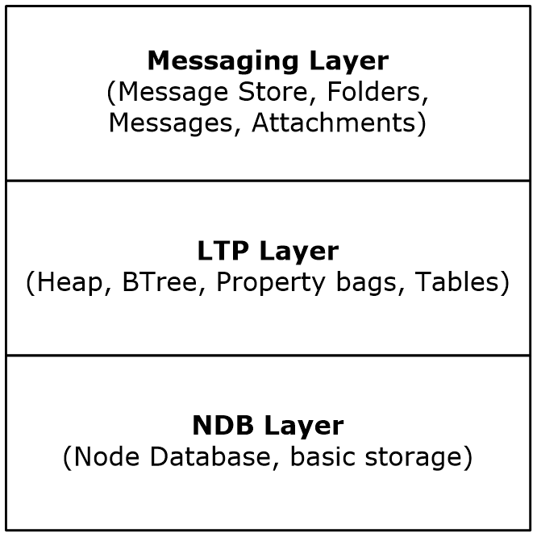

Figure 1: Logical layers of a PST file

#### Node Database (NDB) Layer

The NDB layer consists of a database of nodes, which represents the
lower-level storage facilities of the PST file format. From an
implementation standpoint, the NDB layer consists of the header, file
allocation information, blocks, nodes, and two BTrees: the Node BTree
(NBT) and the Block BTree (BBT).

The NBT contains references to all of the accessible nodes in the PST
file. Its BTree implementation allows for efficient searches to locate
any specific node. Each node reference is represented using a set of
four properties that includes its NID, parent NID, data BID, and subnode
BID. The data BID points to the block that contains the data associated
with the node, and the subnode BID points to the block that contains
references to subnodes of this node. Top-level NIDs are unique across
the PST and are searchable from the NBT. Subnode NIDs are only unique
within a node and are not searchable (or found) from the NBT. The parent
NID is an optimization for the higher layers and has no meaning for the
NDB Layer.

The BBT contains references to all of the data blocks of the PST file.
Its BTree implementation allows for efficient searches to locate any
specific block. A block reference is represented using a set of four
properties, which includes its BID, IB, CB, and CREF. The IB is the
offset within the file where the block is located. The CB is the count
of bytes stored within the block. The CREF is the count of references to
the data stored within the block.

The roots of the NBT and BBT can be accessed from the header of the PST
file.

The following diagram illustrates the high-level relationship between
nodes and blocks.

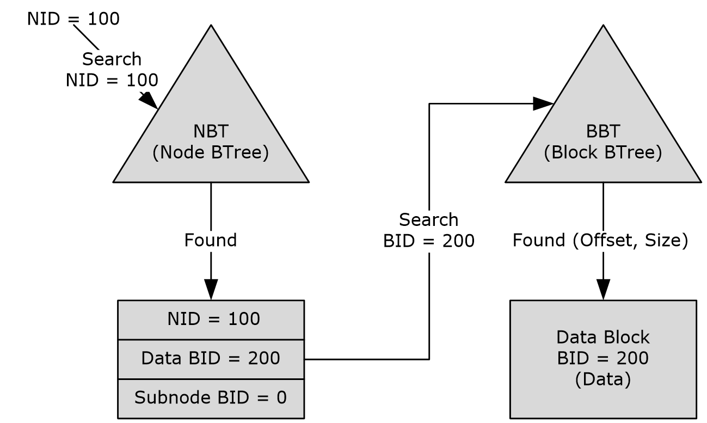

Figure 2: Relationship between nodes and blocks

The preceding figure illustrates how the data of a node with NID=100 can
be accessed. The NBT is searched to find the record with NID=100. Once
found, the record contains the BID (200) of the block that contains the
node's data. With the BID, the BBT can be searched to locate the block
that contains the node's data. As shown in the diagram, it is necessary
to search both the NBT and BBT to locate the data for a top-level node.

#### Lists, Tables, and Properties (LTP) Layer

The LTP layer implements higher-level concepts on top of the NDB
construct. The core elements of the LTP Layer are the Property Context
(PC) and Table Context (TC). A PC represents a collection of properties.
A TC represents a two-dimensional table. The rows represent a collection
of properties. The columns represent which properties are within the
rows.

From a high-level implementation standpoint, each PC or TC is stored as
data in a single node. The LTP layer uses NIDs to identify PCs and TCs.

To implement PCs and TCs efficiently, the LTP layer employs the
following two types of data structures on top of each NDB node.

##### Heap-on-Node (HN)

A Heap-on-Node is a heap data structure that is implemented on top of a
node. The HN enables sub-allocating the data stream of a node into
small, variable-sized fragments. The prime example of HN usage is to
store various string values into a single block. More complex data
structures are built on top of the HN.

##### BTree-on-Heap (BTH)

A BTree-on-Heap data structure is implemented by building inside of an
HN structure. The HN provides a quick way to access the BTree
structures, whereas the BTH provides an expedient way to search through
data. PCs are implemented as BTHs.

#### Messaging Layer

The Messaging layer consists of the higher-level rules and business
logic that allow the structures of the LTP and NDB layers to be combined
and interpreted as **Folder objects**, **Message objects**, **Attachment
objects**, and properties. The Messaging layer also defines the rules
and requirements that need to be followed when modifying the contents of
a PST file so that the modified PST file can still be successfully read
by implementations of this file format.

### Physical Organization of the PST File Format

This section provides an overview of the physical layout of the various
concepts that were introduced in section 1.3.1. The following diagram
illustrates the high-level file organization of a PST.

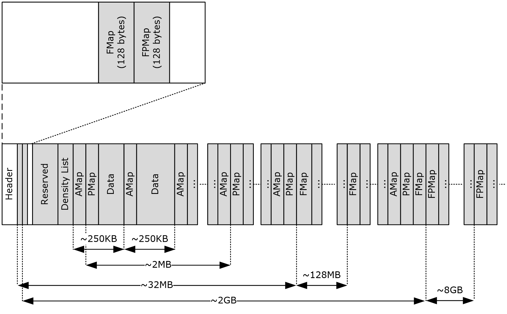

Figure 3: Physical organization of the PST file format

This file format is organized with a header element followed by
allocation information pages at regular intervals that are interspersed
with extensible data blocks. The header section includes metadata about
the PST and information that points to the data sections that contain
the **message store** and its contents. The following sections cover
each of these elements in further detail.

#### Header

The header resides at the very beginning of the file, and contains three
main groups of information: Metadata, root record, and initial free map
(FMap) and free page map (FPMap). For more information about the HEADER
structure, see section 2.2.2.6.

##### Metadata and State of the PST File

The metadata includes information such as version numbers, checksums,
persistent counters, and namespace tables. Using this information, an
implementation can determine the version and format of the PST file,
which determines the layout of the subsequent data in the file.

##### Root Record

The root record contains information about the actual data that is
stored in the PST file. This includes the root of the NBT and BBT, size
and allocation information required to manage the free space and file
growth, as well as file integrity information. For more information
about the ROOT structure, see section 2.2.2.5.

##### Initial Free Map (FMap) and Free Page Map (FPMap)

Free Maps (FMaps) and Free Page Maps (FPMaps) are used to search for
contiguous free space within a PST file.\<1\> FMaps and FPMaps are
further described in greater detail in sections section 1.3.2.7 and
section 1.3.2.8.

#### Reserved Data

A number of octets have been reserved between the end of the HEADER and
the beginning of the Density List (DList). Part of this space is
reserved for future expansion of the PST file HEADER structure, while
the rest is reserved for persisting transient, implementation-specific
data.

#### Density List (DList)

The Density List consists of an ordered list of references to Allocation
Map (AMap) pages (see section 1.3.2.4). It is sorted in order of
ascending density (that is, by descending amount of free space
available). Its function is to optimize the space allocation so that
space referred to by pages with the most abundant free space (that is,
lowest density) is allocated first. There is only one DList in the PST,
which is located at a fixed offset in the PST file. For more details
about the technical details of the DList, see section 2.2.2.7.4.\<2\>

#### Allocation Map (AMap)

An Allocation Map page is a fixed-size page that is used to track the
allocation status of the data section that immediately follows the AMap
page in the file. The entire AMap page can be viewed as an array of
bits, where each bit corresponds to the allocation state of 64 bytes of
data. An AMap page appears roughly every 250 kilobytes in the PST (see
the diagram in section 1.3.2). For more details about the AMap, see
section 2.2.2.7.2.

#### Page Map (PMap)

A Page Map is a block of data that is 512 bytes in size (including
overhead), which is used for storing almost all of the metadata in the
PST (that is, the BBT and NBT). The PMap is created to optimize for the
search of available pages. The PMap is almost identical to the AMap,
except that each bit in the PMap maps the allocation state of 512 bytes
rather than instead of 64 because each bit in the PMap covers eight
times the data of an AMap, a PMap page appears roughly every 2 megabytes
(or one PMap for every eight AMaps). For more details about the PMap,
see section 2.2.2.7.3.

#### Data Section

Data sections are groups of data roughly 250 kilobytes in size that
contain allocations. Each individual allocation is aligned to a 64-byte
boundary, and is in sizes that are multiples of 64 bytes. All of the
blocks referred to by the BBT are allocated out of these data sections.
Data sections are represented by the blocks labeled "Data" in the
diagram in section 1.3.2.

#### Free Map (FMap)

An FMap page provides a mechanism to quickly locate contiguous free
space. Each byte in the FMap corresponds to one AMap page. The value of
each byte indicates the longest number of free bits found in the
corresponding AMap page. Because each bit in the AMap maps to 64 bytes,
the FMap contains the maximum amount of contiguous free space in that
AMap, up to about 16 kilobytes. Generally, because each AMap covers
about 250 kilobytes of data, each FMap page (496 bytes) covers around
125 megabytes of data.

However, a special case exists for the initial FMap. As shown in the
diagram in section 1.3.2, the HEADER contains an initial FMap, which is
only 128 bytes, and which covers the first 32 megabytes of data.

#### Free Page Maps (FPMap)

An FPMap is similar to the FMap except that it is used to quickly find
free pages. Each bit in the FPMap corresponds to a PMap page, and the
value of the bit indicates whether there are any free pages within that
PMap page. With each PMap covering about 2 megabytes, and an FPMap page
at 496 bytes, it follows that an FPMap page covers about 8 gigabytes of
space.

However, a special case exists for the initial FPMap. As shown in the
diagram in section 1.3.2, the HEADER contains an initial FPMap, which is
only 128 bytes, which covers the first 2 gigabytes of data.

ANSI PST files only contain the initial FPMap in the HEADER and no
additional FPMap pages. This limits the size of an ANSI PST file to
about 2 gigabytes.

## Relationship to Protocols and Other Structures

This file format uses structures described in \[MS-OXCDATA\] and
**property tags** described in \[MS-OXPROPS\].

## Applicability Statement

This file format allows implementers to read and write PST files that
are compatible with other implementations of this file format
specification.

## Versioning and Localization

None.

## Vendor-Extensible Fields

None.

# Structures

This section provides detailed technical information about all of the
data structures that are used in the PST file format, as applicable to
the scope of this document.

1.  ## Property and Data Type Definitions

    1.  ### Data Types

The following data types are specified in \[MS-DTYP\]:

- **bit**

- **byte**

- **DWORD**

- **GUID**

- **ULONGLONG**

- **LONG**

- **WCHAR**

- **WORD**

The following data types are specified in \[MS-OXCDATA\] section 2.11.1:

- **PtypBinary**

- **PtypBoolean**

- **PtypGuid**

- **PtypInteger32**

- **PtypInteger64**

- **PtypMultipleInteger32**

- **PtypObject**

- **PtypString**

- **PtypString8**

- **PtypTime**

This specification uses the notations described in the following table
to indicate data size.

| Notation | Meaning  | Value          |
|----------|----------|----------------|
| KB       | kilobyte | 1024 bytes     |
| MB       | megabyte | 1024 kilobytes |
| GB       | gigabyte | 1024 megabytes |

### Properties

This file format specification defines the **property tags** described
in the following table. The **PropertyTag** structure is specified in
\[MS-OXCDATA\] section 2.9.

| Canonical name                    | PropertyTag.PropertyId | PropertyTag.PropertyType |
|-----------------------------------|------------------------|--------------------------|
| **PidTagNameidBucketCount**       | 0x0001                 | **PtypInteger32**        |
| **PidTagNameidStreamGuid**        | 0x0002                 | **PtypBinary**           |
| **PidTagNameidStreamEntry**       | 0x0003                 | **PtypBinary**           |
| **PidTagNameidStreamString**      | 0x0004                 | **PtypBinary**           |
| **PidTagNameidBucketBase**        | 0x1000                 | **PtypBinary**           |
| **PidTagItemTemporaryFlags**      | 0x1097                 | **PtypInteger32**        |
| **PidTagPstBestBodyProptag**      | 0x661D                 | **PtypInteger32**        |
| **PidTagPstHiddenCount**          | 0x6635                 | **PtypInteger32**        |
| **PidTagPstHiddenUnread**         | 0x6636                 | **PtypInteger32**        |
| **PidTagPstIpmsubTreeDescendant** | 0x6705                 | **PtypBoolean**          |
| **PidTagPstSubTreeContainer**     | 0x6772                 | **PtypInteger32**        |
| **PidTagLtpParentNid**            | 0x67F1                 | **PtypInteger32**        |
| **PidTagLtpRowId**                | 0x67F2                 | **PtypInteger32**        |
| **PidTagLtpRowVer**               | 0x67F3                 | **PtypInteger32**        |
| **PidTagPstPassword**             | 0x67FF                 | **PtypInteger32**        |
| **PidTagMapiFormComposeCommand**  | 0x682F                 | **PtypString**           |

## NDB Layer

The following sections describe the data structures used in the NDB
Layer of the PST file.

### Fundamental Concepts

The NDB layer provides the abstractions to:

- Divide the PST file into logical streams.

- Establish hierarchical relationships between the streams.

- Provide transaction functionality when modifying data within the
  streams.

  1.  #### Nodes

The NDB layer uses the concept of nodes to divide the data in the PST
file into logical streams. A node is an abstraction that consists of a
stream of bytes and a collection of subnodes. It is implemented by the
NDB layer as a data block (section 2.2.2.8.3.1) and a subnode BTree
(section 2.2.2.8.3.3). The **NBTENTRY** structures in the Node BTree
(section 2.2.2.7.7.4) exist to define which blocks combine to form
nodes.

#### ANSI Versus Unicode

There are currently two versions of the PST file format: ANSI and
Unicode. The ANSI PST file format is the legacy format and SHOULD NOT be
used to create new PST files. The Unicode PST file format is the
currently-used format.\<3\>

While the nomenclature suggests a difference in how the internal strings
are represented in the PST file, there are other significant differences
between the ANSI and Unicode PST file formats. The most significant
difference is the sizes of various core data elements that are used
throughout the NDB layer. Specifically, the ANSI version uses 32-bit
values to represent block IDs (BIDs) and absolute file offsets (IB). The
Unicode version uses 64-bit values instead. Some other values that were
represented using 32-bits have also been extended to use 64-bits. Those
cases are discussed on a case-by-case basis.

Because BIDs and IBs are used extensively throughout the NDB layer, the
version-specific size differences affect most of the NDB data
structures. ANSI and Unicode versions of the data structures are defined
separately whenever there are material differences between the two
versions.

1.  ### Data Structures

    1.  #### NID (Node ID)

Nodes provide the primary abstraction used to reference data stored in
the PST file that is not interpreted by the NDB layer. Each node is
identified using its NID. Each NID is unique within the namespace in
which it is used. Each node referenced by the NBT MUST have a unique
NID. However, two subnodes of two different nodes can have identical
NIDs, but two subnodes of the same node MUST have different NIDs.

Unicode / ANSI:

<table>
<colgroup>
<col style="width: 3%" />
<col style="width: 3%" />
<col style="width: 3%" />
<col style="width: 3%" />
<col style="width: 3%" />
<col style="width: 3%" />
<col style="width: 3%" />
<col style="width: 3%" />
<col style="width: 3%" />
<col style="width: 3%" />
<col style="width: 3%" />
<col style="width: 3%" />
<col style="width: 3%" />
<col style="width: 3%" />
<col style="width: 3%" />
<col style="width: 3%" />
<col style="width: 3%" />
<col style="width: 3%" />
<col style="width: 3%" />
<col style="width: 3%" />
<col style="width: 3%" />
<col style="width: 3%" />
<col style="width: 3%" />
<col style="width: 3%" />
<col style="width: 3%" />
<col style="width: 3%" />
<col style="width: 3%" />
<col style="width: 3%" />
<col style="width: 3%" />
<col style="width: 3%" />
<col style="width: 3%" />
<col style="width: 3%" />
</colgroup>
<tbody>
<tr class="odd">
<td>0</td>
<td>1</td>
<td>2</td>
<td>3</td>
<td>4</td>
<td>5</td>
<td>6</td>
<td>7</td>
<td>8</td>
<td>9</td>
<td>
1

0
</td>
<td>1</td>
<td>2</td>
<td>3</td>
<td>4</td>
<td>5</td>
<td>6</td>
<td>7</td>
<td>8</td>
<td>9</td>
<td>
2

0
</td>
<td>1</td>
<td>2</td>
<td>3</td>
<td>4</td>
<td>5</td>
<td>6</td>
<td>7</td>
<td>8</td>
<td>9</td>
<td>
3

0
</td>
<td>1</td>
</tr>
<tr class="even">
<td colspan="5">nidType</td>
<td colspan="27">nidIndex</td>
</tr>
</tbody>
</table>

**nidType (5 bits):** Identifies the type of the node represented by the
NID. The following table specifies a list of values for **nidType**.
However, it is worth noting that **nidType** has no meaning to the
structures defined in the NDB Layer.

| Value | Friendly name                   | Description                                                 |
|-------|---------------------------------|-------------------------------------------------------------|
| 0x00  | NID_TYPE_HID                    | Heap node                                                   |
| 0x01  | NID_TYPE_INTERNAL               | Internal node (section 2.4.1)                               |
| 0x02  | NID_TYPE_NORMAL_FOLDER          | Normal **Folder object** (PC)                               |
| 0x03  | NID_TYPE_SEARCH_FOLDER          | Search Folder object (PC)                                   |
| 0x04  | NID_TYPE_NORMAL_MESSAGE         | Normal **Message object** (PC)                              |
| 0x05  | NID_TYPE_ATTACHMENT             | **Attachment object** (PC)                                  |
| 0x06  | NID_TYPE_SEARCH_UPDATE_QUEUE    | Queue of changed objects for search Folder objects          |
| 0x07  | NID_TYPE_SEARCH_CRITERIA_OBJECT | Defines the search criteria for a search Folder object      |
| 0x08  | NID_TYPE_ASSOC_MESSAGE          | **Folder associated information (FAI)** Message object (PC) |
| 0x0A  | NID_TYPE_CONTENTS_TABLE_INDEX   | Internal, persisted view-related                            |
| 0X0B  | NID_TYPE_RECEIVE_FOLDER_TABLE   | Receive Folder object (Inbox)                               |
| 0x0C  | NID_TYPE_OUTGOING_QUEUE_TABLE   | Outbound queue (Outbox)                                     |
| 0x0D  | NID_TYPE_HIERARCHY_TABLE        | Hierarchy table (TC)                                        |
| 0x0E  | NID_TYPE_CONTENTS_TABLE         | Contents table (TC)                                         |
| 0x0F  | NID_TYPE_ASSOC_CONTENTS_TABLE   | **FAI contents table** (TC)                                 |
| 0x10  | NID_TYPE_SEARCH_CONTENTS_TABLE  | Contents table (TC) of a search Folder object               |
| 0x11  | NID_TYPE_ATTACHMENT_TABLE       | Attachment table (TC)                                       |
| 0x12  | NID_TYPE_RECIPIENT_TABLE        | Recipient table (TC)                                        |
| 0x13  | NID_TYPE_SEARCH_TABLE_INDEX     | Internal, persisted view-related                            |
| 0x1F  | NID_TYPE_LTP                    | LTP                                                         |

**nidIndex (27 bits):** The identification portion of the NID.

#### BID (Block ID)

Every block allocated in the PST file is identified using the BID
structure. This structure varies in size according the format of the
file. In the case of ANSI files, the structure is a 32-bit unsigned
value, while in Unicode files it is a 64-bit unsigned long. In addition,
there are two types of BIDs:

1.  BIDs used in the context of Pages (section 2.2.2.7) use all of the
    bits of the structure (below) and are incremented by 1.

2.  Block BIDs (section 2.2.2.8) reserve the two least significant bits
    for flags (see below). As a result these increment by 4 each time a
    new one is assigned.

Shown as used by Blocks (section 2.2.2.8):

Unicode:

<table>
<colgroup>
<col style="width: 3%" />
<col style="width: 3%" />
<col style="width: 3%" />
<col style="width: 3%" />
<col style="width: 3%" />
<col style="width: 3%" />
<col style="width: 3%" />
<col style="width: 3%" />
<col style="width: 3%" />
<col style="width: 3%" />
<col style="width: 3%" />
<col style="width: 3%" />
<col style="width: 3%" />
<col style="width: 3%" />
<col style="width: 3%" />
<col style="width: 3%" />
<col style="width: 3%" />
<col style="width: 3%" />
<col style="width: 3%" />
<col style="width: 3%" />
<col style="width: 3%" />
<col style="width: 3%" />
<col style="width: 3%" />
<col style="width: 3%" />
<col style="width: 3%" />
<col style="width: 3%" />
<col style="width: 3%" />
<col style="width: 3%" />
<col style="width: 3%" />
<col style="width: 3%" />
<col style="width: 3%" />
<col style="width: 3%" />
</colgroup>
<tbody>
<tr class="odd">
<td>0</td>
<td>1</td>
<td>2</td>
<td>3</td>
<td>4</td>
<td>5</td>
<td>6</td>
<td>7</td>
<td>8</td>
<td>9</td>
<td>
1

0
</td>
<td>1</td>
<td>2</td>
<td>3</td>
<td>4</td>
<td>5</td>
<td>6</td>
<td>7</td>
<td>8</td>
<td>9</td>
<td>
2

0
</td>
<td>1</td>
<td>2</td>
<td>3</td>
<td>4</td>
<td>5</td>
<td>6</td>
<td>7</td>
<td>8</td>
<td>9</td>
<td>
3

0
</td>
<td>1</td>
</tr>
<tr class="even">
<td>A</td>
<td>B</td>
<td colspan="30">bidIndex</td>
</tr>
<tr class="odd">
<td colspan="32">...</td>
</tr>
</tbody>
</table>

ANSI:

<table>
<colgroup>
<col style="width: 3%" />
<col style="width: 3%" />
<col style="width: 3%" />
<col style="width: 3%" />
<col style="width: 3%" />
<col style="width: 3%" />
<col style="width: 3%" />
<col style="width: 3%" />
<col style="width: 3%" />
<col style="width: 3%" />
<col style="width: 3%" />
<col style="width: 3%" />
<col style="width: 3%" />
<col style="width: 3%" />
<col style="width: 3%" />
<col style="width: 3%" />
<col style="width: 3%" />
<col style="width: 3%" />
<col style="width: 3%" />
<col style="width: 3%" />
<col style="width: 3%" />
<col style="width: 3%" />
<col style="width: 3%" />
<col style="width: 3%" />
<col style="width: 3%" />
<col style="width: 3%" />
<col style="width: 3%" />
<col style="width: 3%" />
<col style="width: 3%" />
<col style="width: 3%" />
<col style="width: 3%" />
<col style="width: 3%" />
</colgroup>
<tbody>
<tr class="odd">
<td>0</td>
<td>1</td>
<td>2</td>
<td>3</td>
<td>4</td>
<td>5</td>
<td>6</td>
<td>7</td>
<td>8</td>
<td>9</td>
<td>
1

0
</td>
<td>1</td>
<td>2</td>
<td>3</td>
<td>4</td>
<td>5</td>
<td>6</td>
<td>7</td>
<td>8</td>
<td>9</td>
<td>
2

0
</td>
<td>1</td>
<td>2</td>
<td>3</td>
<td>4</td>
<td>5</td>
<td>6</td>
<td>7</td>
<td>8</td>
<td>9</td>
<td>
3

0
</td>
<td>1</td>
</tr>
<tr class="even">
<td>A</td>
<td>B</td>
<td colspan="30">bidIndex</td>
</tr>
</tbody>
</table>

**A - r (1 bit):** Reserved bit. Readers MUST ignore this bit and treat
it as zero before looking up the BID from the BBT. Writers MUST\<4\> set
this bit to zero.

**B - i (1 bit):** MUST set to 1 when the block is "Internal", or zero
when the block is not "Internal". An internal block is an intermediate
block that, instead of containing actual data, contains metadata about
how to locate other data blocks that contain the desired information.
For more details about technical details regarding blocks, see section
2.2.2.8.

**bidIndex (Unicode: 62 bits; ANSI: 30 bits):** A monotonically
increasing value that uniquely identifies the BID within the PST file.
bidIndex values are assigned based on the bidNextB value in the HEADER
structure (see section 2.2.2.6). The bidIndex increments by one each
time a new BID is assigned.

#### IB (Byte Index)

The IB (Byte Index) is used to represent an absolute offset within the
PST file with respect to the beginning of the file. The IB is a simple
unsigned integer value and is 64 bits in Unicode versions and 32 bits in
ANSI versions.

#### BREF

The **BREF** is a record that maps a BID to its absolute file offset
location.

Unicode:

<table>
<colgroup>
<col style="width: 3%" />
<col style="width: 3%" />
<col style="width: 3%" />
<col style="width: 3%" />
<col style="width: 3%" />
<col style="width: 3%" />
<col style="width: 3%" />
<col style="width: 3%" />
<col style="width: 3%" />
<col style="width: 3%" />
<col style="width: 3%" />
<col style="width: 3%" />
<col style="width: 3%" />
<col style="width: 3%" />
<col style="width: 3%" />
<col style="width: 3%" />
<col style="width: 3%" />
<col style="width: 3%" />
<col style="width: 3%" />
<col style="width: 3%" />
<col style="width: 3%" />
<col style="width: 3%" />
<col style="width: 3%" />
<col style="width: 3%" />
<col style="width: 3%" />
<col style="width: 3%" />
<col style="width: 3%" />
<col style="width: 3%" />
<col style="width: 3%" />
<col style="width: 3%" />
<col style="width: 3%" />
<col style="width: 3%" />
</colgroup>
<tbody>
<tr class="odd">
<td>0</td>
<td>1</td>
<td>2</td>
<td>3</td>
<td>4</td>
<td>5</td>
<td>6</td>
<td>7</td>
<td>8</td>
<td>9</td>
<td>
1

0
</td>
<td>1</td>
<td>2</td>
<td>3</td>
<td>4</td>
<td>5</td>
<td>6</td>
<td>7</td>
<td>8</td>
<td>9</td>
<td>
2

0
</td>
<td>1</td>
<td>2</td>
<td>3</td>
<td>4</td>
<td>5</td>
<td>6</td>
<td>7</td>
<td>8</td>
<td>9</td>
<td>
3

0
</td>
<td>1</td>
</tr>
<tr class="even">
<td colspan="32">bid</td>
</tr>
<tr class="odd">
<td colspan="32">...</td>
</tr>
<tr class="even">
<td colspan="32">ib</td>
</tr>
<tr class="odd">
<td colspan="32">...</td>
</tr>
</tbody>
</table>

ANSI:

<table>
<colgroup>
<col style="width: 3%" />
<col style="width: 3%" />
<col style="width: 3%" />
<col style="width: 3%" />
<col style="width: 3%" />
<col style="width: 3%" />
<col style="width: 3%" />
<col style="width: 3%" />
<col style="width: 3%" />
<col style="width: 3%" />
<col style="width: 3%" />
<col style="width: 3%" />
<col style="width: 3%" />
<col style="width: 3%" />
<col style="width: 3%" />
<col style="width: 3%" />
<col style="width: 3%" />
<col style="width: 3%" />
<col style="width: 3%" />
<col style="width: 3%" />
<col style="width: 3%" />
<col style="width: 3%" />
<col style="width: 3%" />
<col style="width: 3%" />
<col style="width: 3%" />
<col style="width: 3%" />
<col style="width: 3%" />
<col style="width: 3%" />
<col style="width: 3%" />
<col style="width: 3%" />
<col style="width: 3%" />
<col style="width: 3%" />
</colgroup>
<tbody>
<tr class="odd">
<td>0</td>
<td>1</td>
<td>2</td>
<td>3</td>
<td>4</td>
<td>5</td>
<td>6</td>
<td>7</td>
<td>8</td>
<td>9</td>
<td>
1

0
</td>
<td>1</td>
<td>2</td>
<td>3</td>
<td>4</td>
<td>5</td>
<td>6</td>
<td>7</td>
<td>8</td>
<td>9</td>
<td>
2

0
</td>
<td>1</td>
<td>2</td>
<td>3</td>
<td>4</td>
<td>5</td>
<td>6</td>
<td>7</td>
<td>8</td>
<td>9</td>
<td>
3

0
</td>
<td>1</td>
</tr>
<tr class="even">
<td colspan="32">bid</td>
</tr>
<tr class="odd">
<td colspan="32">ib</td>
</tr>
</tbody>
</table>

**bid (Unicode: 64 bits; ANSI: 32 bits):** A BID structure, as specified
in section 2.2.2.2.

**ib (Unicode: 64 bits; ANSI: 32 bits):** An IB structure, as specified
in section 2.2.2.3.

#### ROOT

The ROOT structure contains current file state.

Unicode:

<table>
<colgroup>
<col style="width: 3%" />
<col style="width: 3%" />
<col style="width: 3%" />
<col style="width: 3%" />
<col style="width: 3%" />
<col style="width: 3%" />
<col style="width: 3%" />
<col style="width: 3%" />
<col style="width: 3%" />
<col style="width: 3%" />
<col style="width: 3%" />
<col style="width: 3%" />
<col style="width: 3%" />
<col style="width: 3%" />
<col style="width: 3%" />
<col style="width: 3%" />
<col style="width: 3%" />
<col style="width: 3%" />
<col style="width: 3%" />
<col style="width: 3%" />
<col style="width: 3%" />
<col style="width: 3%" />
<col style="width: 3%" />
<col style="width: 3%" />
<col style="width: 3%" />
<col style="width: 3%" />
<col style="width: 3%" />
<col style="width: 3%" />
<col style="width: 3%" />
<col style="width: 3%" />
<col style="width: 3%" />
<col style="width: 3%" />
</colgroup>
<tbody>
<tr class="odd">
<td>0</td>
<td>1</td>
<td>2</td>
<td>3</td>
<td>4</td>
<td>5</td>
<td>6</td>
<td>7</td>
<td>8</td>
<td>9</td>
<td>
1

0
</td>
<td>1</td>
<td>2</td>
<td>3</td>
<td>4</td>
<td>5</td>
<td>6</td>
<td>7</td>
<td>8</td>
<td>9</td>
<td>
2

0
</td>
<td>1</td>
<td>2</td>
<td>3</td>
<td>4</td>
<td>5</td>
<td>6</td>
<td>7</td>
<td>8</td>
<td>9</td>
<td>
3

0
</td>
<td>1</td>
</tr>
<tr class="even">
<td colspan="32">dwReserved</td>
</tr>
<tr class="odd">
<td colspan="32">ibFileEof</td>
</tr>
<tr class="even">
<td colspan="32">...</td>
</tr>
<tr class="odd">
<td colspan="32">ibAMapLast</td>
</tr>
<tr class="even">
<td colspan="32">...</td>
</tr>
<tr class="odd">
<td colspan="32">cbAMapFree</td>
</tr>
<tr class="even">
<td colspan="32">...</td>
</tr>
<tr class="odd">
<td colspan="32">cbPMapFree</td>
</tr>
<tr class="even">
<td colspan="32">...</td>
</tr>
<tr class="odd">
<td colspan="32">BREFNBT (16 bytes)</td>
</tr>
<tr class="even">
<td colspan="32">...</td>
</tr>
<tr class="odd">
<td colspan="32">...</td>
</tr>
<tr class="even">
<td colspan="32">BREFBBT (16 bytes)</td>
</tr>
<tr class="odd">
<td colspan="32">...</td>
</tr>
<tr class="even">
<td colspan="32">...</td>
</tr>
<tr class="odd">
<td colspan="8">fAMapValid</td>
<td colspan="8">bReserved</td>
<td colspan="16">wReserved</td>
</tr>
</tbody>
</table>

ANSI:

<table>
<colgroup>
<col style="width: 3%" />
<col style="width: 3%" />
<col style="width: 3%" />
<col style="width: 3%" />
<col style="width: 3%" />
<col style="width: 3%" />
<col style="width: 3%" />
<col style="width: 3%" />
<col style="width: 3%" />
<col style="width: 3%" />
<col style="width: 3%" />
<col style="width: 3%" />
<col style="width: 3%" />
<col style="width: 3%" />
<col style="width: 3%" />
<col style="width: 3%" />
<col style="width: 3%" />
<col style="width: 3%" />
<col style="width: 3%" />
<col style="width: 3%" />
<col style="width: 3%" />
<col style="width: 3%" />
<col style="width: 3%" />
<col style="width: 3%" />
<col style="width: 3%" />
<col style="width: 3%" />
<col style="width: 3%" />
<col style="width: 3%" />
<col style="width: 3%" />
<col style="width: 3%" />
<col style="width: 3%" />
<col style="width: 3%" />
</colgroup>
<tbody>
<tr class="odd">
<td>0</td>
<td>1</td>
<td>2</td>
<td>3</td>
<td>4</td>
<td>5</td>
<td>6</td>
<td>7</td>
<td>8</td>
<td>9</td>
<td>
1

0
</td>
<td>1</td>
<td>2</td>
<td>3</td>
<td>4</td>
<td>5</td>
<td>6</td>
<td>7</td>
<td>8</td>
<td>9</td>
<td>
2

0
</td>
<td>1</td>
<td>2</td>
<td>3</td>
<td>4</td>
<td>5</td>
<td>6</td>
<td>7</td>
<td>8</td>
<td>9</td>
<td>
3

0
</td>
<td>1</td>
</tr>
<tr class="even">
<td colspan="32">dwReserved</td>
</tr>
<tr class="odd">
<td colspan="32">ibFileEof</td>
</tr>
<tr class="even">
<td colspan="32">ibAMapLast</td>
</tr>
<tr class="odd">
<td colspan="32">cbAMapFree</td>
</tr>
<tr class="even">
<td colspan="32">cbPMapFree</td>
</tr>
<tr class="odd">
<td colspan="32">BREFNBT</td>
</tr>
<tr class="even">
<td colspan="32">...</td>
</tr>
<tr class="odd">
<td colspan="32">BREFBBT</td>
</tr>
<tr class="even">
<td colspan="32">...</td>
</tr>
<tr class="odd">
<td colspan="8">fAMapValid</td>
<td colspan="8">bReserved</td>
<td colspan="16">wReserved</td>
</tr>
</tbody>
</table>

**dwReserved (4 bytes):** Implementations SHOULD ignore this value and
SHOULD NOT modify it. Creators of a new PST file MUST initialize this
value to zero.\<5\>

**ibFileEof (Unicode: 8 bytes; ANSI 4 bytes):** The size of the PST
file, in bytes.

**ibAMapLast (Unicode: 8 bytes; ANSI 4 bytes):** An IB structure
(section 2.2.2.3) that contains the absolute file offset to the last
AMap page of the PST file.

**cbAMapFree (Unicode: 8 bytes; ANSI 4 bytes):** The total free space in
all AMaps, combined.

**cbPMapFree (Unicode: 8 bytes; ANSI 4 bytes):** The total free space in
all PMaps, combined. Because the PMap is deprecated, this value SHOULD
be zero. Creators of new PST files MUST initialize this value to zero.

**BREFNBT (Unicode: 16 bytes; ANSI: 8 bytes):** A **BREF** structure
(section 2.2.2.4) that references the root page of the Node BTree (NBT).

**BREFBBT (Unicode: 16 bytes; ANSI: 8 bytes):** A **BREF** structure
that references the root page of the Block BTree (BBT).

**fAMapValid (1 byte):** Indicates whether all of the AMaps in this PST
file are valid. For more details, see section 2.6.1.3.7. This value MUST
be set to one of the pre-defined values specified in the following
table.

|           |                   |                                                                                  |
|-----------|-------------------|----------------------------------------------------------------------------------|
| **Value** | **Friendly name** | **Meaning**                                                                      |
| 0x00      | INVALID_AMAP      | One or more AMaps in the PST are INVALID                                         |
| 0x01      | VALID_AMAP1       | Deprecated. Implementations SHOULD NOT use this value. The AMaps are VALID.\<6\> |
| 0x02      | VALID_AMAP2       | The AMaps are VALID.                                                             |

**bReserved (1 byte):** Implementations SHOULD ignore this value and
SHOULD NOT modify it. Creators of a new PST file MUST initialize this
value to zero.\<7\>

**wReserved (2 bytes):** Implementations SHOULD ignore this value and
SHOULD NOT modify it. Creators of a new PST file MUST initialize this
value to zero.\<8\>

#### HEADER

The HEADER structure is located at the beginning of the PST file
(absolute file offset 0), and contains metadata about the PST file, as
well as the ROOT information to access the NDB Layer data structures.
Note that the layout of the HEADER structure, including the location and
relative ordering of some fields, differs between the Unicode and ANSI
versions.

Unicode:

<table>
<colgroup>
<col style="width: 3%" />
<col style="width: 3%" />
<col style="width: 3%" />
<col style="width: 3%" />
<col style="width: 3%" />
<col style="width: 3%" />
<col style="width: 3%" />
<col style="width: 3%" />
<col style="width: 3%" />
<col style="width: 3%" />
<col style="width: 3%" />
<col style="width: 3%" />
<col style="width: 3%" />
<col style="width: 3%" />
<col style="width: 3%" />
<col style="width: 3%" />
<col style="width: 3%" />
<col style="width: 3%" />
<col style="width: 3%" />
<col style="width: 3%" />
<col style="width: 3%" />
<col style="width: 3%" />
<col style="width: 3%" />
<col style="width: 3%" />
<col style="width: 3%" />
<col style="width: 3%" />
<col style="width: 3%" />
<col style="width: 3%" />
<col style="width: 3%" />
<col style="width: 3%" />
<col style="width: 3%" />
<col style="width: 3%" />
</colgroup>
<tbody>
<tr class="odd">
<td>0</td>
<td>1</td>
<td>2</td>
<td>3</td>
<td>4</td>
<td>5</td>
<td>6</td>
<td>7</td>
<td>8</td>
<td>9</td>
<td>
1

0
</td>
<td>1</td>
<td>2</td>
<td>3</td>
<td>4</td>
<td>5</td>
<td>6</td>
<td>7</td>
<td>8</td>
<td>9</td>
<td>
2

0
</td>
<td>1</td>
<td>2</td>
<td>3</td>
<td>4</td>
<td>5</td>
<td>6</td>
<td>7</td>
<td>8</td>
<td>9</td>
<td>
3

0
</td>
<td>1</td>
</tr>
<tr class="even">
<td colspan="32">dwMagic</td>
</tr>
<tr class="odd">
<td colspan="32">dwCRCPartial</td>
</tr>
<tr class="even">
<td colspan="16">wMagicClient</td>
<td colspan="16">wVer</td>
</tr>
<tr class="odd">
<td colspan="16">wVerClient</td>
<td colspan="8">bPlatformCreate</td>
<td colspan="8">bPlatformAccess</td>
</tr>
<tr class="even">
<td colspan="32">dwReserved1</td>
</tr>
<tr class="odd">
<td colspan="32">dwReserved2</td>
</tr>
<tr class="even">
<td colspan="32">bidUnused</td>
</tr>
<tr class="odd">
<td colspan="32">...</td>
</tr>
<tr class="even">
<td colspan="32">bidNextP</td>
</tr>
<tr class="odd">
<td colspan="32">...</td>
</tr>
<tr class="even">
<td colspan="32">dwUnique</td>
</tr>
<tr class="odd">
<td colspan="32">rgnid[] (128 bytes)</td>
</tr>
<tr class="even">
<td colspan="32">...</td>
</tr>
<tr class="odd">
<td colspan="32">qwUnused</td>
</tr>
<tr class="even">
<td colspan="32">...</td>
</tr>
<tr class="odd">
<td colspan="32">root (72 bytes)</td>
</tr>
<tr class="even">
<td colspan="32">...</td>
</tr>
<tr class="odd">
<td colspan="32">dwAlign</td>
</tr>
<tr class="even">
<td colspan="32">rgbFM (128 bytes)</td>
</tr>
<tr class="odd">
<td colspan="32">...</td>
</tr>
<tr class="even">
<td colspan="32">...</td>
</tr>
<tr class="odd">
<td colspan="32">rgbFP (128 bytes)</td>
</tr>
<tr class="even">
<td colspan="32">...</td>
</tr>
<tr class="odd">
<td colspan="32">...</td>
</tr>
<tr class="even">
<td colspan="8">bSentinel</td>
<td colspan="8">bCryptMethod</td>
<td colspan="16">rgbReserved</td>
</tr>
<tr class="odd">
<td colspan="32">bidNextB</td>
</tr>
<tr class="even">
<td colspan="32">...</td>
</tr>
<tr class="odd">
<td colspan="32">dwCRCFull</td>
</tr>
<tr class="even">
<td colspan="24">rgbReserved2</td>
<td colspan="8">bReserved</td>
</tr>
<tr class="odd">
<td colspan="32">rgbReserved3 (32 bytes)</td>
</tr>
<tr class="even">
<td colspan="32">...</td>
</tr>
<tr class="odd">
<td colspan="32">...</td>
</tr>
</tbody>
</table>

ANSI:

<table>
<colgroup>
<col style="width: 3%" />
<col style="width: 3%" />
<col style="width: 3%" />
<col style="width: 3%" />
<col style="width: 3%" />
<col style="width: 3%" />
<col style="width: 3%" />
<col style="width: 3%" />
<col style="width: 3%" />
<col style="width: 3%" />
<col style="width: 3%" />
<col style="width: 3%" />
<col style="width: 3%" />
<col style="width: 3%" />
<col style="width: 3%" />
<col style="width: 3%" />
<col style="width: 3%" />
<col style="width: 3%" />
<col style="width: 3%" />
<col style="width: 3%" />
<col style="width: 3%" />
<col style="width: 3%" />
<col style="width: 3%" />
<col style="width: 3%" />
<col style="width: 3%" />
<col style="width: 3%" />
<col style="width: 3%" />
<col style="width: 3%" />
<col style="width: 3%" />
<col style="width: 3%" />
<col style="width: 3%" />
<col style="width: 3%" />
</colgroup>
<tbody>
<tr class="odd">
<td>0</td>
<td>1</td>
<td>2</td>
<td>3</td>
<td>4</td>
<td>5</td>
<td>6</td>
<td>7</td>
<td>8</td>
<td>9</td>
<td>
1

0
</td>
<td>1</td>
<td>2</td>
<td>3</td>
<td>4</td>
<td>5</td>
<td>6</td>
<td>7</td>
<td>8</td>
<td>9</td>
<td>
2

0
</td>
<td>1</td>
<td>2</td>
<td>3</td>
<td>4</td>
<td>5</td>
<td>6</td>
<td>7</td>
<td>8</td>
<td>9</td>
<td>
3

0
</td>
<td>1</td>
</tr>
<tr class="even">
<td colspan="32">dwMagic</td>
</tr>
<tr class="odd">
<td colspan="32">dwCRCPartial</td>
</tr>
<tr class="even">
<td colspan="16">wMagicClient</td>
<td colspan="16">wVer</td>
</tr>
<tr class="odd">
<td colspan="16">wVerClient</td>
<td colspan="8">bPlatformCreate</td>
<td colspan="8">bPlatformAccess</td>
</tr>
<tr class="even">
<td colspan="32">dwReserved1</td>
</tr>
<tr class="odd">
<td colspan="32">dwReserved2</td>
</tr>
<tr class="even">
<td colspan="32">bidNextB</td>
</tr>
<tr class="odd">
<td colspan="32">bidNextP</td>
</tr>
<tr class="even">
<td colspan="32">dwUnique</td>
</tr>
<tr class="odd">
<td colspan="32">rgnid[] (128 bytes)</td>
</tr>
<tr class="even">
<td colspan="32">...</td>
</tr>
<tr class="odd">
<td colspan="32">...</td>
</tr>
<tr class="even">
<td colspan="32">root (40 bytes)</td>
</tr>
<tr class="odd">
<td colspan="32">...</td>
</tr>
<tr class="even">
<td colspan="32">...</td>
</tr>
<tr class="odd">
<td colspan="32">rgbFM (128 bytes)</td>
</tr>
<tr class="even">
<td colspan="32">...</td>
</tr>
<tr class="odd">
<td colspan="32">...</td>
</tr>
<tr class="even">
<td colspan="32">rgbFP (128 bytes)</td>
</tr>
<tr class="odd">
<td colspan="32">...</td>
</tr>
<tr class="even">
<td colspan="32">...</td>
</tr>
<tr class="odd">
<td colspan="8">bSentinel</td>
<td colspan="8">bCryptMethod</td>
<td colspan="16">rgbReserved</td>
</tr>
<tr class="even">
<td colspan="32">ullReserved</td>
</tr>
<tr class="odd">
<td colspan="32">...</td>
</tr>
<tr class="even">
<td colspan="32">dwReserved</td>
</tr>
<tr class="odd">
<td colspan="24">rgbReserved2</td>
<td colspan="8">bReserved</td>
</tr>
<tr class="even">
<td colspan="32">rgbReserved3 (32 bytes)</td>
</tr>
<tr class="odd">
<td colspan="32">...</td>
</tr>
<tr class="even">
<td colspan="32">...</td>
</tr>
</tbody>
</table>

**dwMagic (4 bytes):** MUST be "{ 0x21, 0x42, 0x44, 0x4E } ("!BDN")".

**dwCRCPartial (4 bytes):** The 32-bit **cyclic redundancy check (CRC)**
value of the 471 bytes of data starting from **wMagicClient** (0ffset
0x0008)

**wMagicClient (2 bytes):** MUST be "{ 0x53, 0x4D }".

**wVer (2 bytes):** File format version. This value MUST be 14 or 15 if
the file is an ANSI PST file, and MUST be greater than 23 if the file is
a Unicode PST file. If the value is 37, it indicates that the file is
written by an Outlook of version that supports Windows Information
Protection (WIP). The data MAY have been protected by WIP.

**wVerClient (2 bytes):** Client file format version. The version that
corresponds to the format described in this document is 19. Creators of
a new PST file based on this document SHOULD initialize this value to
19.

**bPlatformCreate (1 byte):** This value MUST be set to 0x01.

**bPlatformAccess (1 byte):** This value MUST be set to 0x01.

**dwReserved1 (4 bytes):** Implementations SHOULD ignore this value and
SHOULD NOT modify it. Creators of a new PST file MUST initialize this
value to zero.\<9\>

**dwReserved2 (4 bytes):** Implementations SHOULD ignore this value and
SHOULD NOT modify it. Creators of a new PST file MUST initialize this
value to zero.\<10\>

**bidUnused (8 bytes Unicode only):** Unused padding added when the
Unicode PST file format was created.

**bidNextB (4 bytes ANSI only):** Next BID. This value is the monotonic
counter that indicates the BID to be assigned for the next allocated
block. BID values advance in increments of 4. For more details, see
section 2.2.2.2.

**bidNextP (Unicode: 8 bytes; ANSI: 4 bytes):** Next page BID. Pages
have a special counter for allocating **bidIndex** values. The value of
**bidIndex** for BIDs for pages is allocated from this counter.

**dwUnique (4 bytes):** This is a monotonically-increasing value that is
modified every time the PST file's HEADER structure is modified. The
function of this value is to provide a unique value, and to ensure that
the HEADER CRCs are different after each header modification.

**rgnid\[\] (128 bytes):** A fixed array of 32 NIDs, each corresponding
to one of the 32 possible NID_TYPEs (section 2.2.2.1). Different
NID_TYPEs can have different starting **nidIndex** values. When a blank
PST file is created, these values are initialized by NID_TYPE according
to the following table. Each of these NIDs indicates the last
**nidIndex** value that had been allocated for the corresponding
NID_TYPE. When an NID of a particular type is assigned, the
corresponding slot in **rgnid** is also incremented by 1.

| NID_TYPE                | Starting nidIndex |
|-------------------------|-------------------|
| NID_TYPE_NORMAL_FOLDER  | 1024 (0x400)      |
| NID_TYPE_SEARCH_FOLDER  | 16384 (0x4000)    |
| NID_TYPE_NORMAL_MESSAGE | 65536 (0x10000)   |
| NID_TYPE_ASSOC_MESSAGE  | 32768 (0x8000)    |
| Any other NID_TYPE      | 1024 (0x400)      |

**qwUnused (8 bytes):** Unused space; MUST be set to zero. Unicode PST
file format only.

**root (Unicode: 72 bytes; ANSI: 40 bytes):** A ROOT structure (section
2.2.2.5).

**dwAlign (4 bytes):** Unused alignment bytes; MUST be set to zero.
Unicode PST file format only.

**rgbFM (128 bytes):** Deprecated FMap. This is no longer used and MUST
be filled with 0xFF. Readers SHOULD ignore the value of these bytes.

**rgbFP (128 bytes):** Deprecated FPMap. This is no longer used and MUST
be filled with 0xFF. Readers SHOULD ignore the value of these bytes.

**bSentinel (1 byte):** MUST be set to 0x80.

**bCryptMethod (1 byte):** Indicates how the data within the PST file is
encoded. MUST be set to one of the pre-defined values described in the
following table.

| Value | Friendly name        | Meaning                                               |
|-------|----------------------|-------------------------------------------------------|
| 0x00  | NDB_CRYPT_NONE       | Data blocks are not encoded.                          |
| 0x01  | NDB_CRYPT_PERMUTE    | Encoded with the Permutation algorithm (section 5.1). |
| 0x02  | NDB_CRYPT_CYCLIC     | Encoded with the Cyclic algorithm (section 5.2).      |
| 0x10  | NDB_CRYPT_EDPCRYPTED | Encrypted with Windows Information Protection.        |

**rgbReserved (2 bytes):** Reserved; MUST be set to zero.

**bidNextB (Unicode ONLY: 8 bytes):** Next BID. This value is the
monotonic counter that indicates the BID to be assigned for the next
allocated block. BID values advance in increments of 4. For more
details, see section 2.2.2.2.

**dwCRCFull (4 bytes):** The 32-bit CRC value of the 516 bytes of data
starting from **wMagicClient** to **bidNextB**, inclusive. Unicode PST
file format only.

**ullReserved (8 bytes):** Reserved; MUST be set to zero. ANSI PST file
format only.

**dwReserved (4 bytes):** Reserved; MUST be set to zero. ANSI PST file
format only.

**rgbReserved2 (3 bytes):** Implementations SHOULD ignore this value and
SHOULD NOT modify it. Creators of a new PST MUST initialize this value
to zero.\<11\>

**bReserved (1 byte):** Implementations SHOULD ignore this value and
SHOULD NOT modify it. Creators of a new PST file MUST initialize this
value to zero.\<12\>

**rgbReserved3 (32 bytes):** Implementations SHOULD ignore this value
and SHOULD NOT modify it. Creators of a new PST MUST initialize this
value to zero.\<13\>

#### Pages

A page is a fixed-size structure of 512 bytes that is used in the NDB
Layer to represent allocation metadata and BTree data structures. A page
trailer is placed at the very end of every page such that the end of the
page trailer is aligned with the end of the page.

##### PAGETRAILER

A PAGETRAILER structure contains information about the page in which it
is contained. PAGETRAILER structure is present at the very end of each
page in a PST file.

Unicode:

<table>
<colgroup>
<col style="width: 3%" />
<col style="width: 3%" />
<col style="width: 3%" />
<col style="width: 3%" />
<col style="width: 3%" />
<col style="width: 3%" />
<col style="width: 3%" />
<col style="width: 3%" />
<col style="width: 3%" />
<col style="width: 3%" />
<col style="width: 3%" />
<col style="width: 3%" />
<col style="width: 3%" />
<col style="width: 3%" />
<col style="width: 3%" />
<col style="width: 3%" />
<col style="width: 3%" />
<col style="width: 3%" />
<col style="width: 3%" />
<col style="width: 3%" />
<col style="width: 3%" />
<col style="width: 3%" />
<col style="width: 3%" />
<col style="width: 3%" />
<col style="width: 3%" />
<col style="width: 3%" />
<col style="width: 3%" />
<col style="width: 3%" />
<col style="width: 3%" />
<col style="width: 3%" />
<col style="width: 3%" />
<col style="width: 3%" />
</colgroup>
<tbody>
<tr class="odd">
<td>0</td>
<td>1</td>
<td>2</td>
<td>3</td>
<td>4</td>
<td>5</td>
<td>6</td>
<td>7</td>
<td>8</td>
<td>9</td>
<td>
1

0
</td>
<td>1</td>
<td>2</td>
<td>3</td>
<td>4</td>
<td>5</td>
<td>6</td>
<td>7</td>
<td>8</td>
<td>9</td>
<td>
2

0
</td>
<td>1</td>
<td>2</td>
<td>3</td>
<td>4</td>
<td>5</td>
<td>6</td>
<td>7</td>
<td>8</td>
<td>9</td>
<td>
3

0
</td>
<td>1</td>
</tr>
<tr class="even">
<td colspan="8">ptype</td>
<td colspan="8">ptypeRepeat</td>
<td colspan="16">wSig</td>
</tr>
<tr class="odd">
<td colspan="32">dwCRC</td>
</tr>
<tr class="even">
<td colspan="32">bid</td>
</tr>
<tr class="odd">
<td colspan="32">...</td>
</tr>
</tbody>
</table>

ANSI:

<table>
<colgroup>
<col style="width: 3%" />
<col style="width: 3%" />
<col style="width: 3%" />
<col style="width: 3%" />
<col style="width: 3%" />
<col style="width: 3%" />
<col style="width: 3%" />
<col style="width: 3%" />
<col style="width: 3%" />
<col style="width: 3%" />
<col style="width: 3%" />
<col style="width: 3%" />
<col style="width: 3%" />
<col style="width: 3%" />
<col style="width: 3%" />
<col style="width: 3%" />
<col style="width: 3%" />
<col style="width: 3%" />
<col style="width: 3%" />
<col style="width: 3%" />
<col style="width: 3%" />
<col style="width: 3%" />
<col style="width: 3%" />
<col style="width: 3%" />
<col style="width: 3%" />
<col style="width: 3%" />
<col style="width: 3%" />
<col style="width: 3%" />
<col style="width: 3%" />
<col style="width: 3%" />
<col style="width: 3%" />
<col style="width: 3%" />
</colgroup>
<tbody>
<tr class="odd">
<td>0</td>
<td>1</td>
<td>2</td>
<td>3</td>
<td>4</td>
<td>5</td>
<td>6</td>
<td>7</td>
<td>8</td>
<td>9</td>
<td>
1

0
</td>
<td>1</td>
<td>2</td>
<td>3</td>
<td>4</td>
<td>5</td>
<td>6</td>
<td>7</td>
<td>8</td>
<td>9</td>
<td>
2

0
</td>
<td>1</td>
<td>2</td>
<td>3</td>
<td>4</td>
<td>5</td>
<td>6</td>
<td>7</td>
<td>8</td>
<td>9</td>
<td>
3

0
</td>
<td>1</td>
</tr>
<tr class="even">
<td colspan="8">ptype</td>
<td colspan="8">ptypeRepeat</td>
<td colspan="16">wSig</td>
</tr>
<tr class="odd">
<td colspan="32">bid</td>
</tr>
<tr class="even">
<td colspan="32">dwCRC</td>
</tr>
</tbody>
</table>

**ptype (1 byte):** This value indicates the type of data contained
within the page. This field MUST contain one of the following values.

| Value | Friendly name | Meaning                   | wSig value                             |
|-------|---------------|---------------------------|----------------------------------------|
| 0x80  | ptypeBBT      | Block BTree page.         | Block or page signature (section 5.5). |
| 0x81  | ptypeNBT      | Node BTree page.          | Block or page signature (section 5.5). |
| 0x82  | ptypeFMap     | Free Map page.            | 0x0000                                 |
| 0x83  | ptypePMap     | Allocation Page Map page. | 0x0000                                 |
| 0x84  | ptypeAMap     | Allocation Map page.      | 0x0000                                 |
| 0x85  | ptypeFPMap    | Free Page Map page.       | 0x0000                                 |
| 0x86  | ptypeDL       | Density List page.        | Block or page signature (section 5.5). |

**ptypeRepeat (1 byte):** MUST be set to the same value as **ptype**.

**wSig (2 bytes):** Page signature. This value depends on the value of
the **ptype** field. This value is zero (0x0000) for AMap, PMap, FMap,
and FPMap pages. For BBT, NBT, and DList pages, a page / block signature
is computed (see section 5.5).

**dwCRC (4 bytes):** 32-bit **CRC** of the page data, excluding the page
trailer. See section 5.3 for the CRC algorithm. Note the locations of
the dwCRC and bid are differs between the Unicode and ANSI version of
this structure.

**bid (Unicode: 8 bytes; ANSI 4 bytes):** The BID of the page's block.
AMap, PMap, FMap, and FPMap pages have a special convention where their
BID is assigned the same value as their IB (that is, the absolute file
offset of the page). The **bidIndex** for other page types are allocated
from the special **bidNextP** counter in the HEADER structure.

##### AMap (Allocation Map) Page

An AMap page contains an array of 496 bytes that is used to track the
space allocation within the data section that immediately follows the
AMap page. Each bit in the array maps to a block of 64 bytes in the data
section. Specifically, the first bit maps to the first 64 bytes of the
data section, the second bit maps to the next 64 bytes of data, and so
on. AMap pages map a data section that consists of 253,952 bytes (496 \*
8 \* 64).

An AMap is allocated out of the data section and, therefore, it actually
"maps itself". What this means is that the AMap actually occupies the
first page of the data section and the first byte (that is, 8 bits) of
the AMap is 0xFF, which indicates that the first 512 bytes are allocated
for the AMap.

The first AMap of a PST file is located at absolute file offset 0x4400,
and subsequent AMaps appear at intervals of 253,952 bytes thereafter.
The following is the structural representation of an AMap page.

###### AMAPPAGE

Unicode:

<table>
<colgroup>
<col style="width: 3%" />
<col style="width: 3%" />
<col style="width: 3%" />
<col style="width: 3%" />
<col style="width: 3%" />
<col style="width: 3%" />
<col style="width: 3%" />
<col style="width: 3%" />
<col style="width: 3%" />
<col style="width: 3%" />
<col style="width: 3%" />
<col style="width: 3%" />
<col style="width: 3%" />
<col style="width: 3%" />
<col style="width: 3%" />
<col style="width: 3%" />
<col style="width: 3%" />
<col style="width: 3%" />
<col style="width: 3%" />
<col style="width: 3%" />
<col style="width: 3%" />
<col style="width: 3%" />
<col style="width: 3%" />
<col style="width: 3%" />
<col style="width: 3%" />
<col style="width: 3%" />
<col style="width: 3%" />
<col style="width: 3%" />
<col style="width: 3%" />
<col style="width: 3%" />
<col style="width: 3%" />
<col style="width: 3%" />
</colgroup>
<tbody>
<tr class="odd">
<td>0</td>
<td>1</td>
<td>2</td>
<td>3</td>
<td>4</td>
<td>5</td>
<td>6</td>
<td>7</td>
<td>8</td>
<td>9</td>
<td>
1

0
</td>
<td>1</td>
<td>2</td>
<td>3</td>
<td>4</td>
<td>5</td>
<td>6</td>
<td>7</td>
<td>8</td>
<td>9</td>
<td>
2

0
</td>
<td>1</td>
<td>2</td>
<td>3</td>
<td>4</td>
<td>5</td>
<td>6</td>
<td>7</td>
<td>8</td>
<td>9</td>
<td>
3

0
</td>
<td>1</td>
</tr>
<tr class="even">
<td colspan="32">rgbAMapBits (496 bytes)</td>
</tr>
<tr class="odd">
<td colspan="32">...</td>
</tr>
<tr class="even">
<td colspan="32">...</td>
</tr>
<tr class="odd">
<td colspan="32">pageTrailer (16 bytes)</td>
</tr>
<tr class="even">
<td colspan="32">...</td>
</tr>
<tr class="odd">
<td colspan="32">...</td>
</tr>
</tbody>
</table>

ANSI:

<table>
<colgroup>
<col style="width: 3%" />
<col style="width: 3%" />
<col style="width: 3%" />
<col style="width: 3%" />
<col style="width: 3%" />
<col style="width: 3%" />
<col style="width: 3%" />
<col style="width: 3%" />
<col style="width: 3%" />
<col style="width: 3%" />
<col style="width: 3%" />
<col style="width: 3%" />
<col style="width: 3%" />
<col style="width: 3%" />
<col style="width: 3%" />
<col style="width: 3%" />
<col style="width: 3%" />
<col style="width: 3%" />
<col style="width: 3%" />
<col style="width: 3%" />
<col style="width: 3%" />
<col style="width: 3%" />
<col style="width: 3%" />
<col style="width: 3%" />
<col style="width: 3%" />
<col style="width: 3%" />
<col style="width: 3%" />
<col style="width: 3%" />
<col style="width: 3%" />
<col style="width: 3%" />
<col style="width: 3%" />
<col style="width: 3%" />
</colgroup>
<tbody>
<tr class="odd">
<td>0</td>
<td>1</td>
<td>2</td>
<td>3</td>
<td>4</td>
<td>5</td>
<td>6</td>
<td>7</td>
<td>8</td>
<td>9</td>
<td>
1

0
</td>
<td>1</td>
<td>2</td>
<td>3</td>
<td>4</td>
<td>5</td>
<td>6</td>
<td>7</td>
<td>8</td>
<td>9</td>
<td>
2

0
</td>
<td>1</td>
<td>2</td>
<td>3</td>
<td>4</td>
<td>5</td>
<td>6</td>
<td>7</td>
<td>8</td>
<td>9</td>
<td>
3

0
</td>
<td>1</td>
</tr>
<tr class="even">
<td colspan="32">dwPadding</td>
</tr>
<tr class="odd">
<td colspan="32">rgbAMapBits (496 bytes)</td>
</tr>
<tr class="even">
<td colspan="32">...</td>
</tr>
<tr class="odd">
<td colspan="32">...</td>
</tr>
<tr class="even">
<td colspan="32">pageTrailer</td>
</tr>
<tr class="odd">
<td colspan="32">...</td>
</tr>
<tr class="even">
<td colspan="32">...</td>
</tr>
</tbody>
</table>

**dwPadding (ANSI file format only, 4 bytes):** Unused padding; MUST be
set to zero.

**rgbAMapBits (496 bytes):** **AMap** data. This is represented as a
sequence of bits that marks whether blocks of 64 bytes of data have been
allocated. If the nth bit is set to 1, then the
nth block of 64 bytes has been allocated. Alternatively, if
the nth bit is set to 0, the nth block of 64 bytes
is not allocated (free).

**pageTrailer (Unicode: 16 bytes; ANSI: 12 bytes):** A **PAGETRAILER**
structure (section 2.2.2.7.1). The **ptype** subfield of **pageTrailer**
MUST be set to **ptypeAMap**. The other subfields of **pageTrailer**
MUST be set as specified in section 2.2.2.7.1.

##### PMap (Page Map) Page

A PMap is the same as an AMap, except that each bit in the PMap tracks
512-byte pages instead of blocks of 64 bytes. Because a page is
equivalent to eight 64-byte blocks in size, one PMap appears for every
eight AMaps. The purpose of the PMap is to optimize locating
frequently-needed free pages for allocating metadata and BTree data
structures. PMap pages, similar to AMap pages, are allocated from the
data section whose allocation is also mapped in the corresponding AMap.

The PMap works by pre-allocating 4 kilobytes (eight pages) of memory
from the AMap at a time. Once the memory is reserved from the AMap, the
corresponding byte (eight pages equals 8 bits) in the PMap is zeroed out
to indicate reserved pages. Implementations seeking to allocate a page
search for bits set to 0 in the PMap to find free pages. The coverage of
a PMap page is 2,031,616 bytes (496 \* 8 \* 512) of data space.

The functionality of the PMap has been deprecated by the Density List.
If a Density List is present in the PST file, then implementations
SHOULD NOT use the PMap to locate free pages, and SHOULD instead use the
Density List instead.\<14\> However, implementations MUST ensure the
presence of PMaps at the correct intervals and maintain valid checksums
to ensure backward-compatibility with older clients.

The first PMap of a PST file is located at absolute file offset 0x4600.
The following is the structural representation of a PMap page.

###### PMAPPAGE

Unicode:

<table>
<colgroup>
<col style="width: 3%" />
<col style="width: 3%" />
<col style="width: 3%" />
<col style="width: 3%" />
<col style="width: 3%" />
<col style="width: 3%" />
<col style="width: 3%" />
<col style="width: 3%" />
<col style="width: 3%" />
<col style="width: 3%" />
<col style="width: 3%" />
<col style="width: 3%" />
<col style="width: 3%" />
<col style="width: 3%" />
<col style="width: 3%" />
<col style="width: 3%" />
<col style="width: 3%" />
<col style="width: 3%" />
<col style="width: 3%" />
<col style="width: 3%" />
<col style="width: 3%" />
<col style="width: 3%" />
<col style="width: 3%" />
<col style="width: 3%" />
<col style="width: 3%" />
<col style="width: 3%" />
<col style="width: 3%" />
<col style="width: 3%" />
<col style="width: 3%" />
<col style="width: 3%" />
<col style="width: 3%" />
<col style="width: 3%" />
</colgroup>
<tbody>
<tr class="odd">
<td>0</td>
<td>1</td>
<td>2</td>
<td>3</td>
<td>4</td>
<td>5</td>
<td>6</td>
<td>7</td>
<td>8</td>
<td>9</td>
<td>
1

0
</td>
<td>1</td>
<td>2</td>
<td>3</td>
<td>4</td>
<td>5</td>
<td>6</td>
<td>7</td>
<td>8</td>
<td>9</td>
<td>
2

0
</td>
<td>1</td>
<td>2</td>
<td>3</td>
<td>4</td>
<td>5</td>
<td>6</td>
<td>7</td>
<td>8</td>
<td>9</td>
<td>
3

0
</td>
<td>1</td>
</tr>
<tr class="even">
<td colspan="32">rgbPMapBits (496 bytes)</td>
</tr>
<tr class="odd">
<td colspan="32">...</td>
</tr>
<tr class="even">
<td colspan="32">...</td>
</tr>
<tr class="odd">
<td colspan="32">pageTrailer (16 bytes)</td>
</tr>
<tr class="even">
<td colspan="32">...</td>
</tr>
<tr class="odd">
<td colspan="32">...</td>
</tr>
</tbody>
</table>

ANSI:

<table>
<colgroup>
<col style="width: 3%" />
<col style="width: 3%" />
<col style="width: 3%" />
<col style="width: 3%" />
<col style="width: 3%" />
<col style="width: 3%" />
<col style="width: 3%" />
<col style="width: 3%" />
<col style="width: 3%" />
<col style="width: 3%" />
<col style="width: 3%" />
<col style="width: 3%" />
<col style="width: 3%" />
<col style="width: 3%" />
<col style="width: 3%" />
<col style="width: 3%" />
<col style="width: 3%" />
<col style="width: 3%" />
<col style="width: 3%" />
<col style="width: 3%" />
<col style="width: 3%" />
<col style="width: 3%" />
<col style="width: 3%" />
<col style="width: 3%" />
<col style="width: 3%" />
<col style="width: 3%" />
<col style="width: 3%" />
<col style="width: 3%" />
<col style="width: 3%" />
<col style="width: 3%" />
<col style="width: 3%" />
<col style="width: 3%" />
</colgroup>
<tbody>
<tr class="odd">
<td>0</td>
<td>1</td>
<td>2</td>
<td>3</td>
<td>4</td>
<td>5</td>
<td>6</td>
<td>7</td>
<td>8</td>
<td>9</td>
<td>
1

0
</td>
<td>1</td>
<td>2</td>
<td>3</td>
<td>4</td>
<td>5</td>
<td>6</td>
<td>7</td>
<td>8</td>
<td>9</td>
<td>
2

0
</td>
<td>1</td>
<td>2</td>
<td>3</td>
<td>4</td>
<td>5</td>
<td>6</td>
<td>7</td>
<td>8</td>
<td>9</td>
<td>
3

0
</td>
<td>1</td>
</tr>
<tr class="even">
<td colspan="32">dwPadding</td>
</tr>
<tr class="odd">
<td colspan="32">rgbPMapBits (496 bytes)</td>
</tr>
<tr class="even">
<td colspan="32">...</td>
</tr>
<tr class="odd">
<td colspan="32">...</td>
</tr>
<tr class="even">
<td colspan="32">pageTrailer</td>
</tr>
<tr class="odd">
<td colspan="32">...</td>
</tr>
<tr class="even">
<td colspan="32">...</td>
</tr>
</tbody>
</table>

**dwPadding (ANSI file format only, 4 bytes):** Unused padding; MUST be
set to zero.

**rgbPMapBits (496 bytes):** **PMap** data. Each 0 bit corresponds to an
available page that can be allocated. The meaning of 1 bits is ambiguous
and SHOULD be ignored.

**pageTrailer (Unicode: 16 bytes; ANSI: 12 bytes):** A **PAGETRAILER**
structure (section 2.2.2.7.1). The **ptype** subfield of **pageTrailer**
MUST be set to **ptypePMap**. The other subfields of **pageTrailer**
MUST be set as specified in section 2.2.2.7.1.

##### Density List (DList)

The Density List is a list of references to AMap pages that is sorted in
order of ascending density (descending amount of free space available).
Its purpose is to optimize the space allocation strategy where
allocations are made from the pages with the most abundant free space
first. The DList is an optional part of a PST file. However,
implementations SHOULD create and use DLists.

There is at most one DList page in each PST file. If present, this page
is located at absolute file offset 0x4200. To maintain backward
compatibility with older clients, the location of the DList is allocated
out of the Reserved data area (section 1.3.2.2) that is also used for
transient storage. Because of the fact that this area is not dedicated
exclusively for the DList, the DList can be over-written at any time by
other transient processes and, therefore, the DList is not guaranteed to
be valid. If a DList page contains an invalid **CRC**, then its contents
MUST NOT be used and SHOULD be recreated by using the information from
all of the AMap pages in the PST file. Implementations SHOULD use the
DList when a valid DList exists.\<15\>

###### DLISTPAGEENT

Each DLISTPAGEENT record in the DList represents a reference to an AMap
PAGE in the PST file.

<table>
<colgroup>
<col style="width: 3%" />
<col style="width: 3%" />
<col style="width: 3%" />
<col style="width: 3%" />
<col style="width: 3%" />
<col style="width: 3%" />
<col style="width: 3%" />
<col style="width: 3%" />
<col style="width: 3%" />
<col style="width: 3%" />
<col style="width: 3%" />
<col style="width: 3%" />
<col style="width: 3%" />
<col style="width: 3%" />
<col style="width: 3%" />
<col style="width: 3%" />
<col style="width: 3%" />
<col style="width: 3%" />
<col style="width: 3%" />
<col style="width: 3%" />
<col style="width: 3%" />
<col style="width: 3%" />
<col style="width: 3%" />
<col style="width: 3%" />
<col style="width: 3%" />
<col style="width: 3%" />
<col style="width: 3%" />
<col style="width: 3%" />
<col style="width: 3%" />
<col style="width: 3%" />
<col style="width: 3%" />
<col style="width: 3%" />
</colgroup>
<tbody>
<tr class="odd">
<td>0</td>
<td>1</td>
<td>2</td>
<td>3</td>
<td>4</td>
<td>5</td>
<td>6</td>
<td>7</td>
<td>8</td>
<td>9</td>
<td>
1

0
</td>
<td>1</td>
<td>2</td>
<td>3</td>
<td>4</td>
<td>5</td>
<td>6</td>
<td>7</td>
<td>8</td>
<td>9</td>
<td>
2

0
</td>
<td>1</td>
<td>2</td>
<td>3</td>
<td>4</td>
<td>5</td>
<td>6</td>
<td>7</td>
<td>8</td>
<td>9</td>
<td>
3

0
</td>
<td>1</td>
</tr>
<tr class="even">
<td colspan="20">dwPageNum</td>
<td colspan="12">dwFreeSlots</td>
</tr>
</tbody>
</table>

**dwPageNum (20 bits):** AMap page number. This is the zero-based index
to the AMap page that corresponds to this entry. A **dwPageNum** of "n"
corresponds to the nth AMap from the beginning of PST file.

**dwFreeSlots (12 bits):** Total number of free slots in the AMap. This
value is the aggregate sum of all free 64-byte slots in the AMap. Note
that the free slots can be of any random configuration, and are not
guaranteed to be contiguous.

###### DLISTPAGE

Unicode:

<table>
<colgroup>
<col style="width: 3%" />
<col style="width: 3%" />
<col style="width: 3%" />
<col style="width: 3%" />
<col style="width: 3%" />
<col style="width: 3%" />
<col style="width: 3%" />
<col style="width: 3%" />
<col style="width: 3%" />
<col style="width: 3%" />
<col style="width: 3%" />
<col style="width: 3%" />
<col style="width: 3%" />
<col style="width: 3%" />
<col style="width: 3%" />
<col style="width: 3%" />
<col style="width: 3%" />
<col style="width: 3%" />
<col style="width: 3%" />
<col style="width: 3%" />
<col style="width: 3%" />
<col style="width: 3%" />
<col style="width: 3%" />
<col style="width: 3%" />
<col style="width: 3%" />
<col style="width: 3%" />
<col style="width: 3%" />
<col style="width: 3%" />
<col style="width: 3%" />
<col style="width: 3%" />
<col style="width: 3%" />
<col style="width: 3%" />
</colgroup>
<tbody>
<tr class="odd">
<td>0</td>
<td>1</td>
<td>2</td>
<td>3</td>
<td>4</td>
<td>5</td>
<td>6</td>
<td>7</td>
<td>8</td>
<td>9</td>
<td>
1

0
</td>
<td>1</td>
<td>2</td>
<td>3</td>
<td>4</td>
<td>5</td>
<td>6</td>
<td>7</td>
<td>8</td>
<td>9</td>
<td>
2

0
</td>
<td>1</td>
<td>2</td>
<td>3</td>
<td>4</td>
<td>5</td>
<td>6</td>
<td>7</td>
<td>8</td>
<td>9</td>
<td>
3

0
</td>
<td>1</td>
</tr>
<tr class="even">
<td colspan="8">bFlags</td>
<td colspan="8">cEntDList</td>
<td colspan="16">wPadding</td>
</tr>
<tr class="odd">
<td colspan="32">ulCurrentPage</td>
</tr>
<tr class="even">
<td colspan="32">rgDListPageEnt (476 bytes)</td>
</tr>
<tr class="odd">
<td colspan="32">...</td>
</tr>
<tr class="even">
<td colspan="32">...</td>
</tr>
<tr class="odd">
<td colspan="32">...</td>
</tr>
<tr class="even">
<td colspan="32">rgPadding</td>
</tr>
<tr class="odd">
<td colspan="32">...</td>
</tr>
<tr class="even">
<td colspan="32">...</td>
</tr>
<tr class="odd">
<td colspan="32">pageTrailer</td>
</tr>
<tr class="even">
<td colspan="32">...</td>
</tr>
<tr class="odd">
<td colspan="32">...</td>
</tr>
<tr class="even">
<td colspan="32">...</td>
</tr>
</tbody>
</table>

ANSI:

<table>
<colgroup>
<col style="width: 3%" />
<col style="width: 3%" />
<col style="width: 3%" />
<col style="width: 3%" />
<col style="width: 3%" />
<col style="width: 3%" />
<col style="width: 3%" />
<col style="width: 3%" />
<col style="width: 3%" />
<col style="width: 3%" />
<col style="width: 3%" />
<col style="width: 3%" />
<col style="width: 3%" />
<col style="width: 3%" />
<col style="width: 3%" />
<col style="width: 3%" />
<col style="width: 3%" />
<col style="width: 3%" />
<col style="width: 3%" />
<col style="width: 3%" />
<col style="width: 3%" />
<col style="width: 3%" />
<col style="width: 3%" />
<col style="width: 3%" />
<col style="width: 3%" />
<col style="width: 3%" />
<col style="width: 3%" />
<col style="width: 3%" />
<col style="width: 3%" />
<col style="width: 3%" />
<col style="width: 3%" />
<col style="width: 3%" />
</colgroup>
<tbody>
<tr class="odd">
<td>0</td>
<td>1</td>
<td>2</td>
<td>3</td>
<td>4</td>
<td>5</td>
<td>6</td>
<td>7</td>
<td>8</td>
<td>9</td>
<td>
1

0
</td>
<td>1</td>
<td>2</td>
<td>3</td>
<td>4</td>
<td>5</td>
<td>6</td>
<td>7</td>
<td>8</td>
<td>9</td>
<td>
2

0
</td>
<td>1</td>
<td>2</td>
<td>3</td>
<td>4</td>
<td>5</td>
<td>6</td>
<td>7</td>
<td>8</td>
<td>9</td>
<td>
3

0
</td>
<td>1</td>
</tr>
<tr class="even">
<td colspan="8">bFlags</td>
<td colspan="8">cEntDList</td>
<td colspan="16">wPadding</td>
</tr>
<tr class="odd">
<td colspan="32">ulCurrentPage</td>
</tr>
<tr class="even">
<td colspan="32">rgDListPageEnt (480 bytes)</td>
</tr>
<tr class="odd">
<td colspan="32">...</td>
</tr>
<tr class="even">
<td colspan="32">...</td>
</tr>
<tr class="odd">
<td colspan="32">...</td>
</tr>
<tr class="even">
<td colspan="32">rgPadding</td>
</tr>
<tr class="odd">
<td colspan="32">...</td>
</tr>
<tr class="even">
<td colspan="32">...</td>
</tr>
<tr class="odd">
<td colspan="32">pageTrailer</td>
</tr>
<tr class="even">
<td colspan="32">...</td>
</tr>
<tr class="odd">
<td colspan="32">...</td>
</tr>
</tbody>
</table>

**bFlags (1 byte):** Flags; MUST be set to zero or a combination of the
defined values described in the following table.

| Value | Friendly name         | Meaning                             |
|-------|-----------------------|-------------------------------------|
| 0x01  | DFL_BACKFILL_COMPLETE | A DList backfill is not in progress |

**cEntDList (1 byte):** Number of entries in the **rgDListPageEnt**
array.

**wPadding (2 bytes):** Padding bytes; MUST be set to zero.

**ulCurrentPage (4 bytes):** The meaning of this field depends on the
value of **bFlags**. If DFL_BACKFILL_COMPLETE is set in **bFlags**, then
this value indicates the AMap page index that is used in the next
allocation. If DFL_BACKFILL_COMPLETE is not set in **bFlags**, then this
value indicates the AMap page index that is attempted for backfilling in
the next allocation. See section 2.6.1.3.4 for more information
regarding Backfilling.

**rgDListPageEnt (Unicode: 476 bytes; ANSI: 480 bytes):** DList page
entries. This is an array of DLISTPAGEENT records with **cEntDList**
entries that constitute the DList. Each record contains an AMap page
index and the aggregate amount of free slots available in that AMap.
Note that, while the size of the field is fixed, the size of valid data
within the field is not. Implementations MUST only read the number of
DLISTPAGEENT entries from the array indicated by **cEntDList**.

**rgPadding (12 bytes):** Unused padding; MUST be set to zero. This
padding comes before the pageTrailer field to make sure it aligns with
the very end of the pages as specified in section 2.2.2.7

**pageTrailer (Unicode: 16 bytes; ANSI: 12 bytes):** A **PAGETRAILER**
structure (section 2.2.2.7.1). The **ptype** subfield of **pageTrailer**
MUST be set to **ptypeDL**. The other subfields of **pageTrailer** MUST
be set as specified in section 2.2.2.7.1.

##### FMap (Free Map) Page

The general layout of an FMap is identical to that of an AMap, except
that each byte in the FMap corresponds to one AMap page. The value of
each byte indicates the longest number of free bits found in the
corresponding AMap page. Generally, because each AMap covers about 250
kilobytes of data, each FMap page (496 bytes) covers around 125
megabytes of data.

Implementations SHOULD NOT use FMaps. The Density List SHOULD be used
for location free space.\<16\> However, the presence of FMap pages at
the correct intervals MUST be preserved, and all corresponding checksums
MUST be maintained for a PST file to remain valid.

###### FMAPPAGE

Unicode:

<table>
<colgroup>
<col style="width: 3%" />
<col style="width: 3%" />
<col style="width: 3%" />
<col style="width: 3%" />
<col style="width: 3%" />
<col style="width: 3%" />
<col style="width: 3%" />
<col style="width: 3%" />
<col style="width: 3%" />
<col style="width: 3%" />
<col style="width: 3%" />
<col style="width: 3%" />
<col style="width: 3%" />
<col style="width: 3%" />
<col style="width: 3%" />
<col style="width: 3%" />
<col style="width: 3%" />
<col style="width: 3%" />
<col style="width: 3%" />
<col style="width: 3%" />
<col style="width: 3%" />
<col style="width: 3%" />
<col style="width: 3%" />
<col style="width: 3%" />
<col style="width: 3%" />
<col style="width: 3%" />
<col style="width: 3%" />
<col style="width: 3%" />
<col style="width: 3%" />
<col style="width: 3%" />
<col style="width: 3%" />
<col style="width: 3%" />
</colgroup>
<tbody>
<tr class="odd">
<td>0</td>
<td>1</td>
<td>2</td>
<td>3</td>
<td>4</td>
<td>5</td>
<td>6</td>
<td>7</td>
<td>8</td>
<td>9</td>
<td>
1

0
</td>
<td>1</td>
<td>2</td>
<td>3</td>
<td>4</td>
<td>5</td>
<td>6</td>
<td>7</td>
<td>8</td>
<td>9</td>
<td>
2

0
</td>
<td>1</td>
<td>2</td>
<td>3</td>
<td>4</td>
<td>5</td>
<td>6</td>
<td>7</td>
<td>8</td>
<td>9</td>
<td>
3

0
</td>
<td>1</td>
</tr>
<tr class="even">
<td colspan="32">rgbFMapBits (496 bytes)</td>
</tr>
<tr class="odd">
<td colspan="32">...</td>
</tr>
<tr class="even">
<td colspan="32">...</td>
</tr>
<tr class="odd">
<td colspan="32">pageTrailer (16 bytes)</td>
</tr>
<tr class="even">
<td colspan="32">...</td>
</tr>
<tr class="odd">
<td colspan="32">...</td>
</tr>
</tbody>
</table>

ANSI:

<table>
<colgroup>
<col style="width: 3%" />
<col style="width: 3%" />
<col style="width: 3%" />
<col style="width: 3%" />
<col style="width: 3%" />
<col style="width: 3%" />
<col style="width: 3%" />
<col style="width: 3%" />
<col style="width: 3%" />
<col style="width: 3%" />
<col style="width: 3%" />
<col style="width: 3%" />
<col style="width: 3%" />
<col style="width: 3%" />
<col style="width: 3%" />
<col style="width: 3%" />
<col style="width: 3%" />
<col style="width: 3%" />
<col style="width: 3%" />
<col style="width: 3%" />
<col style="width: 3%" />
<col style="width: 3%" />
<col style="width: 3%" />
<col style="width: 3%" />
<col style="width: 3%" />
<col style="width: 3%" />
<col style="width: 3%" />
<col style="width: 3%" />
<col style="width: 3%" />
<col style="width: 3%" />
<col style="width: 3%" />
<col style="width: 3%" />
</colgroup>
<tbody>
<tr class="odd">
<td>0</td>
<td>1</td>
<td>2</td>
<td>3</td>
<td>4</td>
<td>5</td>
<td>6</td>
<td>7</td>
<td>8</td>
<td>9</td>
<td>
1

0
</td>
<td>1</td>
<td>2</td>
<td>3</td>
<td>4</td>
<td>5</td>
<td>6</td>
<td>7</td>
<td>8</td>
<td>9</td>
<td>
2

0
</td>
<td>1</td>
<td>2</td>
<td>3</td>
<td>4</td>
<td>5</td>
<td>6</td>
<td>7</td>
<td>8</td>
<td>9</td>
<td>
3

0
</td>
<td>1</td>
</tr>
<tr class="even">
<td colspan="32">dwPadding</td>
</tr>
<tr class="odd">
<td colspan="32">rgbFMapBits (496 bytes)</td>
</tr>
<tr class="even">
<td colspan="32">...</td>
</tr>
<tr class="odd">
<td colspan="32">...</td>
</tr>
<tr class="even">
<td colspan="32">pageTrailer</td>
</tr>
<tr class="odd">
<td colspan="32">...</td>
</tr>
<tr class="even">
<td colspan="32">...</td>
</tr>
</tbody>
</table>

**dwPadding (ANSI only, 4 bytes):** Unused padding; MUST be set to zero.

**rgbFMapBits (496 bytes):** FMap data. Each byte represents the maximum
number of contiguous "0" bits in the corresponding AMap (up to 16
kilobytes).

**pageTrailer (Unicode: 16 bytes; ANSI: 12 bytes):** A **PAGETRAILER**
structure (section 2.2.2.7.1). The **ptype** subfield of **pageTrailer**
MUST be set to **ptypeFMap**. The other subfields of **pageTrailer**
MUST be set as specified in section 2.2.2.7.1.

##### FPMap (Free Page Map) Page

The general layout of an FPMap is identical to that of an AMap, except
that each bit in the FPMap corresponds to a PMap page, and the value of
the bit indicates whether there are any free pages within that PMap
page. With each PMap covering about 2 megabytes and an FPMap page at 496
bytes, an FPMap page covers about 8 gigabytes of space.

Implementations SHOULD NOT use FPMaps. The Density List SHOULD be used
for location free space.\<17\> However, the presence of FPMap pages at
the correct intervals MUST be preserved, and all corresponding checksums
MUST be maintained for a PST file to remain valid.

###### FPMAPPAGE

Unicode only:

<table>
<colgroup>
<col style="width: 3%" />
<col style="width: 3%" />
<col style="width: 3%" />
<col style="width: 3%" />
<col style="width: 3%" />
<col style="width: 3%" />
<col style="width: 3%" />
<col style="width: 3%" />
<col style="width: 3%" />
<col style="width: 3%" />
<col style="width: 3%" />
<col style="width: 3%" />
<col style="width: 3%" />
<col style="width: 3%" />
<col style="width: 3%" />
<col style="width: 3%" />
<col style="width: 3%" />
<col style="width: 3%" />
<col style="width: 3%" />
<col style="width: 3%" />
<col style="width: 3%" />
<col style="width: 3%" />
<col style="width: 3%" />
<col style="width: 3%" />
<col style="width: 3%" />
<col style="width: 3%" />
<col style="width: 3%" />
<col style="width: 3%" />
<col style="width: 3%" />
<col style="width: 3%" />
<col style="width: 3%" />
<col style="width: 3%" />
</colgroup>
<tbody>
<tr class="odd">
<td>0</td>
<td>1</td>
<td>2</td>
<td>3</td>
<td>4</td>
<td>5</td>
<td>6</td>
<td>7</td>
<td>8</td>
<td>9</td>
<td>
1

0
</td>
<td>1</td>
<td>2</td>
<td>3</td>
<td>4</td>
<td>5</td>
<td>6</td>
<td>7</td>
<td>8</td>
<td>9</td>
<td>
2

0
</td>
<td>1</td>
<td>2</td>
<td>3</td>
<td>4</td>
<td>5</td>
<td>6</td>
<td>7</td>
<td>8</td>
<td>9</td>
<td>
3

0
</td>
<td>1</td>
</tr>
<tr class="even">
<td colspan="32">rgbFPMapBits (496 bytes)</td>
</tr>
<tr class="odd">
<td colspan="32">...</td>
</tr>
<tr class="even">
<td colspan="32">...</td>
</tr>
<tr class="odd">
<td colspan="32">pageTrailer (16 bytes)</td>
</tr>
<tr class="even">
<td colspan="32">...</td>
</tr>
<tr class="odd">
<td colspan="32">...</td>
</tr>
</tbody>
</table>

**rgbFPMapBits (496 bytes):** FPMap data. Each bit corresponds to a PMap
page. If the nth bit is set to 0, then the nth
PMap page from the beginning of the PST File has free pages. If the
nth bit is set to 1, then the nth PMap page has no
free pages.

**pageTrailer (Unicode: 16 bytes):** A **PAGETRAILER** structure
(section 2.2.2.7.1). The **ptype** subfield of **pageTrailer** MUST be
set to **ptypeFPMap**. The other subfields of **pageTrailer** MUST be
set as specified in section 2.2.2.7.1.

##### BTrees

BTrees are widely used throughout the PST file format. In the NDB Layer,
BTrees are the building blocks for the NBT and BBT, which are used to
quickly navigate and search nodes and blocks. The PST file format uses a
general BTree implementation that supports up to 8 intermediate levels.

###### BTPAGE

A BTPAGE structure implements a generic BTree using 512-byte pages.

Unicode:

<table>
<colgroup>
<col style="width: 3%" />
<col style="width: 3%" />
<col style="width: 3%" />
<col style="width: 3%" />
<col style="width: 3%" />
<col style="width: 3%" />
<col style="width: 3%" />
<col style="width: 3%" />
<col style="width: 3%" />
<col style="width: 3%" />
<col style="width: 3%" />
<col style="width: 3%" />
<col style="width: 3%" />
<col style="width: 3%" />
<col style="width: 3%" />
<col style="width: 3%" />
<col style="width: 3%" />
<col style="width: 3%" />
<col style="width: 3%" />
<col style="width: 3%" />
<col style="width: 3%" />
<col style="width: 3%" />
<col style="width: 3%" />
<col style="width: 3%" />
<col style="width: 3%" />
<col style="width: 3%" />
<col style="width: 3%" />
<col style="width: 3%" />
<col style="width: 3%" />
<col style="width: 3%" />
<col style="width: 3%" />
<col style="width: 3%" />
</colgroup>
<tbody>
<tr class="odd">
<td>0</td>
<td>1</td>
<td>2</td>
<td>3</td>
<td>4</td>
<td>5</td>
<td>6</td>
<td>7</td>
<td>8</td>
<td>9</td>
<td>
1

0
</td>
<td>1</td>
<td>2</td>
<td>3</td>
<td>4</td>
<td>5</td>
<td>6</td>
<td>7</td>
<td>8</td>
<td>9</td>
<td>
2

0
</td>
<td>1</td>
<td>2</td>
<td>3</td>
<td>4</td>
<td>5</td>
<td>6</td>
<td>7</td>
<td>8</td>
<td>9</td>
<td>
3

0
</td>
<td>1</td>
</tr>
<tr class="even">
<td colspan="32">rgentries (488 bytes)</td>
</tr>
<tr class="odd">
<td colspan="32">...</td>
</tr>
<tr class="even">
<td colspan="32">...</td>
</tr>
<tr class="odd">
<td colspan="8">cEnt</td>
<td colspan="8">cEntMax</td>
<td colspan="8">cbEnt</td>
<td colspan="8">cLevel</td>
</tr>
<tr class="even">
<td colspan="32">dwPadding</td>
</tr>
<tr class="odd">
<td colspan="32">pageTrailer (16 bytes)</td>
</tr>
<tr class="even">
<td colspan="32">...</td>
</tr>
<tr class="odd">
<td colspan="32">...</td>
</tr>
</tbody>
</table>

ANSI:

<table>
<colgroup>
<col style="width: 3%" />
<col style="width: 3%" />
<col style="width: 3%" />
<col style="width: 3%" />
<col style="width: 3%" />
<col style="width: 3%" />
<col style="width: 3%" />
<col style="width: 3%" />
<col style="width: 3%" />
<col style="width: 3%" />
<col style="width: 3%" />
<col style="width: 3%" />
<col style="width: 3%" />
<col style="width: 3%" />
<col style="width: 3%" />
<col style="width: 3%" />
<col style="width: 3%" />
<col style="width: 3%" />
<col style="width: 3%" />
<col style="width: 3%" />
<col style="width: 3%" />
<col style="width: 3%" />
<col style="width: 3%" />
<col style="width: 3%" />
<col style="width: 3%" />
<col style="width: 3%" />
<col style="width: 3%" />
<col style="width: 3%" />
<col style="width: 3%" />
<col style="width: 3%" />
<col style="width: 3%" />
<col style="width: 3%" />
</colgroup>
<tbody>
<tr class="odd">
<td>0</td>
<td>1</td>
<td>2</td>
<td>3</td>
<td>4</td>
<td>5</td>
<td>6</td>
<td>7</td>
<td>8</td>
<td>9</td>
<td>
1

0
</td>
<td>1</td>
<td>2</td>
<td>3</td>
<td>4</td>
<td>5</td>
<td>6</td>
<td>7</td>
<td>8</td>
<td>9</td>
<td>
2

0
</td>
<td>1</td>
<td>2</td>
<td>3</td>
<td>4</td>
<td>5</td>
<td>6</td>
<td>7</td>
<td>8</td>
<td>9</td>
<td>
3

0
</td>
<td>1</td>
</tr>
<tr class="even">
<td colspan="32">rgentries (496 bytes)</td>
</tr>
<tr class="odd">
<td colspan="32">...</td>
</tr>
<tr class="even">
<td colspan="32">...</td>
</tr>
<tr class="odd">
<td colspan="8">cEnt</td>
<td colspan="8">cEntMax</td>
<td colspan="8">cbEnt</td>
<td colspan="8">cLevel</td>
</tr>
<tr class="even">
<td colspan="32">pageTrailer (12 bytes)</td>
</tr>
<tr class="odd">
<td colspan="32">...</td>
</tr>
<tr class="even">
<td colspan="32">...</td>
</tr>
</tbody>
</table>

**rgentries (Unicode: 488 bytes; ANSI: 496 bytes):** Entries of the
**BTree** array. The entries in the array depend on the value of the
**cLevel** field. If **cLevel** is greater than 0, then each entry in
the array is of type BTENTRY. If **cLevel** is 0, then each entry is
either of type BBTENTRY or NBTENTRY, depending on the **ptype** of the
page.

**cEnt (1 byte):** The number of **BTree** entries stored in the page
data.

**cEntMax (1 byte):** The maximum number of entries that can fit inside
the page data.

**cbEnt (1 byte):** The size of each **BTree** entry, in bytes. Note
that in some cases, **cbEnt** can be greater than the corresponding size
of the corresponding **rgentries** structure because of alignment or
other considerations. Implementations MUST use the size specified in
**cbEnt** to advance to the next entry.

| BTree Type | cLevel         | rgentries structure | cbEnt (bytes)         |
|------------|----------------|---------------------|-----------------------|
| NBT        | 0              | NBTENTRY            | ANSI: 16, Unicode: 32 |
|            | Greater than 0 | BTENTRY             | ANSI: 12, Unicode: 24 |
| BBT        | 0              | BBTENTRY            | ANSI: 12, Unicode: 24 |
|            | Less than 0    | BTENTRY             | ANSI: 12, Unicode: 24 |

**cLevel (1 byte):** The depth level of this page. Leaf pages have a
level of zero, whereas intermediate pages have a level greater than 0.
This value determines the type of the entries in **rgentries**, and is
interpreted as unsigned.

**dwPadding (Unicode: 4 bytes):** Padding; MUST be set to zero. Note
there is no padding in the ANSI version of this structure.

**pageTrailer (Unicode: 16 bytes; ANSI: 12 bytes):** A PAGETRAILER
structure (section 2.2.2.7.1). The **ptype** subfield of **pageTrailer**
MUST be set to **ptypeBBT** for a Block BTree page, or **ptypeNBT** for
a Node BTree page. The other subfields of **pageTrailer** MUST be set as
specified in section 2.2.2.7.1.

###### BTENTRY (Intermediate Entries)

BTENTRY records contain a key value (NID or BID) and a reference to a
child BTPAGE page in the BTree.

Unicode:

<table>
<colgroup>
<col style="width: 3%" />
<col style="width: 3%" />
<col style="width: 3%" />
<col style="width: 3%" />
<col style="width: 3%" />
<col style="width: 3%" />
<col style="width: 3%" />
<col style="width: 3%" />
<col style="width: 3%" />
<col style="width: 3%" />
<col style="width: 3%" />
<col style="width: 3%" />
<col style="width: 3%" />
<col style="width: 3%" />
<col style="width: 3%" />
<col style="width: 3%" />
<col style="width: 3%" />
<col style="width: 3%" />
<col style="width: 3%" />
<col style="width: 3%" />
<col style="width: 3%" />
<col style="width: 3%" />
<col style="width: 3%" />
<col style="width: 3%" />
<col style="width: 3%" />
<col style="width: 3%" />
<col style="width: 3%" />
<col style="width: 3%" />
<col style="width: 3%" />
<col style="width: 3%" />
<col style="width: 3%" />
<col style="width: 3%" />
</colgroup>
<tbody>
<tr class="odd">
<td>0</td>
<td>1</td>
<td>2</td>
<td>3</td>
<td>4</td>
<td>5</td>
<td>6</td>
<td>7</td>
<td>8</td>
<td>9</td>
<td>
1

0
</td>
<td>1</td>
<td>2</td>
<td>3</td>
<td>4</td>
<td>5</td>
<td>6</td>
<td>7</td>
<td>8</td>
<td>9</td>
<td>
2

0
</td>
<td>1</td>
<td>2</td>
<td>3</td>
<td>4</td>
<td>5</td>
<td>6</td>
<td>7</td>
<td>8</td>
<td>9</td>
<td>
3

0
</td>
<td>1</td>
</tr>
<tr class="even">
<td colspan="32">btkey</td>
</tr>
<tr class="odd">
<td colspan="32">...</td>
</tr>
<tr class="even">
<td colspan="32">BREF (16 bytes)</td>
</tr>
<tr class="odd">
<td colspan="32">...</td>
</tr>
<tr class="even">
<td colspan="32">...</td>
</tr>
</tbody>
</table>

ANSI:

<table>
<colgroup>
<col style="width: 3%" />
<col style="width: 3%" />
<col style="width: 3%" />
<col style="width: 3%" />
<col style="width: 3%" />
<col style="width: 3%" />
<col style="width: 3%" />
<col style="width: 3%" />
<col style="width: 3%" />
<col style="width: 3%" />
<col style="width: 3%" />
<col style="width: 3%" />
<col style="width: 3%" />
<col style="width: 3%" />
<col style="width: 3%" />
<col style="width: 3%" />
<col style="width: 3%" />
<col style="width: 3%" />
<col style="width: 3%" />
<col style="width: 3%" />
<col style="width: 3%" />
<col style="width: 3%" />
<col style="width: 3%" />
<col style="width: 3%" />
<col style="width: 3%" />
<col style="width: 3%" />
<col style="width: 3%" />
<col style="width: 3%" />
<col style="width: 3%" />
<col style="width: 3%" />
<col style="width: 3%" />
<col style="width: 3%" />
</colgroup>
<tbody>
<tr class="odd">
<td>0</td>
<td>1</td>
<td>2</td>
<td>3</td>
<td>4</td>
<td>5</td>
<td>6</td>
<td>7</td>
<td>8</td>
<td>9</td>
<td>
1

0
</td>
<td>1</td>
<td>2</td>
<td>3</td>
<td>4</td>
<td>5</td>
<td>6</td>
<td>7</td>
<td>8</td>
<td>9</td>
<td>
2

0
</td>
<td>1</td>
<td>2</td>
<td>3</td>
<td>4</td>
<td>5</td>
<td>6</td>
<td>7</td>
<td>8</td>
<td>9</td>
<td>
3

0
</td>
<td>1</td>
</tr>
<tr class="even">
<td colspan="32">btkey</td>
</tr>
<tr class="odd">
<td colspan="32">BREF</td>
</tr>
<tr class="even">
<td colspan="32">...</td>
</tr>
</tbody>
</table>

**btkey (Unicode: 8 bytes; ANSI: 4 bytes):** The key value associated
with this BTENTRY. All the entries in the child BTPAGE referenced by
**BREF** have key values greater than or equal to this key value. The
**btkey** is either an NID (zero extended to 8 bytes for Unicode PSTs)
or a BID, depending on the **ptype** of the page.

**BREF (Unicode: 16 bytes; ANSI: 8 bytes):** **BREF** structure (section
2.2.2.4) that points to the child BTPAGE.

###### BBTENTRY (Leaf BBT Entry)

BBTENTRY records contain information about blocks and are found in
BTPAGES with **cLevel** equal to 0, with the **ptype** of "ptypeBBT".
These are the leaf entries of the BBT. As noted in section 2.2.2.7.7.1,
these structures might not be tightly packed and the **cbEnt** field of
the BTPAGE SHOULD be used to iterate over the entries.

Unicode:

<table>
<colgroup>
<col style="width: 3%" />
<col style="width: 3%" />
<col style="width: 3%" />
<col style="width: 3%" />
<col style="width: 3%" />
<col style="width: 3%" />
<col style="width: 3%" />
<col style="width: 3%" />
<col style="width: 3%" />
<col style="width: 3%" />
<col style="width: 3%" />
<col style="width: 3%" />
<col style="width: 3%" />
<col style="width: 3%" />
<col style="width: 3%" />
<col style="width: 3%" />
<col style="width: 3%" />
<col style="width: 3%" />
<col style="width: 3%" />
<col style="width: 3%" />
<col style="width: 3%" />
<col style="width: 3%" />
<col style="width: 3%" />
<col style="width: 3%" />
<col style="width: 3%" />
<col style="width: 3%" />
<col style="width: 3%" />
<col style="width: 3%" />
<col style="width: 3%" />
<col style="width: 3%" />
<col style="width: 3%" />
<col style="width: 3%" />
</colgroup>
<tbody>
<tr class="odd">
<td>0</td>
<td>1</td>
<td>2</td>
<td>3</td>
<td>4</td>
<td>5</td>
<td>6</td>
<td>7</td>
<td>8</td>
<td>9</td>
<td>
1

0
</td>
<td>1</td>
<td>2</td>
<td>3</td>
<td>4</td>
<td>5</td>
<td>6</td>
<td>7</td>
<td>8</td>
<td>9</td>
<td>
2

0
</td>
<td>1</td>
<td>2</td>
<td>3</td>
<td>4</td>
<td>5</td>
<td>6</td>
<td>7</td>
<td>8</td>
<td>9</td>
<td>
3

0
</td>
<td>1</td>
</tr>
<tr class="even">
<td colspan="32">BREF (16 bytes)</td>
</tr>
<tr class="odd">
<td colspan="32">...</td>
</tr>
<tr class="even">
<td colspan="32">...</td>
</tr>
<tr class="odd">
<td colspan="16">cb</td>
<td colspan="16">cRef</td>
</tr>
<tr class="even">
<td colspan="32">dwPadding</td>
</tr>
</tbody>
</table>

ANSI:

<table>
<colgroup>
<col style="width: 3%" />
<col style="width: 3%" />
<col style="width: 3%" />
<col style="width: 3%" />
<col style="width: 3%" />
<col style="width: 3%" />
<col style="width: 3%" />
<col style="width: 3%" />
<col style="width: 3%" />
<col style="width: 3%" />
<col style="width: 3%" />
<col style="width: 3%" />
<col style="width: 3%" />
<col style="width: 3%" />
<col style="width: 3%" />
<col style="width: 3%" />
<col style="width: 3%" />
<col style="width: 3%" />
<col style="width: 3%" />
<col style="width: 3%" />
<col style="width: 3%" />
<col style="width: 3%" />
<col style="width: 3%" />
<col style="width: 3%" />
<col style="width: 3%" />
<col style="width: 3%" />
<col style="width: 3%" />
<col style="width: 3%" />
<col style="width: 3%" />
<col style="width: 3%" />
<col style="width: 3%" />
<col style="width: 3%" />
</colgroup>
<tbody>
<tr class="odd">
<td>0</td>
<td>1</td>
<td>2</td>
<td>3</td>
<td>4</td>
<td>5</td>
<td>6</td>
<td>7</td>
<td>8</td>
<td>9</td>
<td>
1

0
</td>
<td>1</td>
<td>2</td>
<td>3</td>
<td>4</td>
<td>5</td>
<td>6</td>
<td>7</td>
<td>8</td>
<td>9</td>
<td>
2

0
</td>
<td>1</td>
<td>2</td>
<td>3</td>
<td>4</td>
<td>5</td>
<td>6</td>
<td>7</td>
<td>8</td>
<td>9</td>
<td>
3

0
</td>
<td>1</td>
</tr>
<tr class="even">
<td colspan="32">BREF</td>
</tr>
<tr class="odd">
<td colspan="32">...</td>
</tr>
<tr class="even">
<td colspan="16">cb</td>
<td colspan="16">cRef</td>
</tr>
</tbody>
</table>

**BREF (Unicode: 16 bytes; ANSI: 8 bytes):** **BREF** structure (section
2.2.2.4) that contains the BID and IB of the block that the BBTENTRY
references.

**cb (2 bytes):** The count of bytes of the raw data contained in the
block referenced by **BREF** excluding the block trailer and alignment
padding, if any.

**cRef (2 bytes):** Reference count indicating the count of references
to this block. See section 2.2.2.7.7.3.1 regarding how reference counts
work.

**dwPadding (Unicode file format only, 4 bytes):** Padding; MUST be set
to zero.

###### Reference Counts

To improve storage efficiency, the NDB supports single-instancing by
allowing multiple entities to reference the same data block. This is
supported at the BBT level by having reference counts for blocks.

For example, when a node is copied, a new node is created with a new
NID, but instead of making a separate copy of the entire contents of the
node, the new node simply references the existing immediate data and
subnode blocks by incrementing the reference count of each block.

The single-instance is only broken when the data referenced needs to be
changed by a referencing node. This requires creation of a new block
into which the new data is written and the reference count to the
original block is decremented. When the reference count of a block
reaches one, then the block is no longer use in use and is marked as
"Free" in the corresponding AMap. Finally, the corresponding leaf BBT
entry is removed from the BBT.

In addition to the BBTENTRY, other types of structures can also hold
references to a block. The following is a list of structures that can
hold reference counts to a block:

- **Leaf BBTENTRY:** Any leaf BBT entry that points to a BID holds a
  reference count to it.

- **NBTENTRY:** A reference count is held if a block is referenced in
  the **bidData** or **bidSub** fields of a NBTENTRY.

- **SLBLOCK:** a reference count is held if a block is referenced in the
  **bidData** or **bidSub** fields of an SLENTRY.

- **Data tree:** A reference count is held if a block is referenced in
  an **rgbid** slot of an XBLOCK.

For example, consider a node called "Node1". The data block of Node1 has
a reference count of 2 (BBTENTRY and Node1's NBTENTRY.**bidData**). If a
copy of Node1 is made (Node2), then the block's reference count becomes
3 (Node2's NBTENTRY.**bidData**). If a change is made to Node2's data,
then a new data block is created for the modified copy with a reference
count of 2 (BBTENTRY, Node2's NBTENTRY.**bidData**), and the reference
count of Node1's data block returns to 2 (BBTENTRY, Node1's
NBTENTRY.**bidData**).

###### NBTENTRY (Leaf NBT Entry)

NBTENTRY records contain information about nodes and are found in
BTPAGES with **cLevel** equal to 0, with the **ptype** of **ptypeNBT**.
These are the leaf entries of the NBT.

Unicode:

<table>
<colgroup>
<col style="width: 3%" />
<col style="width: 3%" />
<col style="width: 3%" />
<col style="width: 3%" />
<col style="width: 3%" />
<col style="width: 3%" />
<col style="width: 3%" />
<col style="width: 3%" />
<col style="width: 3%" />
<col style="width: 3%" />
<col style="width: 3%" />
<col style="width: 3%" />
<col style="width: 3%" />
<col style="width: 3%" />
<col style="width: 3%" />
<col style="width: 3%" />
<col style="width: 3%" />
<col style="width: 3%" />
<col style="width: 3%" />
<col style="width: 3%" />
<col style="width: 3%" />
<col style="width: 3%" />
<col style="width: 3%" />
<col style="width: 3%" />
<col style="width: 3%" />
<col style="width: 3%" />
<col style="width: 3%" />
<col style="width: 3%" />
<col style="width: 3%" />
<col style="width: 3%" />
<col style="width: 3%" />
<col style="width: 3%" />
</colgroup>
<tbody>
<tr class="odd">
<td>0</td>
<td>1</td>
<td>2</td>
<td>3</td>
<td>4</td>
<td>5</td>
<td>6</td>
<td>7</td>
<td>8</td>
<td>9</td>
<td>
1

0
</td>
<td>1</td>
<td>2</td>
<td>3</td>
<td>4</td>
<td>5</td>
<td>6</td>
<td>7</td>
<td>8</td>
<td>9</td>
<td>
2

0
</td>
<td>1</td>
<td>2</td>
<td>3</td>
<td>4</td>
<td>5</td>
<td>6</td>
<td>7</td>
<td>8</td>
<td>9</td>
<td>
3

0
</td>
<td>1</td>
</tr>
<tr class="even">
<td colspan="32">nid</td>
</tr>
<tr class="odd">
<td colspan="32">...</td>
</tr>
<tr class="even">
<td colspan="32">bidData</td>
</tr>
<tr class="odd">
<td colspan="32">...</td>
</tr>
<tr class="even">
<td colspan="32">bidSub</td>
</tr>
<tr class="odd">
<td colspan="32">...</td>
</tr>
<tr class="even">
<td colspan="32">nidParent</td>
</tr>
<tr class="odd">
<td colspan="32">dwPadding</td>
</tr>
</tbody>
</table>

ANSI:

<table>
<colgroup>
<col style="width: 3%" />
<col style="width: 3%" />
<col style="width: 3%" />
<col style="width: 3%" />
<col style="width: 3%" />
<col style="width: 3%" />
<col style="width: 3%" />
<col style="width: 3%" />
<col style="width: 3%" />
<col style="width: 3%" />
<col style="width: 3%" />
<col style="width: 3%" />
<col style="width: 3%" />
<col style="width: 3%" />
<col style="width: 3%" />
<col style="width: 3%" />
<col style="width: 3%" />
<col style="width: 3%" />
<col style="width: 3%" />
<col style="width: 3%" />
<col style="width: 3%" />
<col style="width: 3%" />
<col style="width: 3%" />
<col style="width: 3%" />
<col style="width: 3%" />
<col style="width: 3%" />
<col style="width: 3%" />
<col style="width: 3%" />
<col style="width: 3%" />
<col style="width: 3%" />
<col style="width: 3%" />
<col style="width: 3%" />
</colgroup>
<tbody>
<tr class="odd">
<td>0</td>
<td>1</td>
<td>2</td>
<td>3</td>
<td>4</td>
<td>5</td>
<td>6</td>
<td>7</td>
<td>8</td>
<td>9</td>
<td>
1

0
</td>
<td>1</td>
<td>2</td>
<td>3</td>
<td>4</td>
<td>5</td>
<td>6</td>
<td>7</td>
<td>8</td>
<td>9</td>
<td>
2

0
</td>
<td>1</td>
<td>2</td>
<td>3</td>
<td>4</td>
<td>5</td>
<td>6</td>
<td>7</td>
<td>8</td>
<td>9</td>
<td>
3

0
</td>
<td>1</td>
</tr>
<tr class="even">
<td colspan="32">nid</td>
</tr>
<tr class="odd">
<td colspan="32">bidData</td>
</tr>
<tr class="even">
<td colspan="32">bidSub</td>
</tr>
<tr class="odd">
<td colspan="32">nidParent</td>
</tr>
</tbody>
</table>

**nid (Unicode: 8 bytes; ANSI: 4 bytes):** The NID (section 2.2.2.1) of
the entry. Note that the NID is a 4-byte value for both Unicode and ANSI
formats. However, to stay consistent with the size of the **btkey**
member in BTENTRY, the 4-byte NID is extended to its 8-byte equivalent
for Unicode PST files.

**bidData (Unicode: 8 bytes; ANSI: 4 bytes):** The BID of the data block
for this node.

**bidSub (Unicode: 8 bytes; ANSI: 4 bytes):** The BID of the subnode
block for this node. If this value is zero, a subnode block does not
exist for this node.

**nidParent (4 bytes):** If this node represents a child of a **Folder
object** defined in the Messaging Layer, then this value is nonzero and
contains the NID of the parent Folder object's node. Otherwise, this
value is zero. See section 2.2.2.7.7.4.1 for more information. This
field is not interpreted by any structure defined at the NDB Layer.

**dwPadding (Unicode file format only, 4 bytes):** Padding; MUST be set
to zero.

###### Parent NID

A specific challenge exists when a simple node database is used to
represent hierarchical concepts such as a tree of **Folder objects**
where top-level nodes are disjoint items that do not contain
hierarchical semantics. While subnodes have a hierarchical structure,
the fact that internal subnodes are not addressable outside of the NDB
Layer makes them unsuitable for this purpose.

The concept of a parent NID (**nidParent**) is introduced to address
this challenge, providing a simple and efficient way for each Folder
object node to point back to its parent Folder object node in the
hierarchy. This link enables traversing up the Folder object tree to
find its parent Folder objects, which is necessary and common for many
Folder object-related operations, without having to read the raw data
associated with each node.

The parent NID concept described here is separate from the node/subnode
relationship. The parent NID, as described here has no meaning to the
NDB layer and is merely maintained as an optimization for the Messaging
layer.

#### Blocks

Blocks are the fundamental units of data storage at the NDB layer.
Blocks are assigned in sizes that are multiples of 64 bytes and are
aligned on 64-byte boundaries. The maximum size of any block is 8
kilobytes (8192 bytes).

Similar to pages, each block stores its metadata in a block trailer
placed at the very end of the block so that the end of the trailer is
aligned with the end of the block.

Blocks generally fall into one of two categories: data blocks and
subnode blocks. Data blocks are used to store raw data, where subnode
blocks are used to represent nodes contained within a node.

The storage capacity of each data block is the size of the data block
(from 64 to 8192 bytes) minus the size of the trailer block.

##### BLOCKTRAILER

Unicode:

<table>
<colgroup>
<col style="width: 3%" />
<col style="width: 3%" />
<col style="width: 3%" />
<col style="width: 3%" />
<col style="width: 3%" />
<col style="width: 3%" />
<col style="width: 3%" />
<col style="width: 3%" />
<col style="width: 3%" />
<col style="width: 3%" />
<col style="width: 3%" />
<col style="width: 3%" />
<col style="width: 3%" />
<col style="width: 3%" />
<col style="width: 3%" />
<col style="width: 3%" />
<col style="width: 3%" />
<col style="width: 3%" />
<col style="width: 3%" />
<col style="width: 3%" />
<col style="width: 3%" />
<col style="width: 3%" />
<col style="width: 3%" />
<col style="width: 3%" />
<col style="width: 3%" />
<col style="width: 3%" />
<col style="width: 3%" />
<col style="width: 3%" />
<col style="width: 3%" />
<col style="width: 3%" />
<col style="width: 3%" />
<col style="width: 3%" />
</colgroup>
<tbody>
<tr class="odd">
<td>0</td>
<td>1</td>
<td>2</td>
<td>3</td>
<td>4</td>
<td>5</td>
<td>6</td>
<td>7</td>
<td>8</td>
<td>9</td>
<td>
1

0
</td>
<td>1</td>
<td>2</td>
<td>3</td>
<td>4</td>
<td>5</td>
<td>6</td>
<td>7</td>
<td>8</td>
<td>9</td>
<td>
2

0
</td>
<td>1</td>
<td>2</td>
<td>3</td>
<td>4</td>
<td>5</td>
<td>6</td>
<td>7</td>
<td>8</td>
<td>9</td>
<td>
3

0
</td>
<td>1</td>
</tr>
<tr class="even">
<td colspan="16">cb</td>
<td colspan="16">wSig</td>
</tr>
<tr class="odd">
<td colspan="32">dwCRC</td>
</tr>
<tr class="even">
<td colspan="32">bid</td>
</tr>
<tr class="odd">
<td colspan="32">...</td>
</tr>
</tbody>
</table>

ANSI:

<table>
<colgroup>
<col style="width: 3%" />
<col style="width: 3%" />
<col style="width: 3%" />
<col style="width: 3%" />
<col style="width: 3%" />
<col style="width: 3%" />
<col style="width: 3%" />
<col style="width: 3%" />
<col style="width: 3%" />
<col style="width: 3%" />
<col style="width: 3%" />
<col style="width: 3%" />
<col style="width: 3%" />
<col style="width: 3%" />
<col style="width: 3%" />
<col style="width: 3%" />
<col style="width: 3%" />
<col style="width: 3%" />
<col style="width: 3%" />
<col style="width: 3%" />
<col style="width: 3%" />
<col style="width: 3%" />
<col style="width: 3%" />
<col style="width: 3%" />
<col style="width: 3%" />
<col style="width: 3%" />
<col style="width: 3%" />
<col style="width: 3%" />
<col style="width: 3%" />
<col style="width: 3%" />
<col style="width: 3%" />
<col style="width: 3%" />
</colgroup>
<tbody>
<tr class="odd">
<td>0</td>
<td>1</td>
<td>2</td>
<td>3</td>
<td>4</td>
<td>5</td>
<td>6</td>
<td>7</td>
<td>8</td>
<td>9</td>
<td>
1

0
</td>
<td>1</td>
<td>2</td>
<td>3</td>
<td>4</td>
<td>5</td>
<td>6</td>
<td>7</td>
<td>8</td>
<td>9</td>
<td>
2

0
</td>
<td>1</td>
<td>2</td>
<td>3</td>
<td>4</td>
<td>5</td>
<td>6</td>
<td>7</td>
<td>8</td>
<td>9</td>
<td>
3

0
</td>
<td>1</td>
</tr>
<tr class="even">
<td colspan="16">cb</td>
<td colspan="16">wSig</td>
</tr>
<tr class="odd">
<td colspan="32">bid</td>
</tr>
<tr class="even">
<td colspan="32">dwCRC</td>
</tr>
</tbody>
</table>

**cb (2 bytes):** The amount of data, in bytes, contained within the
data section of the block. This value does not include the block trailer
or any unused bytes that can exist after the end of the data and before
the start of the block trailer.

**wSig (2 bytes):** Block signature. See section 5.5 for the algorithm
to calculate the block signature.

**dwCRC (4 bytes):** 32-bit **CRC** of the **cb** bytes of raw data, see
section 5.3 for the algorithm to calculate the CRC. Note the locations
of the dwCRC and bid are differs between the Unicode and ANSI version of
this structure.

**bid (Unicode: 8 bytes; ANSI 4 bytes):** The BID (section 2.2.2.2) of
the data block.

##### Anatomy of a Block

The following example attempts to illustrate the anatomy of a block
allocated at absolute file offset 0x5000 to store 236 (0xEC) bytes of
raw data in a Unicode PST file.

<table>
<colgroup>
<col style="width: 3%" />
<col style="width: 3%" />
<col style="width: 3%" />
<col style="width: 3%" />
<col style="width: 3%" />
<col style="width: 3%" />
<col style="width: 3%" />
<col style="width: 3%" />
<col style="width: 3%" />
<col style="width: 3%" />
<col style="width: 3%" />
<col style="width: 3%" />
<col style="width: 3%" />
<col style="width: 3%" />
<col style="width: 3%" />
<col style="width: 3%" />
<col style="width: 3%" />
<col style="width: 3%" />
<col style="width: 3%" />
<col style="width: 3%" />
<col style="width: 3%" />
<col style="width: 3%" />
<col style="width: 3%" />
<col style="width: 3%" />
<col style="width: 3%" />
<col style="width: 3%" />
<col style="width: 3%" />
<col style="width: 3%" />
<col style="width: 3%" />
<col style="width: 3%" />
<col style="width: 3%" />
<col style="width: 3%" />
</colgroup>
<tbody>
<tr class="odd">
<td>0</td>
<td>1</td>
<td>2</td>
<td>3</td>
<td>4</td>
<td>5</td>
<td>6</td>
<td>7</td>
<td>8</td>
<td>9</td>
<td>
1

0
</td>
<td>1</td>
<td>2</td>
<td>3</td>
<td>4</td>
<td>5</td>
<td>6</td>
<td>7</td>
<td>8</td>
<td>9</td>
<td>
2

0
</td>
<td>1</td>
<td>2</td>
<td>3</td>
<td>4</td>
<td>5</td>
<td>6</td>
<td>7</td>
<td>8</td>
<td>9</td>
<td>
3

0
</td>
<td>1</td>
</tr>
<tr class="even">
<td colspan="32">data (236 bytes)</td>
</tr>
<tr class="odd">
<td colspan="32">...</td>
</tr>
<tr class="even">
<td colspan="32">...</td>
</tr>
<tr class="odd">
<td colspan="32">padding</td>
</tr>
<tr class="even">
<td colspan="16">cb</td>
<td colspan="16">wSig</td>
</tr>
<tr class="odd">
<td colspan="32">dwCRC</td>
</tr>
<tr class="even">
<td colspan="32">Bid</td>
</tr>
<tr class="odd">
<td colspan="32">...</td>
</tr>
</tbody>
</table>

**data (236 bytes):** Raw data.

**padding (4 bytes):** Reserved.

**cb (2 bytes):** The amount of data, in bytes, contained within the
data section of the block. This value does not include the block trailer
or any unused bytes that can exist after the end of the data and before
the start of the block trailer.

**wSig (2 bytes):** Block signature. See section 5.5 for the algorithm
to calculate the block signature.

**dwCRC (4 bytes):** 32-bit **CRC** of the **cb** bytes of raw data, see
section 5.3 for the algorithm to calculate the CRC

**Bid (8 bytes):** The BID (section 2.2.2.2) of the data block.

Given the raw data size of 236 bytes and a block trailer size of 16
bytes, the smallest multiple of 64 that can hold both items is 256
(0x100). Thus, the size of the data block required is 256 bytes.
However, the raw data and the trailer only add up to 252 bytes, which
results in a 4-byte gap between the end of the raw data and the
beginning of the trailer. This gap of "wasted space" is necessitated by
the alignment of the trailer block with respect to the end of the block
and can be as large as 63 bytes.

Because the data in the **padding** field is undetermined (that is, not
guaranteed to be zero-filled), implementers MUST NOT include unused data
in CRC calculations. In this particular case, the value of **cb** is 236
(not 240) and the calculation for the value in **dwCRC** MUST NOT
include the 4 bytes of unused data in the **padding** field.

The data contained in the data section of most blocks within a PST file
have no meaning to the structures defined at the NDB Layer. However,
some blocks contain metadata that is interpreted by the NDB Layer.

##### Block Types

Several types of blocks are defined at the NDB Layer. The following
table defines the block type mapping.

| Block type         | Data structure | Internal BID? | Header level | Array content        |
|--------------------|----------------|---------------|--------------|----------------------|
| Data Tree          | Data block     | No            | N/A          | Bytes                |
|                    | XBLOCK         | Yes           | 1            | Data block reference |
|                    | XXBLOCK        |               | 2            | XBLOCK reference     |
| Subnode BTree data | SLBLOCK        |               | 0            | SLENTRY              |
|                    | SIBLOCK        |               | 1            | SIENTRY              |

###### Data Blocks

A data block is a block that is "External" (that is, not marked
"Internal") and contains data streamed from higher layer structures. The
data contained in data blocks have no meaning to the structures defined
at the NDB Layer.

Unicode:

<table>
<colgroup>
<col style="width: 3%" />
<col style="width: 3%" />
<col style="width: 3%" />
<col style="width: 3%" />
<col style="width: 3%" />
<col style="width: 3%" />
<col style="width: 3%" />
<col style="width: 3%" />
<col style="width: 3%" />
<col style="width: 3%" />
<col style="width: 3%" />
<col style="width: 3%" />
<col style="width: 3%" />
<col style="width: 3%" />
<col style="width: 3%" />
<col style="width: 3%" />
<col style="width: 3%" />
<col style="width: 3%" />
<col style="width: 3%" />
<col style="width: 3%" />
<col style="width: 3%" />
<col style="width: 3%" />
<col style="width: 3%" />
<col style="width: 3%" />
<col style="width: 3%" />
<col style="width: 3%" />
<col style="width: 3%" />
<col style="width: 3%" />
<col style="width: 3%" />
<col style="width: 3%" />
<col style="width: 3%" />
<col style="width: 3%" />
</colgroup>
<tbody>
<tr class="odd">
<td>0</td>
<td>1</td>
<td>2</td>
<td>3</td>
<td>4</td>
<td>5</td>
<td>6</td>
<td>7</td>
<td>8</td>
<td>9</td>
<td>
1

0
</td>
<td>1</td>
<td>2</td>
<td>3</td>
<td>4</td>
<td>5</td>
<td>6</td>
<td>7</td>
<td>8</td>
<td>9</td>
<td>
2

0
</td>
<td>1</td>
<td>2</td>
<td>3</td>
<td>4</td>
<td>5</td>
<td>6</td>
<td>7</td>
<td>8</td>
<td>9</td>
<td>
3

0
</td>
<td>1</td>
</tr>
<tr class="even">
<td colspan="32">data (variable)</td>
</tr>
<tr class="odd">
<td colspan="32">...</td>
</tr>
<tr class="even">
<td colspan="32">padding (variable, optional)</td>
</tr>
<tr class="odd">
<td colspan="32">...</td>
</tr>
<tr class="even">
<td colspan="32">blockTrailer (16 bytes)</td>
</tr>
<tr class="odd">
<td colspan="32">...</td>
</tr>
<tr class="even">
<td colspan="32">...</td>
</tr>
</tbody>
</table>

ANSI:

<table>
<colgroup>
<col style="width: 3%" />
<col style="width: 3%" />
<col style="width: 3%" />
<col style="width: 3%" />
<col style="width: 3%" />
<col style="width: 3%" />
<col style="width: 3%" />
<col style="width: 3%" />
<col style="width: 3%" />
<col style="width: 3%" />
<col style="width: 3%" />
<col style="width: 3%" />
<col style="width: 3%" />
<col style="width: 3%" />
<col style="width: 3%" />
<col style="width: 3%" />
<col style="width: 3%" />
<col style="width: 3%" />
<col style="width: 3%" />
<col style="width: 3%" />
<col style="width: 3%" />
<col style="width: 3%" />
<col style="width: 3%" />
<col style="width: 3%" />
<col style="width: 3%" />
<col style="width: 3%" />
<col style="width: 3%" />
<col style="width: 3%" />
<col style="width: 3%" />
<col style="width: 3%" />
<col style="width: 3%" />
<col style="width: 3%" />
</colgroup>
<tbody>
<tr class="odd">
<td>0</td>
<td>1</td>
<td>2</td>
<td>3</td>
<td>4</td>
<td>5</td>
<td>6</td>
<td>7</td>
<td>8</td>
<td>9</td>
<td>
1

0
</td>
<td>1</td>
<td>2</td>
<td>3</td>
<td>4</td>
<td>5</td>
<td>6</td>
<td>7</td>
<td>8</td>
<td>9</td>
<td>
2

0
</td>
<td>1</td>
<td>2</td>
<td>3</td>
<td>4</td>
<td>5</td>
<td>6</td>
<td>7</td>
<td>8</td>
<td>9</td>
<td>
3

0
</td>
<td>1</td>
</tr>
<tr class="even">
<td colspan="32">data (variable)</td>
</tr>
<tr class="odd">
<td colspan="32">...</td>
</tr>
<tr class="even">
<td colspan="32">padding (variable, optional)</td>
</tr>
<tr class="odd">
<td colspan="32">...</td>
</tr>
<tr class="even">
<td colspan="32">blockTrailer</td>
</tr>
<tr class="odd">
<td colspan="32">...</td>
</tr>
<tr class="even">
<td colspan="32">...</td>
</tr>
</tbody>
</table>

**data (variable):** The value of this field SHOULD be treated as an
opaque **binary large object (BLOB)** by the NDB Layer. The size of this
field is indicated by the **cb** subfield of the **blockTrailer** field.

**padding (variable, optional):** This field is present if the size of
the **data** field plus the size of the **blockTrailer** field is not a
multiple of 64. The size of this field is the smallest number of bytes
required to make the size of the data block a multiple of 64.
Implementations MUST ignore this field.

**blockTrailer (Unicode: 16 bytes; ANSI: 12 bytes):** A BLOCKTRAILER
structure (section 2.2.2.8.1).

###### Data Block Encoding/Obfuscation

A special case exists when a PST file is configured to encode its
contents. In that case, the NDB Layer encodes the **data** field of data
blocks to obfuscate the data using one of two keyless ciphers. Section
5.1 and section 5.2 contain further information about the two cipher
algorithms used to encode the data. Only the **data** field is encoded.
The **padding** and **blockTrailer** are not encoded.

###### Data Tree

A data tree collectively refers to all the elements that are used to
store data. In the simplest case, a data tree consists of a single data
block, which can hold up to 8,176 bytes. If the data is more than 8,176
bytes, a construct using XBLOCKs and XXBLOCKs is used to store the data
in a series of data blocks arranged in a tree format. The layout of the
XBLOCK and XXBLOCK structures are defined in the following sections.

###### XBLOCK

XBLOCKs are used when the data associated with a node data that exceeds
8,176 bytes in size. The XBLOCK expands the data that is associated with
a node by using an array of BIDs that reference data blocks that contain
the data stream associated with the node. A BLOCKTRAILER is present at
the end of an XBLOCK, and the end of the BLOCKTRAILER MUST be aligned on
a 64-byte boundary.

Unicode:

<table>
<colgroup>
<col style="width: 3%" />
<col style="width: 3%" />
<col style="width: 3%" />
<col style="width: 3%" />
<col style="width: 3%" />
<col style="width: 3%" />
<col style="width: 3%" />
<col style="width: 3%" />
<col style="width: 3%" />
<col style="width: 3%" />
<col style="width: 3%" />
<col style="width: 3%" />
<col style="width: 3%" />
<col style="width: 3%" />
<col style="width: 3%" />
<col style="width: 3%" />
<col style="width: 3%" />
<col style="width: 3%" />
<col style="width: 3%" />
<col style="width: 3%" />
<col style="width: 3%" />
<col style="width: 3%" />
<col style="width: 3%" />
<col style="width: 3%" />
<col style="width: 3%" />
<col style="width: 3%" />
<col style="width: 3%" />
<col style="width: 3%" />
<col style="width: 3%" />
<col style="width: 3%" />
<col style="width: 3%" />
<col style="width: 3%" />
</colgroup>
<tbody>
<tr class="odd">
<td>0</td>
<td>1</td>
<td>2</td>
<td>3</td>
<td>4</td>
<td>5</td>
<td>6</td>
<td>7</td>
<td>8</td>
<td>9</td>
<td>
1

0
</td>
<td>1</td>
<td>2</td>
<td>3</td>
<td>4</td>
<td>5</td>
<td>6</td>
<td>7</td>
<td>8</td>
<td>9</td>
<td>
2

0
</td>
<td>1</td>
<td>2</td>
<td>3</td>
<td>4</td>
<td>5</td>
<td>6</td>
<td>7</td>
<td>8</td>
<td>9</td>
<td>
3

0
</td>
<td>1</td>
</tr>
<tr class="even">
<td colspan="8">btype</td>
<td colspan="8">cLevel</td>
<td colspan="16">cEnt</td>
</tr>
<tr class="odd">
<td colspan="32">lcbTotal</td>
</tr>
<tr class="even">
<td colspan="32">rgbid (variable)</td>
</tr>
<tr class="odd">
<td colspan="32">...</td>
</tr>
<tr class="even">
<td colspan="32">rgbPadding (variable, optional)</td>
</tr>
<tr class="odd">
<td colspan="32">...</td>
</tr>
<tr class="even">
<td colspan="32">blockTrailer (16 bytes)</td>
</tr>
<tr class="odd">
<td colspan="32">...</td>
</tr>
<tr class="even">
<td colspan="32">...</td>
</tr>
</tbody>
</table>

ANSI:

<table>
<colgroup>
<col style="width: 3%" />
<col style="width: 3%" />
<col style="width: 3%" />
<col style="width: 3%" />
<col style="width: 3%" />
<col style="width: 3%" />
<col style="width: 3%" />
<col style="width: 3%" />
<col style="width: 3%" />
<col style="width: 3%" />
<col style="width: 3%" />
<col style="width: 3%" />
<col style="width: 3%" />
<col style="width: 3%" />
<col style="width: 3%" />
<col style="width: 3%" />
<col style="width: 3%" />
<col style="width: 3%" />
<col style="width: 3%" />
<col style="width: 3%" />
<col style="width: 3%" />
<col style="width: 3%" />
<col style="width: 3%" />
<col style="width: 3%" />
<col style="width: 3%" />
<col style="width: 3%" />
<col style="width: 3%" />
<col style="width: 3%" />
<col style="width: 3%" />
<col style="width: 3%" />
<col style="width: 3%" />
<col style="width: 3%" />
</colgroup>
<tbody>
<tr class="odd">
<td>0</td>
<td>1</td>
<td>2</td>
<td>3</td>
<td>4</td>
<td>5</td>
<td>6</td>
<td>7</td>
<td>8</td>
<td>9</td>
<td>
1

0
</td>
<td>1</td>
<td>2</td>
<td>3</td>
<td>4</td>
<td>5</td>
<td>6</td>
<td>7</td>
<td>8</td>
<td>9</td>
<td>
2

0
</td>
<td>1</td>
<td>2</td>
<td>3</td>
<td>4</td>
<td>5</td>
<td>6</td>
<td>7</td>
<td>8</td>
<td>9</td>
<td>
3

0
</td>
<td>1</td>
</tr>
<tr class="even">
<td colspan="8">btype</td>
<td colspan="8">cLevel</td>
<td colspan="16">cEnt</td>
</tr>
<tr class="odd">
<td colspan="32">lcbTotal</td>
</tr>
<tr class="even">
<td colspan="32">rgbid (variable)</td>
</tr>
<tr class="odd">
<td colspan="32">...</td>
</tr>
<tr class="even">
<td colspan="32">rgbPadding (variable, optional)</td>
</tr>
<tr class="odd">
<td colspan="32">...</td>
</tr>
<tr class="even">
<td colspan="32">blockTrailer</td>
</tr>
<tr class="odd">
<td colspan="32">...</td>
</tr>
<tr class="even">
<td colspan="32">...</td>
</tr>
</tbody>
</table>

**btype (1 byte):** Block type; MUST be set to 0x01 to indicate an
XBLOCK or XXBLOCK.

**cLevel (1 byte):** MUST be set to 0x01 to indicate an XBLOCK.

**cEnt (2 bytes):** The count of BID entries in the XBLOCK.

**lcbTotal (4 bytes):** Total count of bytes of all the external data
stored in the data blocks referenced by XBLOCK.

**rgbid (variable):** Array of BIDs that reference data blocks. The size
is equal to the number of entries indicated by **cEnt** multiplied by
the size of a BID (8 bytes for Unicode PST files, 4 bytes for ANSI PST
files).

**rgbPadding (variable, optional):** This field is present if the total
size of all of the other fields is not a multiple of 64. The size of
this field is the smallest number of bytes required to make the size of
the **XBLOCK** a multiple of 64. Implementations MUST ignore this field.

**blockTrailer (ANSI: 12 bytes; Unicode: 16 bytes):** A **BLOCKTRAILER**
structure (section 2.2.2.8.1).

###### XXBLOCK

The XXBLOCK further expands the data that is associated with a node by
using an array of BIDs that reference XBLOCKs. A BLOCKTRAILER is present
at the end of an XXBLOCK, and the end of the BLOCKTRAILER MUST be
aligned on a 64-byte boundary.

Unicode:

<table>
<colgroup>
<col style="width: 3%" />
<col style="width: 3%" />
<col style="width: 3%" />
<col style="width: 3%" />
<col style="width: 3%" />
<col style="width: 3%" />
<col style="width: 3%" />
<col style="width: 3%" />
<col style="width: 3%" />
<col style="width: 3%" />
<col style="width: 3%" />
<col style="width: 3%" />
<col style="width: 3%" />
<col style="width: 3%" />
<col style="width: 3%" />
<col style="width: 3%" />
<col style="width: 3%" />
<col style="width: 3%" />
<col style="width: 3%" />
<col style="width: 3%" />
<col style="width: 3%" />
<col style="width: 3%" />
<col style="width: 3%" />
<col style="width: 3%" />
<col style="width: 3%" />
<col style="width: 3%" />
<col style="width: 3%" />
<col style="width: 3%" />
<col style="width: 3%" />
<col style="width: 3%" />
<col style="width: 3%" />
<col style="width: 3%" />
</colgroup>
<tbody>
<tr class="odd">
<td>0</td>
<td>1</td>
<td>2</td>
<td>3</td>
<td>4</td>
<td>5</td>
<td>6</td>
<td>7</td>
<td>8</td>
<td>9</td>
<td>
1

0
</td>
<td>1</td>
<td>2</td>
<td>3</td>
<td>4</td>
<td>5</td>
<td>6</td>
<td>7</td>
<td>8</td>
<td>9</td>
<td>
2

0
</td>
<td>1</td>
<td>2</td>
<td>3</td>
<td>4</td>
<td>5</td>
<td>6</td>
<td>7</td>
<td>8</td>
<td>9</td>
<td>
3

0
</td>
<td>1</td>
</tr>
<tr class="even">
<td colspan="8">btype</td>
<td colspan="8">cLevel</td>
<td colspan="16">cEnt</td>
</tr>
<tr class="odd">
<td colspan="32">lcbTotal</td>
</tr>
<tr class="even">
<td colspan="32">rgbid (variable)</td>
</tr>
<tr class="odd">
<td colspan="32">...</td>
</tr>
<tr class="even">
<td colspan="32">rgbPadding (variable, optional)</td>
</tr>
<tr class="odd">
<td colspan="32">...</td>
</tr>
<tr class="even">
<td colspan="32">blockTrailer (16 bytes)</td>
</tr>
<tr class="odd">
<td colspan="32">...</td>
</tr>
<tr class="even">
<td colspan="32">...</td>
</tr>
</tbody>
</table>

ANSI:

<table>
<colgroup>
<col style="width: 3%" />
<col style="width: 3%" />
<col style="width: 3%" />
<col style="width: 3%" />
<col style="width: 3%" />
<col style="width: 3%" />
<col style="width: 3%" />
<col style="width: 3%" />
<col style="width: 3%" />
<col style="width: 3%" />
<col style="width: 3%" />
<col style="width: 3%" />
<col style="width: 3%" />
<col style="width: 3%" />
<col style="width: 3%" />
<col style="width: 3%" />
<col style="width: 3%" />
<col style="width: 3%" />
<col style="width: 3%" />
<col style="width: 3%" />
<col style="width: 3%" />
<col style="width: 3%" />
<col style="width: 3%" />
<col style="width: 3%" />
<col style="width: 3%" />
<col style="width: 3%" />
<col style="width: 3%" />
<col style="width: 3%" />
<col style="width: 3%" />
<col style="width: 3%" />
<col style="width: 3%" />
<col style="width: 3%" />
</colgroup>
<tbody>
<tr class="odd">
<td>0</td>
<td>1</td>
<td>2</td>
<td>3</td>
<td>4</td>
<td>5</td>
<td>6</td>
<td>7</td>
<td>8</td>
<td>9</td>
<td>
1

0
</td>
<td>1</td>
<td>2</td>
<td>3</td>
<td>4</td>
<td>5</td>
<td>6</td>
<td>7</td>
<td>8</td>
<td>9</td>
<td>
2

0
</td>
<td>1</td>
<td>2</td>
<td>3</td>
<td>4</td>
<td>5</td>
<td>6</td>
<td>7</td>
<td>8</td>
<td>9</td>
<td>
3

0
</td>
<td>1</td>
</tr>
<tr class="even">
<td colspan="8">btype</td>
<td colspan="8">cLevel</td>
<td colspan="16">cEnt</td>
</tr>
<tr class="odd">
<td colspan="32">lcbTotal</td>
</tr>
<tr class="even">
<td colspan="32">rgbid (variable)</td>
</tr>
<tr class="odd">
<td colspan="32">...</td>
</tr>
<tr class="even">
<td colspan="32">rgbPadding (variable, optional)</td>
</tr>
<tr class="odd">
<td colspan="32">...</td>
</tr>
<tr class="even">
<td colspan="32">blockTrailer</td>
</tr>
<tr class="odd">
<td colspan="32">...</td>
</tr>
<tr class="even">
<td colspan="32">...</td>
</tr>
</tbody>
</table>

**btype (1 byte):** Block type; MUST be set to 0x01 to indicate an
XBLOCK or XXBLOCK.

**cLevel (1 byte):** MUST be set to 0x02 to indicate and XXBLOCK.

**cEnt (2 bytes):** The count of BID entries in the XXBLOCK.

**lcbTotal (4 bytes):** Total count of bytes of all the external data
stored in XBLOCKs under this XXBLOCK.

**rgbid (variable):** Array of BIDs that reference XBLOCKs. The size is
equal to the number of entries indicated by **cEnt** multiplied by the
size of a BID (8 bytes for Unicode PST files, 4 bytes for ANSI PST
Files).

**rgbPadding (variable, optional):** This field is present if the total
size of all of the other fields is not a multiple of 64. The size of
this field is the smallest number of bytes required to make the size of
the XXBLOCK a multiple of 64. Implementations MUST ignore this field.

**blockTrailer (ANSI: 12 bytes; Unicode: 16 bytes):** A **BLOCKTRAILER**
structure (section 2.2.2.8.1).

###### Subnode BTree

The subnode BTree collectively refers to all the elements that make up a
subnode. The subnode BTree is a BTree that is made up of SIBLOCK and
SLBLOCK structures, which contain SIENTRY and SLENTRY structures,
respectively. These structures are defined in the following sections.

###### SLBLOCKs

An SLBLOCK is a block that contains an array of SLENTRYs. It is used to
reference the subnodes of a node.

###### SLENTRY (Leaf Block Entry)

SLENTRY are records that refer to internal subnodes of a node.

Unicode:

<table>
<colgroup>
<col style="width: 3%" />
<col style="width: 3%" />
<col style="width: 3%" />
<col style="width: 3%" />
<col style="width: 3%" />
<col style="width: 3%" />
<col style="width: 3%" />
<col style="width: 3%" />
<col style="width: 3%" />
<col style="width: 3%" />
<col style="width: 3%" />
<col style="width: 3%" />
<col style="width: 3%" />
<col style="width: 3%" />
<col style="width: 3%" />
<col style="width: 3%" />
<col style="width: 3%" />
<col style="width: 3%" />
<col style="width: 3%" />
<col style="width: 3%" />
<col style="width: 3%" />
<col style="width: 3%" />
<col style="width: 3%" />
<col style="width: 3%" />
<col style="width: 3%" />
<col style="width: 3%" />
<col style="width: 3%" />
<col style="width: 3%" />
<col style="width: 3%" />
<col style="width: 3%" />
<col style="width: 3%" />
<col style="width: 3%" />
</colgroup>
<tbody>
<tr class="odd">
<td>0</td>
<td>1</td>
<td>2</td>
<td>3</td>
<td>4</td>
<td>5</td>
<td>6</td>
<td>7</td>
<td>8</td>
<td>9</td>
<td>
1

0
</td>
<td>1</td>
<td>2</td>
<td>3</td>
<td>4</td>
<td>5</td>
<td>6</td>
<td>7</td>
<td>8</td>
<td>9</td>
<td>
2

0
</td>
<td>1</td>
<td>2</td>
<td>3</td>
<td>4</td>
<td>5</td>
<td>6</td>
<td>7</td>
<td>8</td>
<td>9</td>
<td>
3

0
</td>
<td>1</td>
</tr>
<tr class="even">
<td colspan="32">nid</td>
</tr>
<tr class="odd">
<td colspan="32">...</td>
</tr>
<tr class="even">
<td colspan="32">bidData</td>
</tr>
<tr class="odd">
<td colspan="32">...</td>
</tr>
<tr class="even">
<td colspan="32">bidSub</td>
</tr>
<tr class="odd">
<td colspan="32">...</td>
</tr>
</tbody>
</table>

ANSI:

<table>
<colgroup>
<col style="width: 3%" />
<col style="width: 3%" />
<col style="width: 3%" />
<col style="width: 3%" />
<col style="width: 3%" />
<col style="width: 3%" />
<col style="width: 3%" />
<col style="width: 3%" />
<col style="width: 3%" />
<col style="width: 3%" />
<col style="width: 3%" />
<col style="width: 3%" />
<col style="width: 3%" />
<col style="width: 3%" />
<col style="width: 3%" />
<col style="width: 3%" />
<col style="width: 3%" />
<col style="width: 3%" />
<col style="width: 3%" />
<col style="width: 3%" />
<col style="width: 3%" />
<col style="width: 3%" />
<col style="width: 3%" />
<col style="width: 3%" />
<col style="width: 3%" />
<col style="width: 3%" />
<col style="width: 3%" />
<col style="width: 3%" />
<col style="width: 3%" />
<col style="width: 3%" />
<col style="width: 3%" />
<col style="width: 3%" />
</colgroup>
<tbody>
<tr class="odd">
<td>0</td>
<td>1</td>
<td>2</td>
<td>3</td>
<td>4</td>
<td>5</td>
<td>6</td>
<td>7</td>
<td>8</td>
<td>9</td>
<td>
1

0
</td>
<td>1</td>
<td>2</td>
<td>3</td>
<td>4</td>
<td>5</td>
<td>6</td>
<td>7</td>
<td>8</td>
<td>9</td>
<td>
2

0
</td>
<td>1</td>
<td>2</td>
<td>3</td>
<td>4</td>
<td>5</td>
<td>6</td>
<td>7</td>
<td>8</td>
<td>9</td>
<td>
3

0
</td>
<td>1</td>
</tr>
<tr class="even">
<td colspan="32">nid</td>
</tr>
<tr class="odd">
<td colspan="32">bidData</td>
</tr>
<tr class="even">
<td colspan="32">bidSub</td>
</tr>
</tbody>
</table>

**nid (Unicode: 8 bytes; ANSI: 4 bytes):** Local NID of the subnode.
This NID is guaranteed to be unique only within the parent node.

**bidData (Unicode: 8 bytes; ANSI: 4 bytes):** The BID of the data block
associated with the subnode.

**bidSub (Unicode: 8 bytes; ANSI: 4 bytes):** If nonzero, the BID of the
subnode of this subnode.

###### SLBLOCK

Unicode:

<table>
<colgroup>
<col style="width: 3%" />
<col style="width: 3%" />
<col style="width: 3%" />
<col style="width: 3%" />
<col style="width: 3%" />
<col style="width: 3%" />
<col style="width: 3%" />
<col style="width: 3%" />
<col style="width: 3%" />
<col style="width: 3%" />
<col style="width: 3%" />
<col style="width: 3%" />
<col style="width: 3%" />
<col style="width: 3%" />
<col style="width: 3%" />
<col style="width: 3%" />
<col style="width: 3%" />
<col style="width: 3%" />
<col style="width: 3%" />
<col style="width: 3%" />
<col style="width: 3%" />
<col style="width: 3%" />
<col style="width: 3%" />
<col style="width: 3%" />
<col style="width: 3%" />
<col style="width: 3%" />
<col style="width: 3%" />
<col style="width: 3%" />
<col style="width: 3%" />
<col style="width: 3%" />
<col style="width: 3%" />
<col style="width: 3%" />
</colgroup>
<tbody>
<tr class="odd">
<td>0</td>
<td>1</td>
<td>2</td>
<td>3</td>
<td>4</td>
<td>5</td>
<td>6</td>
<td>7</td>
<td>8</td>
<td>9</td>
<td>
1

0
</td>
<td>1</td>
<td>2</td>
<td>3</td>
<td>4</td>
<td>5</td>
<td>6</td>
<td>7</td>
<td>8</td>
<td>9</td>
<td>
2

0
</td>
<td>1</td>
<td>2</td>
<td>3</td>
<td>4</td>
<td>5</td>
<td>6</td>
<td>7</td>
<td>8</td>
<td>9</td>
<td>
3

0
</td>
<td>1</td>
</tr>
<tr class="even">
<td colspan="8">btype</td>
<td colspan="8">cLevel</td>
<td colspan="16">cEnt</td>
</tr>
<tr class="odd">
<td colspan="32">dwPadding</td>
</tr>
<tr class="even">
<td colspan="32">rgentries (variable)</td>
</tr>
<tr class="odd">
<td colspan="32">...</td>
</tr>
<tr class="even">
<td colspan="32">rgbPadding (variable, optional)</td>
</tr>
<tr class="odd">
<td colspan="32">...</td>
</tr>
<tr class="even">
<td colspan="32">blockTrailer (16 bytes)</td>
</tr>
<tr class="odd">
<td colspan="32">...</td>
</tr>
<tr class="even">
<td colspan="32">...</td>
</tr>
</tbody>
</table>

ANSI:

<table>
<colgroup>
<col style="width: 3%" />
<col style="width: 3%" />
<col style="width: 3%" />
<col style="width: 3%" />
<col style="width: 3%" />
<col style="width: 3%" />
<col style="width: 3%" />
<col style="width: 3%" />
<col style="width: 3%" />
<col style="width: 3%" />
<col style="width: 3%" />
<col style="width: 3%" />
<col style="width: 3%" />
<col style="width: 3%" />
<col style="width: 3%" />
<col style="width: 3%" />
<col style="width: 3%" />
<col style="width: 3%" />
<col style="width: 3%" />
<col style="width: 3%" />
<col style="width: 3%" />
<col style="width: 3%" />
<col style="width: 3%" />
<col style="width: 3%" />
<col style="width: 3%" />
<col style="width: 3%" />
<col style="width: 3%" />
<col style="width: 3%" />
<col style="width: 3%" />
<col style="width: 3%" />
<col style="width: 3%" />
<col style="width: 3%" />
</colgroup>
<tbody>
<tr class="odd">
<td>0</td>
<td>1</td>
<td>2</td>
<td>3</td>
<td>4</td>
<td>5</td>
<td>6</td>
<td>7</td>
<td>8</td>
<td>9</td>
<td>
1

0
</td>
<td>1</td>
<td>2</td>
<td>3</td>
<td>4</td>
<td>5</td>
<td>6</td>
<td>7</td>
<td>8</td>
<td>9</td>
<td>
2

0
</td>
<td>1</td>
<td>2</td>
<td>3</td>
<td>4</td>
<td>5</td>
<td>6</td>
<td>7</td>
<td>8</td>
<td>9</td>
<td>
3

0
</td>
<td>1</td>
</tr>
<tr class="even">
<td colspan="8">btype</td>
<td colspan="8">cLevel</td>
<td colspan="16">cEnt</td>
</tr>
<tr class="odd">
<td colspan="32">rgentries (variable)</td>
</tr>
<tr class="even">
<td colspan="32">...</td>
</tr>
<tr class="odd">
<td colspan="32">rgbPadding (variable, optional)</td>
</tr>
<tr class="even">
<td colspan="32">...</td>
</tr>
<tr class="odd">
<td colspan="32">blockTrailer</td>
</tr>
<tr class="even">
<td colspan="32">...</td>
</tr>
<tr class="odd">
<td colspan="32">...</td>
</tr>
</tbody>
</table>

**btype (1 byte):** Block type; MUST be set to 0x02.

**cLevel (1 byte):** MUST be set to 0x00.

**cEnt (2 bytes):** The number of SLENTRYs in the SLBLOCK. This value
and the number of elements in the **rgentries** array MUST be non-zero.
When this value transitions to zero, it is required for the block to be
deleted.

**dwPadding (4 bytes, Unicode only):** Padding; MUST be set to zero.

**rgentries (variable size):** Array of **SLENTRY** structures. The size
is equal to the number of entries indicated by **cEnt** multiplied by
the size of an **SLENTRY** (24 bytes for Unicode PST files, 12 bytes for
ANSI PST Files).

**rgbPadding (optional, variable):** This field is present if the total
size of all of the other fields is not a multiple of 64. The size of
this field is the smallest number of bytes required to make the size of
the SLBLOCK a multiple of 64. Implementations MUST ignore this field.

**blockTrailer (ANSI: 12 bytes; Unicode: 16 bytes):** A **BLOCKTRAILER**
structure (section 2.2.2.8.1).

###### SIBLOCKs

An SIBLOCK is a block that contains an array of SIENTRYs. It is used to
extend the number of subnodes that a node can reference by chaining
SLBLOCKS.

###### SIENTRY (Intermediate Block Entry)

SIENTRY are intermediate records that point to SLBLOCKs.

Unicode:

<table>
<colgroup>
<col style="width: 3%" />
<col style="width: 3%" />
<col style="width: 3%" />
<col style="width: 3%" />
<col style="width: 3%" />
<col style="width: 3%" />
<col style="width: 3%" />
<col style="width: 3%" />
<col style="width: 3%" />
<col style="width: 3%" />
<col style="width: 3%" />
<col style="width: 3%" />
<col style="width: 3%" />
<col style="width: 3%" />
<col style="width: 3%" />
<col style="width: 3%" />
<col style="width: 3%" />
<col style="width: 3%" />
<col style="width: 3%" />
<col style="width: 3%" />
<col style="width: 3%" />
<col style="width: 3%" />
<col style="width: 3%" />
<col style="width: 3%" />
<col style="width: 3%" />
<col style="width: 3%" />
<col style="width: 3%" />
<col style="width: 3%" />
<col style="width: 3%" />
<col style="width: 3%" />
<col style="width: 3%" />
<col style="width: 3%" />
</colgroup>
<tbody>
<tr class="odd">
<td>0</td>
<td>1</td>
<td>2</td>
<td>3</td>
<td>4</td>
<td>5</td>
<td>6</td>
<td>7</td>
<td>8</td>
<td>9</td>
<td>
1

0
</td>
<td>1</td>
<td>2</td>
<td>3</td>
<td>4</td>
<td>5</td>
<td>6</td>
<td>7</td>
<td>8</td>
<td>9</td>
<td>
2

0
</td>
<td>1</td>
<td>2</td>
<td>3</td>
<td>4</td>
<td>5</td>
<td>6</td>
<td>7</td>
<td>8</td>
<td>9</td>
<td>
3

0
</td>
<td>1</td>
</tr>
<tr class="even">
<td colspan="32">nid</td>
</tr>
<tr class="odd">
<td colspan="32">...</td>
</tr>
<tr class="even">
<td colspan="32">bid</td>
</tr>
<tr class="odd">
<td colspan="32">...</td>
</tr>
</tbody>
</table>

ANSI:

<table>
<colgroup>
<col style="width: 3%" />
<col style="width: 3%" />
<col style="width: 3%" />
<col style="width: 3%" />
<col style="width: 3%" />
<col style="width: 3%" />
<col style="width: 3%" />
<col style="width: 3%" />
<col style="width: 3%" />
<col style="width: 3%" />
<col style="width: 3%" />
<col style="width: 3%" />
<col style="width: 3%" />
<col style="width: 3%" />
<col style="width: 3%" />
<col style="width: 3%" />
<col style="width: 3%" />
<col style="width: 3%" />
<col style="width: 3%" />
<col style="width: 3%" />
<col style="width: 3%" />
<col style="width: 3%" />
<col style="width: 3%" />
<col style="width: 3%" />
<col style="width: 3%" />
<col style="width: 3%" />
<col style="width: 3%" />
<col style="width: 3%" />
<col style="width: 3%" />
<col style="width: 3%" />
<col style="width: 3%" />
<col style="width: 3%" />
</colgroup>
<tbody>
<tr class="odd">
<td>0</td>
<td>1</td>
<td>2</td>
<td>3</td>
<td>4</td>
<td>5</td>
<td>6</td>
<td>7</td>
<td>8</td>
<td>9</td>
<td>
1

0
</td>
<td>1</td>
<td>2</td>
<td>3</td>
<td>4</td>
<td>5</td>
<td>6</td>
<td>7</td>
<td>8</td>
<td>9</td>
<td>
2

0
</td>
<td>1</td>
<td>2</td>
<td>3</td>
<td>4</td>
<td>5</td>
<td>6</td>
<td>7</td>
<td>8</td>
<td>9</td>
<td>
3

0
</td>
<td>1</td>
</tr>
<tr class="even">
<td colspan="32">nid</td>
</tr>
<tr class="odd">
<td colspan="32">bid</td>
</tr>
</tbody>
</table>

**nid (Unicode: 8 bytes; ANSI: 4 bytes):** The key NID value to the
next-level child block. This NID is only unique within the parent node.
The NID is extended to 8 bytes in order for Unicode PST files to follow
the general convention of 8-byte indices (see section 2.2.2.7.7.4 for
details).

**bid (Unicode: 8 bytes; ANSI: 4 bytes):** The BID of the SLBLOCK.

###### SIBLOCK

Unicode:

<table>
<colgroup>
<col style="width: 3%" />
<col style="width: 3%" />
<col style="width: 3%" />
<col style="width: 3%" />
<col style="width: 3%" />
<col style="width: 3%" />
<col style="width: 3%" />
<col style="width: 3%" />
<col style="width: 3%" />
<col style="width: 3%" />
<col style="width: 3%" />
<col style="width: 3%" />
<col style="width: 3%" />
<col style="width: 3%" />
<col style="width: 3%" />
<col style="width: 3%" />
<col style="width: 3%" />
<col style="width: 3%" />
<col style="width: 3%" />
<col style="width: 3%" />
<col style="width: 3%" />
<col style="width: 3%" />
<col style="width: 3%" />
<col style="width: 3%" />
<col style="width: 3%" />
<col style="width: 3%" />
<col style="width: 3%" />
<col style="width: 3%" />
<col style="width: 3%" />
<col style="width: 3%" />
<col style="width: 3%" />
<col style="width: 3%" />
</colgroup>
<tbody>
<tr class="odd">
<td>0</td>
<td>1</td>
<td>2</td>
<td>3</td>
<td>4</td>
<td>5</td>
<td>6</td>
<td>7</td>
<td>8</td>
<td>9</td>
<td>
1

0
</td>
<td>1</td>
<td>2</td>
<td>3</td>
<td>4</td>
<td>5</td>
<td>6</td>
<td>7</td>
<td>8</td>
<td>9</td>
<td>
2

0
</td>
<td>1</td>
<td>2</td>
<td>3</td>
<td>4</td>
<td>5</td>
<td>6</td>
<td>7</td>
<td>8</td>
<td>9</td>
<td>
3

0
</td>
<td>1</td>
</tr>
<tr class="even">
<td colspan="8">btype</td>
<td colspan="8">cLevel</td>
<td colspan="16">cEnt</td>
</tr>
<tr class="odd">
<td colspan="32">dwPadding</td>
</tr>
<tr class="even">
<td colspan="32">rgentries (variable)</td>
</tr>
<tr class="odd">
<td colspan="32">...</td>
</tr>
<tr class="even">
<td colspan="32">rgbPadding (variable, optional)</td>
</tr>
<tr class="odd">
<td colspan="32">...</td>
</tr>
<tr class="even">
<td colspan="32">blockTrailer (16 bytes)</td>
</tr>
<tr class="odd">
<td colspan="32">...</td>
</tr>
<tr class="even">
<td colspan="32">...</td>
</tr>
</tbody>
</table>

ANSI:

<table>
<colgroup>
<col style="width: 3%" />
<col style="width: 3%" />
<col style="width: 3%" />
<col style="width: 3%" />
<col style="width: 3%" />
<col style="width: 3%" />
<col style="width: 3%" />
<col style="width: 3%" />
<col style="width: 3%" />
<col style="width: 3%" />
<col style="width: 3%" />
<col style="width: 3%" />
<col style="width: 3%" />
<col style="width: 3%" />
<col style="width: 3%" />
<col style="width: 3%" />
<col style="width: 3%" />
<col style="width: 3%" />
<col style="width: 3%" />
<col style="width: 3%" />
<col style="width: 3%" />
<col style="width: 3%" />
<col style="width: 3%" />
<col style="width: 3%" />
<col style="width: 3%" />
<col style="width: 3%" />
<col style="width: 3%" />
<col style="width: 3%" />
<col style="width: 3%" />
<col style="width: 3%" />
<col style="width: 3%" />
<col style="width: 3%" />
</colgroup>
<tbody>
<tr class="odd">
<td>0</td>
<td>1</td>
<td>2</td>
<td>3</td>
<td>4</td>
<td>5</td>
<td>6</td>
<td>7</td>
<td>8</td>
<td>9</td>
<td>
1

0
</td>
<td>1</td>
<td>2</td>
<td>3</td>
<td>4</td>
<td>5</td>
<td>6</td>
<td>7</td>
<td>8</td>
<td>9</td>
<td>
2

0
</td>
<td>1</td>
<td>2</td>
<td>3</td>
<td>4</td>
<td>5</td>
<td>6</td>
<td>7</td>
<td>8</td>
<td>9</td>
<td>
3

0
</td>
<td>1</td>
</tr>
<tr class="even">
<td colspan="8">btype</td>
<td colspan="8">cLevel</td>
<td colspan="16">cEnt</td>
</tr>
<tr class="odd">
<td colspan="32">rgentries (variable)</td>
</tr>
<tr class="even">
<td colspan="32">...</td>
</tr>
<tr class="odd">
<td colspan="32">...</td>
</tr>
<tr class="even">
<td colspan="32">...</td>
</tr>
<tr class="odd">
<td colspan="32">rgbPadding (variable, optional)</td>
</tr>
<tr class="even">
<td colspan="32">...</td>
</tr>
<tr class="odd">
<td colspan="32">...</td>
</tr>
<tr class="even">
<td colspan="32">...</td>
</tr>
<tr class="odd">
<td colspan="32">blockTrailer</td>
</tr>
<tr class="even">
<td colspan="32">...</td>
</tr>
<tr class="odd">
<td colspan="32">...</td>
</tr>
</tbody>
</table>

**btype (1 byte):** Block type; MUST be set to 0x02.

**cLevel (1 byte):** MUST be set to 0x01.

**cEnt (2 bytes):** The number of SIENTRYs in the SIBLOCK.

**dwPadding (4 bytes, Unicode only):** Padding; MUST be set to zero.

**rgentries (variable size):** Array of SIENTRY structures. The size is
equal to the number of entries indicated by **cEnt** multiplied by the
size of an SIENTRY (16 bytes for Unicode PST files, 8 bytes for ANSI PST
Files).

**rgbPadding (optional, variable):** This field is present if the total
size of all of the other fields is not a multiple of 64. The size of
this field is the smallest number of bytes required to make the size of
the SIBLOCK a multiple of 64. Implementations MUST ignore this field.

**blockTrailer (ANSI: 12 bytes; Unicode: 16 bytes):** A **BLOCKTRAILER**
structure (section 2.2.2.8.1).

## LTP Layer

The LTP layer builds on top of the NDB infrastructure to provide the
structured storage elements that are required to represent complex
messaging-related objects such as **Folder objects**, **Message
objects** and **Attachment objects**.

The LTP defines a heap on an NDB node as well as a BTree that is defined
within the heap structure.

The LTP uses these abstractions to further define property contexts and
table contexts which represent collections of property-value pairs and
tables consisting of rows of columns, respectively.

### HN (Heap-on-Node)

The **Heap-on-Node** defines a standard heap over a node's data stream.
Taking advantage of the flexible structure of the node, the organization
of the heap data can take on several forms, depending on how much data
is stored in the heap.

For heaps whose size exceed the amount of data that can fit in one data
block, the first data block in the HN contains a full header record and
a trailer record. With the exception of blocks that require an
**HNBITMAPHDR** structure, subsequent data blocks only have an abridged
header and a trailer. This is explained in more detail in the following
sections. Because the heap is a structure that is defined at a higher
layer than the NDB, the heap structures are written to the external data
sections of data blocks and do not use any information from the data
block's **NDB** structure.

#### HID

An **HID** is a 4-byte value that identifies an item allocated from the
heap. The value is unique only within the heap itself. The following is
the structure of an HID.

Unicode / ANSI:

<table>
<colgroup>
<col style="width: 3%" />
<col style="width: 3%" />
<col style="width: 3%" />
<col style="width: 3%" />
<col style="width: 3%" />
<col style="width: 3%" />
<col style="width: 3%" />
<col style="width: 3%" />
<col style="width: 3%" />
<col style="width: 3%" />
<col style="width: 3%" />
<col style="width: 3%" />
<col style="width: 3%" />
<col style="width: 3%" />
<col style="width: 3%" />
<col style="width: 3%" />
<col style="width: 3%" />
<col style="width: 3%" />
<col style="width: 3%" />
<col style="width: 3%" />
<col style="width: 3%" />
<col style="width: 3%" />
<col style="width: 3%" />
<col style="width: 3%" />
<col style="width: 3%" />
<col style="width: 3%" />
<col style="width: 3%" />
<col style="width: 3%" />
<col style="width: 3%" />
<col style="width: 3%" />
<col style="width: 3%" />
<col style="width: 3%" />
</colgroup>
<tbody>
<tr class="odd">
<td>0</td>
<td>1</td>
<td>2</td>
<td>3</td>
<td>4</td>
<td>5</td>
<td>6</td>
<td>7</td>
<td>8</td>
<td>9</td>
<td>
1

0
</td>
<td>1</td>
<td>2</td>
<td>3</td>
<td>4</td>
<td>5</td>
<td>6</td>
<td>7</td>
<td>8</td>
<td>9</td>
<td>
2

0
</td>
<td>1</td>
<td>2</td>
<td>3</td>
<td>4</td>
<td>5</td>
<td>6</td>
<td>7</td>
<td>8</td>
<td>9</td>
<td>
3

0
</td>
<td>1</td>
</tr>
<tr class="even">
<td colspan="5">hidType</td>
<td colspan="11">hidIndex</td>
<td colspan="16">hidBlockIndex</td>
</tr>
</tbody>
</table>

**hidType (5 bits):** HID Type; MUST be set to 0 (NID_TYPE_HID) to
indicate a valid HID.

**hidIndex (11 bits):** HID index. This is the 1-based index value that
identifies an item allocated from the heap node. This value MUST NOT be
zero.

**hidBlockIndex (16 bits):** This is the zero-based data block index.
This number indicates the zero-based index of the data block in which
this heap item resides.

#### HNHDR

The **HNHDR** record resides at the beginning of the first data block in
the **HN** (an **HN** can span several blocks), which contains root
information about the **HN**.

Unicode / ANSI:

<table>
<colgroup>
<col style="width: 3%" />
<col style="width: 3%" />
<col style="width: 3%" />
<col style="width: 3%" />
<col style="width: 3%" />
<col style="width: 3%" />
<col style="width: 3%" />
<col style="width: 3%" />
<col style="width: 3%" />
<col style="width: 3%" />
<col style="width: 3%" />
<col style="width: 3%" />
<col style="width: 3%" />
<col style="width: 3%" />
<col style="width: 3%" />
<col style="width: 3%" />
<col style="width: 3%" />
<col style="width: 3%" />
<col style="width: 3%" />
<col style="width: 3%" />
<col style="width: 3%" />
<col style="width: 3%" />
<col style="width: 3%" />
<col style="width: 3%" />
<col style="width: 3%" />
<col style="width: 3%" />
<col style="width: 3%" />
<col style="width: 3%" />
<col style="width: 3%" />
<col style="width: 3%" />
<col style="width: 3%" />
<col style="width: 3%" />
</colgroup>
<tbody>
<tr class="odd">
<td>0</td>
<td>1</td>
<td>2</td>
<td>3</td>
<td>4</td>
<td>5</td>
<td>6</td>
<td>7</td>
<td>8</td>
<td>9</td>
<td>
1

0
</td>
<td>1</td>
<td>2</td>
<td>3</td>
<td>4</td>
<td>5</td>
<td>6</td>
<td>7</td>
<td>8</td>
<td>9</td>
<td>
2

0
</td>
<td>1</td>
<td>2</td>
<td>3</td>
<td>4</td>
<td>5</td>
<td>6</td>
<td>7</td>
<td>8</td>
<td>9</td>
<td>
3

0
</td>
<td>1</td>
</tr>
<tr class="even">
<td colspan="16">ibHnpm</td>
<td colspan="8">bSig</td>
<td colspan="8">bClientSig</td>
</tr>
<tr class="odd">
<td colspan="32">hidUserRoot</td>
</tr>
<tr class="even">
<td colspan="32">rgbFillLevel</td>
</tr>
</tbody>
</table>

**ibHnpm (2 bytes):** The byte offset to the HN page Map record (section
2.3.1.5), with respect to the beginning of the **HNHDR** structure.

**bSig (1 byte):** Block signature; MUST be set to 0xEC to indicate an
HN.

**bClientSig (1 byte):** Client signature. This value describes the
higher-level structure that is implemented on top of the HN. This value
is intended as a hint for a higher-level structure and has no meaning
for structures defined at the HN level. The following values are
pre-defined for **bClientSig**. All other values not described in the
following table are reserved and MUST NOT be assigned or used.

| Value | Friendly name  | Meaning                   |
|-------|----------------|---------------------------|
| 0x6C  | bTypeReserved1 | Reserved                  |
| 0x7C  | bTypeTC        | Table Context (TC/HN)     |
| 0x8C  | bTypeReserved2 | Reserved                  |
| 0x9C  | bTypeReserved3 | Reserved                  |
| 0xA5  | bTypeReserved4 | Reserved                  |
| 0xAC  | bTypeReserved5 | Reserved                  |
| 0xB5  | bTypeBTH       | BTree-on-Heap (BTH)       |
| 0xBC  | bTypePC        | Property Context (PC/BTH) |
| 0xCC  | bTypeReserved6 | Reserved                  |

**hidUserRoot (4 bytes):** HID that points to the User Root record. The
User Root record contains data that is specific to the higher level.

**rgbFillLevel (4 bytes):** Per-block Fill Level Map. This array
consists of eight 4-bit values that indicate the fill level for each of
the first 8 data blocks (including this header block). If the HN has
fewer than 8 data blocks, then the values corresponding to the
non-existent data blocks MUST be set to zero. The following table
explains the values indicated by each 4-bit value.

| Value | Friendly name    | Meaning                                              |
|-------|------------------|------------------------------------------------------|
| 0x0   | FILL_LEVEL_EMPTY | At least 3584 bytes free / data block does not exist |
| 0x1   | FILL_LEVEL_1     | 2560-3584 bytes free                                 |
| 0x2   | FILL_LEVEL_2     | 2048-2560 bytes free                                 |
| 0x3   | FILL_LEVEL_3     | 1792-2048 bytes free                                 |
| 0x4   | FILL_LEVEL_4     | 1536-1792 bytes free                                 |
| 0x5   | FILL_LEVEL_5     | 1280-1536 bytes free                                 |
| 0x6   | FILL_LEVEL_6     | 1024-1280 bytes free                                 |
| 0x7   | FILL_LEVEL_7     | 768-1024 bytes free                                  |
| 0x8   | FILL_LEVEL_8     | 512-768 bytes free                                   |
| 0x9   | FILL_LEVEL_9     | 256-512 bytes free                                   |
| 0xA   | FILL_LEVEL_10    | 128-256 bytes free                                   |
| 0xB   | FILL_LEVEL_11    | 64-128 bytes free                                    |
| 0xC   | FILL_LEVEL_12    | 32-64 bytes free                                     |
| 0xD   | FILL_LEVEL_13    | 16-32 bytes free                                     |
| 0xE   | FILL_LEVEL_14    | 8-16 bytes free                                      |
| 0xF   | FILL_LEVEL_FULL  | Data block has less than 8 bytes free                |

#### HNPAGEHDR

This is the header record used in subsequent data blocks of the HN that
do not require a new Fill Level Map (see next section). This is only
used when multiple data blocks are present.

Unicode / ANSI:

<table>
<colgroup>
<col style="width: 3%" />
<col style="width: 3%" />
<col style="width: 3%" />
<col style="width: 3%" />
<col style="width: 3%" />
<col style="width: 3%" />
<col style="width: 3%" />
<col style="width: 3%" />
<col style="width: 3%" />
<col style="width: 3%" />
<col style="width: 3%" />
<col style="width: 3%" />
<col style="width: 3%" />
<col style="width: 3%" />
<col style="width: 3%" />
<col style="width: 3%" />
<col style="width: 3%" />
<col style="width: 3%" />
<col style="width: 3%" />
<col style="width: 3%" />
<col style="width: 3%" />
<col style="width: 3%" />
<col style="width: 3%" />
<col style="width: 3%" />
<col style="width: 3%" />
<col style="width: 3%" />
<col style="width: 3%" />
<col style="width: 3%" />
<col style="width: 3%" />
<col style="width: 3%" />
<col style="width: 3%" />
<col style="width: 3%" />
</colgroup>
<tbody>
<tr class="odd">
<td>0</td>
<td>1</td>
<td>2</td>
<td>3</td>
<td>4</td>
<td>5</td>
<td>6</td>
<td>7</td>
<td>8</td>
<td>9</td>
<td>
1

0
</td>
<td>1</td>
<td>2</td>
<td>3</td>
<td>4</td>
<td>5</td>
<td>6</td>
<td>7</td>
<td>8</td>
<td>9</td>
<td>
2

0
</td>
<td>1</td>
<td>2</td>
<td>3</td>
<td>4</td>
<td>5</td>
<td>6</td>
<td>7</td>
<td>8</td>
<td>9</td>
<td>
3

0
</td>
<td>1</td>
</tr>
<tr class="even">
<td colspan="16">ibHnpm</td>
<td></td>
<td></td>
<td></td>
<td></td>
<td></td>
<td></td>
<td></td>
<td></td>
<td></td>
<td></td>
<td></td>
<td></td>
<td></td>
<td></td>
<td></td>
<td></td>
</tr>
</tbody>
</table>

**ibHnpm (2 bytes):** The bytes offset to the **HNPAGEMAP** record
(section 2.3.1.5), with respect to the beginning of the **HNPAGEHDR**
structure.

#### HNBITMAPHDR

Beginning with the eighth data block, a new Fill Level Map is required.
An HNBITMAPHDR fulfills this requirement. The Fill Level Map in the
HNBITMAPHDR can map 128 blocks. This means that an HNBITMAPHDR appears
at data block 8 (the first data block is data block 0) and thereafter
every 128 blocks. (that is, data block 8, data block 136, data block
264, and so on).

Unicode / ANSI:

<table>
<colgroup>
<col style="width: 3%" />
<col style="width: 3%" />
<col style="width: 3%" />
<col style="width: 3%" />
<col style="width: 3%" />
<col style="width: 3%" />
<col style="width: 3%" />
<col style="width: 3%" />
<col style="width: 3%" />
<col style="width: 3%" />
<col style="width: 3%" />
<col style="width: 3%" />
<col style="width: 3%" />
<col style="width: 3%" />
<col style="width: 3%" />
<col style="width: 3%" />
<col style="width: 3%" />
<col style="width: 3%" />
<col style="width: 3%" />
<col style="width: 3%" />
<col style="width: 3%" />
<col style="width: 3%" />
<col style="width: 3%" />
<col style="width: 3%" />
<col style="width: 3%" />
<col style="width: 3%" />
<col style="width: 3%" />
<col style="width: 3%" />
<col style="width: 3%" />
<col style="width: 3%" />
<col style="width: 3%" />
<col style="width: 3%" />
</colgroup>
<tbody>
<tr class="odd">
<td>0</td>
<td>1</td>
<td>2</td>
<td>3</td>
<td>4</td>
<td>5</td>
<td>6</td>
<td>7</td>
<td>8</td>
<td>9</td>
<td>
1

0
</td>
<td>1</td>
<td>2</td>
<td>3</td>
<td>4</td>
<td>5</td>
<td>6</td>
<td>7</td>
<td>8</td>
<td>9</td>
<td>
2

0
</td>
<td>1</td>
<td>2</td>
<td>3</td>
<td>4</td>
<td>5</td>
<td>6</td>
<td>7</td>
<td>8</td>
<td>9</td>
<td>
3

0
</td>
<td>1</td>
</tr>
<tr class="even">
<td colspan="16">ibHnpm</td>
<td colspan="16">rgbFillLevel (64 bytes)</td>
</tr>
<tr class="odd">
<td colspan="32">...</td>
</tr>
<tr class="even">
<td colspan="32">...</td>
</tr>
</tbody>
</table>

**ibHnpm (2 bytes):** The byte offset to the **HNPAGEMAP** record
(section 2.3.1.5) relative to the beginning of the **HNPAGEHDR**
structure.

**rgbFillLevel (64 bytes):** Per-block Fill Level Map. This array
consists of one hundred and twenty-eight (128) 4-bit values that
indicate the fill level for the next 128 data blocks (including this
data block). If the HN has fewer than 128 data blocks after this data
block, then the values corresponding to the non-existent data blocks
MUST be set to zero. See **rgbFillLevel** in section 2.3.1.2 for
possible values.

#### HNPAGEMAP

The **HNPAGEMAP** is the last item in the variable length data portion
of the block immediately following the last heap item. There can be
anywhere from 0 to 63 bytes of padding between the **HNPAGEMAP** and the
block trailer. The beginning of the **HNPAGEMAP** is aligned on a 2-byte
boundary so there can be an additional 1 byte of padding between the
last heap item and the **HNPAGEMAP**.

The **HNPAGEMAP** structure contains the information about the
allocations in the page. The **HNPAGEMAP** is located using the
**ibHnpm** field in the HNHDR, HNPAGEHDR and HNBITMAPHDR records.

Unicode / ANSI:

<table>
<colgroup>
<col style="width: 3%" />
<col style="width: 3%" />
<col style="width: 3%" />
<col style="width: 3%" />
<col style="width: 3%" />
<col style="width: 3%" />
<col style="width: 3%" />
<col style="width: 3%" />
<col style="width: 3%" />
<col style="width: 3%" />
<col style="width: 3%" />
<col style="width: 3%" />
<col style="width: 3%" />
<col style="width: 3%" />
<col style="width: 3%" />
<col style="width: 3%" />
<col style="width: 3%" />
<col style="width: 3%" />
<col style="width: 3%" />
<col style="width: 3%" />
<col style="width: 3%" />
<col style="width: 3%" />
<col style="width: 3%" />
<col style="width: 3%" />
<col style="width: 3%" />
<col style="width: 3%" />
<col style="width: 3%" />
<col style="width: 3%" />
<col style="width: 3%" />
<col style="width: 3%" />
<col style="width: 3%" />
<col style="width: 3%" />
</colgroup>
<tbody>
<tr class="odd">
<td>0</td>
<td>1</td>
<td>2</td>
<td>3</td>
<td>4</td>
<td>5</td>
<td>6</td>
<td>7</td>
<td>8</td>
<td>9</td>
<td>
1

0
</td>
<td>1</td>
<td>2</td>
<td>3</td>
<td>4</td>
<td>5</td>
<td>6</td>
<td>7</td>
<td>8</td>
<td>9</td>
<td>
2

0
</td>
<td>1</td>
<td>2</td>
<td>3</td>
<td>4</td>
<td>5</td>
<td>6</td>
<td>7</td>
<td>8</td>
<td>9</td>
<td>
3

0
</td>
<td>1</td>
</tr>
<tr class="even">
<td colspan="16">cAlloc</td>
<td colspan="16">cFree</td>
</tr>
<tr class="odd">
<td colspan="32">rgibAlloc (variable)</td>
</tr>
<tr class="even">
<td colspan="32">...</td>
</tr>
</tbody>
</table>

**cAlloc (2 bytes):** Allocation count. This represents the number of
items (allocations) in the HN.

**cFree (2 bytes):** Free count. This represents the number of freed
items in the HN.

**rgibAlloc (variable):** Allocation table. This contains **cAlloc** + 1
entries. Each entry is a WORD value that is the byte offset to the
beginning of the allocation. An extra entry exists at the **cAlloc** +
1st position to mark the offset of the next available slot.
Therefore, the nth allocation starts at offset
**rgibAlloc\[n\]** (from the beginning of the HN header), and its size
is calculated as rgibAlloc\[n + 1\] – rgibAlloc\[n\] bytes.

#### Anatomy of HN Data Blocks

The following diagram shows the organization of a **Heap**
node.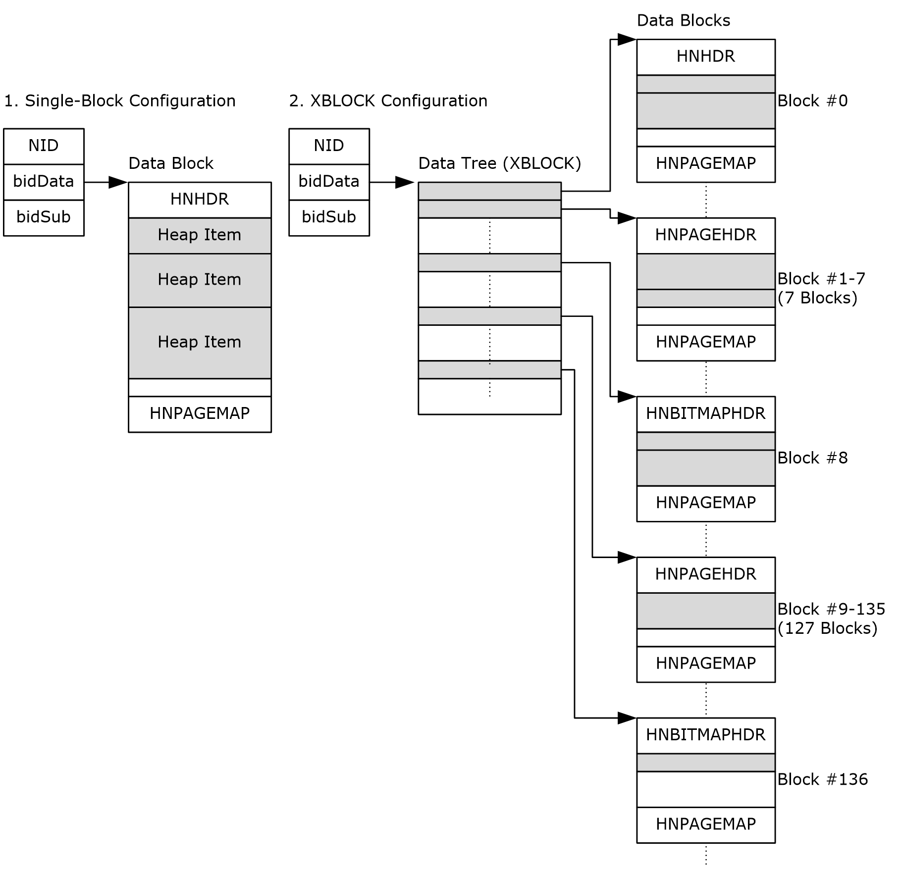

Figure 4: Data organization of a Heap node

This illustrates the data organization for an **HN** that consists of a
single data block, and an **HN** that consists of multiple data blocks
through the use of a data tree construct. Note than an **XXBLOCK** can
be used if the space required exceeds the capacity of an **XBLOCK**.

##### Single-Block Configuration

The single-block **HN** consists of a single data block with an
**HNHDR** header structure and an **HNPAGEMAP** trailer structure at the
end. The diagram in section 2.3.1.6 also shows how all the items
allocated from the heap are located in the space between the **HNHDR**
and the **HNPAGEMAP** structures.

##### Data Tree Configuration

In the case of the multi-block **HN**, a data tree is used to fan out
into multiple data blocks. An **XXBLOCK** is used if the **HN** exceeds
the capacity of an **XBLOCK**, but the maximum number of blocks is 2 to
the 16th power because of the 16-bit capacity of
**hidBlockIndex** (section 2.3.1.1). The first data block is identical
to the single-block case. Because the **HNHDR** has eight Fill **Level**
Map slots, the next seven blocks only have the abbreviated **HNPAGEHDR**
header structure. The eighth block, however, only has an **HNBITMAPHDR**
header structure because a new Fill Level Map is needed. Because
**HNBITMAPHDR** has 128 slots, it is only required once every 128 blocks
thereafter. All the blocks in-between have the **HNPAGEHDR** header
instead.

In terms of data arrangement, the data tree case is an extension to the
single-block case, where individual heap items are allocated from the
leaf data blocks in a similar manner.

### BTree-on-Heap (BTH)

A **BTree-on-Heap** implements a classic BTree on a heap node. A BTH
consists of several parts: A header, the BTree records, and optional
BTree data. The following diagram shows a high-level schematic of a BTH.

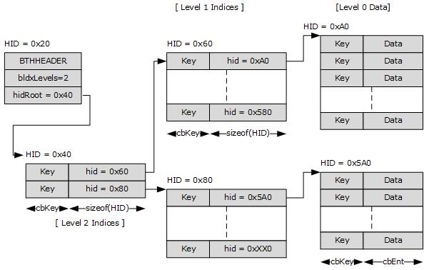

Figure 5: Data organization of a BTH

The preceding diagram shows a BTH with two levels of indices. The
top-level index (Key, HID) value pairs actually point to heap items that
contain the Level 1 Indices, which, in turn, point to heap items that
contain the leaf (Key, data) value pairs. Each of the six boxes in the
diagram actually represents six separate items allocated out of the same
HN, as indicated by their associated HIDs.

#### BTHHEADER

The BTHHEADER contains the BTH metadata, which instructs the reader how
to access the other objects of the BTH structure.

Unicode / ANSI:

<table>
<colgroup>
<col style="width: 3%" />
<col style="width: 3%" />
<col style="width: 3%" />
<col style="width: 3%" />
<col style="width: 3%" />
<col style="width: 3%" />
<col style="width: 3%" />
<col style="width: 3%" />
<col style="width: 3%" />
<col style="width: 3%" />
<col style="width: 3%" />
<col style="width: 3%" />
<col style="width: 3%" />
<col style="width: 3%" />
<col style="width: 3%" />
<col style="width: 3%" />
<col style="width: 3%" />
<col style="width: 3%" />
<col style="width: 3%" />
<col style="width: 3%" />
<col style="width: 3%" />
<col style="width: 3%" />
<col style="width: 3%" />
<col style="width: 3%" />
<col style="width: 3%" />
<col style="width: 3%" />
<col style="width: 3%" />
<col style="width: 3%" />
<col style="width: 3%" />
<col style="width: 3%" />
<col style="width: 3%" />
<col style="width: 3%" />
</colgroup>
<tbody>
<tr class="odd">
<td>0</td>
<td>1</td>
<td>2</td>
<td>3</td>
<td>4</td>
<td>5</td>
<td>6</td>
<td>7</td>
<td>8</td>
<td>9</td>
<td>
1

0
</td>
<td>1</td>
<td>2</td>
<td>3</td>
<td>4</td>
<td>5</td>
<td>6</td>
<td>7</td>
<td>8</td>
<td>9</td>
<td>
2

0
</td>
<td>1</td>
<td>2</td>
<td>3</td>
<td>4</td>
<td>5</td>
<td>6</td>
<td>7</td>
<td>8</td>
<td>9</td>
<td>
3

0
</td>
<td>1</td>
</tr>
<tr class="even">
<td colspan="8">bType</td>
<td colspan="8">cbKey</td>
<td colspan="8">cbEnt</td>
<td colspan="8">bIdxLevels</td>
</tr>
<tr class="odd">
<td colspan="32">hidRoot</td>
</tr>
</tbody>
</table>

**bType (1 byte):** MUST be **bTypeBTH**.

**cbKey (1 byte):** Size of the **BTree Key** value, in bytes. This
value MUST be set to 2, 4, 8, or 16.

**cbEnt (1 byte):** Size of the data value, in bytes. This MUST be
greater than zero and less than or equal to 32.

**bIdxLevels (1 byte):** Index depth. This number indicates how many
levels of intermediate indices exist in the **BTH**. Note that this
number is zero-based, meaning that a value of zero actually means that
the **BTH** has one level of indices. If this value is greater than
zero, then its value indicates how many intermediate index levels are
present.

**hidRoot (4 bytes):** This is the HID that points to the **BTH**
entries for this **BTHHEADER**. The data consists of an array of **BTH**
records. This value is set to zero if the **BTH** is empty.

#### Intermediate BTH (Index) Records

Index records do not contain actual data, but point to other index
records or leaf records. The format of the intermediate index record is
as follows. The number of index records can be determined based on the
size of the heap allocation.

Unicode / ANSI:

<table>
<colgroup>
<col style="width: 3%" />
<col style="width: 3%" />
<col style="width: 3%" />
<col style="width: 3%" />
<col style="width: 3%" />
<col style="width: 3%" />
<col style="width: 3%" />
<col style="width: 3%" />
<col style="width: 3%" />
<col style="width: 3%" />
<col style="width: 3%" />
<col style="width: 3%" />
<col style="width: 3%" />
<col style="width: 3%" />
<col style="width: 3%" />
<col style="width: 3%" />
<col style="width: 3%" />
<col style="width: 3%" />
<col style="width: 3%" />
<col style="width: 3%" />
<col style="width: 3%" />
<col style="width: 3%" />
<col style="width: 3%" />
<col style="width: 3%" />
<col style="width: 3%" />
<col style="width: 3%" />
<col style="width: 3%" />
<col style="width: 3%" />
<col style="width: 3%" />
<col style="width: 3%" />
<col style="width: 3%" />
<col style="width: 3%" />
</colgroup>
<tbody>
<tr class="odd">
<td>0</td>
<td>1</td>
<td>2</td>
<td>3</td>
<td>4</td>
<td>5</td>
<td>6</td>
<td>7</td>
<td>8</td>
<td>9</td>
<td>
1

0
</td>
<td>1</td>
<td>2</td>
<td>3</td>
<td>4</td>
<td>5</td>
<td>6</td>
<td>7</td>
<td>8</td>
<td>9</td>
<td>
2

0
</td>
<td>1</td>
<td>2</td>
<td>3</td>
<td>4</td>
<td>5</td>
<td>6</td>
<td>7</td>
<td>8</td>
<td>9</td>
<td>
3

0
</td>
<td>1</td>
</tr>
<tr class="even">
<td colspan="32">key (variable)</td>
</tr>
<tr class="odd">
<td colspan="32">...</td>
</tr>
<tr class="even">
<td colspan="32">hidNextLevel</td>
</tr>
</tbody>
</table>

**key (variable):** This is the **key** of the first record in the next
level index record array. The size of the **key** is specified in the
**cbKey** field in the corresponding BTHHEADER structure (section
2.3.2.1). The size and contents of the **key** are specific to the
higher level structure that implements this BTH.

**hidNextLevel (4 bytes):** HID of the next level index record array.
This contains the HID of the heap item that contains the next level
index record array.

#### Leaf BTH (Data) Records

Leaf BTH records contain the actual data associated with each key entry.
The BTH records are tightly packed (that is, byte-aligned), and each
record is exactly **cbKey** + **cbEnt** bytes in size. The number of
data records can be determined based on the size of the heap allocation.

Unicode / ANSI:

<table>
<colgroup>
<col style="width: 3%" />
<col style="width: 3%" />
<col style="width: 3%" />
<col style="width: 3%" />
<col style="width: 3%" />
<col style="width: 3%" />
<col style="width: 3%" />
<col style="width: 3%" />
<col style="width: 3%" />
<col style="width: 3%" />
<col style="width: 3%" />
<col style="width: 3%" />
<col style="width: 3%" />
<col style="width: 3%" />
<col style="width: 3%" />
<col style="width: 3%" />
<col style="width: 3%" />
<col style="width: 3%" />
<col style="width: 3%" />
<col style="width: 3%" />
<col style="width: 3%" />
<col style="width: 3%" />
<col style="width: 3%" />
<col style="width: 3%" />
<col style="width: 3%" />
<col style="width: 3%" />
<col style="width: 3%" />
<col style="width: 3%" />
<col style="width: 3%" />
<col style="width: 3%" />
<col style="width: 3%" />
<col style="width: 3%" />
</colgroup>
<tbody>
<tr class="odd">
<td>0</td>
<td>1</td>
<td>2</td>
<td>3</td>
<td>4</td>
<td>5</td>
<td>6</td>
<td>7</td>
<td>8</td>
<td>9</td>
<td>
1

0
</td>
<td>1</td>
<td>2</td>
<td>3</td>
<td>4</td>
<td>5</td>
<td>6</td>
<td>7</td>
<td>8</td>
<td>9</td>
<td>
2

0
</td>
<td>1</td>
<td>2</td>
<td>3</td>
<td>4</td>
<td>5</td>
<td>6</td>
<td>7</td>
<td>8</td>
<td>9</td>
<td>
3

0
</td>
<td>1</td>
</tr>
<tr class="even">
<td colspan="32">key (variable)</td>
</tr>
<tr class="odd">
<td colspan="32">...</td>
</tr>
<tr class="even">
<td colspan="32">data (variable)</td>
</tr>
<tr class="odd">
<td colspan="32">...</td>
</tr>
</tbody>
</table>

**key (variable):** This is the key of the record. The size of the
**key** is specified in the **cbKey** field in the corresponding
**BTHHEADER** structure(section 2.3.2.1). The size and contents of the
**key** are specific to the higher level structure that implements this
**BTH**.

**data (variable):** This contains the actual data associated with the
**key**. The size of the data is specified in the **cbEnt** field in the
corresponding **BTHHEADER** structure. The size and contents of the data
are specific to the higher level structure that implements this **BTH**.

### Property Context (PC)

The Property Context is built directly on top of a BTH. The existence of
a PC is indicated at the HN level, where **bClientSig** is set to
**bTypePC**. Implementation-wise, the PC is simply a BTH with **cbKey**
set to 2 and **cbEnt** set to 6 (see section 2.3.3.3). The following
section explains the layout of a PC BTH record.

Each property is stored as an entry in the BTH. Accessing a specific
property is just a matter of searching the BTH for a key that matches
the **property identifier** of the desired property, as the following
data structure illustrates.

#### Accessing the PC BTHHEADER

The BTHHEADER structure of a PC is accessed through the **hidUserRoot**
of the HNHDR structure of the containing HN.

#### HNID

An HNID is a 32-bit hybrid value that represents either an HID or an
NID. The determination is made by examining the **hidType** (or
equivalently, **nidType**) value. The HNID refers to an HID if the
**hidType** is NID_TYPE_HID. Otherwise, the HNID refers to an NID.

An HNID that refers to an HID indicates that the item is stored in the
data block. An HNID that refers to an NID indicates that the item is
stored in the subnode block, and the NID is the local NID under the
subnode where the raw data is located.

#### PC BTH Record

Unicode / ANSI:

<table>
<colgroup>
<col style="width: 3%" />
<col style="width: 3%" />
<col style="width: 3%" />
<col style="width: 3%" />
<col style="width: 3%" />
<col style="width: 3%" />
<col style="width: 3%" />
<col style="width: 3%" />
<col style="width: 3%" />
<col style="width: 3%" />
<col style="width: 3%" />
<col style="width: 3%" />
<col style="width: 3%" />
<col style="width: 3%" />
<col style="width: 3%" />
<col style="width: 3%" />
<col style="width: 3%" />
<col style="width: 3%" />
<col style="width: 3%" />
<col style="width: 3%" />
<col style="width: 3%" />
<col style="width: 3%" />
<col style="width: 3%" />
<col style="width: 3%" />
<col style="width: 3%" />
<col style="width: 3%" />
<col style="width: 3%" />
<col style="width: 3%" />
<col style="width: 3%" />
<col style="width: 3%" />
<col style="width: 3%" />
<col style="width: 3%" />
</colgroup>
<tbody>
<tr class="odd">
<td>0</td>
<td>1</td>
<td>2</td>
<td>3</td>
<td>4</td>
<td>5</td>
<td>6</td>
<td>7</td>
<td>8</td>
<td>9</td>
<td>
1

0
</td>
<td>1</td>
<td>2</td>
<td>3</td>
<td>4</td>
<td>5</td>
<td>6</td>
<td>7</td>
<td>8</td>
<td>9</td>
<td>
2

0
</td>
<td>1</td>
<td>2</td>
<td>3</td>
<td>4</td>
<td>5</td>
<td>6</td>
<td>7</td>
<td>8</td>
<td>9</td>
<td>
3

0
</td>
<td>1</td>
</tr>
<tr class="even">
<td colspan="16">wPropId</td>
<td colspan="16">wPropType</td>
</tr>
<tr class="odd">
<td colspan="32">dwValueHnid</td>
</tr>
</tbody>
</table>

**wPropId (2 bytes):** **Property ID**, as specified in \[MS-OXCDATA\]
section 2.9. This is the upper 16 bits of the **property tag** value.
This is a manifestation of the BTH record (section 2.3.2.3) and
constitutes the key of this record.

**wPropType (2 bytes):** **Property type**. This is the lower 16 bits of
the property tag value, which identifies the type of data that is
associated with the property. The complete list of property type values
and their data sizes are specified in \[MS-OXCDATA\] section 2.11.1.

**dwValueHnid (4 bytes):** Depending on the data size of the property
type indicated by **wPropType** and a few other factors, this field
represents different values. The following table explains the value
contained in **dwValueHnid** based on the different scenarios. In the
event where the **dwValueHnid** value contains an HID or NID (section
2.3.3.2), the actual data is stored in the corresponding heap or subnode
entry, respectively.

| Variable size? | Fixed data size | NID_TYPE(dwValueHnid) == NID_TYPE_HID? | dwValueHnid                  |
|----------------|-----------------|----------------------------------------|------------------------------|
| N              | \<= 4 bytes     | \-                                     | Data Value                   |
|                | \> 4 bytes      | Y                                      | HID                          |
| Y              | \-              | Y                                      | HID (\<= 3580 bytes)         |
|                |                 | N                                      | NID (subnode, \> 3580 bytes) |

#### Multi-Valued Properties

Multi-valued (MV) properties are properties that contain an array of
values. A Multi-Valued property can be derived from any basic **property
type**, for example: **PtypInteger32**, **PtypGuid**, **PtypString**,
**PtypBinary** (\[MS-OXCDATA\] section 2.11.1). The value of an MV
property is stored using an HNID, and is encoded in a packed binary
format. The following explains the data format for Multi-valued
properties:

##### MV Properties with Fixed-size Base Type

When an MV property contains elements of fixed size, such as
**PtypInteger32** or **PtypGuid**, the data layout is very
straightforward. The number of elements present is determined by
dividing the size of the heap or node data size by the size of the data
type. Each data element is aligned with respect to its own data type,
which results in a tightly-packed array of elements.

For example, if the HID points to an allocation of 64 bytes, and the
Fixed-size type is a **PtypInteger64** (8 bytes), then the number of
items in the MV property is 64 / 8 = 8 items. The size of the heap or
node data MUST be an integer multiple of the data type size.

##### MV Properties with Variable-size Base Type

When the MV property contains variable-size elements, such as
**PtypBinary**, **PtypString**, or **PtypString8**), the data layout is
more complex. The following is the data format of a multi-valued
property with variable-size base type.

Unicode / ANSI:

<table>
<colgroup>
<col style="width: 3%" />
<col style="width: 3%" />
<col style="width: 3%" />
<col style="width: 3%" />
<col style="width: 3%" />
<col style="width: 3%" />
<col style="width: 3%" />
<col style="width: 3%" />
<col style="width: 3%" />
<col style="width: 3%" />
<col style="width: 3%" />
<col style="width: 3%" />
<col style="width: 3%" />
<col style="width: 3%" />
<col style="width: 3%" />
<col style="width: 3%" />
<col style="width: 3%" />
<col style="width: 3%" />
<col style="width: 3%" />
<col style="width: 3%" />
<col style="width: 3%" />
<col style="width: 3%" />
<col style="width: 3%" />
<col style="width: 3%" />
<col style="width: 3%" />
<col style="width: 3%" />
<col style="width: 3%" />
<col style="width: 3%" />
<col style="width: 3%" />
<col style="width: 3%" />
<col style="width: 3%" />
<col style="width: 3%" />
</colgroup>
<tbody>
<tr class="odd">
<td>0</td>
<td>1</td>
<td>2</td>
<td>3</td>
<td>4</td>
<td>5</td>
<td>6</td>
<td>7</td>
<td>8</td>
<td>9</td>
<td>
1

0
</td>
<td>1</td>
<td>2</td>
<td>3</td>
<td>4</td>
<td>5</td>
<td>6</td>
<td>7</td>
<td>8</td>
<td>9</td>
<td>
2

0
</td>
<td>1</td>
<td>2</td>
<td>3</td>
<td>4</td>
<td>5</td>
<td>6</td>
<td>7</td>
<td>8</td>
<td>9</td>
<td>
3

0
</td>
<td>1</td>
</tr>
<tr class="even">
<td colspan="32">ulCount</td>
</tr>
<tr class="odd">
<td colspan="32">rgulDataOffsets (variable)</td>
</tr>
<tr class="even">
<td colspan="32">...</td>
</tr>
<tr class="odd">
<td colspan="32">rgDataItems (variable)</td>
</tr>
<tr class="even">
<td colspan="32">...</td>
</tr>
</tbody>
</table>

**ulCount (4 bytes):** Number of data items in the array.

**rgulDataOffsets (variable):** An array of ULONG values that represent
offsets to the start of each data item for the MV array. Offsets are
relative to the beginning of the MV property data record. The length of
the Nth data item is calculated as:
**rgulDataOffsets\[N+1\]** – **rgulDataOffsets\[N\]**, with the
exception of the last item, in which the total size of the MV property
data record is used instead of rgulDataOffsets\[N+1\].

**rgDataItems (variable):** A byte-aligned array of data items.
Individual items are delineated using the **rgulDataOffsets** values.

#### PtypObject Properties

When a property of type **PtypObject** is stored in a PC, the
**dwValueHnid** value described in section 2.3.3.3 points to a heap
allocation that contains a structure that defines the size and location
of the object data.

Unicode / ANSI:

<table>
<colgroup>
<col style="width: 3%" />
<col style="width: 3%" />
<col style="width: 3%" />
<col style="width: 3%" />
<col style="width: 3%" />
<col style="width: 3%" />
<col style="width: 3%" />
<col style="width: 3%" />
<col style="width: 3%" />
<col style="width: 3%" />
<col style="width: 3%" />
<col style="width: 3%" />
<col style="width: 3%" />
<col style="width: 3%" />
<col style="width: 3%" />
<col style="width: 3%" />
<col style="width: 3%" />
<col style="width: 3%" />
<col style="width: 3%" />
<col style="width: 3%" />
<col style="width: 3%" />
<col style="width: 3%" />
<col style="width: 3%" />
<col style="width: 3%" />
<col style="width: 3%" />
<col style="width: 3%" />
<col style="width: 3%" />
<col style="width: 3%" />
<col style="width: 3%" />
<col style="width: 3%" />
<col style="width: 3%" />
<col style="width: 3%" />
</colgroup>
<tbody>
<tr class="odd">
<td>0</td>
<td>1</td>
<td>2</td>
<td>3</td>
<td>4</td>
<td>5</td>
<td>6</td>
<td>7</td>
<td>8</td>
<td>9</td>
<td>
1

0
</td>
<td>1</td>
<td>2</td>
<td>3</td>
<td>4</td>
<td>5</td>
<td>6</td>
<td>7</td>
<td>8</td>
<td>9</td>
<td>
2

0
</td>
<td>1</td>
<td>2</td>
<td>3</td>
<td>4</td>
<td>5</td>
<td>6</td>
<td>7</td>
<td>8</td>
<td>9</td>
<td>
3

0
</td>
<td>1</td>
</tr>
<tr class="even">
<td colspan="32">Nid</td>
</tr>
<tr class="odd">
<td colspan="32">ulSize</td>
</tr>
</tbody>
</table>

**Nid (4 bytes):** The subnode identifier that contains the object data.

**ulSize (4 bytes):** The total size of the object.

#### Anatomy of a PC

The following diagram provides a visual representation how the various
storage scenarios play out in a PC.

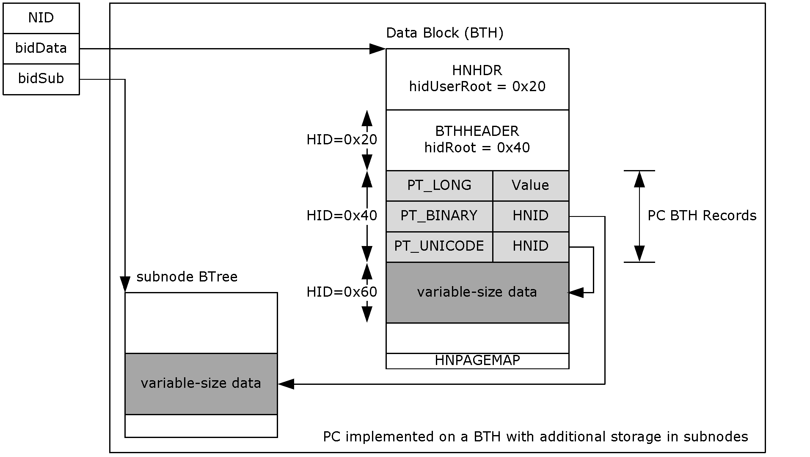

Figure 6: Data organization of a property context

This example shows a PC that is represented using a single data block
and the subnode. For a small **BTH**, a subnode is not used. The data
block points to an HN, which in turn contains a **BTH** that is built on
top of an **HN** as shown. For a PC, the **hidUserRoot** of the HN
points to the **BTHHEADER** (allocated form the heap with **HID** set to
0x20). The **hidRoot** of the BTHHEADER points to the array of PC BTH
records, which is also allocated from the heap (with **HID** set to
0x40).

The property-value pairs in the PC **BTH** records are stored using the
rules described in the previous sections. For a 32-bit **PtypInteger32**
(\[MS-OXCDATA\] section 2.11.1) property, the value is stored inline.
For variable-size properties such as strings and binary BLOBs, an
**HNID** is used to reference the data location. For the **PtypString**
(\[MS-OXCDATA\] section 2.11.1) case, the data fits into the available
space in the heap, and therefore is stored in the heap (HNID=0x60).

In the **PtypBinary** (\[MS-OXCDATA\] section 2.11.1) case, because the
BLOB is too large to fit within the heap (larger than 3580 bytes), the
subnode is used to store the data. In this case, the value of **HNID**
is set to the subnode **NID** that contains the binary data. Note that
the subnode structure in the diagram is significantly simplified for
illustrative purposes.

### Table Context (TC)

A Table Context represents a table with rows of columns. From an
implementation perspective, a TC is a complex, composite structure that
is built on top of an HN. The presence of a TC is indicated at both the
NDB and LTP Layers. At the NDB Layer, a TC is indicated through one of
the special NID_TYPEs, and at the LTP Layer, a value of **bTypeTC** for
**bClientSig** in the HNHDR structure is reserved for TCs. The
underlying TC data is separated into 3 entries: a header with Column
descriptors, a RowIndex (a nested BTH), and the actual table data (known
as the Row Matrix).

The Row Matrix contains the actual row data for the TC. New rows are
appended to the end of the Row Matrix, which means that the rows are not
sorted in any meaningful manner. To provide a way to efficiently search
the Row Matrix for a particular data row, each TC also contains an
embedded BTH, known as the RowIndex, to provide a 32-bit "primary index"
for the Row Matrix. Each 32-bit value is a key that uniquely identifies
a row within the Row Matrix.

In practice, the Row Matrix is stored in a subnode because of its
typical size, but in rare cases, a TC can fit into a single data block
if it is small enough. To facilitate navigation between rows, each row
of data is of the same size, and the size is stored in the TCINFO header
structure (section 2.3.4.1). To further help with data packing and
alignment, the data values are grouped according to its corresponding
data size. DWORD and ULONGLONG values are grouped first, followed by
WORD-sized data, and then byte-sized data. The TCINFO structure contains
an array of offsets that points to the starting offset of each group of
data.

The TC also includes a construct known as a Cell Existence Bitmap (CEB),
which is used to denote whether a particular column in a particular row
actually "exists". A CEB is present at the end of each row of data in
the Row Matrix that indicates which columns in that row exists and which
columns don't exist.

The following diagram depicts the various elements of a TC, and how they
relate to each other.

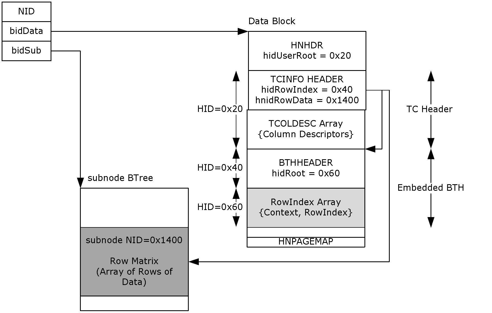

Figure 7: Data organization of a Table Context

The preceding example illustrates a typical TC arrangement, where the
metadata is stored in the main data block (a data tree can be used if
the TC is large), and the Row Matrix is stored in the corresponding
subnode. Note that the numerical values used in the example are for
reference purposes only.

The **hidUserRoot** of the HNHDR points to the TC header, which is
allocated from the heap with HID=0x20. The TC header contains a TCINFO
structure, followed by an array of column descriptors. The TCINFO
structure contains pointers that point to the RowIndex (**hidRowIndex**)
and The Row Matrix (hnidRowData). The RowIndex is allocated off the
heap, whereas the Row Matrix is stored in the subnode (in rare cases
where the TC is very small, the Row Matrix can be stored in a heap
allocation instead. Note that the subnode structure in the diagram is
significantly simplified for illustrative purposes.

The next sections describe actual data structures associated with Table
Contexts:

#### TCINFO

TCINFO is the header structure for the TC. The TCINFO is accessed using
the **hidUserRoot** field in the HNHDR structure of the containing HN.
The header contains the column definitions and other relevant data.

Unicode / ANSI:

<table>
<colgroup>
<col style="width: 3%" />
<col style="width: 3%" />
<col style="width: 3%" />
<col style="width: 3%" />
<col style="width: 3%" />
<col style="width: 3%" />
<col style="width: 3%" />
<col style="width: 3%" />
<col style="width: 3%" />
<col style="width: 3%" />
<col style="width: 3%" />
<col style="width: 3%" />
<col style="width: 3%" />
<col style="width: 3%" />
<col style="width: 3%" />
<col style="width: 3%" />
<col style="width: 3%" />
<col style="width: 3%" />
<col style="width: 3%" />
<col style="width: 3%" />
<col style="width: 3%" />
<col style="width: 3%" />
<col style="width: 3%" />
<col style="width: 3%" />
<col style="width: 3%" />
<col style="width: 3%" />
<col style="width: 3%" />
<col style="width: 3%" />
<col style="width: 3%" />
<col style="width: 3%" />
<col style="width: 3%" />
<col style="width: 3%" />
</colgroup>
<tbody>
<tr class="odd">
<td>0</td>
<td>1</td>
<td>2</td>
<td>3</td>
<td>4</td>
<td>5</td>
<td>6</td>
<td>7</td>
<td>8</td>
<td>9</td>
<td>
1

0
</td>
<td>1</td>
<td>2</td>
<td>3</td>
<td>4</td>
<td>5</td>
<td>6</td>
<td>7</td>
<td>8</td>
<td>9</td>
<td>
2

0
</td>
<td>1</td>
<td>2</td>
<td>3</td>
<td>4</td>
<td>5</td>
<td>6</td>
<td>7</td>
<td>8</td>
<td>9</td>
<td>
3

0
</td>
<td>1</td>
</tr>
<tr class="even">
<td colspan="8">bType</td>
<td colspan="8">cCols</td>
<td colspan="16">rgib</td>
</tr>
<tr class="odd">
<td colspan="32">...</td>
</tr>
<tr class="even">
<td colspan="16">...</td>
<td colspan="16">hidRowIndex</td>
</tr>
<tr class="odd">
<td colspan="16">...</td>
<td colspan="16">hnidRows</td>
</tr>
<tr class="even">
<td colspan="16">...</td>
<td colspan="16">hidIndex</td>
</tr>
<tr class="odd">
<td colspan="16">...</td>
<td colspan="16">rgTCOLDESC (variable)</td>
</tr>
<tr class="even">
<td colspan="32">...</td>
</tr>
</tbody>
</table>

**bType (1 byte):** TC signature; MUST be set to **bTypeTC.**

**cCols (1 byte):** Column count. This specifies the number of columns
in the TC.

**rgib (8 bytes):** This is an array of 4 16-bit values that specify the
offsets of various groups of data in the actual row data. The
application of this array is specified in section 2.3.4.4, which covers
the data layout of the Row Matrix. The following table lists the meaning
of each value:

| Index | Friendly name | Meaning of rgib\[Index\] value                   |
|-------|---------------|--------------------------------------------------|
| 0     | TCI_4b        | Ending offset of 8- and 4-byte data value group. |
| 1     | TCI_2b        | Ending offset of 2-byte data value group.        |
| 2     | TCI_1b        | Ending offset of 1-byte data value group.        |
| 3     | TCI_bm        | Ending offset of the Cell Existence Block.       |

**hidRowIndex (4 bytes):** HID to the Row ID BTH. The Row ID BTH
contains (RowID, RowIndex) value pairs that correspond to each row of
the TC. The RowID is a value that is associated with the row identified
by the RowIndex, whose meaning depends on the higher level structure
that implements this TC. The RowIndex is the zero-based index to a
particular row in the Row Matrix.

**hnidRows (4 bytes):** HNID to the Row Matrix (that is, actual table
data). This value is set to zero if the TC contains no rows.

**hidIndex (4 bytes):** Deprecated. Implementations SHOULD ignore this
value, and creators of a new PST MUST set this value to zero.

**rgTCOLDESC (variable):** Array of Column Descriptors. This array
contains **cCols** entries of type **TCOLDESC** structures that define
each TC column. The entries in this array MUST be sorted by the tag
field of **TCOLDESC**.

#### TCOLDESC

The **TCOLDESC** structure describes a single column in the TC, which
includes metadata about the size of the data associated with this
column, as well as whether a column exists, and how to locate the column
data from the Row Matrix.

Unicode / ANSI:

<table>
<colgroup>
<col style="width: 3%" />
<col style="width: 3%" />
<col style="width: 3%" />
<col style="width: 3%" />
<col style="width: 3%" />
<col style="width: 3%" />
<col style="width: 3%" />
<col style="width: 3%" />
<col style="width: 3%" />
<col style="width: 3%" />
<col style="width: 3%" />
<col style="width: 3%" />
<col style="width: 3%" />
<col style="width: 3%" />
<col style="width: 3%" />
<col style="width: 3%" />
<col style="width: 3%" />
<col style="width: 3%" />
<col style="width: 3%" />
<col style="width: 3%" />
<col style="width: 3%" />
<col style="width: 3%" />
<col style="width: 3%" />
<col style="width: 3%" />
<col style="width: 3%" />
<col style="width: 3%" />
<col style="width: 3%" />
<col style="width: 3%" />
<col style="width: 3%" />
<col style="width: 3%" />
<col style="width: 3%" />
<col style="width: 3%" />
</colgroup>
<tbody>
<tr class="odd">
<td>0</td>
<td>1</td>
<td>2</td>
<td>3</td>
<td>4</td>
<td>5</td>
<td>6</td>
<td>7</td>
<td>8</td>
<td>9</td>
<td>
1

0
</td>
<td>1</td>
<td>2</td>
<td>3</td>
<td>4</td>
<td>5</td>
<td>6</td>
<td>7</td>
<td>8</td>
<td>9</td>
<td>
2

0
</td>
<td>1</td>
<td>2</td>
<td>3</td>
<td>4</td>
<td>5</td>
<td>6</td>
<td>7</td>
<td>8</td>
<td>9</td>
<td>
3

0
</td>
<td>1</td>
</tr>
<tr class="even">
<td colspan="32">tag</td>
</tr>
<tr class="odd">
<td colspan="16">ibData</td>
<td colspan="8">cbData</td>
<td colspan="8">iBit</td>
</tr>
</tbody>
</table>

**tag (4 bytes):** This field specifies that 32-bit tag that is
associated with the column.

**ibData (2 bytes):** Data Offset. This field indicates the offset from
the beginning of the row data (in the Row Matrix) where the data for
this column can be retrieved. Because each data row is laid out the same
way in the Row Matrix, the Column data for each row can be found at the
same offset.

**cbData (1 byte):** Data size. This field specifies the size of the
data associated with this column (that is, "width" of the column), in
bytes per row. However, in the case of variable-sized data, this value
is set to the size of an HNID instead. This is explained further in
section 2.3.4.4.

**iBit (1 byte):** Cell Existence Bitmap Index. This value is the
0-based index into the CEB bit that corresponds to this Column. A
detailed explanation of the mapping mechanism will be discussed in
section 2.3.4.4.1.

#### The RowIndex

The **hidRowIndex** member in **TCINFO** points to an embedded BTH that
contains an array of (**dwRowID**, **dwRowIndex**) value pairs, which
provides a 32-bit primary index for searching the Row Matrix. Simply
put, the RowIndex maps **dwRowID**, a unique identifier, to the index of
a particular row in the Row Matrix.

The **RowIndex** itself is a generic mechanism to provide a 32-bit
primary key and therefore it is up to the implementation to decide what
value to use for the primary key. However, an NID value is used as the
primary key because of its uniqueness within a PST.

The following is the layout of the BTH data record used in the
**RowIndex**.

##### TCROWID

The **TCROWID** structure is a manifestation of the BTH data record
(section 2.3.2.3). The size of the **TCROWID** structure varies
depending on the version of the PST. For the Unicode PST, each record in
the BTH are 8 bytes in size, where **cbKey** is set to 4 and **cEnt** is
set to 4. For an ANSI PST, each record is 6 bytes in size, where
**cbKey** is set to 4 and **cEnt** is set to 2. The following is the
binary layout of the **TCROWID** structure.

Unicode:

<table>
<colgroup>
<col style="width: 3%" />
<col style="width: 3%" />
<col style="width: 3%" />
<col style="width: 3%" />
<col style="width: 3%" />
<col style="width: 3%" />
<col style="width: 3%" />
<col style="width: 3%" />
<col style="width: 3%" />
<col style="width: 3%" />
<col style="width: 3%" />
<col style="width: 3%" />
<col style="width: 3%" />
<col style="width: 3%" />
<col style="width: 3%" />
<col style="width: 3%" />
<col style="width: 3%" />
<col style="width: 3%" />
<col style="width: 3%" />
<col style="width: 3%" />
<col style="width: 3%" />
<col style="width: 3%" />
<col style="width: 3%" />
<col style="width: 3%" />
<col style="width: 3%" />
<col style="width: 3%" />
<col style="width: 3%" />
<col style="width: 3%" />
<col style="width: 3%" />
<col style="width: 3%" />
<col style="width: 3%" />
<col style="width: 3%" />
</colgroup>
<tbody>
<tr class="odd">
<td>0</td>
<td>1</td>
<td>2</td>
<td>3</td>
<td>4</td>
<td>5</td>
<td>6</td>
<td>7</td>
<td>8</td>
<td>9</td>
<td>
1

0
</td>
<td>1</td>
<td>2</td>
<td>3</td>
<td>4</td>
<td>5</td>
<td>6</td>
<td>7</td>
<td>8</td>
<td>9</td>
<td>
2

0
</td>
<td>1</td>
<td>2</td>
<td>3</td>
<td>4</td>
<td>5</td>
<td>6</td>
<td>7</td>
<td>8</td>
<td>9</td>
<td>
3

0
</td>
<td>1</td>
</tr>
<tr class="even">
<td colspan="32">dwRowID</td>
</tr>
<tr class="odd">
<td colspan="32">dwRowIndex</td>
</tr>
</tbody>
</table>

ANSI:

<table>
<colgroup>
<col style="width: 3%" />
<col style="width: 3%" />
<col style="width: 3%" />
<col style="width: 3%" />
<col style="width: 3%" />
<col style="width: 3%" />
<col style="width: 3%" />
<col style="width: 3%" />
<col style="width: 3%" />
<col style="width: 3%" />
<col style="width: 3%" />
<col style="width: 3%" />
<col style="width: 3%" />
<col style="width: 3%" />
<col style="width: 3%" />
<col style="width: 3%" />
<col style="width: 3%" />
<col style="width: 3%" />
<col style="width: 3%" />
<col style="width: 3%" />
<col style="width: 3%" />
<col style="width: 3%" />
<col style="width: 3%" />
<col style="width: 3%" />
<col style="width: 3%" />
<col style="width: 3%" />
<col style="width: 3%" />
<col style="width: 3%" />
<col style="width: 3%" />
<col style="width: 3%" />
<col style="width: 3%" />
<col style="width: 3%" />
</colgroup>
<tbody>
<tr class="odd">
<td>0</td>
<td>1</td>
<td>2</td>
<td>3</td>
<td>4</td>
<td>5</td>
<td>6</td>
<td>7</td>
<td>8</td>
<td>9</td>
<td>
1

0
</td>
<td>1</td>
<td>2</td>
<td>3</td>
<td>4</td>
<td>5</td>
<td>6</td>
<td>7</td>
<td>8</td>
<td>9</td>
<td>
2

0
</td>
<td>1</td>
<td>2</td>
<td>3</td>
<td>4</td>
<td>5</td>
<td>6</td>
<td>7</td>
<td>8</td>
<td>9</td>
<td>
3

0
</td>
<td>1</td>
</tr>
<tr class="even">
<td colspan="32">dwRowID</td>
</tr>
<tr class="odd">
<td colspan="16">dwRowIndex</td>
<td></td>
<td></td>
<td></td>
<td></td>
<td></td>
<td></td>
<td></td>
<td></td>
<td></td>
<td></td>
<td></td>
<td></td>
<td></td>
<td></td>
<td></td>
<td></td>
</tr>
</tbody>
</table>

**dwRowID (4 bytes):** This is the 32-bit primary key value that
uniquely identifies a row in the Row Matrix.

**dwRowIndex (Unicode: 4 bytes; ANSI: 2 bytes):** The 0-based index to
the corresponding row in the Row Matrix. Note that for ANSI PSTs, the
maximum number of rows is 2^16.

#### Row Matrix

The Row Matrix contains the actual data for the rows and columns of the
TC. The data is physically arranged in rows; each row contains the data
for each of its columns. Each row of column data in the Row Matrix is of
the same size and is arranged in the same layout, and the size of each
row is specified in the **rgib\[TCI_bm\]** value in the TCINFO header
structure.

However, in many cases, the Row Matrix is larger than 8 kilobytes and
therefore cannot fit in a single data block, which means that a data
tree is used to store the Row Matrix in separate data blocks. This means
that the row data is partitioned across two or more data blocks and
needs special handling considerations.

The design of a TC dictates that each data block MUST store an integral
number of rows, which means that rows cannot span across two blocks, and
that each block MUST start with a fresh row. This also means that in
order for a client to access a particular row in the Row Matrix, it
first calculates how many rows fit in a block, and calculates the row
index within that block at which the row data is located. The general
formulas to calculate the block index and row index for the
Nth row are as follows:

Rows per block = Floor((sizeof(block) – sizeof(BLOCKTRAILER)) /
TCINFO.rgib\[TCI_bm\])

Block index = N / (rows per block)

Row index = N % (rows per block)

Each block except the last one MUST have a size of 8192 bytes. If not,
the file is considered corrupted. The size of a block is specified in
the formula by *sizeof(block)*.

The following diagram illustrates how the data in the Row Matrix is
organized.

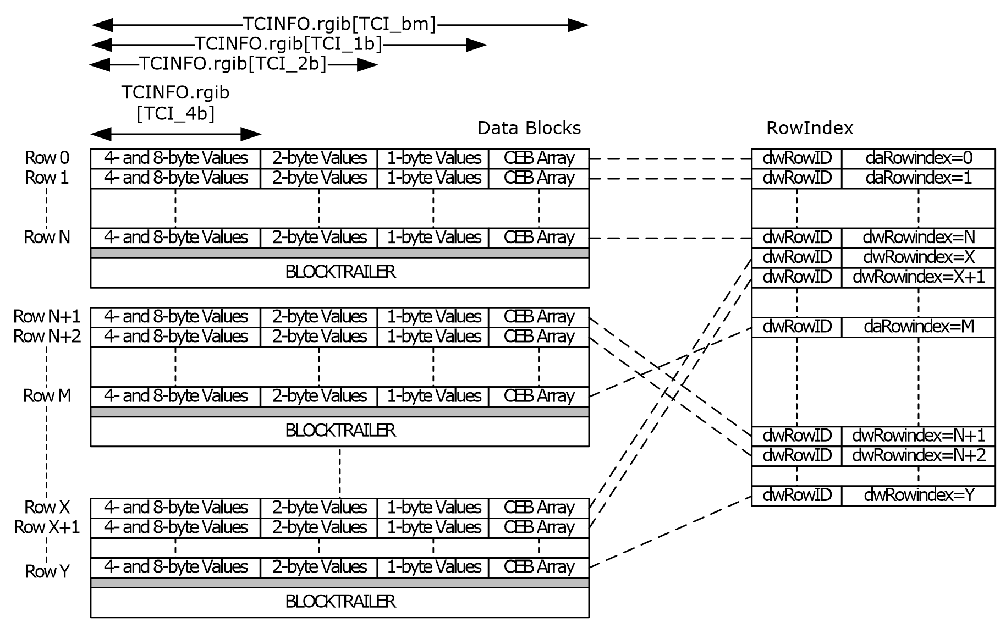

Figure 8: Data organization of the Row Matrix

In addition to showing the data organization of the Row Matrix, this
diagram also illustrates how the rows in the RowIndex relate to the row
data in the Row Matrix. As illustrated by the crossing of dotted lines
between the two structures, the Row Matrix data is unsorted, which makes
searching inefficient. The RowIndex, which is implemented using an
embedded BTH indexed by **dwRowID**, provides the primary search key to
lookup specific rows in the Row Matrix.

It is also worth noting that because of the fact that partial rows are
not allowed, there might be unused space at the end of the data block
(shaded in gray in the diagram). Readers MUST ignore any such "dead
space" and MUST NOT interpret its contents.

##### Row Data Format

The following is the organization of a single row of data in the Row
Matrix. Rows of data are tightly-packed in the Row Matrix, and the size
of each data row is **TCINFO.rgib\[TCI_bm\]** bytes. The following
constraints exist for the columns within the structure.

Columns MUST be sorted

1.  **PidTagLtpRowId** MUST be assigned **iBit** == 0

2.  **PidTagLtpRowId** MUST be assigned **ibData** == 0

3.  **PidTagLtpRowVer** MUST be assigned **iBit** == 1

4.  **PidTagLtpRowVer** MUST be assigned ibData == 4

5.  For any other columns, **iBit** can change/be any valid value (other
    than 0 and 1)

6.  For any other columns, **ibData** can be any valid value (other than
    0 and 4)

Unicode / ANSI:

<table>
<colgroup>
<col style="width: 3%" />
<col style="width: 3%" />
<col style="width: 3%" />
<col style="width: 3%" />
<col style="width: 3%" />
<col style="width: 3%" />
<col style="width: 3%" />
<col style="width: 3%" />
<col style="width: 3%" />
<col style="width: 3%" />
<col style="width: 3%" />
<col style="width: 3%" />
<col style="width: 3%" />
<col style="width: 3%" />
<col style="width: 3%" />
<col style="width: 3%" />
<col style="width: 3%" />
<col style="width: 3%" />
<col style="width: 3%" />
<col style="width: 3%" />
<col style="width: 3%" />
<col style="width: 3%" />
<col style="width: 3%" />
<col style="width: 3%" />
<col style="width: 3%" />
<col style="width: 3%" />
<col style="width: 3%" />
<col style="width: 3%" />
<col style="width: 3%" />
<col style="width: 3%" />
<col style="width: 3%" />
<col style="width: 3%" />
</colgroup>
<tbody>
<tr class="odd">
<td>0</td>
<td>1</td>
<td>2</td>
<td>3</td>
<td>4</td>
<td>5</td>
<td>6</td>
<td>7</td>
<td>8</td>
<td>9</td>
<td>
1

0
</td>
<td>1</td>
<td>2</td>
<td>3</td>
<td>4</td>
<td>5</td>
<td>6</td>
<td>7</td>
<td>8</td>
<td>9</td>
<td>
2

0
</td>
<td>1</td>
<td>2</td>
<td>3</td>
<td>4</td>
<td>5</td>
<td>6</td>
<td>7</td>
<td>8</td>
<td>9</td>
<td>
3

0
</td>
<td>1</td>
</tr>
<tr class="even">
<td colspan="32">dwRowID</td>
</tr>
<tr class="odd">
<td colspan="32">rgdwData (variable)</td>
</tr>
<tr class="even">
<td colspan="32">...</td>
</tr>
<tr class="odd">
<td colspan="32">rgwData (variable)</td>
</tr>
<tr class="even">
<td colspan="32">...</td>
</tr>
<tr class="odd">
<td colspan="32">rgbData (variable)</td>
</tr>
<tr class="even">
<td colspan="32">...</td>
</tr>
<tr class="odd">
<td colspan="32">rgbCEB (variable)</td>
</tr>
<tr class="even">
<td colspan="32">...</td>
</tr>
</tbody>
</table>

**dwRowID (4 bytes):** The 32-bit value that corresponds to the
**dwRowID** value in this row's corresponding **TCROWID** record. Note
that this value corresponds to the **PidTagLtpRowId** property.

**rgdwData (variable):** 4-byte-aligned **Column** data. This region
contains data with a size that is a multiple of 4 bytes. The types of
data stored in this region are 4-byte and 8-byte values.

**rgwData (variable):** 2-byte-aligned **Column** data. This region
contains data that are 2 bytes in size.

**rgbData (variable):** Byte-aligned **Column** data. This region
contains data that are byte-sized.

**rgbCEB (variable):** Cell Existence Block. This array of bits
comprises the CEB, in which each bit corresponds to a particular Column
in the current row. The mapping between CEB bits and actual Columns is
based on the **iBit** member of each **TCOLDESC** (section 2.3.4.2),
where an **iBit** value of zero maps to the Most Significant Bit (MSB)
of the 0th byte of the CEB array (rgCEB\[0\]). Subsequent **iBit**
values map to the next less-significant bit until the Least Significant
Bit (LSB) is reached, where the subsequent **iBit** can be found in the
MSB of the next byte in the CEB array and the process repeats itself.
Programmatically, the Cell Existence Bit that corresponds to iBit can be
extracted as follows:

1.  BOOL fCEB = !!(rgCEB\[iBit / 8\] & (1 \<\< (7 - (iBit % 8))));

Space is reserved for a column in the Row Matrix, regardless of the
corresponding CEB bit value for that column. Specifically, an fCEB bit
value of TRUE indicates that the corresponding column value in the Row
matrix is valid and SHOULD be returned if requested. However, an fCEB
bit value of **false** indicates that the corresponding column value in
the Row matrix is "not set" or "invalid". In this case, the property
MUST be "not found" if requested.

The size of **rgCEB** is CEIL(TCINFO.cCols / 8) bytes. Extra lower-order
bits SHOULD be ignored. Creators of a new PST MUST set the extra
lower-order bits to zero.

##### Variable-sized Data

With respect to the TC, variable-sized data is defined as any data type
that allows a variable size (such as strings), or any fixed-size data
type that exceeds 8 bytes (for example, a GUID). In the case of
variable-sized data, the actual data is stored elsewhere in the heap or
in a subnode, and the HNID that references the data is stored the
corresponding **rgdwData** slot instead. The following is a list of the
**property types** that are stored using an HNID. A complete list of
property types is specified in \[MS-OXCDATA\] section 2.11.1.

- **PtypString**

- **PtypString8**

- **PtypBinary**

- **PtypObject**

- **PtypGuid**

- All multi-valued types

The following table illustrates the handling of fixed- and
variable-sized data in the TC (see section 2.3.3.2 for determining if an
HNID is an HID or an NID).

| Variable size? | Fixed data size | NID_TYPE(dwValueHnid) == NID_TYPE_HID? | rgdwData value               |
|----------------|-----------------|----------------------------------------|------------------------------|
| N              | \<= 8 bytes\*   | \-                                     | Data value                   |
|                | \> 8 bytes\*    | Y                                      | HID                          |
| Y              | \-              | Y                                      | HID (\<= 3580 bytes)         |
|                |                 | N                                      | NID (subnode, \> 3580 bytes) |

This contrasts with the PC in that the TC stores 8-byte values inline
(in **rgdwData**), whereas a PC would use an HNID for any data that
exceeds 4-bytes in size.

All property value not stored inline in the Row Matrix are processed as
described in section 2.3.3 Property Context (PC).

##### Cell Existence Test

Despite the existence of the CEB, the size of each row of column data is
still the same for every row. This means that a data slot exists for a
column, whether or not the column exists for that row. Because the data
slot of a non-existent column contains random values, third-party
implementations MUST first check the CEB to determine if a column
exists, and only process the column data if the column exists. This
prevents any confusion resulting from interpreting invalid data from
non-existent columns. Implementations MUST set the value of a
non-existent column to zero.

## Messaging Layer

The Messaging layer is a high-level layer that exposes functionality
provided in the LTP Layer through Messaging semantics. Instead of
primitive Property and Table Contexts, the Messaging Layer exposes
objects in terms of **message store**, **Folder objects**, **Message
objects** and **Attachment objects**, and defines the composite
structures for each of these objects, as well as defines the rules that
interrelate these objects with each other.

### Special Internal NIDs

This section focuses on a special NID_TYPE: NID_TYPE_INTERNAL (0x01). As
specified in section 2.2.2.1, the **nidType** of an NID is ignored by
the NDB Layer, and is left for the interpretation by higher level
implementations.

In the Messaging layer, nodes with various **nidType** values are also
used to build related structures that collectively represent complex
structures (for example, a **Folder object** is a composite object that
consists of a PC and three TCs of various **nidType** values). In
addition, the Messaging layer also uses NID_TYPE_INTERNAL to define
special NIDs that have special functions.

Because top-level NIDs are globally-unique within a PST, it follows that
each instance of a special NID can only appear once in a PST. The
following table lists all predefined internal NIDs.

| Value | Friendly name                    | Meaning                                                                                       |
|-------|----------------------------------|-----------------------------------------------------------------------------------------------|
| 0x21  | NID_MESSAGE_STORE                | **Message store** node (section 2.4.3).                                                       |
| 0x61  | NID_NAME_TO_ID_MAP               | Named Properties Map (section 2.4.7).                                                         |
| 0xA1  | NID_NORMAL_FOLDER_TEMPLATE       | Special template node for an empty Folder object.                                             |
| 0xC1  | NID_SEARCH_FOLDER_TEMPLATE       | Special template node for an empty search Folder object.                                      |
| 0x122 | NID_ROOT_FOLDER                  | Root Mailbox Folder object of PST.                                                            |
| 0x1E1 | NID_SEARCH_MANAGEMENT_QUEUE      | Queue of Pending Search-related updates.                                                      |
| 0x201 | NID_SEARCH_ACTIVITY_LIST         | Folder object NIDs with active Search activity.                                               |
| 0x241 | NID_RESERVED1                    | Reserved.                                                                                     |
| 0x261 | NID_SEARCH_DOMAIN_OBJECT         | Global list of all Folder objects that are referenced by any Folder object's Search Criteria. |
| 0x281 | NID_SEARCH_GATHERER_QUEUE        | Search Gatherer Queue (section 2.4.8.5.1).                                                    |
| 0x2A1 | NID_SEARCH_GATHERER_DESCRIPTOR   | Search Gatherer Descriptor (section 2.4.8.5.2).                                               |
| 0x2E1 | NID_RESERVED2                    | Reserved.                                                                                     |
| 0x301 | NID_RESERVED3                    | Reserved.                                                                                     |
| 0x321 | NID_SEARCH_GATHERER_FOLDER_QUEUE | Search Gatherer Folder Queue (section 2.4.8.5.3).                                             |

### Properties

A property is the basic unit of information in the Messaging layer. Each
property consists of a **property tag**, and a value. The property tag
consists of a **property identifier**, which identifies the property,
and a **property type**, which identifies the type of data associated
with the property.

#### Standard Properties

This document assumes the reader is already familiar with the concept of
properties, and does not delve into details about properties beyond what
is required to describe how properties are stored and handled in the PST
file format. Property definitions are specified in \[MS-OXPROPS\].

#### Named Properties

**Named properties** are a special type of properties which reside in a
reserved range of **property identifier** values (that is, WORD values
between 0x8000 and 0x8FFF). Named properties, unlike standard
properties, have names and meanings that are context-specific.

The assignment of named property identifiers is sequential and starts
from 0x8000. The first named property in the **message store** has a
property identifier of 0x8000, followed by 0x8001, and so on. A mapping
exists to map these property identifiers to property names. Note that a
named property only maps a property identifier to a property name (which
is a (GUID, Value) pair), but it says nothing about the data type of the
named property. The data type of the named property is specified in
**property tag** when the property is actually used (or stored). The
effective scope of named properties is limited to the current PST only.
In other words, the same named property identifier (for example, 0x8003)
might map to different properties in different PSTs.

There are two ways to map a named property identifier (NPID) to a
property name, the first way is to associate the NPID to a (GUID,
string) value pair, and the second way is to associate the NPID to a
(GUID, NameID) value pair. Each PST contains a special construct to
provide the mapping between NPIDs to their property names. The technical
details of this mapping mechanism are quite involved, and is presented
in section 2.4.7.

#### Calculated Properties

Calculated properties are properties that are well-known to the public
but are not physically stored in the PST as individual properties.
Instead, these properties are derived or calculated in one way or
another using other properties and other existing data. A detailed
account of all the calculated properties and how they are evaluated can
be found in section 2.5.

### Message Store

At the PST level, the **message store** is the root of the PST, which is
the rough equivalent of the top of a Mailbox. The message store contains
the top-level PST settings and metadata that are required to access and
manage the PST contents.

At the LTP Level, the message store is implemented as a regular PC. At
the NDB Layer, the message store is identified with a special internal
NID value of NID_MESSAGE_STORE (0x21) (see section 2.4.1). Any valid PST
MUST have exactly one message store node.

#### Minimum Set of Required Properties

The following properties MUST be present in any valid **message store**
PC.

| Property identifier | Property type  | Friendly name                   | Description                                       |
|---------------------|----------------|---------------------------------|---------------------------------------------------|
| 0x0FF9              | **PtypBinary** | **PidTagRecordKey**             | Record key. This is the Provider UID of this PST. |
| 0x3001              | **PtypString** | **PidTagDisplayName**           | Display name of PST                               |
| 0x35E0              | **PtypBinary** | **PidTagIpmSubTreeEntryId**     | **EntryID** of the Root Mailbox **Folder object** |
| 0x35E3              | **PtypBinary** | **PidTagIpmWastebasketEntryId** | EntryID of the Deleted Items Folder object        |
| 0x35E7              | **PtypBinary** | **PidTagFinderEntryId**         | EntryID of the search Folder object               |

#### Mapping between EntryID and NID

Objects in the **message store** are accessed externally using
**EntryIDs** (\[MS-OXCDATA\] section 2.2), where within the PST, objects
are accessed using their respective NIDs. The following explains the
layout of the ENTRYID structure, which is used to map between an NID and
its EntryID:

Unicode / ANSI:

<table>
<colgroup>
<col style="width: 3%" />
<col style="width: 3%" />
<col style="width: 3%" />
<col style="width: 3%" />
<col style="width: 3%" />
<col style="width: 3%" />
<col style="width: 3%" />
<col style="width: 3%" />
<col style="width: 3%" />
<col style="width: 3%" />
<col style="width: 3%" />
<col style="width: 3%" />
<col style="width: 3%" />
<col style="width: 3%" />
<col style="width: 3%" />
<col style="width: 3%" />
<col style="width: 3%" />
<col style="width: 3%" />
<col style="width: 3%" />
<col style="width: 3%" />
<col style="width: 3%" />
<col style="width: 3%" />
<col style="width: 3%" />
<col style="width: 3%" />
<col style="width: 3%" />
<col style="width: 3%" />
<col style="width: 3%" />
<col style="width: 3%" />
<col style="width: 3%" />
<col style="width: 3%" />
<col style="width: 3%" />
<col style="width: 3%" />
</colgroup>
<tbody>
<tr class="odd">
<td>0</td>
<td>1</td>
<td>2</td>
<td>3</td>
<td>4</td>
<td>5</td>
<td>6</td>
<td>7</td>
<td>8</td>
<td>9</td>
<td>
1

0
</td>
<td>1</td>
<td>2</td>
<td>3</td>
<td>4</td>
<td>5</td>
<td>6</td>
<td>7</td>
<td>8</td>
<td>9</td>
<td>
2

0
</td>
<td>1</td>
<td>2</td>
<td>3</td>
<td>4</td>
<td>5</td>
<td>6</td>
<td>7</td>
<td>8</td>
<td>9</td>
<td>
3

0
</td>
<td>1</td>
</tr>
<tr class="even">
<td colspan="32">rgbFlags</td>
</tr>
<tr class="odd">
<td colspan="32">uid (16 bytes)</td>
</tr>
<tr class="even">
<td colspan="32">...</td>
</tr>
<tr class="odd">
<td colspan="32">...</td>
</tr>
<tr class="even">
<td colspan="32">nid</td>
</tr>
</tbody>
</table>

**rgbFlags (4 bytes):** Flags; each of these bytes MUST be initialized
to zero.

**uid (16 bytes):** The provider UID of this PST, which is the value of
the **PidTagRecordKey** property in the message store. If this property
does not exist, the PST client MAY generate a new unique ID, or reject
the PST as invalid.

**nid (4 bytes):** This is the corresponding NID of the underlying node
that represents the object.

The corresponding NID of an EntryID can be directly extracted from the
EntryID structure. In addition, the NID_TYPE of the NID can be further
verified to ensure that the type of node (for example,
NID_TYPE_NORMAL_MESSAGE) actually matches the type of object being
referenced. Also, as a further verification mechanism, implementations
can compare the **uid** field against the **PidTagRecordKey** property
in the message store to ensure the EntryID actually refers to an item in
the current PST. This is particularly useful if the implementation
supports opening more than one PST at a time.

Conversely, the procedure for converting an NID to an **EntryID** simply
involves constructing the **ENTRYID** structure from the NID and the PST
Provider UID (**PidTagRecordKey**).

#### PST Password Security

PST files support a password-protect feature that requires an end user
to enter a pre-defined password before the PST can be opened. In
practice, the PST password is just implemented at the UI level, meaning
that the password is only required to gain access of the PST through the
UI. The password itself is not used to secure the PST data in any way.

Specifically, the CRC-32 hash of the password text is stored in the
**PidTagPstPassword** property in the PC associated with
NID_MESSAGE_STORE, and if the property exists and is nonzero,
implementations SHOULD prompt the end user for a password, compute the
CRC-32 hash of the user password, and verify it against the value stored
in **PidTagPstPassword**. Implementations MUST enforce the PST Password
check if a nonzero value for **PidTagPstPassword** is set in the
**message store**. Further discussion on PST Password Security can be
found in section 4.2.

### Folders

**Folder objects** are hierarchical containers that are used to create a
storage hierarchy for the **message store**. In the PST architecture, a
single root Folder object exists at the top of the message store, from
which an arbitrarily complex hierarchy of Folder objects descends to
provide structured storage for all the Messaging objects.

At the LTP level, a Folder object is a composite entity that is
represented using four LTP constructs. Specifically, each Folder object
consists of one PC, which contains the properties directly associated
with the Folder object, and three TCs for information about the
contents, hierarchy and other associated information of the Folder
object. Some Folder objects MAY have additional nodes that pertain to
Search, which is discussed in section 2.4.8.6.

At the NDB level, the 4 LTP constructs are persisted as 4 separate
top-level nodes (that is, 4 different NIDs). For identification
purposes, the **nidIndex** portion for each of the NIDs is the same to
indicate that these nodes collectively make up a Folder object. However,
each of the 4 NIDs has a different **nidType** value to differentiate
their respective function. The following diagram indicates the
relationships among these elements.

Figure 9: Components of a Folder object

The following sections explain the structure and function of each of the
4 composite elements of a Folder object,

#### Folder object PC

The **Folder object** PC is a PC that contains the immediate properties
of the Folder object. The NID of a Folder object PC MUST have an
NID_TYPE of NID_TYPE_NORMAL_FOLDER.

##### Property Schema of a Folder object PC

The default property schema of a **Folder object** is specified in
\[MS-OXCFOLD\] and \[MS-OXPROPS\]. However, the following properties
MUST be present in any valid Folder object PC.

| Property identifier | Property type     | Friendly name                | Description                                           |
|---------------------|-------------------|------------------------------|-------------------------------------------------------|
| 0x3001              | **PtypString**    | **PidTagDisplayName**        | Display name of the Folder object.                    |
| 0x3602              | **PtypInteger32** | **PidTagContentCount**       | Total number of items in the Folder object.           |
| 0x3603              | **PtypInteger32** | **PidTagContentUnreadCount** | Number of unread items in the Folder object.          |
| 0x360A              | **PtypBoolean**   | **PidTagSubfolders**         | Whether the Folder object has any sub-Folder objects. |

##### Locating the Parent Folder object

The **nidParent** member in a **Folder object** PC node contains the NID
of its parent Folder object. This allows efficient recursive traversal
of parent Folder objects by only accessing the Folder object PC node of
each Folder object.

#### Folder Template Tables

The PST has the notion of folder template tables, which are blank TCs
(that is, no data rows) with a set of columns. A folder template table
exists for each of the three **Folder object** TCs (**Hierarchy**,
**Contents**, and **folder associated information (FAI)**), and the
folder template table serves two purposes:

- Defines the default column schema for each Folder object TC.

- Specifies which columns to copy from the child object into the TC.

In the first case, whenever a new Folder object is created, each of the
folder template table TCs is duplicated into the new Folder object,
which defines the default set of columns for each of the Folder object
TCs. For the second case, when a new child object is created under the
Folder object (for example, sub-Folder object, **Message object**, and
so on), the default columns determine which properties of the child
object is to be copied into the TC row.

#### Data Duplication and Coherency Maintenance

It follows from the previous sections that information in each row of
the **Folder object** TC are duplicates of properties in a child object.
While this duplication of information allows efficient enumeration of
sub-objects without having to enumerate and examine the sub-object nodes
one-by-one, this duplication of information also requires additional
effort to keep both copies of the information in sync. Implementations
MUST ensure that changes to the underlying child object are correctly
reflected in the parent Folder object TC.

#### Hierarchy Table

The hierarchy table is implemented as a TC. The NID of a hierarchy table
MUST have an NID_TYPE of NID_TYPE_HIERARCHY_TABLE. Its function is to
list the immediate sub-**Folder objects** of the Folder object. Note
that the hierarchy table only contains sub-Folder object information.
Information about **Message objects** stored in the Folder object is
stored in the Contents Table (section 2.4.4.5) instead.

##### Hierarchy Table Template

Each PST MUST have one hierarchy table template, which is identified
with an NID value of NID_HIERARCHY_TABLE_TEMPLATE (0x60D). The hierarchy
table template defines the set of columns for every new hierarchy table
that is created. The hierarchy table template MUST have no data rows,
and MUST contain the following property columns. The list of columns
below represent the required properties, and different versions of
Outlook can add additional properties to the template.

| Property identifier | Property type     | Friendly name                | Description                                                                                              | Copied? |
|---------------------|-------------------|------------------------------|----------------------------------------------------------------------------------------------------------|---------|
| 0x0E30              | **PtypInteger32** | **PidTagReplItemid**         | Replication Item ID.                                                                                     | N       |
| 0x0E33              | **PtypInteger64** | **PidTagReplChangenum**      | Replication Change Number.                                                                               | N       |
| 0x0E34              | **PtypBinary**    | **PidTagReplVersionHistory** | Replication Version History.                                                                             | N       |
| 0x0E38              | **PtypInteger32** | **PidTagReplFlags**          | Replication flags.                                                                                       | Y       |
| 0x3001              | **PtypString**    | **PidTagDisplayName**        | Display name of sub-Folder object. This property has an alternate name of PidTagDisplayName_W.           | Y       |
| 0x3602              | **PtypInteger32** | **PidTagContentCount**       | Total number of items in the Folder object.                                                              | Y       |
| 0x3603              | **PtypInteger32** | **PidTagContentUnreadCount** | Number of unread items in the Folder object.                                                             | Y       |
| 0x360A              | **PtypBoolean**   | **PidTagSubfolders**         | Whether the **Folder object** has any sub-Folder objects.                                                | Y       |
| 0x3613              | **PtypBinary**    | **PidTagContainerClass**     | Container class of the sub-Folder object. This property has an alternate name of PidTagContainerClass_W. | Y       |
| 0x6635              | **PtypInteger32** | **PidTagPstHiddenCount**     | Total number of hidden Items in sub-Folder object.                                                       | Y       |
| 0x6636              | **PtypInteger32** | **PidTagPstHiddenUnread**    | Unread hidden items in sub-Folder object.                                                                | Y       |
| 0x67F2              | **PtypInteger32** | **PidTagLtpRowId**           | LTP Row ID.                                                                                              | Y       |
| 0x67F3              | **PtypInteger32** | **PidTagLtpRowVer**          | LTP Row Version.                                                                                         | Y       |

The right-most column indicates whether the property is copied from the
child Folder object PC into the hierarchy TC row when a new child Folder
object is created.

##### Locating Sub-Folder Object Nodes

The **RowIndex** (section 2.3.4.3) of the hierarchy table TC provides a
mechanism for efficiently locating immediate sub-**Folder objects**. The
**dwRowIndex** field represents the 0-based sub-Folder object row in the
Row Matrix, whereas the **dwRowID** value represents the NID of the
sub-Folder object node that corresponds to the row specified by
RowIndex. For example, if a TCROWID is: "{ **dwRowID**=0x8022,
**dwRowIndex**=3 }", the sub-Folder object NID that corresponds to the
fourth (first being 0th) sub-Folder object row in the Row
Matrix is 0x8022.

#### Contents Table

The contents table is a TC node that is identified with an NID_TYPE of
NID_TYPE_CONTENTS_TABLE. Its function is to list the **Message objects**
in the **Folder object**.

##### Contents Table Template

Each PST MUST have one contents table template, which is identified with
an NID value of NID_CONTENTS_TABLE_TEMPLATE (0x60E). The contents table
template MUST have no data rows, and MUST contain the property columns
described in the following table. These properties represent ONLY the
required properties; additional properties can be added by newer
versions of Outlook.

|                         |                   |                                        |                                                                                                      |             |
|-------------------------|-------------------|----------------------------------------|------------------------------------------------------------------------------------------------------|-------------|
| **Property identifier** | **Property type** | **Friendly name**                      | **Description**                                                                                      | **Copied?** |
| 0x0017                  | **PtypInteger32** | **PidTagImportance**                   | Importance                                                                                           | Y           |
| 0x001A                  | **PtypString**    | **PidTagMessageClassW**                | Message class. This property has an alternate name of **PidTagMessageClass_W**.                      | Y           |
| 0x0036                  | **PtypInteger32** | **PidTagSensitivity**                  | Sensitivity                                                                                          | Y           |
| 0x0037                  | **PtypString**    | **PidTagSubjectW**                     | Subject. This property has an alternate name of **PidTagSubject_W**.                                 | Y           |
| 0x0039                  | **PtypTime**      | **PidTagClientSubmitTime**             | Submit timestamp                                                                                     | Y           |
| 0x0042                  | **PtypString**    | **PidTagSentRepresentingNameW**        | Sender representative name. This property has an alternate name of **PidTagSentRepresentingName_W**. | Y           |
| 0x0057                  | **PtypBoolean**   | **PidTagMessageToMe**                  | Whether recipient is in To: line                                                                     | Y           |
| 0x0058                  | **PtypBoolean**   | **PidTagMessageCcMe**                  | Whether recipient is in Cc: line                                                                     | Y           |
| 0x0070                  | **PtypString**    | **PidTagConversationTopicW**           | Conversation topic. This property has an alternate name of **PidTagConversationTopic_W**.            | Y           |
| 0x0071                  | **PtypBinary**    | **PidTagConversationIndex**            | Conversation index                                                                                   | Y           |
| 0x0E03                  | **PtypString**    | **PidTagDisplayCcW**                   | Cc: line. This property has an alternate name of **PidTagDisplayCc_W**.                              | Y           |
| 0x0E04                  | **PtypString**    | **PidTagDisplayToW**                   | To: line. This property has an alternate name of **PidTagDisplayTo_W**.                              | Y           |
| 0x0E06                  | **PtypTime**      | **PidTagMessageDeliveryTime**          | Message delivery timestamp                                                                           | Y           |
| 0x0E07                  | **PtypInteger32** | **PidTagMessageFlags**                 | Message flags                                                                                        | Y           |
| 0x0E08                  | **PtypInteger32** | **PidTagMessageSize**                  | Message size                                                                                         | Y           |
| 0x0E17                  | **PtypInteger32** | **PidTagMessageStatus**                | Message status                                                                                       | Y           |
| 0x0E30                  | **PtypInteger32** | **PidTagReplItemid**                   | Replication item ID                                                                                  | Y           |
| 0x0E33                  | **PtypInteger64** | **PidTagReplChangenum**                | Replication change number                                                                            | Y           |
| 0x0E34                  | **PtypBinary**    | **PidTagReplVersionHistory**           | Replication version history                                                                          | Y           |
| 0x0E38                  | **PtypInteger32** | **PidTagReplFlags**                    | Replication flags                                                                                    | Y           |
| 0x0E3C                  | **PtypBinary**    | **PidTagReplCopiedfromVersionhistory** | Replication version information                                                                      | Y           |
| 0x0E3D                  | **PtypBinary**    | **PidTagReplCopiedfromItemid**         | Replication item ID information                                                                      | Y           |
| 0x1097                  | **PtypInteger32** | **PidTagItemTemporaryFlags**           | Temporary flags                                                                                      | Y           |
| 0x3008                  | **PtypTime**      | **PidTagLastModificationTime**         | Last modification time of **Message object**                                                         | Y           |
| 0x65C6                  | **PtypInteger32** | **PidTagSecureSubmitFlags**            | Secure submit flags                                                                                  | Y           |
| 0x67F2                  | **PtypInteger32** | **PidTagLtpRowId**                     | LTP row ID                                                                                           | Y           |
| 0x67F3                  | **PtypInteger32** | **PidTagLtpRowVer**                    | LTP row version                                                                                      | Y           |

The right-most column indicates whether the property is copied from the
Message object PC into the Contents TC row when a new Message object is
created.

##### Locating Message Object Nodes

The **RowIndex** (section 2.3.4.3) of the contents table TC provides an
efficient mechanism to locate the **Message object** PC node of every
Message object in the **Folder object**. The **dwRowIndex** field
represents the 0-based Message object row in the Row Matrix, whereas the
**dwRowID** value represents the NID of the Message object node that
corresponds to the row specified by **RowIndex**. For example, if a
TCROWID is "{ **dwRowID**=0x200024, **dwRowIndex**=3 }", the NID that
corresponds to the fourth (first being 0th) Message object
row in the Row Matrix is 0x200024.

#### FAI Contents Table

The **FAI contents table** is a TC node identified with an NID_TYPE of
NID_TYPE_ASSOC_CONTENTS_TABLE. Its function is to list the **FAI**
**Message objects** in the **Folder object**.

##### FAI Contents Table Template

Each PST MUST have one **FAI contents table** template, which is
identified with an NID value of NID_ASSOC_CONTENTS_TABLE_TEMPLATE
(0x60F). The FAI contents table template MUST have no data rows, and
MUST contain the following property columns.

| Property identifier | Property type             | Friendly name                                   | Description                                                                    | Copied? |
|---------------------|---------------------------|-------------------------------------------------|--------------------------------------------------------------------------------|---------|
| 0x001A              | **PtypString**            | **PidTagMessageClass**                          | Message class. And it has an alternate name PidTagMessageClass_W.              | Y       |
| 0x0E07              | **PtypInteger32**         | **PidTagMessageFlags**                          | Message flags.                                                                 | Y       |
| 0x0E17              | **PtypInteger32**         | **PidTagMessageStatus**                         | Message status.                                                                | Y       |
| 0x3001              | **PtypString**            | **PidTagDisplayName**                           | Display name. And it has an alternate name PidTagDisplayName_W.                | Y       |
| 0x67F2              | **PtypInteger32**         | **PidTagLtpRowId**                              | LTP row ID.                                                                    | Y       |
| 0x67F3              | **PtypInteger32**         | **PidTagLtpRowVer**                             | LTP row version.                                                               | Y       |
| 0x6800              | **PtypString**            | **PidTagOfflineAddressBookName**                | OAB name. And it has an alternate name PidTagOfflineAddressBookName_W.         | Y       |
| 0x6803              | **PtypBoolean**           | **PidTagSendOutlookRecallReport**               | Send recall report.                                                            | Y       |
| 0x6805              | **PtypMultipleInteger32** | **PidTagOfflineAddressBookTruncatedProperties** | OAB truncated properties.                                                      | Y       |
| 0x7003              | **PtypInteger32**         | **PidTagViewDescriptorFlags**                   | View descriptor flags.                                                         | Y       |
| 0x7004              | **PtypBinary**            | **PidTagViewDescriptorLinkTo**                  | View descriptor link.                                                          | Y       |
| 0x7005              | **PtypBinary**            | **PidTagViewDescriptorViewFolder**              | View descriptor **Folder object**.                                             | Y       |
| 0x7006              | **PtypString**            | **PidTagViewDescriptorName**                    | View descriptor name. And it has an alternate name PidTagViewDescriptorName_W. | Y       |
| 0x7007              | **PtypInteger32**         | **PidTagViewDescriptorVersion**                 | View descriptor version.                                                       | Y       |

#### Anatomy of a Folder Hierarchy

The following diagram links all the **Folder object** concepts together
by illustrating how each element interrelates with each other.

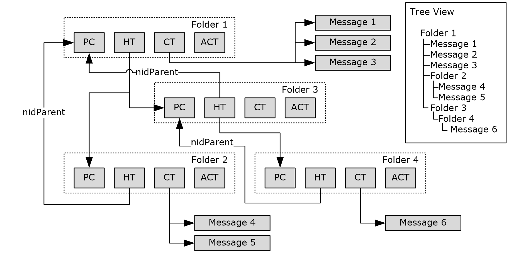

Figure 10: Anatomy of a Folder hierarchy

The preceding example illustrates how the various elements of a Folder
object work together to represent a Folder object hierarchy. The
equivalent "tree view" of the hierarchy is indicated on the right.

At the top of the hierarchy is Folder object 1, which contains 3
**Message objects** and 2 sub-Folder objects. The PC contains all the
properties associated with Folder object 1, where the hierarchy table
(HT) contains information about the 2 sub-Folder objects: Folder object
2 and Folder object 3. The information about the 3 Message objects in
the Folder object, however, is stored in the contents table (CT). While
not shown, the **FAI contents table** contains **FAI** Message objects
that pertain to Folder object 1. For more information about FAI Message
objects, see \[MS-OXCMSG\] section 1.3.2. In addition, the **RowIndex**
of Folder object 1's HT contains the necessary NID mappings that enable
navigation from Folder object 1 to Folder objects 2 and 3. The
relationship applies recursively to Folder object 2 and Folder object 3,
and eventually, to Folder object 4, as shown in the preceding diagram.

Note the use of the **nidParent** field in the hierarchy table node to
point back to the NID of the parent Folder object. Also note that all
arrows eventually point to the Folder object PC node, whose NID can be
replaced with different NID_TYPEs to access the other TCs.

#### Implications of Modifying a Folder Template Table

Modifying the list of columns in a folder template table TC impacts the
column list of the corresponding **Folder object** TC for Folder objects
created subsequent to the modification. The modification SHOULD NOT
impact Folder objects that were created prior to the modification.
Implementations MUST NOT remove columns from a template Table that is
part of its original template Table definition.

Implementations MUST NOT create data rows in a folder template table.

#### Implications of Modifying a Folder Object TC

In general, columns can be added to existing **Folder object** TCs. Any
new columns added to a Folder object TC MUST also be copied from the
child object, if the property exists in the child object, otherwise, the
new column is marked as non-existent for that particular row.
Implementations MUST also make sure that the information in the TC is
kept in sync with the underlying child objects.

Implementations MUST NOT remove columns form a TC (that is, remove a
TCOLDESC).

### Message Objects

A **Message object** is a composite structure, but unlike a **Folder
object**, all the data of a Message object is contained in a single
top-level node (that is, accessed through a single top-level NID). Both
the data block and subnode are used in a Message object node, where the
data block contains a PC structure that contains the immediate
properties of the Message object, and the subnode contains a number of
composite structures that contain information such as the Recipient List
and **Attachment objects**, if any.

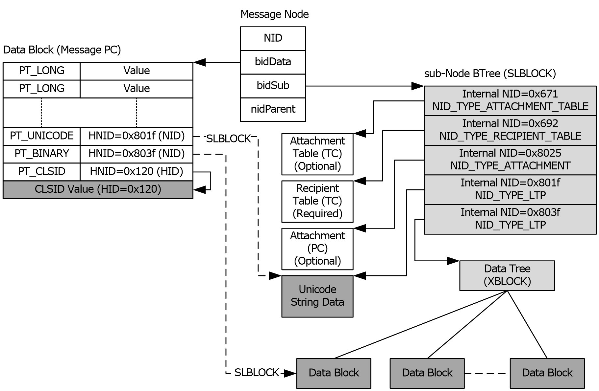

Figure 11: Components of a Message object

The preceding diagram is an illustration of the various components of a
Message object node. The data block contains the Message object PC,
which contains the properties associated with this Message object. The
subnode of the Message object can contain a number of objects, such as:
a Recipient Table TC, an optional Attachment Table TC, optional
Attachment object PCs, as well as variable-size data from the Message
object PC that cannot fit directly into the Message object PC heap. The
subnode BTree contains an array of subnodes that are identified using
internal NIDs (that is, unique within the Message object node only). The
contents of each subnode are identified primarily by the NID_TYPE. The
following table lists the NID_TYPEs that can be found in the subnode of
a Message object node.

| NID_TYPE                  | Description                                           | Required? |
|---------------------------|-------------------------------------------------------|-----------|
| NID_TYPE_RECIPIENT_TABLE  | The subnode is a Message Recipient Table.             | Y         |
| NID_TYPE_ATTACHMENT_TABLE | The subnode is an Attachment Table (optional).        | N         |
| NID_TYPE_ATTACHMENT       | The subnode is an Attachment object.                  | N         |
| NID_TYPE_LTP              | The subnode contains raw LTP data for the Message PC. | N         |

#### Message Object PC

The **Message object** PC is a standard Property Context structure that
contains the properties associated with the Message object. Message
object PC nodes are identified with an NID_TYPE of
NID_TYPE_NORMAL_MESSAGE.

##### Property Schema of a Message Object PC

**Message objects** have a rather complicated set of schemas and are out
of the scope of discussion of this document. However, the basic property
schema of a general Message object is specified in \[MS-OXCMSG\],
\[MS-OXOMSG\] and \[MS-OXPROPS\]. From the PST perspective, the
following properties MUST be present in any valid Message object PC.

| Property identifier | Property type     | Friendly name                  | Description                                                      |
|---------------------|-------------------|--------------------------------|------------------------------------------------------------------|
| 0x001A              | **PtypString**    | **PidTagMessageClass**         | Message class. And it has an alternate name PidTagMessageClassW. |
| 0x0E07              | **PtypInteger32** | **PidTagMessageFlags**         | Message flags.                                                   |
| 0x0E08              | **PtypInteger32** | **PidTagMessageSize**          | Message size.                                                    |
| 0x0E17              | **PtypInteger32** | **PidTagMessageStatus**        | Message status.                                                  |
| 0x3007              | **PtypTime**      | **PidTagCreationTime**         | Creation time.                                                   |
| 0x3008              | **PtypTime**      | **PidTagLastModificationTime** | Last modification time.                                          |
| 0x300B              | **PtypBinary**    | **PidTagSearchKey**            | Message Search Key.                                              |

#### Locating the Parent Folder Object of a Message Object

**Message objects** are not stand-alone entities and therefore each
Message object belongs to a parent **Folder object**. Similar to Folder
objects, the **nidParent** member of the Message object node (see the
diagram in section 2.4.6.3) contains the NID of the immediate parent
Folder object PC of the Message object. This allows efficient moving of
Message objects from one Folder object to another simply by updating the
**nidParent** to point to the new parent.

#### Recipient Table

The Recipient Table is a standard Table Context structure that is
identified with an NID_TYPE of NID_TYPE_RECIPIENT_TABLE. With the
exception of the recipient table template a Recipient Table resides in
the subnode of a **Message object** node. It contains the list of
Recipients of the Message object (one row per Recipient). A Recipient
Table MUST exist for any Message object.

##### Recipient Table Template

Each PST MUST have one recipient table template, which is identified
with an NID value of NID_RECIPIENT_TABLE (0x692). The recipient table
template defines the set of columns for every new Recipient Table that
is created. The recipient table template MUST have no data rows, and
MUST contain the following property columns.

| Property identifier | Property type     | Friendly name             | Description                                                                      |
|---------------------|-------------------|---------------------------|----------------------------------------------------------------------------------|
| 0x0c15              | **PtypInteger32** | **PidTagRecipientType**   | Type of recipient.                                                               |
| 0x0E0F              | **PtypBoolean**   | **PidTagResponsibility**  | Handling Responsibility.                                                         |
| 0x0FF9              | **PtypBinary**    | **PidTagRecordKey**       | Record Key.                                                                      |
| 0x0FFE              | **PtypInteger32** | **PidTagObjectType**      | Recipient Object type.                                                           |
| 0x0FFF              | **PtypBinary**    | **PidTagEntryId**         | EntryID of the recipient.                                                        |
| 0x3001              | **PtypString**    | **PidTagDisplayName**     | Display name of the recipient. And it has an alternate name PidTagDisplayName_W. |
| 0x3002              | **PtypString**    | **PidTagAddressType**     | Type of recipient address.                                                       |
| 0x3003              | **PtypString**    | **PidTagEmailAddress**    | E-mail address of recipient.                                                     |
| 0x300B              | **PtypBinary**    | **PidTagSearchKey**       | Search Key.                                                                      |
| 0x3900              | **PtypInteger32** | **PidTagDisplayType**     | Display type.                                                                    |
| 0x39FF              | **PtypString**    | **PidTag7BitDisplayName** | 7-bit Display name.                                                              |
| 0x3A40              | **PtypBoolean**   | **PidTagSendRichInfo**    | Send Rich info for recipient.                                                    |
| 0x67F2              | **PtypInteger32** | **PidTagLtpRowId**        | LTP Row ID.                                                                      |
| 0x67F3              | **PtypInteger32** | **PidTagLtpRowVer**       | LTP Row Version.                                                                 |

##### Message Object Recipient Tables

Recipient Tables in actual **Message objects** contain all the columns
in the recipient table template, plus a number of extra properties about
its Recipients. Recipient properties are specified in \[MS-OXPROPS\].

### Attachment Objects

An **Attachment object** is an arbitrary binary object that can be
associated with (that is, attached to) a **Message object**. As
illustrated in the diagram in section 2.4.6.3, Attachment objects are
stored in the subnode of a Message object node, and are therefore only
accessible through the Message object node.

A Message object keeps track of its Attachment objects using an optional
Attachment Table in its subnode. The Attachment Table is said to be
optional because it only exists if a Message object has at least one
Attachment object. The presence of Attachment objects is indicated in
**PidTagMessageFlags** property in the Message object. The presence of
Attachment objects is indicated by the **mfHasAttach** bit set to "1" in
**PidTagMessageFlags**(as specified in \[MS-OXCMSG\] section 2.2.1.6).
If Attachment objects are present, then the Attachment Table can be
accessed by scanning the subnode BTree of the Message object subnode to
locate a subnode whose NID is NID_ATTACHMENT_TABLE. Each Message object
MUST have at most one Attachment Table.

While the Attachment Table lists all the Attachment objects of a Message
object, The actual Attachment objects are stored in separate subnodes in
the Message object (see the diagram in section 2.4.6.3). Attachment
object subnodes are easily identified by having an NID_TYPE of
NID_TYPE_ATTACHMENT. Each Attachment object subnode contains a PC with
all the properties of the Attachment object, including a property that
contains the actual binary data of the Attachment object. The number of
Attachment object subnodes MUST match the number of rows in the
Attachment Table.

#### Attachment Table

The Attachment Table is a standard TC structure where each of its rows
maps to an **Attachment object**. Each row contains sufficient metadata
to identify or display a representation of the Attachment object, but
the full Attachment object data is stored in a separate subnode. The
Attachment table is optional, and can be absent from **Message objects**
that do not contain any Attachment objects.

##### Attachment Table Template

Each PST MUST have one attachment table template, which is identified
with an NID value of NID_ATTACHMENT_TABLE (0x671). The attachment table
template defines the set of columns for every new Attachment Table that
is created. The attachment table template MUST have no data rows, and
MUST contain the following property columns.

| Property identifier | Property type     | Friendly name               | Description                              |
|---------------------|-------------------|-----------------------------|------------------------------------------|
| 0x0E20              | **PtypInteger32** | **PidTagAttachSize**        | Size of **Attachment object**.           |
| 0x3704              | **PtypString**    | **PidTagAttachFilenameW**   | File name of Attachment object.          |
| 0x3705              | **PtypInteger32** | **PidTagAttachMethod**      | Attachment method.                       |
| 0x370B              | **PtypInteger32** | **PidTagRenderingPosition** | Rendering position of Attachment object. |
| 0x67F2              | **PtypInteger32** | **PidTagLtpRowId**          | LTP Row ID.                              |
| 0x67F3              | **PtypInteger32** | **PidTagLtpRowVer**         | LTP Row Version.                         |

##### Message Object Attachment Tables

Attachment Tables in actual **Message objects** contain all the columns
in the attachment table template, plus a number of extra properties
about its **Attachment object**. Attachment object properties are
specified in \[MS-OXCMSG\] and \[MS-OXPROPS\].

##### Locating Attachment Object Nodes from the Attachment Table

Each row in the Attachment Table maps to an **Attachment object**
subnode in the same way that a **Folder object** contents table maps its
rows to **Message object** nodes (see section 2.4.4.5.2). The Attachment
Table uses the **RowIndex** in the TC to map rows to Attachment object
subnodes. In particular, each **dwRowID** value contains the subnode NID
of the Attachment object subnode that corresponds to the row specified
by **dwRowIndex**.

#### Attachment Object PC

An **Attachment object** PC is a subnode with an NID_TYPE of
NID_TYPE_ATTACHMENT, which contains all the information about an
Attachment object. Because of the size of most Attachment objects being
quite large, the binary data of the Attachment objects are stored in the
subnode of the Attachment object node (which is itself a subnode of the
**Message object** node), and often, a data tree is used to store the
binary content. The number of Attachment object subnodes in a Message
object MUST equal the number of rows in the Attachment Table.

##### Property Schema of an Attachment Object PC

The basic property schema of a general **Message object** is specified
in \[MS-OXCMSG\] and \[MS-OXPROPS\]. From the PST perspective, the
following properties MUST be present in any valid **Attachment object**
PC.

| Property identifier | Property type     | Friendly name               | Description                              |
|---------------------|-------------------|-----------------------------|------------------------------------------|
| 0x0E20              | **PtypInteger32** | **PidTagAttachSize**        | Size of Attachment object.               |
| 0x3705              | **PtypInteger32** | **PidTagAttachMethod**      | Attachment method.                       |
| 0x370B              | **PtypInteger32** | **PidTagRenderingPosition** | Rendering position of Attachment object. |

##### Attachment Data

The actual binary content of an attachment (if any) is stored in
**PidTagAttachDataBinary**. However, if the attachment is itself a
message, the data is stored in **PidTagAttachDataObject**. In this case,
the **nid** value of the **PtypObject** property structure defined in
section 2.3.3.5 is a subnode which is a fully formed message as
described in section 2.4.5 – with the exception that such attached
messages are not located in the NBT and do not have a parent folder.

#### Relationship between Attachment Table and Attachment objects

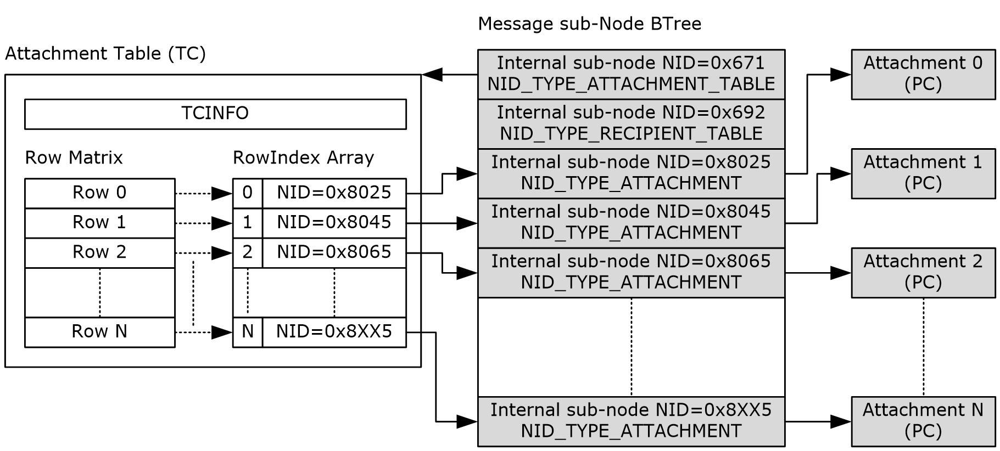

Figure 12: Relationship between Attachment table and Attachment objects

The preceding diagram depicts the mapping between rows in the Attachment
Table and the actual **Attachment object** subnodes using the
**RowIndex** to obtain the subnode NID, and then using the subnode BTree
records to locate the BIDs associated with each Attachment object PC.

### Named Property Lookup Map

The mapping between NPIDs and property names is done using a special
Name-to-ID-Map in the PST, with a special NID of NID_NAME_TO_ID_MAP
(0x61). There is one Name-to-ID-Map per PST. From an implementation
point of view, the Name-to-ID-Map is a standard PC with some special
properties. Specifically, the properties in the PC do not refer to real
**property identifiers**, but instead point to specific data sections of
the Name-to-ID-Map.

A **named property** is identified by a (GUID, identifier) value pair,
otherwise known as the property name. The identifier can be a string or
a 16-bit numerical value. The GUID value identifies the **property set**
to which the property name is associated. Well-known property names and
a list of property set GUIDs are specified in \[MS-OXPROPS\].

The Name-to-ID-Map (NPMAP) consists of several components: an Entry
Stream, a GUID Stream, a String Stream, and a hash table to expedite
searching. The following are the data structures used for the NPMAP.

#### NAMEID

Each NAMEID record corresponds to a **named property**. The contents of
the NAMEID record can be interpreted in two ways, depending on the value
of the N bit.

Unicode / ANSI:

<table>
<colgroup>
<col style="width: 3%" />
<col style="width: 3%" />
<col style="width: 3%" />
<col style="width: 3%" />
<col style="width: 3%" />
<col style="width: 3%" />
<col style="width: 3%" />
<col style="width: 3%" />
<col style="width: 3%" />
<col style="width: 3%" />
<col style="width: 3%" />
<col style="width: 3%" />
<col style="width: 3%" />
<col style="width: 3%" />
<col style="width: 3%" />
<col style="width: 3%" />
<col style="width: 3%" />
<col style="width: 3%" />
<col style="width: 3%" />
<col style="width: 3%" />
<col style="width: 3%" />
<col style="width: 3%" />
<col style="width: 3%" />
<col style="width: 3%" />
<col style="width: 3%" />
<col style="width: 3%" />
<col style="width: 3%" />
<col style="width: 3%" />
<col style="width: 3%" />
<col style="width: 3%" />
<col style="width: 3%" />
<col style="width: 3%" />
</colgroup>
<tbody>
<tr class="odd">
<td>0</td>
<td>1</td>
<td>2</td>
<td>3</td>
<td>4</td>
<td>5</td>
<td>6</td>
<td>7</td>
<td>8</td>
<td>9</td>
<td>
1

0
</td>
<td>1</td>
<td>2</td>
<td>3</td>
<td>4</td>
<td>5</td>
<td>6</td>
<td>7</td>
<td>8</td>
<td>9</td>
<td>
2

0
</td>
<td>1</td>
<td>2</td>
<td>3</td>
<td>4</td>
<td>5</td>
<td>6</td>
<td>7</td>
<td>8</td>
<td>9</td>
<td>
3

0
</td>
<td>1</td>
</tr>
<tr class="even">
<td colspan="32">dwPropertyID</td>
</tr>
<tr class="odd">
<td>N</td>
<td colspan="15">wGuid</td>
<td colspan="16">wPropIdx</td>
</tr>
</tbody>
</table>

**dwPropertyID (4 bytes):** If the **N** field is 1, this value is the
byte offset into the **String** stream in which the string name of the
property is stored. If the **N** field is 0, this value contains the
value of numerical name.

**N (1 bit):** Named property identifier type. If this value is 1, the
named property identifier is a string. If this value is 0, the named
property identifier is a 16-bit numerical value.

**wGuid (15 bits):** GUID index. If this value is 1 or 2, the named
property's GUID is one of 2 well-known GUIDs. If this value is greater
than 2, this value is the index plus 3 into the GUID Stream where the
GUID associated with this named property is located. The following table
explains how the **wGuid** value works.

| wGuid  | Friendly name              | Description                                                      |
|--------|----------------------------|------------------------------------------------------------------|
| 0x0000 | NAMEID_GUID_NONE           | No GUID (N=1).                                                   |
| 0x0001 | NAMEID_GUID_MAPI           | The GUID is PS_MAPI (\[MS-OXPROPS\] section 1.3.2).              |
| 0x0002 | NAMEID_GUID_PUBLIC_STRINGS | The GUID is PS_PUBLIC_STRINGS (\[MS-OXPROPS\] section 1.3.2).    |
| 0x0003 | N/A                        | GUID is found at the (N-3) \* 16 byte offset in the GUID Stream. |

**wPropIdx (2 bytes):** Property index. This is the ordinal number of
the named property, which is used to calculate the NPID of this named
property. The NPID of this named property is calculated by adding 0x8000
to **wPropIdx**.

#### GUID Stream

The GUID Stream is a flat array of 16-byte GUID values that contains the
GUIDs associated with all the **property sets** used in all the **named
properties** in the PST. The Entry Stream is stored as a single property
in the PC with the **property tag** **PidTagNameidStreamGuid**.

For each NAMEID record, the **wGuid** field is used to locate the GUID
that is associated with the named property. Because each GUID represents
a property set that can contain many related properties, it is therefore
quite common to have multiple NAMEID records referring to the same GUID.

#### Entry Stream

The Entry Stream is a flat array of NAMEID records that represent all
the **named properties** in the PST. The Entry Stream is stored as a
single property in the PC with the **property tag**
**PidTagNameidStreamEntry**.

#### The String Stream

The String Stream is a packed list of strings that is used for all the
**named properties** in the PST. The String Stream is stored as a single
property in the PC with the **property tag**
**PidTagNameidStreamString**.

The String Stream contains a string Name for every NAMEID record whose N
bit is set to 1. The corresponding value in **dwPropertyID** is the byte
offset to the beginning of the corresponding Name string in the String
Stream. The Name string is in Unicode format, even for ANSI PSTs. Each
string is preceded by the a DWORD giving the length of the string, in
bytes. NAMEID records given the offset of this length DWORD. Padding is
also added to the end of each string, so each length/string pair ends on
a 4 byte boundary. The strings are not null terminated.

#### Hash Table

The NPMAP has a hash table to expedite searches without having to scan
the various streams. The hash table is mostly used in avoiding
duplicates when attempting to add a new **named property**. The hash
table consists of a number of properties in the PC, including a special
property that contains the bucket count, and the hash buckets, each
bucket being a separate property.

The bucket count is stored in the property **PidTagNameidBucketCount**.
This property contains the number of hash buckets in the hash table. The
value of this property SHOULD be 251 (0xFB). Implementations, however,
MUST consult **PidTagNameidBucketCount** to obtain the actual bucket
count.

Hash buckets start at the **property identifier** of
**PidTagNameidBucketBase**, and are assigned sequentially. The hash
bucket property identifiers range from 0x1000 to (0x1000 + (bucket count
– 1)).

Given any NAMEID record, the bucket selection is determined using the
following formula:

2.  NAMEID nameid = { … };ULONG \*pul = (ULONG \*)&nameid;ULONG ulBucket
    = ((pul\[0\] ^ (pul\[1\] & 0xFFFF)) % BucketCount);

Each hash bucket contains a flat array of slightly modified NAMEID
records. The fields are interpreted as specified in section 2.4.7.1,
with the following exception. When the **N** field is set to "1", the
**dwPropertyID** field contains the CRC32 value of the corresponding
string in the String Stream. This is used to quickly identify potential
name matches or collisions when searching and inserting named
properties, respectively. Note that because of the many-to-one
properties of the CRC32 hash, a matching CRC32 value merely indicates
the potential of a Name match. An exact match is determined by checking
the actual strings.

The individual records within the bucket are not sorted in any
particular order so it is necessary to scan all the records in the
bucket to determine if a match is present.

#### Data Organization of the Name-to-ID Map

The following diagram depicts how the various elements of the NPMAP
relate to each other, and the two mapping scenarios.

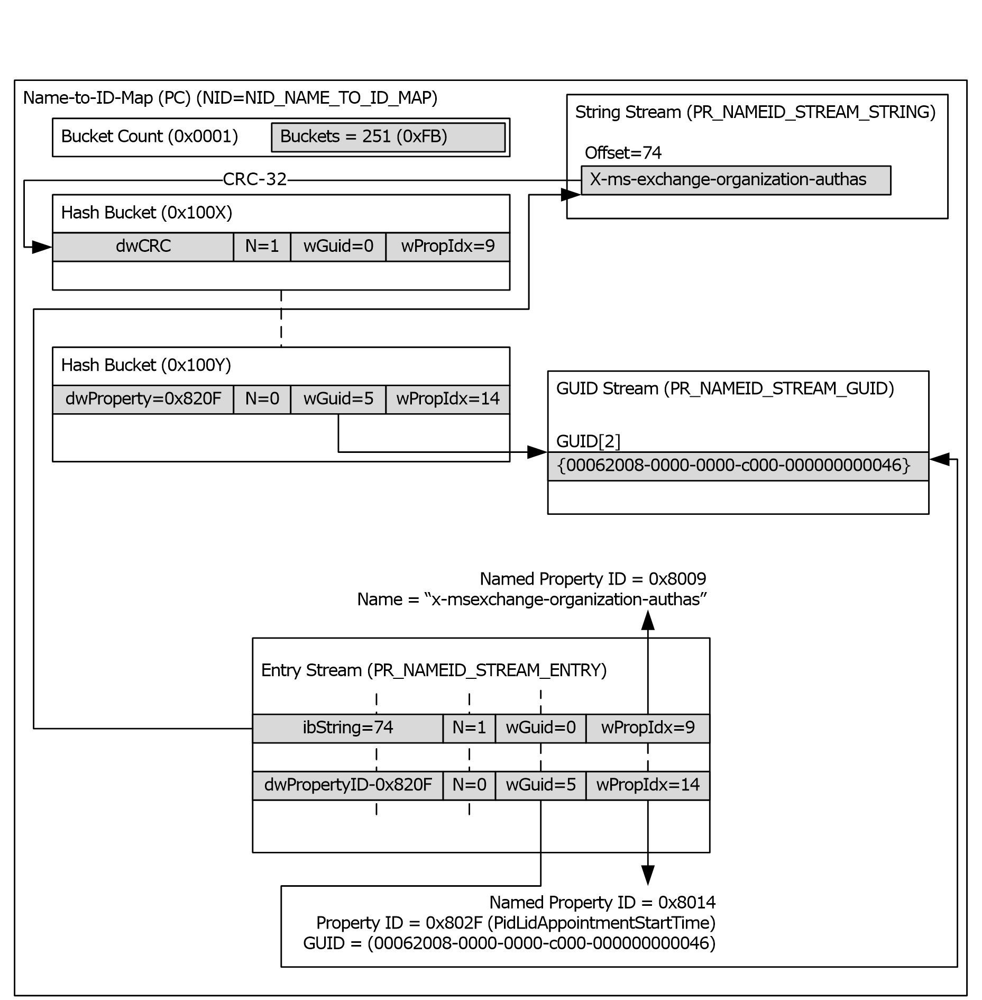

Figure 13: Data organization of the Name-to-ID map

The preceding diagram shows the Name-to-ID map (NPMAP) as a single
Property Context, and all the streams and hash table entities as
individual properties in the PC.

The top-right case shows the case where the property name is a (GUID,
string) value pair. The **property identifier** 0x8009 is mapped to the
name "x-ms-exchange-organization-authas", which is embedded in the
String Stream. The **wGuid** field is set to 0, indicating that no GUID
is associated with this property name.

The bottom-right case shows the second scenario, where property
identifier 0x8014 associated with well-known property name
**PidLidAppointmentStartTime**. 0x8014 is also associated with GUID
{00062008-0000-0000-C000-000000000046}, which represents the
PSETID_Common **property set** (\[MS-OXPROPS\]).

The left column depicts the hash table and how two buckets contain
records that refer back to these two **named properties**. The CRC32 of
the string property name is used in the **dwPropertyID** field in the
NAMEID record in the hash table.

### Search

A number of objects exist in the PST to support search-related features.
This section provides high-level information about the various Search
objects that can be found in a PST. The discussion of search-related
objects in this document is strictly limited to the scope of providing a
brief technical overview of each of the objects, and allowing
implementers to perform the necessary update requirements to the search
object when changing the contents of the PST.

The following are specific non-goals of this section:

- Provide technical information such that implementations can create
  search **Folder objects** and search criteria.

- Provide technical information such that implementations can perform
  search queue processing and content indexing.

The following diagram depicts the various search objects and their
relationship.

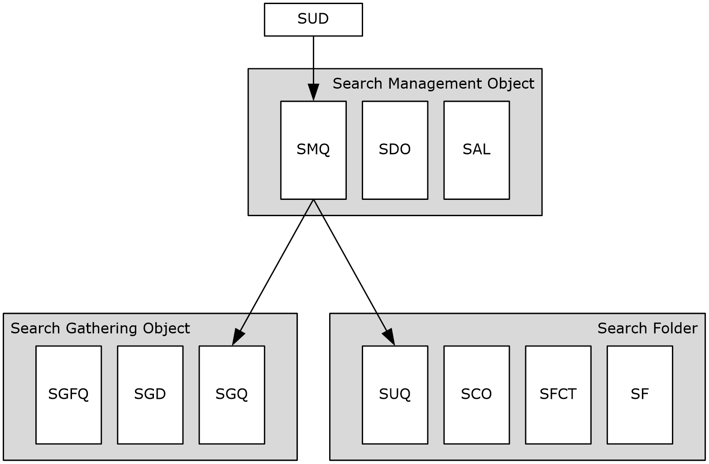

Figure 14: Search-related objects

#### Search Update Descriptor (SUD)

The SUD represents a single unit of change that can have an effect on
any of the search objects. When a change is made to the contents of a
PST (add, modification, removal, and so on), the modifier is responsible
to create a SUD that describes the change and queue it into the Search
Management Queue (SMQ). In order to prevent wasted space in the PST, the
following rules are applied:

1.  If indexing is enabled for a desktop search, the following types are
    queued:

    - SUDT_MSG_ADD

    - SUDT_MSG_MOD

    - SUDT_MSG_DEL

    - SUDT_FLD_ADD

    - SUDT_FLD_MOD

    - SUDT_FLD_DEL

    - SUDT_IDX_MSG_DEL

    - SUDT_MSG_MOV

2.  The following types are queued:

    - SUDT_SRCH_ADD

    - SUDT_SRCH_MOD

    - SUDT_SRCH_DEL

3.  If the NIDs of either old or new parent folders are contained in the
    SDO, the following types are queued:

    - SUDT_MSG_MOV

    - SUDT_FLD_MOV

    - SUDT_MSG_ADD

    - SUDT_MSG_MOD

    - SUDT_MSG_ROW_MOD

    - SUDT_MSG_DEL

    - SUDT_MSG_SPAM

    - SUDT_IDX_MSG_DEL

    - SUDT_FLD_ADD

    - SUDT_FLD_MOD

    - SUDT_FLD_DEL

4.  If none of the above conditions is satisfied, the SUD is not queued.

    1.  ##### SUD Structure

Each SUD is represented by SUD structure, which has the following
format.

<table>
<colgroup>
<col style="width: 3%" />
<col style="width: 3%" />
<col style="width: 3%" />
<col style="width: 3%" />
<col style="width: 3%" />
<col style="width: 3%" />
<col style="width: 3%" />
<col style="width: 3%" />
<col style="width: 3%" />
<col style="width: 3%" />
<col style="width: 3%" />
<col style="width: 3%" />
<col style="width: 3%" />
<col style="width: 3%" />
<col style="width: 3%" />
<col style="width: 3%" />
<col style="width: 3%" />
<col style="width: 3%" />
<col style="width: 3%" />
<col style="width: 3%" />
<col style="width: 3%" />
<col style="width: 3%" />
<col style="width: 3%" />
<col style="width: 3%" />
<col style="width: 3%" />
<col style="width: 3%" />
<col style="width: 3%" />
<col style="width: 3%" />
<col style="width: 3%" />
<col style="width: 3%" />
<col style="width: 3%" />
<col style="width: 3%" />
</colgroup>
<tbody>
<tr class="odd">
<td>0</td>
<td>1</td>
<td>2</td>
<td>3</td>
<td>4</td>
<td>5</td>
<td>6</td>
<td>7</td>
<td>8</td>
<td>9</td>
<td>
1

0
</td>
<td>1</td>
<td>2</td>
<td>3</td>
<td>4</td>
<td>5</td>
<td>6</td>
<td>7</td>
<td>8</td>
<td>9</td>
<td>
2

0
</td>
<td>1</td>
<td>2</td>
<td>3</td>
<td>4</td>
<td>5</td>
<td>6</td>
<td>7</td>
<td>8</td>
<td>9</td>
<td>
3

0
</td>
<td>1</td>
</tr>
<tr class="even">
<td colspan="16">wFlags</td>
<td colspan="16">wSUDType</td>
</tr>
<tr class="odd">
<td colspan="32">SUDData (16 bytes)</td>
</tr>
<tr class="even">
<td colspan="32">...</td>
</tr>
<tr class="odd">
<td colspan="32">...</td>
</tr>
</tbody>
</table>

**wFlags (2 bytes):** SUD Flags. Applicable SUD Flags depend on the
associated SUD Type. The following table summarizes the SUD Flags and
the types to which they are applicable. In the event that **wSUDType**
contains a type that is not listed below, this value is undefined and is
assigned a value of 0.

| Value  | Friendly name          | Meaning                                                  | Applies To       |
|--------|------------------------|----------------------------------------------------------|------------------|
| 0x0001 | SUDF_PRIORITY_LOW      | Change search **Folder object** priority to foreground.  | SUDT_SRCH_MOD    |
| 0x0002 | SUDF_PRIORITY_HIGH     | Change search Folder object priority to background.      | SUDT_SRCH_MOD    |
| 0x0004 | SUDF_SEARCH_RESTART    | Request full rebuild of search Folder object contents.   | SUDT_SRCH_MOD    |
| 0x0008 | SUDF_NAME_CHANGED      | Display Name of Folder object changed.                   | SUDT_FLD_MOD     |
| 0x0010 | SUDF_MOVE_OUT_TO_IN    | Move from non-SDO domain to SDO domain.                  | SUDT_FLD/MSG_MOV |
| 0x0020 | SUDF_MOVE_IN_TO_IN     | Move from SDO domain to SDO domain.                      | SUDT_FLD/MSG_MOV |
| 0x0040 | SUDF_MOVE_IN_TO_OUT    | Move from SDO domain to non-SDO domain.                  | SUDT_MSG_MOV     |
| 0x0080 | SUDF_MOVE_OUT_TO_OUT   | Move between non-SDO domains.                            | SUDT_MSG_MOV     |
| 0x0100 | SUDF_SPAM_CHECK_SERVER | Make sure **spam** **Message object** deleted on server. | SUDT_MSG_SPAM    |
| 0x0200 | SUDF_SET_DEL_NAME      | Delegate Root Name of Folder object changed.             | SUDT_FLD_MOD     |
| 0x0400 | SUDF_SRCH_DONE         | Search is finished for associated object.                | SUDT_SRCH_MOD    |
| 0x8000 | SUDF_DOMAIN_CHECKED    | Object is validated against the SDO.                     | SUDT_FLD/MSG\_\* |

**wSUDType (2 bytes):** SUD Type. This indicated the type of update that
is described in this SUD and is used as the selector field into the
structure to use for **SUDData**. The defined SUD types are described in
the following table.

| Value | Friendly name    | Meaning                                    | SUDData structure |
|-------|------------------|--------------------------------------------|-------------------|
| 0x00  | SUDT_NULL        | Invalid SUD Type.                          | None              |
| 0x01  | SUDT_MSG_ADD     | Message added.                             | SUD_MSG_ADD       |
| 0x02  | SUDT_MSG_MOD     | Message modified.                          | SUD_MSG_MOD       |
| 0x03  | SUDT_MSG_DEL     | Message deleted.                           | SUD_MSG_DEL       |
| 0x04  | SUDT_MSG_MOV     | Message moved.                             | SUD_MSG_MOV       |
| 0x05  | SUDT_FLD_ADD     | Folder object added.                       | SUD_FLD_ADD       |
| 0x06  | SUDT_FLD_MOD     | Folder object modified.                    | SUD_FLD_MOD       |
| 0x07  | SUDT_FLD_DEL     | Folder object deleted.                     | SUD_FLD_DEL       |
| 0x08  | SUDT_FLD_MOV     | Folder object moved.                       | SUD_FLD_MOV       |
| 0x09  | SUDT_SRCH_ADD    | Search Folder object added.                | SUD_SRCH_ADD      |
| 0x0A  | SUDT_SRCH_MOD    | Search Folder object modified.             | SUD_SRCH_MOD      |
| 0x0B  | SUDT_SRCH_DEL    | Search Folder object deleted.              | SUD_SRCH_DEL      |
| 0x0C  | SUDT_MSG_ROW_MOD | Message modified, contents table affected. | SUD_MSG_MOD       |
| 0x0D  | SUDT_MSG_SPAM    | Message identified as spam.                | SUD_MSG_SPAM      |
| 0x0E  | SUDT_IDX_MSG_DEL | Content-indexed Message object deleted.    | SUD_IDX_MSG_DEL   |
| 0x0F  | SUDT_MSG_IDX     | Message has been indexed.                  | SUD_MSG_IDX       |

**SUDData (16 bytes):** This is the data associated with the SUD. The
structure of this data depends on the SUD Type indicated in
**wSUDType**. Details about each structure type are specified in section
2.4.8.2.

#### SUDData Structures

The following are the definitions of the various **SUDData** structures
referenced in the preceding table.

##### SUD_MSG_ADD / SUD_MSG_MOD / SUD_MSG_DEL Structure

This structure is used to indicate that a **Message object** has been
added, modified or deleted. This structure has the following format.

<table>
<colgroup>
<col style="width: 3%" />
<col style="width: 3%" />
<col style="width: 3%" />
<col style="width: 3%" />
<col style="width: 3%" />
<col style="width: 3%" />
<col style="width: 3%" />
<col style="width: 3%" />
<col style="width: 3%" />
<col style="width: 3%" />
<col style="width: 3%" />
<col style="width: 3%" />
<col style="width: 3%" />
<col style="width: 3%" />
<col style="width: 3%" />
<col style="width: 3%" />
<col style="width: 3%" />
<col style="width: 3%" />
<col style="width: 3%" />
<col style="width: 3%" />
<col style="width: 3%" />
<col style="width: 3%" />
<col style="width: 3%" />
<col style="width: 3%" />
<col style="width: 3%" />
<col style="width: 3%" />
<col style="width: 3%" />
<col style="width: 3%" />
<col style="width: 3%" />
<col style="width: 3%" />
<col style="width: 3%" />
<col style="width: 3%" />
</colgroup>
<tbody>
<tr class="odd">
<td>0</td>
<td>1</td>
<td>2</td>
<td>3</td>
<td>4</td>
<td>5</td>
<td>6</td>
<td>7</td>
<td>8</td>
<td>9</td>
<td>
1

0
</td>
<td>1</td>
<td>2</td>
<td>3</td>
<td>4</td>
<td>5</td>
<td>6</td>
<td>7</td>
<td>8</td>
<td>9</td>
<td>
2

0
</td>
<td>1</td>
<td>2</td>
<td>3</td>
<td>4</td>
<td>5</td>
<td>6</td>
<td>7</td>
<td>8</td>
<td>9</td>
<td>
3

0
</td>
<td>1</td>
</tr>
<tr class="even">
<td colspan="32">nidParent</td>
</tr>
<tr class="odd">
<td colspan="32">nidMsg</td>
</tr>
</tbody>
</table>

**nidParent (4 bytes):** NID of the parent **Folder object** into which
the Message object is added, modified, or deleted.

**nidMsg (4 bytes):** NID of the Message object that was added,
modified, or deleted.

##### SUD_MSG_MOV Structure

This structure is used to indicate that a **Message object** has been
moved. This structure has the following format.

<table>
<colgroup>
<col style="width: 3%" />
<col style="width: 3%" />
<col style="width: 3%" />
<col style="width: 3%" />
<col style="width: 3%" />
<col style="width: 3%" />
<col style="width: 3%" />
<col style="width: 3%" />
<col style="width: 3%" />
<col style="width: 3%" />
<col style="width: 3%" />
<col style="width: 3%" />
<col style="width: 3%" />
<col style="width: 3%" />
<col style="width: 3%" />
<col style="width: 3%" />
<col style="width: 3%" />
<col style="width: 3%" />
<col style="width: 3%" />
<col style="width: 3%" />
<col style="width: 3%" />
<col style="width: 3%" />
<col style="width: 3%" />
<col style="width: 3%" />
<col style="width: 3%" />
<col style="width: 3%" />
<col style="width: 3%" />
<col style="width: 3%" />
<col style="width: 3%" />
<col style="width: 3%" />
<col style="width: 3%" />
<col style="width: 3%" />
</colgroup>
<tbody>
<tr class="odd">
<td>0</td>
<td>1</td>
<td>2</td>
<td>3</td>
<td>4</td>
<td>5</td>
<td>6</td>
<td>7</td>
<td>8</td>
<td>9</td>
<td>
1

0
</td>
<td>1</td>
<td>2</td>
<td>3</td>
<td>4</td>
<td>5</td>
<td>6</td>
<td>7</td>
<td>8</td>
<td>9</td>
<td>
2

0
</td>
<td>1</td>
<td>2</td>
<td>3</td>
<td>4</td>
<td>5</td>
<td>6</td>
<td>7</td>
<td>8</td>
<td>9</td>
<td>
3

0
</td>
<td>1</td>
</tr>
<tr class="even">
<td colspan="32">nidParentNew</td>
</tr>
<tr class="odd">
<td colspan="32">nidMsg</td>
</tr>
<tr class="even">
<td colspan="32">nidParentOld</td>
</tr>
</tbody>
</table>

**nidParentNew (4 bytes):** NID of the parent **Folder object** into
which the Message object is moved.

**nidMsg (4 bytes):** NID of the Message object that was moved.

**nidParentOld (4 bytes):** NID of the parent Folder object from which
the Message object is moved.

##### SUD_FLD_ADD / SUD_FLD_MOV Structure

This structure is used to indicate that a **Folder object** has been
added or moved. This structure has the following format.

<table>
<colgroup>
<col style="width: 3%" />
<col style="width: 3%" />
<col style="width: 3%" />
<col style="width: 3%" />
<col style="width: 3%" />
<col style="width: 3%" />
<col style="width: 3%" />
<col style="width: 3%" />
<col style="width: 3%" />
<col style="width: 3%" />
<col style="width: 3%" />
<col style="width: 3%" />
<col style="width: 3%" />
<col style="width: 3%" />
<col style="width: 3%" />
<col style="width: 3%" />
<col style="width: 3%" />
<col style="width: 3%" />
<col style="width: 3%" />
<col style="width: 3%" />
<col style="width: 3%" />
<col style="width: 3%" />
<col style="width: 3%" />
<col style="width: 3%" />
<col style="width: 3%" />
<col style="width: 3%" />
<col style="width: 3%" />
<col style="width: 3%" />
<col style="width: 3%" />
<col style="width: 3%" />
<col style="width: 3%" />
<col style="width: 3%" />
</colgroup>
<tbody>
<tr class="odd">
<td>0</td>
<td>1</td>
<td>2</td>
<td>3</td>
<td>4</td>
<td>5</td>
<td>6</td>
<td>7</td>
<td>8</td>
<td>9</td>
<td>
1

0
</td>
<td>1</td>
<td>2</td>
<td>3</td>
<td>4</td>
<td>5</td>
<td>6</td>
<td>7</td>
<td>8</td>
<td>9</td>
<td>
2

0
</td>
<td>1</td>
<td>2</td>
<td>3</td>
<td>4</td>
<td>5</td>
<td>6</td>
<td>7</td>
<td>8</td>
<td>9</td>
<td>
3

0
</td>
<td>1</td>
</tr>
<tr class="even">
<td colspan="32">nidParent</td>
</tr>
<tr class="odd">
<td colspan="32">nidMsg</td>
</tr>
<tr class="even">
<td colspan="32">dwReserved1</td>
</tr>
<tr class="odd">
<td colspan="32">dwReserved2</td>
</tr>
</tbody>
</table>

**nidParent (4 bytes):** NID of the parent Folder object into which the
**Message object** is added or moved.

**nidMsg (4 bytes):** NID of the Folder object that was added or moved.

**dwReserved1 (4 bytes):** Reserved; MUST be set to zero.

**dwReserved2 (4 bytes):** Reserved; MUST be set to zero.

##### SUD_FLD_MOD / SUD_FLD_DEL Structure

This structure is used to indicate that a **Folder object** has been
modified or deleted. This structure has the following format.

<table>
<colgroup>
<col style="width: 3%" />
<col style="width: 3%" />
<col style="width: 3%" />
<col style="width: 3%" />
<col style="width: 3%" />
<col style="width: 3%" />
<col style="width: 3%" />
<col style="width: 3%" />
<col style="width: 3%" />
<col style="width: 3%" />
<col style="width: 3%" />
<col style="width: 3%" />
<col style="width: 3%" />
<col style="width: 3%" />
<col style="width: 3%" />
<col style="width: 3%" />
<col style="width: 3%" />
<col style="width: 3%" />
<col style="width: 3%" />
<col style="width: 3%" />
<col style="width: 3%" />
<col style="width: 3%" />
<col style="width: 3%" />
<col style="width: 3%" />
<col style="width: 3%" />
<col style="width: 3%" />
<col style="width: 3%" />
<col style="width: 3%" />
<col style="width: 3%" />
<col style="width: 3%" />
<col style="width: 3%" />
<col style="width: 3%" />
</colgroup>
<tbody>
<tr class="odd">
<td>0</td>
<td>1</td>
<td>2</td>
<td>3</td>
<td>4</td>
<td>5</td>
<td>6</td>
<td>7</td>
<td>8</td>
<td>9</td>
<td>
1

0
</td>
<td>1</td>
<td>2</td>
<td>3</td>
<td>4</td>
<td>5</td>
<td>6</td>
<td>7</td>
<td>8</td>
<td>9</td>
<td>
2

0
</td>
<td>1</td>
<td>2</td>
<td>3</td>
<td>4</td>
<td>5</td>
<td>6</td>
<td>7</td>
<td>8</td>
<td>9</td>
<td>
3

0
</td>
<td>1</td>
</tr>
<tr class="even">
<td colspan="32">nidFld</td>
</tr>
<tr class="odd">
<td colspan="32">dwReserved</td>
</tr>
</tbody>
</table>

**nidFld (4 bytes):** NID of the Folder object that was modified or
deleted.

**dwReserved (4 bytes):** Reserved. Readers MUST NOT modify this value.
Creators of this structure MUST initialize this value to zero.

##### SUD_SRCH_ADD / SUD_SRCH_DEL Structure

This structure is used to indicate that a search **Folder object** has
been added or deleted. This structure has the following format.

<table>
<colgroup>
<col style="width: 3%" />
<col style="width: 3%" />
<col style="width: 3%" />
<col style="width: 3%" />
<col style="width: 3%" />
<col style="width: 3%" />
<col style="width: 3%" />
<col style="width: 3%" />
<col style="width: 3%" />
<col style="width: 3%" />
<col style="width: 3%" />
<col style="width: 3%" />
<col style="width: 3%" />
<col style="width: 3%" />
<col style="width: 3%" />
<col style="width: 3%" />
<col style="width: 3%" />
<col style="width: 3%" />
<col style="width: 3%" />
<col style="width: 3%" />
<col style="width: 3%" />
<col style="width: 3%" />
<col style="width: 3%" />
<col style="width: 3%" />
<col style="width: 3%" />
<col style="width: 3%" />
<col style="width: 3%" />
<col style="width: 3%" />
<col style="width: 3%" />
<col style="width: 3%" />
<col style="width: 3%" />
<col style="width: 3%" />
</colgroup>
<tbody>
<tr class="odd">
<td>0</td>
<td>1</td>
<td>2</td>
<td>3</td>
<td>4</td>
<td>5</td>
<td>6</td>
<td>7</td>
<td>8</td>
<td>9</td>
<td>
1

0
</td>
<td>1</td>
<td>2</td>
<td>3</td>
<td>4</td>
<td>5</td>
<td>6</td>
<td>7</td>
<td>8</td>
<td>9</td>
<td>
2

0
</td>
<td>1</td>
<td>2</td>
<td>3</td>
<td>4</td>
<td>5</td>
<td>6</td>
<td>7</td>
<td>8</td>
<td>9</td>
<td>
3

0
</td>
<td>1</td>
</tr>
<tr class="even">
<td colspan="32">nidSrch</td>
</tr>
</tbody>
</table>

**nidSrch (4 bytes):** NID of the search Folder object that was added or
deleted.

##### SUD_SRCH_MOD Structure

This structure is used to indicate that a search **Folder object** has
been modified. This structure has the following format.

<table>
<colgroup>
<col style="width: 3%" />
<col style="width: 3%" />
<col style="width: 3%" />
<col style="width: 3%" />
<col style="width: 3%" />
<col style="width: 3%" />
<col style="width: 3%" />
<col style="width: 3%" />
<col style="width: 3%" />
<col style="width: 3%" />
<col style="width: 3%" />
<col style="width: 3%" />
<col style="width: 3%" />
<col style="width: 3%" />
<col style="width: 3%" />
<col style="width: 3%" />
<col style="width: 3%" />
<col style="width: 3%" />
<col style="width: 3%" />
<col style="width: 3%" />
<col style="width: 3%" />
<col style="width: 3%" />
<col style="width: 3%" />
<col style="width: 3%" />
<col style="width: 3%" />
<col style="width: 3%" />
<col style="width: 3%" />
<col style="width: 3%" />
<col style="width: 3%" />
<col style="width: 3%" />
<col style="width: 3%" />
<col style="width: 3%" />
</colgroup>
<tbody>
<tr class="odd">
<td>0</td>
<td>1</td>
<td>2</td>
<td>3</td>
<td>4</td>
<td>5</td>
<td>6</td>
<td>7</td>
<td>8</td>
<td>9</td>
<td>
1

0
</td>
<td>1</td>
<td>2</td>
<td>3</td>
<td>4</td>
<td>5</td>
<td>6</td>
<td>7</td>
<td>8</td>
<td>9</td>
<td>
2

0
</td>
<td>1</td>
<td>2</td>
<td>3</td>
<td>4</td>
<td>5</td>
<td>6</td>
<td>7</td>
<td>8</td>
<td>9</td>
<td>
3

0
</td>
<td>1</td>
</tr>
<tr class="even">
<td colspan="32">nidSrch</td>
</tr>
<tr class="odd">
<td colspan="32">dwReserved</td>
</tr>
</tbody>
</table>

**nidSrch (4 bytes):** NID of the search Folder object that was
modified.

**dwReserved (4 bytes):** Reserved. Readers MUST NOT modify this value.
Creators of this structure MUST initialize this value to zero.

##### SUD_MSG_SPAM Structure

This structure is used to indicate that an incoming **Message object**
had been determined to be **spam**. This structure has the following
format.

<table>
<colgroup>
<col style="width: 3%" />
<col style="width: 3%" />
<col style="width: 3%" />
<col style="width: 3%" />
<col style="width: 3%" />
<col style="width: 3%" />
<col style="width: 3%" />
<col style="width: 3%" />
<col style="width: 3%" />
<col style="width: 3%" />
<col style="width: 3%" />
<col style="width: 3%" />
<col style="width: 3%" />
<col style="width: 3%" />
<col style="width: 3%" />
<col style="width: 3%" />
<col style="width: 3%" />
<col style="width: 3%" />
<col style="width: 3%" />
<col style="width: 3%" />
<col style="width: 3%" />
<col style="width: 3%" />
<col style="width: 3%" />
<col style="width: 3%" />
<col style="width: 3%" />
<col style="width: 3%" />
<col style="width: 3%" />
<col style="width: 3%" />
<col style="width: 3%" />
<col style="width: 3%" />
<col style="width: 3%" />
<col style="width: 3%" />
</colgroup>
<tbody>
<tr class="odd">
<td>0</td>
<td>1</td>
<td>2</td>
<td>3</td>
<td>4</td>
<td>5</td>
<td>6</td>
<td>7</td>
<td>8</td>
<td>9</td>
<td>
1

0
</td>
<td>1</td>
<td>2</td>
<td>3</td>
<td>4</td>
<td>5</td>
<td>6</td>
<td>7</td>
<td>8</td>
<td>9</td>
<td>
2

0
</td>
<td>1</td>
<td>2</td>
<td>3</td>
<td>4</td>
<td>5</td>
<td>6</td>
<td>7</td>
<td>8</td>
<td>9</td>
<td>
3

0
</td>
<td>1</td>
</tr>
<tr class="even">
<td colspan="32">nidParent</td>
</tr>
<tr class="odd">
<td colspan="32">nidMsg</td>
</tr>
</tbody>
</table>

**nidParent (4 bytes):** NID of the parent **Folder object** that
contains the spam Message object.

**nidMsg (4 bytes):** NID of the Message object being identified as
spam.

##### SUD_IDX_MSG_DEL Structure

This structure is used to indicate that an indexed **Message object**
has been deleted. This structure has the following format.

<table>
<colgroup>
<col style="width: 3%" />
<col style="width: 3%" />
<col style="width: 3%" />
<col style="width: 3%" />
<col style="width: 3%" />
<col style="width: 3%" />
<col style="width: 3%" />
<col style="width: 3%" />
<col style="width: 3%" />
<col style="width: 3%" />
<col style="width: 3%" />
<col style="width: 3%" />
<col style="width: 3%" />
<col style="width: 3%" />
<col style="width: 3%" />
<col style="width: 3%" />
<col style="width: 3%" />
<col style="width: 3%" />
<col style="width: 3%" />
<col style="width: 3%" />
<col style="width: 3%" />
<col style="width: 3%" />
<col style="width: 3%" />
<col style="width: 3%" />
<col style="width: 3%" />
<col style="width: 3%" />
<col style="width: 3%" />
<col style="width: 3%" />
<col style="width: 3%" />
<col style="width: 3%" />
<col style="width: 3%" />
<col style="width: 3%" />
</colgroup>
<tbody>
<tr class="odd">
<td>0</td>
<td>1</td>
<td>2</td>
<td>3</td>
<td>4</td>
<td>5</td>
<td>6</td>
<td>7</td>
<td>8</td>
<td>9</td>
<td>
1

0
</td>
<td>1</td>
<td>2</td>
<td>3</td>
<td>4</td>
<td>5</td>
<td>6</td>
<td>7</td>
<td>8</td>
<td>9</td>
<td>
2

0
</td>
<td>1</td>
<td>2</td>
<td>3</td>
<td>4</td>
<td>5</td>
<td>6</td>
<td>7</td>
<td>8</td>
<td>9</td>
<td>
3

0
</td>
<td>1</td>
</tr>
<tr class="even">
<td colspan="32">nidParent</td>
</tr>
<tr class="odd">
<td colspan="32">nidMsg</td>
</tr>
</tbody>
</table>

**nidParent (4 bytes):** NID of the parent **Folder object** that
contains the deleted Message object.

**nidMsg (4 bytes):** NID of the deleted Message object.

##### SUD_MSG_IDX Structure

This structure is used to indicate that a **Message object** was
successfully indexed. This structure has the following format.

<table>
<colgroup>
<col style="width: 3%" />
<col style="width: 3%" />
<col style="width: 3%" />
<col style="width: 3%" />
<col style="width: 3%" />
<col style="width: 3%" />
<col style="width: 3%" />
<col style="width: 3%" />
<col style="width: 3%" />
<col style="width: 3%" />
<col style="width: 3%" />
<col style="width: 3%" />
<col style="width: 3%" />
<col style="width: 3%" />
<col style="width: 3%" />
<col style="width: 3%" />
<col style="width: 3%" />
<col style="width: 3%" />
<col style="width: 3%" />
<col style="width: 3%" />
<col style="width: 3%" />
<col style="width: 3%" />
<col style="width: 3%" />
<col style="width: 3%" />
<col style="width: 3%" />
<col style="width: 3%" />
<col style="width: 3%" />
<col style="width: 3%" />
<col style="width: 3%" />
<col style="width: 3%" />
<col style="width: 3%" />
<col style="width: 3%" />
</colgroup>
<tbody>
<tr class="odd">
<td>0</td>
<td>1</td>
<td>2</td>
<td>3</td>
<td>4</td>
<td>5</td>
<td>6</td>
<td>7</td>
<td>8</td>
<td>9</td>
<td>
1

0
</td>
<td>1</td>
<td>2</td>
<td>3</td>
<td>4</td>
<td>5</td>
<td>6</td>
<td>7</td>
<td>8</td>
<td>9</td>
<td>
2

0
</td>
<td>1</td>
<td>2</td>
<td>3</td>
<td>4</td>
<td>5</td>
<td>6</td>
<td>7</td>
<td>8</td>
<td>9</td>
<td>
3

0
</td>
<td>1</td>
</tr>
<tr class="even">
<td colspan="32">nidMsg</td>
</tr>
</tbody>
</table>

**nidMsg (4 bytes):** NID of the Message object that was indexed.

#### Basic Queue Node

A number of objects that are referenced in the remainder of this section
depend on a shared generic concept of a queue node. In the context of
Search, a queue is implemented as a node that contains an array of
fixed-size items. To maintain the FIFO properties of a queue, new items
are appended to the end of the array, and items are removed from the
front of the array.

However, the PST implementation of the queue object has a special
feature to optimize for speed of access by minimizing the amount of data
written. Specifically, when an item is removed from the queue, instead
of removing the item from the array and shifting remaining items
forward, the **nidParent** field of the queue node is overloaded to be
used as a pointer to the "head" of the queue. The following diagram
illustrates how this works.

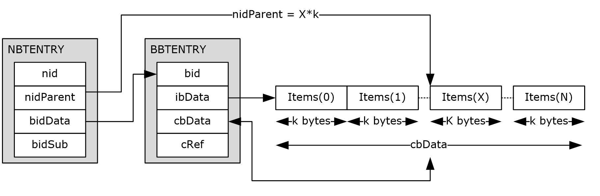

Figure 15: Basic queue structure

Because a queue is a standalone entity and does not have the concept of
a "parent", the **nidParent** field of the queue node is re-purposed to
be used as a byte offset pointer to the "head" of the queue. Initially,
**nidParent** points to 0 (that is, Item\[0\]), and new items, each of
size k bytes, are appended to the end of the array as shown. When the
first item is removed from the queue, the contents of Items\[0\] is
returned to the caller, and then the value of **nidParent** is updated
to point to the next item (that is, Items\[1\]). Note that **nidParent**
stores the byte offset of the "head" of the queue instead of an item
index. The number of items in the queue can be determined by dividing
**cbData** by k (that is, the size of each item). Implementations MUST
NOT process the contents of a queue if **cbData** is not an integer
multiple of k.

As an implementation detail, when the last item of the queue is removed
(that is, NBTENTRY.**nidParent** == BBTENTRY.**cbData**), the entire
queue contents are deleted, and both **nidParent** and **cbData** are
reset to zero.

The same generic queue node concept is used throughout this section,
except that each type of queue has its own specific value for the size
of each item (that is, k).

#### Search Management Object (SMO)

The Search Management object is responsible for tracking all pending
search activity in the PST. It consists of three nodes: The Search
Management queue (SMQ), Search Activity List (SAL), and Search Domain
object (SDO).

##### Search Management Queue (SMQ)

The Search Management queue is where all the SUDs are queued when
changes are made to the PST contents. There MUST be exactly one instance
of the SMQ in each PST, and it is identified by a special NID value of
NID_SEARCH_MANAGEMENT_QUEUE (0x1e1). Implementation-wise, it uses a
basic queue node described in section 2.4.8.3, and each of the items in
the SMQ is a SUD Structure described in section 2.4.8.1.1. The SMQ is
the master FIFO queue of all pending search activity in the PST.

Any implementation that modifies the contents of the PST queues SUD
entries that correspond to the sequence and nature of the modification
into the SMQ, according to the rules specified in section 2.4.8.1.
Failure to queue the SUD entries or queuing the SUD entries out-of-order
results in search **Folder objects** going out of sync with the actual
contents.

##### Search Activity List (SAL)

The Search Activity List is a node that is identified by a special NID
value of NID_SEARCH_ACTIVITY_LIST (0x201), which contains a simple array
of NIDs (not a queue). Each NID in the SAL corresponds to the NID of a
**Folder object** that has an associated search Folder object.
Implementations SHOULD NOT modify the SAL.\<18\>

##### Search Domain Object (SDO)

The Search Domain Object is a node that is identified by a special NID
value of NID_SEARCH_DOMAIN_OBJECT (0x261), which contains a simple array
of NIDs that collectively represent the global search domain of the PST.

#### Search Gatherer Object (SGO)

The Search Gatherer Object controls all the Content Indexing
functionality in the PST. However, because the implementation of Content
Indexing is out of the scope of this document, this section only
provides a high-level summary of the various objects that are associated
with Content Indexing.

##### Search Gatherer Queue (SGQ)

The Search Gatherer Queue is a node that is identified by a special NID
value of NID_SEARCH_GATHERER_QUEUE (0x281). It is implemented as a queue
node where each of its items is a SUD Structure that contains specific
changes that pertain to Content Indexing. Entries in the SGQ are moved
from the SMQ to the SGQ during SMQ processing. All SUDs MUST be queued
through the SMQ and implementations MUST NOT modify the SGQ in any way.

##### Search Gatherer Descriptor (SGD)

The Search Gatherer Descriptor is a node that is identified by a special
NID value of NID_SEARCH_GATHERER_DESCRIPTOR (0x2A1). It contains an
opaque, variable-size binary BLOB that provides context for Context
Indexing. Implementations MUST NOT modify the SGD in any way.

##### Search Gatherer Folder Queue (SGFQ)

The Search Gatherer Folder Queue is a node that is identified by a
special NID value of NID_SEARCH_GATHERER_FOLDER_QUEUE (0x321), which
contains a simple array of NIDs (not a queue). Each NID in the SGFQ
corresponds to the NID of a **Folder object** that has related Content
Indexing activity. Implementations MUST NOT modify the SGFQ in any way.

#### Search Folder Objects

This section describes the various objects that are associated with
search **Folder objects**. Because it is not the intention of this
document to document the creation and maintenance of search Folder
object, this section only provides high-level information about these
objects so that they can be identified when reading existing PSTs.

##### Search Folder Object (SF)

The search **Folder object** is implemented as a PC that is identified
by a special NID_TYPE of NID_TYPE_SEARCH_FOLDER (0x03). The basic schema
requirements of the search Folder object PC are identical to the Folder
object PC (section 2.4.4.1).

##### Search Folder Object Contents Table (SFCT)

The Search Folder Object Contents table is a TC node identified with an
NID_TYPE of NID_TYPE_SEARCH_CONTENTS_TABLE. Its function is to list the
Search **Message objects** in the **Folder object**, which are Message
objects that match the search Folder object's search criteria.

###### Search Folder Contents Table Template

Each PST MUST have one search folder contents table template, which is
identified with an NID value of NID_SEARCH_CONTENTS_TABLE_TEMPLATE
(0x610). The search contents table template MUST have no data rows, and
MUST contain the following property columns.

| Property identifier | Property type     | Friendly name                   | Description                                                                                          |
|---------------------|-------------------|---------------------------------|------------------------------------------------------------------------------------------------------|
| 0x0017              | **PtypInteger32** | **PidTagImportance**            | Importance                                                                                           |
| 0x001A              | **PtypString**    | **PidTagMessageClassW**         | Message class. This property has an alternate name of **PidTagMessageClass_W**.                      |
| 0x0036              | **PtypInteger32** | **PidTagSensitivity**           | Sensitivity                                                                                          |
| 0x0E07              | **PtypInteger32** | **PidTagMessageFlags**          | Message flags                                                                                        |
| 0x0E17              | **PtypInteger32** | **PidTagMessageStatus**         | Message status                                                                                       |
| 0x0037              | **PtypString**    | **PidTagSubjectW**              | Subject. This property has an alternate name of **PidTagSubject_W**.                                 |
| 0x0042              | **PtypString**    | **PidTagSentRepresentingNameW** | Sender representative name. This property has an alternate name of **PidTagSentRepresentingName_W**. |
| 0x0057              | **PtypBoolean**   | **PidTagMessageToMe**           | Whether recipient is in the To: line                                                                 |
| 0x0E03              | **PtypString**    | **PidTagDisplayCcW**            | Cc: line. This property has an alternate name of **PidTagDisplayCc_W**.                              |
| 0x0E04              | **PtypString**    | **PidTagDisplayToW**            | To: line. This property has an alternate name of **PidTagDisplayTo_W**.                              |
| 0x0E05              | **PtypString**    | **PidTagParentDisplayW**        | Parent Display name. This property has an alternate name of **PidTagParentDisplay_W**.               |
| 0x0E06              | **PtypTime**      | **PidTagMessageDeliveryTime**   | Message delivery timestamp                                                                           |
| 0x0E07              | **PtypInteger32** | **PidTagMessageFlags**          | Message flags                                                                                        |
| 0x0E08              | **PtypInteger32** | **PidTagMessageSize**           | Message size                                                                                         |
| 0x0E17              | **PtypInteger32** | **PidTagMessageStatus**         | Message status                                                                                       |
| 0x0E2A              | **PtypBoolean**   | **PidTagExchangeRemoteHeader**  | Has Exchange Remote Header                                                                           |
| 0x3008              | **PtypTime**      | **PidTagLastModificationTime**  | Last modification time of **Message object**                                                         |
| 0x67F1              | **PtypInteger32** | **PidTagLtpParentNid**          | LTP Parent NID                                                                                       |
| 0x67F2              | **PtypInteger32** | **PidTagLtpRowId**              | LTP Row ID                                                                                           |
| 0x67F3              | **PtypInteger32** | **PidTagLtpRowVer**             | LTP Row Version                                                                                      |

##### Search Update Queue (SUQ)

The Search Update queue is a node that is identified by a special
NID_TYPE of NID_TYPE_SEARCH_UPDATE_QUEUE (0x06). It is implemented as a
queue node where each of its items is a SUD Structure that contain
specific changes that pertain to Search activity of this particular
search **Folder object**. Entries in the SUQ are moved from the SMQ to
the Folder object's SUQ during SMQ processing. All SUDs MUST be queued
through the SMQ and implementations MUST NOT modify the SUQ in any way.

##### Search Criteria Object (SCO)

The Search Criteria object is a PC that is identified by a special
NID_TYPE of NID_TYPE_SEARCH_CRITERIA_OBJECT (0x07). The properties in
the PC collectively represent the specific Search Criteria for the
search **Folder object**. The specific properties used by the SCO are
out of the scope of this document. Implementations MUST NOT modify the
SCO in any way.

## Calculated Properties

Calculated properties are properties that are not physically stored in
the PST as individual properties. Instead, these properties are derived
or calculated in one way or another. This section defines the list of
calculated properties and the mechanisms through which the values of
these properties are evaluated, discovered, modified and otherwise
manipulated.

The following is a comprehensive list of calculated properties defined
for the PST. The properties are grouped by Object Type. Note that for an
ANSI PST, all string properties are stored in ANSI encoding, whereas a
Unicode PST stores all string properties in Unicode encoding.
Implementations MUST support retrieving string properties in either
**PtypString8** or **PtypString** formats.

### Attributes of a Calculated Property

A calculated property has six attributes, which are represented by the
six columns in each of the calculated property tables. These Attributes
collectively determine how the property value is calculated and the
behavior characteristics on Get / Set / Delete and List operations. The
following table lists these Attributes and their description.

<table>
<colgroup>
<col style="width: 20%" />
<col style="width: 80%" />
</colgroup>
<thead>
<tr class="header">
<th>Attribute</th>
<th>Description</th>
</tr>
</thead>
<tbody>
<tr class="odd">
<td>Property Tag</td>
<td>The <strong>property tag</strong> used to access the property at the
Messaging layer.</td>
</tr>
<tr class="even">
<td>Base Tag</td>
<td>The internal property tag of the corresponding property, if
applicable. If specified, this is the property tag that is used to store
the related property value in the PC or TC. In most cases, the value
stored in the base property is further manipulated to calculate the
actual property value.</td>
</tr>
<tr class="odd">
<td>Get Behavior</td>
<td>
This describes how the property value is calculated. In most
cases, the get operations refers to an <strong>SPGET_*</strong>
operation, which describes how to calculate the property value. All the
SPGET codes are defined later in this section.

In some cases, the property value is retrieved directly from the
PC.
</td>
</tr>
<tr class="even">
<td>Set Behavior</td>
<td>Whether the property can be modified, and if so, whether there are
special remarks or side effects. Set behavior is discussed in further
detail after the Get Behavior.</td>
</tr>
<tr class="odd">
<td>Delete Behavior</td>
<td>Whether the property can be deleted. There are a few special cases
that have some side effects.</td>
</tr>
<tr class="even">
<td>List Behavior</td>
<td>This column describes the visibility of the calculated property in
the event of an "Enumerate All Properties" query.</td>
</tr>
</tbody>
</table>

Implementations MUST follow the documented Get / Set / Delete and List
behaviors while accessing these properties.

In the event where the ANSI and Unicode versions support different sets
of special properties, they are defined separately. Rows that are
different between the ANSI and Unicode versions are shaded in gray.

### Calculated Properties by Object Type

The following are the list of Messaging objects and the corresponding
list of calculated properties for that object type.

#### Message Store

The following are the calculated properties defined under the **message
store**. Note that "nid" and "nidParent" in the "Base Tag" column refers
to the **nid** and the **nidParent** fields of the current object node.

ANSI / Unicode:

| Property tag                        | Base tag | Get behavior      | Set | Delete | List   |
|-------------------------------------|----------|-------------------|-----|--------|--------|
| **PidTagReplFlags**                 |          | PC                | PC  | PC     | ALLOW  |
| **PidTagAssociatedSharingProvider** |          | PC                | PC  | PC     | ALLOW  |
| **PidTagMappingSignature**          |          | SPGET_MAPSIG      | N   | N      | ALWAYS |
| **PidTagRecordKey**                 |          | SPGET_UIDRESOURCE | N   | N      | ALLOW  |
| **PidTagStoreRecordKey**            |          | SPGET_UIDRESOURCE | N   | N      | ALWAYS |
| **PidTagStoreEntryId**              |          | SPGET_STOREEID    | N   | N      | ALWAYS |
| **PidTagObjectType**                | nid      | SPGET_OBJECTTYPE  | N   | N      | ALWAYS |
| **PidTagEntryId**                   |          | SPGET_STOREEID    | N   | N      | ALWAYS |
| **PidTagDisplayName**               |          | PC                | PC  | N      | ALLOW  |
| **PidTagStoreState**                |          | SPGET_STORESTATE  | N   | N      | ALWAYS |
| **PidTagStoreProvider**             |          | SPGET_UIDPROVIDER | N   | N      | ALWAYS |
| **PidTagReceiveFolderSettings**     |          | SPGET_TRUE        | N   | N      | ALWAYS |

#### Folder Objects

The following are the calculated properties defined under the Folder
object.

ANSI / Unicode:

| Property tag                               | Base tag          | Get behavior          | Set            | Delete | List   |
|--------------------------------------------|-------------------|-----------------------|----------------|--------|--------|
| **PidTagParentEntryId**                    | nidParent         | SPGET_PARENTEID       | N              | N      | ALWAYS |
| **PidTagReplItemid**                       |                   | SPGET_TABLE_ONLY      | N              | N      | NEVER  |
| **PidTagReplFolderid**                     | nidParent         | SPGET_FOLDERID        | SPSET_FOLDERID | N      | NEVER  |
| **PidTagReplChangenum**                    | nid               | SPGET_TABLE_ONLY      | N              | N      | NEVER  |
| **PidTagReplVersionhistory**               |                   | SPGET_TABLE_ONLY      | N              | N      | NEVER  |
| **PidTagReplFlags**                        |                   | SPGET_TABLE_ONLY      | N              | N      | NEVER  |
| **PidTagReplCopiedfromVersionhistory**     |                   | SPGET_TABLE_ONLY      | N              | N      | NEVER  |
| **PidTagReplCopiedfromItemid**             |                   | SPGET_TABLE_ONLY      | N              | N      | NEVER  |
| **PidTagProviderItemid**                   | nid               | SPGET_PROV_ITEMID     | N              | N      | NEVER  |
| **PidTagMappingSignature**                 |                   | SPGET_MAPSIG          | N              | N      | ALWAYS |
| **PidTagRecordKey**                        | nid               | SPGET_RECORDKEY       | N              | N      | ALWAYS |
| **PidTagStoreRecordKey**                   |                   | SPGET_UIDRESOURCE     | N              | N      | ALWAYS |
| **PidTagStoreEntryId**                     |                   | SPGET_STOREEID        | N              | N      | ALWAYS |
| **PidTagObjectType**                       | nid               | SPGET_OBJECTTYPE      | N              | N      | ALWAYS |
| **PidTagEntryId**                          | nid               | SPGET_EID             | N              | N      | ALWAYS |
| **PidTagAttributeHidden**                  |                   | PC                    | PC             | PC     | ALLOW  |
| **PidTagDisplayName**                      |                   | PC                    | PC             | N      | ALLOW  |
| **PidTagStoreProvider**                    |                   | SPGET_UIDPROVIDER     | N              | N      | ALWAYS |
| **PidTagFolderType**                       | nid               | SPGET_FOLDERTYPE      | N              | N      | ALWAYS |
| **PidTagContentCount**                     | PR_CONTENT_COUNT  | SPGET_CONTENT_COUNT   | N              | N      | ALLOW  |
| **PidTagContentUnreadCount**               | PR_CONTENT_UNREAD | SPGET_UNREAD_COUNT    | N              | N      | ALLOW  |
| **PidTagSubfolders**                       |                   | PC                    | N              | N      | ALLOW  |
| **PidTagContainerHierarchy**               |                   | SPGET_TRUE            | N              | N      | ALWAYS |
| **PidTagContainerContents**                |                   | SPGET_TRUE            | N              | N      | ALWAYS |
| **PidTagFolderAssociatedContents**         |                   | SPGET_TRUE            | N              | N      | ALWAYS |
| **PidTagExtendedFolderFlags**              |                   | PC                    | PC             | PC     | ALLOW  |
| **PidTagShortTermParentEntryIdFromObject** | nidParent         | SPGET_PARENTEID       | N              | N      | NEVER  |
| **PidTagShortTermEntryIdFromObject**       | nid               | SPGET_EID             | N              | N      | NEVER  |
| **PidTagPstIpmsubTreeDescendant**          | nid               | SPGET_IPMSUBTREE_DESC | N              | N      | NEVER  |

#### Message Objects

The following are the calculated properties defined under the **Message
object**.

ANSI / Unicode:

| Property tag                               | Base tag           | Get behavior              | Set            | Delete  | List   |
|--------------------------------------------|--------------------|---------------------------|----------------|---------|--------|
| **PidTagMessageClass**                     |                    | PC                        | SPSET_MC       | N       | ALLOW  |
| **PidTagSubject**                          | PidTagSubject      | SPGET_SUBJECT             | SPSET_SP       | DEL_1   | ALLOW  |
| **PidTagSubjectPrefix**                    | PidTagSubject      | SPGET_SUBJECTPREFIX       | SPSET_SUB      | DEL_1   | BASED  |
| **PidTagConversationTopic**                |                    | PC                        | SPSET_CID      | DEL_5   | ALLOW  |
| **PidTagConversationIndex**                |                    | PC                        | SPSET_CID      | DEL_5   | ALLOW  |
| **PidTagDisplayBcc**                       | PidTagDisplayBcc   | SPGET_DISPLAY             | N              | N       | ALWAYS |
| **PidTagDisplayCc**                        | PidTagDisplayCc    | SPGET_DISPLAY             | PC             | N       | ALWAYS |
| **PidTagDisplayTo**                        | PidTagDisplayTo    | SPGET_DISPLAY             | PC             | N       | ALWAYS |
| **PidTagMessageFlags**                     |                    | PC                        | SPSET_MF       | N       | ALLOW  |
| **PidTagMessageSize**                      |                    | PC                        | PC             | N       | ALLOW  |
| **PidTagParentEntryId**                    | nidParent          | SPGET_PARENTEID           | N              | N       | ALWAYS |
| **PidTagMessageRecipients**                |                    | SPGET_TRUE                | N              | N       | ALWAYS |
| **PidTagMessageAttachments**               |                    | SPGET_TRUE                | N              | N       | ALWAYS |
| **PidTagMessageStatus**                    |                    | SPGET_MSGSTATUS           | N              | N       | ALLOW  |
| **PidTagHasAttachments**                   | PidTagMessageFlags | SPGET_HASATTACH           | N              | N       | ALWAYS |
| **PidTagNormalizedSubject**                | PidTagSubject      | SPGET_NORMALIZESUBJECT    | N              | N       | BASED  |
| **PidTagRtfInSync**                        |                    | SPGET_RTF_IN_SYNC         | SPSET_RIS      | SPDEL_4 | ALWAYS |
| **PidTagReplItemid**                       |                    | SPGET_TABLE_ONLY          | N              | N       | NEVER  |
| **PidTagReplFolderid**                     | nidParent          | SPGET_FOLDERID            | SPSET_FOLDERID | N       | NEVER  |
| **PidTagReplChangenum**                    | nid                | SPGET_TABLE_ONLY          | N              | N       | NEVER  |
| **PidTagReplVersionhistory**               |                    | SPGET_TABLE_ONLY          | N              | N       | NEVER  |
| **PidTagReplFlags**                        |                    | SPGET_TABLE_ONLY          | N              | N       | NEVER  |
| **PidTagReplCopiedfromVersionhistory**     |                    | SPGET_TABLE_ONLY          | N              | N       | NEVER  |
| **PidTagReplCopiedfromItemid**             |                    | SPGET_TABLE_ONLY          | N              | N       | NEVER  |
| **PidTagProviderItemid**                   | nid                | SPGET_PROV_ITEMID         | N              | N       | NEVER  |
| **PidTagProviderParentItemid**             | nidParent          | SPGET_PROV_ITEMID         | N              | N       | NEVER  |
| **PidTagMappingSignature**                 |                    | SPGET_MAPSIG              | N              | N       | ALWAYS |
| **PidTagRecordKey**                        |                    | SPGET_RECORDKEY           | N              | N       | ALWAYS |
| **PidTagStoreRecordKey**                   |                    | SPGET_UIDRESOURCE         | N              | N       | ALWAYS |
| **PidTagStoreEntryId**                     |                    | SPGET_STOREEID            | N              | N       | ALWAYS |
| **PidTagObjectType**                       | nid                | SPGET_OBJECTTYPE          | N              | N       | ALWAYS |
| **PidTagEntryId**                          | nid                | SPGET_EID                 | N              | N       | ALWAYS |
| **PidTagBody**                             |                    | SPGET_BB_BODY             | SPSET_BBB      | DEL_2   | BODY   |
| **PidTagRtfSyncBodyCrc**                   |                    | SPGET_RTF_AUX             | SPSET_RA       | DEL_3   | NEVER  |
| **PidTagRtfSyncBodyCount**                 |                    | SPGET_RTF_AUX             | SPSET_RA       | DEL_3   | NEVER  |
| **PidTagRtfSyncBodyTag**                   |                    | SPGET_RTF_AUX             | SPSET_RA       | DEL_3   | NEVER  |
| **PidTagRtfCompressed**                    |                    | SPGET_BB_BODY             | SPSET_BBB      | DEL_2   | BODY   |
| **PidTagRtfSyncPrefixCount**               |                    | SPGET_RTF_AUX             | SPSET_RA       | DEL_3   | NEVER  |
| **PidTagRtfSyncTrailingCount**             |                    | SPGET_RTF_AUX             | SPSET_RA       | DEL_3   | NEVER  |
| **PidTagBodyHtml (ANSI ONLY)**             | PidTagHtml         | SPGET_BODYHTMLA           | SPSET_BBB      | DEL_2   |        |
| **PidTagHtml**                             |                    | SPGET_BB_BODY             | SPSET_BBB      | DEL_2   | BODY   |
| **PidTagCreationTime**                     |                    | PC                        | PC             | N       | ALLOW  |
| **PidTagLastModificationTime**             |                    | PC                        | PC             | N       | ALLOW  |
| **PidTagSearchKey**                        |                    | PC                        | PC             | N       | ALLOW  |
| **PidTagConversationId**                   |                    | SPGET_CONVERSATION_ID     | N              | DEL_5   | ALLOW  |
| **PidTagConversationIndexTracking**        |                    | PC                        | SPSET_CID      | DEL_5   | ALLOW  |
| **PidTagStoreProvider**                    |                    | SPGET_UIDPROVIDER         | N              | N       | ALWAYS |
| **PidTagContentFilterSpamConfidenceLevel** |                    | SPGET_CONTENT_FILTER_SCL  | N              | PC      | NEVER  |
| **PidTagSecureSubmitFlags**                |                    | SPGET_SECURE_SUBMIT_FLAGS | N              | PC      | NEVER  |
| **PidTagPstBestBodyProptag**               |                    | SPGET_BB_PROPTAG          | N              | N       | NEVER  |
| **PidTagShortTermParentEntryIdFromObject** | nidParent          | SPGET_PARENTEID           | N              | N       | NEVER  |
| **PidTagShortTermEntryIdFromObject**       | nid                | SPGET_EID                 | N              | N       | NEVER  |
| **PidTagPstSubTreeContainer**              |                    | SPGET_SUBTREE_CONTAINER   | N              | N       | NEVER  |

#### Embedded Message Objects

The following are the calculated properties defined under the embedded
**Message object**.

ANSI / Unicode:

| Property tag                               | Base tag           | Get behavior              | Set       | Delete | List   |
|--------------------------------------------|--------------------|---------------------------|-----------|--------|--------|
| **PidTagMessageClass**                     |                    | PC                        | SPSET_MC  | N      | ALLOW  |
| **PidTagSubject**                          | PidTagSubject      | SPGET_SUBJECT             | SPSET_SUB | DEL_1  | ALLOW  |
| **PidTagSubjectPrefix**                    | PidTagSubject      | SPGET_SUBJECTPREFIX       | SPSET_SP  | DEL_1  | BASED  |
| **PidTagConversationTopic**                |                    | PC                        | SPSET_CID | DEL_5  | ALLOW  |
| **PidTagConversationIndex**                |                    | PC                        | SPSET_CID | DEL_5  | ALLOW  |
| **PidTagDisplayBcc**                       | PidTagDisplayBcc   | SPGET_DISPLAY             | N         | N      | ALWAYS |
| **PidTagDisplayCc**                        | PidTagDisplayCc    | SPGET_DISPLAY             | PC        | N      | ALWAYS |
| **PidTagDisplayTo**                        | PidTagDisplayTo    | SPGET_DISPLAY             | PC        | N      | ALWAYS |
| **PidTagMessageFlags**                     |                    | PC                        | SPSET_MF  | N      | ALLOW  |
| **PidTagMessageSize**                      |                    | PC                        | PC        | N      | ALLOW  |
| **PidTagParentEntryId**                    | nidParent          | SPGET_PARENTEID           | N         | N      | ALWAYS |
| **PidTagMessageRecipients**                |                    | SPGET_TRUE                | N         | N      | ALWAYS |
| **PidTagMessageAttachments**               |                    | SPGET_TRUE                | N         | N      | ALWAYS |
| **PidTagHasAttachments**                   | PidTagMessageFlags | SPGET_HASATTACH           | N         | N      | ALWAYS |
| **PidTagNormalizedSubject**                | PidTagSubject      | SPGET_NORMALIZESUBJECT    | N         | N      | BASED  |
| **PidTagMappingSignature**                 |                    | SPGET_MAPSIG              | N         | N      | ALWAYS |
| **PidTagRecordKey**                        |                    | SPGET_RECORDKEY           | N         | N      | ALWAYS |
| **PidTagStoreRecordKey**                   |                    | SPGET_UIDRESOURCE         | N         | N      | ALWAYS |
| **PidTagStoreEntryId**                     |                    | SPGET_STOREEID            | N         | N      | ALWAYS |
| **PidTagObjectType**                       | nid                | SPGET_OBJECTTYPE          | N         | N      | ALWAYS |
| **PidTagEntryId**                          | nid                | SPGET_EID                 | N         | N      | ALWAYS |
| **PidTagBody**                             |                    | SPGET_BB_BODY             | SPSET_BBB | DEL_2  | BODY   |
| **PidTagRtfSyncBodyCrc**                   |                    | SPGET_RTF_AUX             | SPSET_RA  | DEL_3  | NEVER  |
| **PidTagRtfSyncBodyCount**                 |                    | SPGET_RTF_AUX             | SPSET_RA  | DEL_3  | NEVER  |
| **PidTagRtfSyncBodyTag**                   |                    | SPGET_RTF_AUX             | SPSET_RA  | DEL_3  | NEVER  |
| **PidTagRtfCompressed**                    |                    | SPGET_BB_BODY             | SPSET_BBB | DEL_2  | BODY   |
| **PidTagRtfSyncPrefixCount**               |                    | SPGET_RTF_AUX             | SPSET_RA  | DEL_3  | NEVER  |
| **PidTagRtfSyncTrailingCount**             |                    | SPGET_RTF_AUX             | SPSET_RA  | DEL_3  | NEVER  |
| **PidTagBodyHtml (ANSI ONLY)**             | PidTagHtml         | SPGET_BODYHTMLA           | SPSET_BBB | DEL_2  | BODY   |
| **PidTagHtml**                             |                    | SPGET_BB_BODY             | SPSET_BBB | DEL_2  | BODY   |
| **PidTagCreationTime**                     |                    | PC                        | PC        | N      | ALLOW  |
| **PidTagLastModificationTime**             |                    | PC                        | PC        | N      | ALLOW  |
| **PidTagSearchKey**                        |                    | PC                        | PC        | N      | ALLOW  |
| **PidTagConversationId**                   |                    | SPGET_CONVERSATION_ID     | N         | DEL_5  | ALLOW  |
| **PidTagConversationIndexTracking**        |                    | PC                        | SPSET_CID | DEL_5  | ALLOW  |
| **PidTagStoreProvider**                    |                    | SPGET_UIDPROVIDER         | N         | N      | ALWAYS |
| **PidTagContentFilterSpamConfidenceLevel** |                    | SPGET_CONTENT_FILTER_SCL  | N         | PC     | NEVER  |
| **PidTagSecureSubmitFlags**                |                    | SPGET_SECURE_SUBMIT_FLAGS | N         | PC     | NEVER  |
| **PidTagPstBestBodyProptag**               |                    | SPGET_BB_PROPTAG          | N         | N      | NEVER  |

#### Attachment Objects

The following are the calculated properties defined under the
**Attachment object**.

ANSI / Unicode:

| Property tag                | Base tag | Get behavior              | Set | Delete | List   |
|-----------------------------|----------|---------------------------|-----|--------|--------|
| **PidTagAttachSize**        |          | PC                        | N   | N      | ALLOW  |
| **PidTagAttachNumber**      | nid      | SPGET_LONGNID             | N   | N      | ALWAYS |
| **PidTagMappingSignature**  |          | SPGET_MAPSIG              | N   | N      | ALWAYS |
| **PidTagRecordKey**         | nid      | SPGET_RECORDKEY           | N   | N      | ALWAYS |
| **PidTagStoreRecordKey**    |          | SPGET_UIDRESOURCE         | N   | N      | ALWAYS |
| **PidTagStoreEntryId**      |          | SPGET_STOREEID            | N   | N      | ALWAYS |
| **PidTagObjectType**        | nid      | SPGET_OBJECTTYPE          | N   | N      | ALWAYS |
| **PidTagAttachMethod**      |          | PC                        | PC  | N      | ALLOW  |
| **PidTagRenderingPosition** |          | PC                        | PC  | N      | ALLOW  |
| **PidTagSecureSubmitFlags** |          | SPGET_SECURE_SUBMIT_FLAGS | N   | PC     | NEVER  |

### Calculated Property Behaviors

The following are the definitions of the Get / Set / Delete / List
behavior descriptors used in the preceding tables.

#### Behavior Descriptors for Get Operations

The following is a list of Behavior Descriptors that relate to **Get**
operations used in the preceding tables, which explain how each specific
calculated property is evaluated. In the evaluation column, the use of
angle braces (\< \>) around a **property tag** is used to denote the
value of that property.

<table>
<colgroup>
<col style="width: 24%" />
<col style="width: 46%" />
<col style="width: 28%" />
</colgroup>
<thead>
<tr class="header">
<th>Mnemonic</th>
<th>Evaluation</th>
<th>Input data for evaluation</th>
</tr>
</thead>
<tbody>
<tr class="odd">
<td>PC</td>
<td>The property value is loaded directly from the PC (that is, no
special calculations are required). However the property has special
instructions for Set, Delete, and List operations.</td>
<td>See the Base Tag column for the underlying PC property.</td>
</tr>
<tr class="even">
<td>SPGET_EID</td>
<td>Returns the PST-specific <strong>EntryID</strong> of the object in
question. See section 2.4.3.2 for details regarding the conversion
between an EntryID and its corresponding NID.</td>
<td>Node.<strong>nid</strong></td>
</tr>
<tr class="odd">
<td>SPGET_STOREEID</td>
<td>Returns the <strong>EntryID</strong> for the current PST
<strong>message store</strong>. The EntryID of the message store is
stored in the <strong>PidTagEntryId</strong> property of the message
store PC.</td>
<td>
<strong>PidTagEntryId</strong>

(message store PC only)
</td>
</tr>
<tr class="even">
<td>SPGET_LONGNID</td>
<td>Returns <strong>Node.nid</strong>.</td>
<td><strong>Node.nid</strong></td>
</tr>
<tr class="odd">
<td>SPGET_RECORDKEY</td>
<td>Returns <strong>Node.nid</strong>.</td>
<td><strong>Node.nid</strong></td>
</tr>
<tr class="even">
<td>SPGET_UIDRESOURCE</td>
<td>Returns identical value as SPGET_STOREEID.</td>
<td>
<strong>PidTagEntryId</strong>

(message store PC only)
</td>
</tr>
<tr class="odd">
<td>SPGET_TRUE</td>
<td>Returns <strong>true</strong>.</td>
<td>None</td>
</tr>
<tr class="even">
<td>SPGET_OBJECTTYPE</td>
<td>
Returns the object type of the current object. Implementations
MUST return one of the pre-defined values:

<ul>
<li>
MAPI_STORE
</li>
<li>
MAPI_FOLDER
</li>
<li>
MAPI_MESSAGE
</li>
<li>
MAPI_ATTACH
</li>
</ul></td>
<td>None</td>
</tr>
<tr class="odd">
<td>SPGET_FOLDERTYPE</td>
<td>
Returns the type of the current <strong>Folder object</strong>.
Implementations MUST return one of the possible values:

<ul>
<li>
FOLDER_ROOT
</li>
<li>
FOLDER_GENERIC
</li>
<li>
FOLDER_SEARCH
</li>
</ul></td>
<td>None</td>
</tr>
<tr class="even">
<td>SPGET_UIDPROVIDER</td>
<td>Returns the Provider UID for the current PST. This value is stored
in the <strong>PidTagRecordKey</strong> property of the message store
PC.</td>
<td>
<strong>PidTagEntryId</strong>

(message store PC only)
</td>
</tr>
<tr class="odd">
<td>SPGET_NORMALIZESUBJECT</td>
<td>Returns the Unicode/ANSI version of
<strong>PidTagNormalizedSubject</strong> according to the PST version
based on the requested string type. See section 2.5.3.1.1 for extracting
the normalized subject of a <strong>Message object</strong>.</td>
<td><strong>PidTagNormalizedSubject</strong></td>
</tr>
<tr class="even">
<td>SPGET_PARENTEID</td>
<td>Returns the <strong>EntryID</strong> representation (see section
2.4.3.2) of the NID of the parent of the current object.</td>
<td>Node.<strong>nidParent</strong></td>
</tr>
<tr class="odd">
<td>SPGET_HASATTACH</td>
<td>Returns 1 if <strong>PidTagMessageFlags</strong> contains
<strong>mfHasAttach</strong>; zero otherwise.</td>
<td><strong>PidTagMessageFlags</strong></td>
</tr>
<tr class="even">
<td>SPGET_STORESTATE</td>
<td>Returns STORE_HAS_SEARCHES (as specified in [MS-OXCSTOR] section
2.2.1.5.2) if a node with NID NID_SEARCH_ACTIVITY_LIST is found; zero
otherwise.</td>
<td>None</td>
</tr>
<tr class="odd">
<td>SPGET_SUBJECTPREFIX</td>
<td>Returns the Unicode/ANSI version of
<strong>PidTagSubjectPrefix</strong> based on the requested string type.
See section 2.5.3.1.1 for extracting the subject prefix of a Message
object.</td>
<td><strong>PidTagSubjectPrefix</strong></td>
</tr>
<tr class="even">
<td>SPGET_SUBJECT</td>
<td>Returns the Unicode/ANSI version of <strong>PidTagSubject</strong>
based on the requested string type. See section 2.5.3.1.1 for extracting
the subject of a Message object.</td>
<td><strong>PidTagSubject</strong></td>
</tr>
<tr class="odd">
<td>SPGET_DISPLAY</td>
<td>If the Base Tag property exists, then its value is returned,
otherwise, an empty string in the correct encoding (Unicode/ANSI) is
returned based on the requested string type.</td>
<td>See Base Tag column</td>
</tr>
<tr class="even">
<td>SPGET_ZERO</td>
<td>Returns zero.</td>
<td>None</td>
</tr>
<tr class="odd">
<td>SPGET_MAPSIG</td>
<td>Returns the Mapping Signature UID. This is identical to
SPGET_UIDPROVIDER.</td>
<td>See SPGET_UIDPROVIDER</td>
</tr>
<tr class="even">
<td>SPGET_BB_BODY</td>
<td>Returns the most Message object body format based on the requested
property tag.</td>
<td>Any of <strong>PidTagBody</strong>, <strong>PidTagHtml</strong>, or
<strong>PidTagRtfCompressed</strong></td>
</tr>
<tr class="odd">
<td>SPGET_RTF_IN_SYNC</td>
<td>Returns <strong>true</strong> if the RTF version of the Message
object body exists and is synchronized with the order versions of the
Message object body (if any), or <strong>false</strong> otherwise.</td>
<td><strong>PidTagRtfCompressed</strong> and
<strong>PidTagRtfInSync</strong></td>
</tr>
<tr class="even">
<td>SPGET_MSGSTATUS</td>
<td>Returns <strong>PidTagMessageStatus</strong> retrieved from the
Contents TC from the parent Folder object of the Message object.
Implementations MUST follow this method when retrieving this
property.</td>
<td>
<strong>PidTagMessageStatus</strong>

(from Contents TC of parent Folder object)
</td>
</tr>
<tr class="odd">
<td>SPGET_RTF_AUX</td>
<td>Returns the synchronized values of the requested RTF auxiliary
property. If the RTF content is not in sync, the RTF MUST first be
synchronized before the property value is retrieved and returned.</td>
<td>Any of <strong>PidTagRtfSyncBodyCrc</strong>,
<strong>PidTagRtfSyncBodyCount</strong>,
<strong>PidTagRtfSyncBodyTag</strong>,
<strong>PidTagRtfSyncPrefixCount</strong>, or
<strong>PidTagRtfSyncTrailingCount</strong></td>
</tr>
<tr class="even">
<td>SPGET_BODYHTMLA</td>
<td>Returns the HTML rendering of the Message object body. If
<strong>PidTagHtml</strong> is found in the PC, its value MUST be
returned. Otherwise, the HTML rendering of the Message object body
SHOULD be generated from the other Message object body formats and
returned. This property only exists in ANSI versions of the PST and the
HTML rendering MUST be returned in ANSI encoding.</td>
<td><strong>PidTagHtml</strong></td>
</tr>
<tr class="odd">
<td>SPGET_FOLDERID</td>
<td>Returns <strong>PidTagReplItemid</strong> of the containing Folder
object for a Message object or Folder object.</td>
<td>
<strong>PidTagReplItemid</strong>

(from parent Folder object PC)
</td>
</tr>
<tr class="even">
<td>SPGET_TABLE_ONLY</td>
<td>Retrieves and returns the requested property from the parent Folder
object TC (Hierarchy, Contents, or Assoc Contents, based on the
requesting object type).</td>
<td>
Any of <strong>PidTagReplItemid</strong>,
<strong>PidTagReplChangenum</strong>,
<strong>PidTagReplVersionhistory</strong>,
<strong>PidTagReplFlags</strong>,
<strong>PidTagReplCopiedfromVersionhistory</strong>, or
<strong>PidTagReplCopiedfromItemid</strong>

(from parent Folder object TC)
</td>
</tr>
<tr class="odd">
<td>SPGET_HST_FOLDERREPL</td>
<td>Returns <strong>true</strong> if
<strong>PidTagContainerClass</strong> exists and is set to "IPF.Note",
"IPF.Contact", "IPF.Appointment" or an empty string. Returns
<strong>false</strong> otherwise.</td>
<td><strong>PidTagContainerClass</strong></td>
</tr>
<tr class="even">
<td>SPGET_IPMSUBTREE_DESC</td>
<td>Returns <strong>true</strong> if the current object is a descendant
object of the IPM SuBTree, <strong>false</strong> otherwise.</td>
<td><strong>Node.nid</strong></td>
</tr>
<tr class="odd">
<td>SPGET_BB_PROPTAG</td>
<td>
Returns the property tag of the best Message object body format.
The typical order of preference for best Message object body is as
follows:

<strong>PidTagRtfCompressed</strong> (only if
<strong>PidTagRtfInSync</strong>=TRUE)

<strong>PidTagHtml</strong>

<strong>PidTagBody</strong>

Note that the best Message object body format can be explicitly set
to override the default preference.
</td>
<td>
<strong>PidTagRtfCompressed</strong>

<strong>PidTagRtfInSync</strong>

<strong>PidTagHtml</strong>

<strong>PidTagBody</strong>
</td>
</tr>
<tr class="even">
<td>SPGET_SUBTREE_CONTAINER</td>
<td>Returns the SuBTree container of the current object. For a PST, the
valid return values are SUBTREECONTAINER_NONE which means no SuBTree
container, or SUBTREECONTAINER_IPM_SUBTREE which means an IPM
SuBTree.</td>
<td><strong>Node.nid</strong></td>
</tr>
<tr class="odd">
<td>SPGET_PROV_ITEMID</td>
<td>Returns the endian-swapped value of the requested property.</td>
<td><strong>PidTagProviderItemid</strong> or
<strong>PidTagProviderParentItemid</strong></td>
</tr>
<tr class="even">
<td>SPGET_UNREAD_COUNT</td>
<td>If <strong>PidTagPstHiddenUnread</strong> exists, return
(<strong>PidTagContentUnreadCount</strong> minus
<strong>PidTagPstHiddenUnread</strong>); otherwise, return
<strong>PidTagContentUnreadCount</strong>.</td>
<td>
<strong>PidTagContentUnreadCount</strong> and

<strong>PidTagPstHiddenUnread</strong>
</td>
</tr>
<tr class="odd">
<td>SPGET_CONTENT_COUNT</td>
<td>
If <strong>PidTagPstHiddenCount</strong> exists, return

(<strong>PidTagContentCount</strong> minus
<strong>PidTagPstHiddenCount</strong>); otherwise, return
<strong>PidTagContentCount</strong>.
</td>
<td><strong>PidTagContentCount</strong> and
<strong>PidTagPstHiddenCount</strong></td>
</tr>
<tr class="even">
<td>SPGET_SECURE_SUBMIT_FLAGS</td>
<td>Returns zero.</td>
<td>None</td>
</tr>
<tr class="odd">
<td>SPGET_CONTENT_FILTER_SCL</td>
<td>Returns zero.</td>
<td>None</td>
</tr>
<tr class="even">
<td>SPGET_CONVERSATION_ID</td>
<td>Returns the computed conversation ID from
<strong>PidTagConversationIndex</strong>,
<strong>PidTagConversationTopic</strong>, and
<strong>PidTagConversationIndexTracking</strong>. Refer to section 5.4
for the algorithm used to compute the Conversation ID value using these
properties.</td>
<td><strong>PidTagConversationIndex</strong>,
<strong>PidTagConversationTopic</strong> and
<strong>PidTagConversationIndexTracking</strong></td>
</tr>
</tbody>
</table>

##### Message Subject Handling Considerations

A message subject consists of two distinct parts: a Subject Prefix
(which can be an empty string), and the Normalized Subject. The Message
Subject is physically stored in a **Message object** PC as the
**PidTagSubject** property, which includes the entire message subject
line, plus some metadata that allows the reader to parse out the Subject
Prefix and Normalized Subject.

The following explains the data layout of the binary data stored in
**PidTagSubject**, and how to extract the Subject Prefix
(**PidTagSubjectPrefix**) and Normalized Subject
(**PidTagNormalizedSubject**) fields from **PidTagSubject**.

###### Obtaining the Prefix and Normalized Subject from PidTagSubject

The first character of **PidTagSubject** indicates whether metadata
exists to tell the reader how to parse the prefix and normalized
subject. Note that a character is a 1-byte CHAR for an ANSI PST file,
and a 2-byte WCHAR for a Unicode PST file.

If the first character contains the value of 1 (the actual value 1, not
the ASCII code for the character 1), the next character indicates the
length of the Subject Prefix, including the separator between the prefix
and the normalized subject (a space character in most cases). The
Normalized Subject immediately follows the Subject Prefix. When the
subject is encoded in the database, the length of the prefix is one
longer than the prefix string. The following example shows what layout
in memory looks like for an ANSI subject:

| Index | 0    | 1    | 2        | 3        | 4        | 5    | 6        | 7        | 8        | 9    |
|-------|------|------|----------|----------|----------|------|----------|----------|----------|------|
| Value | 0x01 | 0x05 | 0x52 (R) | 0x45 (E) | 0x3A (:) | 0x32 | 0x53 (S) | 0x55 (U) | 0x42 (B) | 0x00 |

The length of the encoded prefix is 5, corresponding to the actual
length of the string, which is 4. In order to increment the pointer to
the normalized subject, which starts at index 6, 1 needs to be
subtracted from this value. When writing a subject, the reverse
operation MUST be performed as well, adding 1 to the length of the
prefix string.

However, if the first character is not 1, then the string contains the
entire message subject, with no additional metadata. In this case, the
message subject MUST be parsed to extract the prefix and normalized
subject.

###### Rules for Parsing the Subject Prefix

The subject prefix is defined as a series of one to three non-space,
non-numerical characters that is followed by a colon (:). Zero or more
space characters (that is, " "; other whitespace characters are not
allowed) can exist after the colon and before the start of the
normalized subject.

#### Behavior Descriptors for Set Operations

Modifying the value of a calculated property is more complicated than
retrieving its value in that a reverse calculation needs to be performed
to calculate the new underlying value, and in some cases, more than one
underlying property has to be updated as a result.

The following is a list of Behavior Descriptors that relate to Set
operations, which describes the actions required to update the pertinent
information, as well as any PC properties that are affected as a result
of the Set operation.

<table>
<colgroup>
<col style="width: 26%" />
<col style="width: 40%" />
<col style="width: 32%" />
<col style="width: 0%" />
</colgroup>
<thead>
<tr class="header">
<th>Mnemonic</th>
<th>Action</th>
<th>Affected PC properties</th>
<th></th>
</tr>
</thead>
<tbody>
<tr class="odd">
<td>N</td>
<td>Property MUST NOT be modified.</td>
<td>None</td>
<td></td>
</tr>
<tr class="even">
<td>PC</td>
<td>The property value is written directly to the PC (that is, no
special calculations are required). However the property has special
instructions for Get, Delete, and List operations.</td>
<td>Only the modified property itself.</td>
<td></td>
</tr>
<tr class="odd">
<td>SPSET_MF</td>
<td>Refreshes <strong>PidTagMessageFlags</strong> based on the current
state of the <strong>Message object</strong>. This involves checking
many properties, including the various versions of the Message object
body, the recipient and attachment tables, and so on.</td>
<td><strong>PidTagMessageFlags</strong></td>
<td></td>
</tr>
<tr class="even">
<td>SPSET_SP</td>
<td>Sets the subject prefix for the Message object, which MAY affect
other Subject-related properties.</td>
<td><strong>PidTagSubjectPrefix</strong>,
<strong>PidTagSubject</strong>, and
<strong>PidTagNormalizedSubject</strong></td>
<td></td>
</tr>
<tr class="odd">
<td>SPSET_SUB</td>
<td>Sets the subject of the Message object. This MAY have cascading
effects to the other Subject-related fields.</td>
<td><strong>PidTagSubjectPrefix</strong>,
<strong>PidTagSubject</strong>, and
<strong>PidTagNormalizedSubject</strong></td>
<td></td>
</tr>
<tr class="even">
<td>SPSET_MC</td>
<td>Sets the message class for the Message object. Implementations MUST
check the new message class and reject invalid message classes.</td>
<td><strong>PidTagMessageClass</strong></td>
<td></td>
</tr>
<tr class="odd">
<td>SPSET_RA</td>
<td>Sets the specified Auxiliary RTF. Modifying one Auxiliary property
MAY have cascading effects to other properties. Implementations MUST
ensure all the Auxiliary RTF properties stay synchronized.</td>
<td><strong>PidTagRtfSyncBodyCrc</strong>,
<strong>PidTagRtfSyncBodyCount</strong>,
<strong>PidTagRtfSyncBodyTag</strong>,
<strong>PidTagRtfSyncPrefixCount</strong>, and
<strong>PidTagRtfSyncTrailingCount</strong></td>
<td></td>
</tr>
<tr class="even">
<td>SPSET_RIS</td>
<td>Writes through to the <strong>PidTagRtfInSync</strong>, with
potential side effects to any of the Best Body properties.</td>
<td>
<strong>PidTagRtfCompressed</strong>,
<strong>PidTagHtml</strong>, <strong>PidTagBody</strong>, or

<strong>PidTagBodyHtml</strong> (ANSI PST only)
</td>
<td></td>
</tr>
<tr class="odd">
<td>SPSET_BBB</td>
<td>Sets the Message object body for the specified body property. This
also establishes the specified Message object body type as the best
Message object body.</td>
<td>
<strong>PidTagRtfCompressed</strong>,
<strong>PidTagHtml</strong>, <strong>PidTagBody</strong>, or

<strong>PidTagBodyHtml</strong> (ANSI PST only)
</td>
<td></td>
</tr>
<tr class="even">
<td>SPSET_CID</td>
<td>Sets the specified property and causes the PidTagConversationId to
be recalculated. Refer to section 5.4 for the algorithm used to compute
the Conversation ID value using these properties.</td>
<td><strong>PidTagConversationId</strong></td>
<td></td>
</tr>
<tr class="odd">
<td>SPSET_FOLDERID</td>
<td>Sets <strong>PidTagReplItemid</strong> of the containing
<strong>Folder object</strong> for a Message object or Folder
object.</td>
<td colspan="2"><strong>PidTagReplItemid</strong></td>
</tr>
</tbody>
</table>

#### Behavior Descriptors for Delete Operations

The following is a list of Behavior Descriptors that relate to Delete
operations (that is, deleting the property value altogether).

| Mnemonic | Action                                               | Side effects                                                                                                                                                             |
|----------|------------------------------------------------------|--------------------------------------------------------------------------------------------------------------------------------------------------------------------------|
| N        | Property MUST NOT be deleted.                        | None                                                                                                                                                                     |
| PC       | Deletes the property from the PC.                    | None                                                                                                                                                                     |
| SPDEL_1  | Delete from PC, with side effects.                   | MUST update **PidTagSubject** and **PidTagNormalizedSubject**                                                                                                            |
| SPDEL_2  | Delete from PC, with side effects.                   | MUST update **PidTagBody**, **PidTagRtfCompressed**, **PidTagRtfInSync**, **PidTagHtml**, and **PidTagBodyHtml** (ANSI PST only)                                         |
| SPDEL_3  | Delete from PC, with side effects.                   | MAY need to also update **PidTagRtfSyncBodyCrc**, **PidTagRtfSyncBodyCount**, **PidTagRtfSyncBodyTag**, **PidTagRtfSyncPrefixCount**, and **PidTagRtfSyncTrailingCount** |
| SPDEL_4  | Succeeds, but does not actually delete the property. | None                                                                                                                                                                     |
| SPDEL_5  | Delete, with side effects.                           | **PidTagConversationId**                                                                                                                                                 |

#### Interpreting the List Behavior Column

The last column in the calculated property table indicates that
visibility of each property when various operations to retrieve or
otherwise list the property are invoked. There are three possible List
behaviors for each property, which are explained in the following table.

| Behavior | Description                                                                                                                                                                                |
|----------|--------------------------------------------------------------------------------------------------------------------------------------------------------------------------------------------|
| ALWAYS   | The property is included in an enumerate properties call.                                                                                                                                  |
| ALLOW    | This property is only included in an enumerate properties call if the property already exists in the underlying PC.                                                                        |
| BASED    | This property is included only if the property indicated in the Base Tag column exists in the PC.                                                                                          |
| BODY     | This property is included only if at least one of the **Message object** body properties (**PidTagRtfCompressed**, **PidTagBody**, **PidTagBodyHtml** or **PidTagHtml**) exists in the PC. |
| NEVER    | This property is never included in an enumerate properties call.                                                                                                                           |

The List behavior only dictates the visibility of a calculated property
during a call to enumerate all the properties of an object. A property
with a List Behavior of NEVER can still be retrieved and even modified
(according to its Get, Set, and Delete rules).

## Maintaining Data Integrity

The following section outlines a series of considerations for
implementations that intend to modify the contents of a PST.

This section specifies a set of implementation considerations to
maintain PST file integrity while modifying its contents and to ensure
the modified PST continues to be recognized and accessible by other
implementations of this file format specification. Specific algorithms
are not discussed in this section.

### NDB Layer

The NDB layer, for the purpose of discussion in this section, consists
of two portions: an infrastructure portion, and the NDB portion, as
shown in the following diagram.

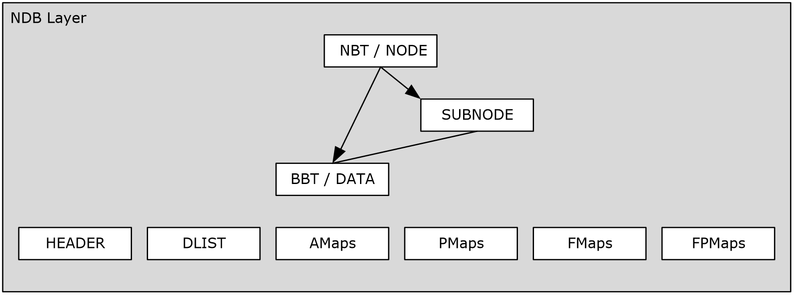

Figure 16: NDB layer

The infrastructure portion contains the various elements in the PST that
maintain the lowest-level information, which includes: the PST header
and the allocation metadata pages (that is, AMaps, PMaps, FMaps, FPMaps,
and the DList). Together these entities form the underlying
infrastructure that represent the metadata and state on which the proper
functioning of the PST relies. The header and the allocation metadata
pages are the only entities in the PST that are ever modified in-place.

The NDB portion is the node database that includes the NBT and BBT, and
all its associated operations. This section covers the various
implementation considerations associated with the NDB Layer. To start,
the following table illustrates the various entities that exist in the
NDB layer.

| Entity     | Required? | Instances      | Remarks                                                                                                                                   |
|------------|-----------|----------------|-------------------------------------------------------------------------------------------------------------------------------------------|
| PST HEADER | Y         | 1              | The PST header MUST be maintained and up-to-date at all times.                                                                            |
| AMap       | Y         | Many, Periodic | Authoritative source of all free/allocated space in the PST, MUST be maintained at all times.                                             |
| PMap       | Y         | Many, Periodic | MUST exist in correct intervals for backward client compatibility. Implementations SHOULD NOT modify PMaps after they are created.\<19\>  |
| FMap       | Y         | Many, Periodic | MUST exist in correct intervals for backward client compatibility. Implementations SHOULD NOT modify FMaps after they are created.\<20\>  |
| FPMap      | Y         | Many, Periodic | MUST exist in correct intervals for backward client compatibility. Implementations SHOULD NOT modify FPMaps after they are created.\<21\> |

#### Basic Operations

The following sections describe the most common operations performed at
the NDB layer, and specific implementation considerations.

##### Allocating Space from the PST

Allocating space directly from the PST file for higher-level operations.

<table>
<colgroup>
<col style="width: 19%" />
<col style="width: 80%" />
</colgroup>
<thead>
<tr class="header">
<th>Requirement level</th>
<th><strong>Actions</strong></th>
</tr>
</thead>
<tbody>
<tr class="odd">
<td>Required</td>
<td>
MUST check the <strong>fAMapValid</strong> value in the
<strong>ROOT</strong> structure before proceeding (section
2.6.1.3.7).

Each allocation MUST NOT exceed 8 kilobytes (8192 bytes) in size.

The corresponding AMap MUST be updated to reflect the allocation
(section 2.2.2.7.2).

The <strong>cbAMapFree</strong> and <strong>cbPMapFree</strong>
fields in the HEADER.ROOT structure MUST be updated to reflect the
allocation.
</td>
</tr>
<tr class="even">
<td>Recommended</td>
<td>Use the DList, PMap, FMap, FPMap as optimizations.</td>
</tr>
<tr class="odd">
<td>Optional</td>
<td>
Update the DList.

Update the PMap, FMap, FPMap.
</td>
</tr>
</tbody>
</table>

Possible side effects:

| Scenario                             | Impact                                                                           |
|--------------------------------------|----------------------------------------------------------------------------------|
| Free slot of required size not found | The PST File needs to grow. See section 2.6.1.1.2 for additional considerations. |

##### Growing the PST File

Increasing the size of the PST file to create more space for allocation.

<table>
<colgroup>
<col style="width: 19%" />
<col style="width: 80%" />
</colgroup>
<thead>
<tr class="header">
<th>Requirement level</th>
<th><strong>Actions</strong></th>
</tr>
</thead>
<tbody>
<tr class="odd">
<td>Required</td>
<td>
The PST file MUST grow at integer multiples of the number of
bytes mapped by an AMap (that is, multiples of approximately 250
kilobytes).

All new AMaps created MUST be properly initialized.

If needed, PMaps, FMaps, and FPMaps MUST be created at the required
intervals and properly initialized (section 2.2.2.7).

The <strong>ibFileEof</strong>, <strong>ibAMapLast</strong>,
<strong>cbAMapFree</strong> and <strong>cbPMapFree</strong> fields in
the HEADER.ROOT structure MUST be updated to reflect the
growth.
</td>
</tr>
<tr class="even">
<td>Recommended</td>
<td>None.</td>
</tr>
<tr class="odd">
<td>Optional</td>
<td>Update the DList.</td>
</tr>
</tbody>
</table>

Possible side effects: None

##### Freeing Space Back to the PST

Freeing allocated space to the PST.

<table>
<colgroup>
<col style="width: 19%" />
<col style="width: 80%" />
</colgroup>
<thead>
<tr class="header">
<th>Requirement level</th>
<th><strong>Actions</strong></th>
</tr>
</thead>
<tbody>
<tr class="odd">
<td>Required</td>
<td>
The corresponding AMap MUST be updated to reflect the freed page
(section 2.2.2.7.2).

The <strong>cbAMapFree</strong> and <strong>cbPMapFree</strong>
fields in the HEADER.ROOT structure MUST be updated
accordingly.
</td>
</tr>
<tr class="even">
<td>Recommended</td>
<td>None.</td>
</tr>
<tr class="odd">
<td>Optional</td>
<td>
Update the DList.

Update the PMap, FMap, FPMap.
</td>
</tr>
</tbody>
</table>

Possible side effects: None.

##### Creating a Page

Allocating a new page and assigning an BID.

<table>
<colgroup>
<col style="width: 19%" />
<col style="width: 80%" />
</colgroup>
<thead>
<tr class="header">
<th>Requirement level</th>
<th><strong>Actions</strong></th>
</tr>
</thead>
<tbody>
<tr class="odd">
<td>Required</td>
<td>
MUST check the <strong>fAMapValid</strong> value in the ROOT
structure before proceeding (see section 2.6.1.3.7).

Page allocations MUST be 512 bytes in size and aligned on a 512-byte
boundary.

Allocate space for the page (section 2.6.1.1.1).

The PAGETRAILER MUST be initialized (section 2.2.2.7.1).

The BBT Reference Count for each data block MUST be initialized.

The BBT MUST be updated to reflect the new data block(s).

The <strong>bidNextB</strong> field in the HEADER.ROOT structure MUST
be incremented.

The <strong>bidNextP</strong> field in HEADER MUST also be
incremented.
</td>
</tr>
<tr class="even">
<td>Recommended</td>
<td>Use the DList, PMap, FMap, FPMap as optimizations.</td>
</tr>
<tr class="odd">
<td>Optional</td>
<td>
Update the DList.

Update the PMap, FMap, FPMap.
</td>
</tr>
</tbody>
</table>

Possible side effects:

| Scenario                              | Impact                                                                                |
|---------------------------------------|---------------------------------------------------------------------------------------|
| Free slot of required size not found. | The PST File needs to grow. Refer to section 2.6.1.1.2 for additional considerations. |
| BBT page too full.                    | The BBT might need more levels or need to be balanced.                                |

##### Creating a Block

Allocating a new data block and assigning an BID.

<table>
<colgroup>
<col style="width: 19%" />
<col style="width: 80%" />
</colgroup>
<thead>
<tr class="header">
<th>Requirement level</th>
<th><strong>Actions</strong></th>
</tr>
</thead>
<tbody>
<tr class="odd">
<td>Required</td>
<td>
MUST check the <strong>fAMapValid</strong> value in the ROOT
structure before proceeding (section 2.6.1.3.7).

Block allocations MUST be integer multiples of 64 bytes in size and
aligned on a 64-byte boundary. The allocation size MUST factor in the
size of the extra BLOCKTRAILER.

Allocate space for the block (section 2.6.1.1.1).

Non-internal data blocks MUST be encoded according to
HEADER.<strong>bCryptMethod</strong>.

The BBT Reference Count for each data block MUST be initialized.

The BBT MUST be updated to reflect the new data block(s).

The BLOCKTRAILER MUST be initialized, including the data
<strong>CRC</strong> (section 2.2.2.8.1).

The <strong>bidNextB</strong> field in the HEADER.ROOT structure MUST
be incremented.
</td>
</tr>
<tr class="even">
<td>Recommended</td>
<td>Use the DList, PMap, FMap, FPMap as optimizations.</td>
</tr>
<tr class="odd">
<td>Optional</td>
<td>
Update the DList.

Update the PMap, FMap, FPMap.
</td>
</tr>
</tbody>
</table>

Possible side effects:

| Scenario                              | Impact                                                                                |
|---------------------------------------|---------------------------------------------------------------------------------------|
| Free slot of required size not found. | The PST File needs to grow. Refer to section 2.6.1.1.2 for additional considerations. |
| BBT page too full.                    | The BBT might need more levels or need to be balanced.                                |

##### Freeing a Page in the PST

Freeing an allocated page back to the PST file.

<table>
<colgroup>
<col style="width: 19%" />
<col style="width: 80%" />
</colgroup>
<thead>
<tr class="header">
<th>Requirement level</th>
<th><strong>Actions</strong></th>
</tr>
</thead>
<tbody>
<tr class="odd">
<td>Required</td>
<td>
Drop the reference count of the BID that corresponds to the
page.

In the reference count drops to less than 2, then free the BID
(section 2.6.1.1.3).
</td>
</tr>
<tr class="even">
<td>Recommended</td>
<td>Validate the PAGETRAILER to make sure the page is valid (section
2.2.2.7.1).</td>
</tr>
<tr class="odd">
<td>Optional</td>
<td>None.</td>
</tr>
</tbody>
</table>

Possible side effects: None.

##### Dropping the Reference Count of a Block

Dropping the reference count of an allocated block, and freeing back to
the PST if the reference count drops to one or less.

<table>
<colgroup>
<col style="width: 19%" />
<col style="width: 80%" />
</colgroup>
<thead>
<tr class="header">
<th>Requirement level</th>
<th><strong>Actions</strong></th>
</tr>
</thead>
<tbody>
<tr class="odd">
<td>Required</td>
<td>
Drop the reference count of the BID associated with the data
block.

If the reference count drops to less than 2, then free the BID
(section 2.6.1.1.3).
</td>
</tr>
<tr class="even">
<td>Recommended</td>
<td>Validate the BLOCKTRAILER to make sure the block is valid (section
2.2.2.8.1).</td>
</tr>
<tr class="odd">
<td>Optional</td>
<td>None.</td>
</tr>
</tbody>
</table>

Possible side effects: None.

##### Modifying a Page

Modifying the contents of a page.

<table>
<colgroup>
<col style="width: 19%" />
<col style="width: 80%" />
</colgroup>
<thead>
<tr class="header">
<th>Requirement level</th>
<th><strong>Actions</strong></th>
</tr>
</thead>
<tbody>
<tr class="odd">
<td>Required</td>
<td>
MUST check the <strong>fAMapValid</strong> value in the ROOT
structure before proceeding (see section 2.6.1.3.7).

Create a new page for the modifications (section 2.6.1.1.4).

Replace references to the old page BID with the new page BID.

Free the old page (section 2.6.1.1.6).
</td>
</tr>
<tr class="even">
<td>Recommended</td>
<td>None.</td>
</tr>
<tr class="odd">
<td>Optional</td>
<td>None.</td>
</tr>
</tbody>
</table>

Possible side effects:

| Scenario                                | Impact                                                                                |
|-----------------------------------------|---------------------------------------------------------------------------------------|
| Free slot of required size not found.   | The PST File needs to grow. Refer to section 2.6.1.1.2 for additional considerations. |
| Higher-level pages reference this page. | Higher-level pages MUST be recursively modified using the same mechanism.             |

##### Modifying a Block

Modifying the contents of a block.

<table>
<colgroup>
<col style="width: 19%" />
<col style="width: 80%" />
</colgroup>
<thead>
<tr class="header">
<th>Requirement level</th>
<th><strong>Actions</strong></th>
</tr>
</thead>
<tbody>
<tr class="odd">
<td>Required</td>
<td>
MUST check the <strong>fAMapValid</strong> value in the ROOT
structure before proceeding (see section 2.6.1.3.7).

Create a new block for the modified data (section 2.6.1.1.5).

Replace references to the old BID with the new BID, this requires
cascading modifications to other referencing pages (section
2.6.1.1.8).

Drop the reference count of the old block (section
2.6.1.1.7).
</td>
</tr>
<tr class="even">
<td>Recommended</td>
<td>None.</td>
</tr>
<tr class="odd">
<td>Optional</td>
<td>None.</td>
</tr>
</tbody>
</table>

Possible side effects:

| Scenario                                | Impact                                                                                                               |
|-----------------------------------------|----------------------------------------------------------------------------------------------------------------------|
| Free slot of required size not found.   | The PST File needs to grow. Refer to section 2.6.1.1.2 for additional considerations.                                |
| The block is referenced by a data tree. | The XBLOCK and the data tree blocks that reference the XBLOCK MUST be recursively modified using the same mechanism. |

2.  #### NDB Operations

    1.  ##### Creating a New Node

Creating a new node with a data BLOB (see next section for adding a
subnode).

<table>
<colgroup>
<col style="width: 19%" />
<col style="width: 80%" />
</colgroup>
<thead>
<tr class="header">
<th>Requirement level</th>
<th><strong>Actions</strong></th>
</tr>
</thead>
<tbody>
<tr class="odd">
<td>Required</td>
<td>
New data block(s) MUST be allocated to store the data (section
2.6.1.1.5).

The NBT MUST be updated to reflect the new node and associated BIDs
(section 2.2.2.7.7.4).

The corresponding <strong>rgnid</strong>[<strong>nidType</strong>]
field in the HEADER.ROOT structure MUST be incremented
accordingly.
</td>
</tr>
<tr class="even">
<td>Recommended</td>
<td>BTree pages SHOULD be maintained at under 90 percent capacity.</td>
</tr>
<tr class="odd">
<td>Optional</td>
<td>None.</td>
</tr>
</tbody>
</table>

Possible side effects:

| Scenario                           | Impact                                                      |
|------------------------------------|-------------------------------------------------------------|
| Not enough free space.             | The PST File needs to grow.                                 |
| BBT page too full.                 | The BBT might need more levels or need to be balanced.      |
| NBT page too full.                 | The NBT might need more levels or need to be balanced.      |
| Data BLOB larger than 8 kilobytes. | A data tree needs to be constructed to store the data BLOB. |

##### Creating or Adding a Subnode Entry

Creating a subnode entry with a data BLOB and associating it with an
existing node.

<table>
<colgroup>
<col style="width: 19%" />
<col style="width: 80%" />
</colgroup>
<thead>
<tr class="header">
<th>Requirement level</th>
<th>Actions</th>
</tr>
</thead>
<tbody>
<tr class="odd">
<td>Required</td>
<td>
Create a new data block (section 2.6.1.1.5).

Allocate an SLBLOCK, if one does not exist (section 2.6.1.1.5).

Associate the SLBLOCK with NID of the containing node (NBT page needs
to be modified).

Create a new SLENTRY in the SLBLOCK and associate it with the data
block.
</td>
</tr>
<tr class="even">
<td>Recommended</td>
<td>None.</td>
</tr>
<tr class="odd">
<td>Optional</td>
<td>None.</td>
</tr>
</tbody>
</table>

Possible side effects:

| Scenario                           | Impact                                                                     |
|------------------------------------|----------------------------------------------------------------------------|
| Not enough free space.             | The PST File needs to grow.                                                |
| BBT page too full.                 | The BBT might need more levels or need to be balanced.                     |
| SLBLOCK is full.                   | The subnode BTree needs to grow in depth to accommodate new subnode entry. |
| Data BLOB larger than 8 kilobytes. | A data tree needs to be constructed to store the data BLOB.                |

NIDs for subnodes are internal and therefore NOT allocated from the
**rgnid\[nidType\]** counter in the HEADER.

##### Modifying Node Data

Modifying the contents of the data BLOB of an existing node.

<table>
<colgroup>
<col style="width: 19%" />
<col style="width: 80%" />
</colgroup>
<thead>
<tr class="header">
<th>Requirement level</th>
<th><strong>Actions</strong></th>
</tr>
</thead>
<tbody>
<tr class="odd">
<td>Required</td>
<td>
Create a new data block(s) for the modified data (section
2.6.1.1.5).

The NBT node entry MUST be updated with the new BID(s) (section
2.6.1.1.8).
</td>
</tr>
<tr class="even">
<td>Recommended</td>
<td>If the data is stored in a data tree, implementations are encouraged
to add optimizations to only replace the specific blocks that have
actually been modified.</td>
</tr>
<tr class="odd">
<td>Optional</td>
<td>None.</td>
</tr>
</tbody>
</table>

Possible side effects:

| Scenario                                          | Impact                                                      |
|---------------------------------------------------|-------------------------------------------------------------|
| Not enough free space to store the new data BLOB. | The PST File needs to grow.                                 |
| BBT page too full.                                | The BBT might need more levels or need to be balanced.      |
| New data BLOB larger than 8 kilobytes.            | A data tree needs to be constructed to store the data BLOB. |

A new data block MUST be allocated even if the new content is smaller
than or equal to the old content in size. See section 2.6.1.3.1 for
further explanation.

##### Duplicating the Contents of One Node to Another

Copying all the contents of an existing node to a new node, where the
new node can be a top-level node or a subnode (for example, when a
**Message object** is added to another Message object as an **Attachment
object**). Both nodes end up referencing the same instance of the data
block, and subnodes (that is, single-instancing).

<table>
<colgroup>
<col style="width: 19%" />
<col style="width: 80%" />
</colgroup>
<thead>
<tr class="header">
<th>Requirement level</th>
<th><strong>Actions</strong></th>
</tr>
</thead>
<tbody>
<tr class="odd">
<td>Required</td>
<td>
The BBT Reference Count for <strong>bidData</strong> and
<strong>bidSub</strong> of the existing node MUST be incremented.

The NBT or SLBLOCK MUST be updated, depending on whether the target
is a node or subnode, to reflect the new node, using the same
<strong>bidData</strong> and <strong>bidSub</strong> values as the
existing node.

The corresponding <strong>rgnid</strong>[<strong>nidType</strong>]
field in the HEADER.ROOT structure MUST be incremented.
</td>
</tr>
<tr class="even">
<td>Recommended</td>
<td>None.</td>
</tr>
<tr class="odd">
<td>Optional</td>
<td>None.</td>
</tr>
</tbody>
</table>

Possible side effects:

| Scenario                                         | Impact                                                                     |
|--------------------------------------------------|----------------------------------------------------------------------------|
| NBT page too full.                               | The NBT might need more levels or need to be balanced.                     |
| The target is a subnode and the SLBLOCK is full. | The subnode BTree needs to grow in depth to accommodate new subnode entry. |

If **bidData** points to a data tree, there is no need to recursively
increment the reference count of its child data blocks.

If the node contains a subnode, there is no need to recursively
increment the reference count of its child data blocks.

In many cases the existing node and new node have a different
**nidParent**.

##### Modifying Subnode Entry Data

Modifying the data associated with a subnode entry. This is identical to
modifying node data in section 2.6.1.2.3, except that the subnode entry
is located using the subnode BTree of the containing node instead of
looking up the NBT.

<table>
<colgroup>
<col style="width: 19%" />
<col style="width: 80%" />
</colgroup>
<thead>
<tr class="header">
<th>Requirement level</th>
<th><strong>Actions</strong></th>
</tr>
</thead>
<tbody>
<tr class="odd">
<td>Required</td>
<td>
Create new data block(s) for the modified data (section
2.6.1.1.5).

The corresponding SLBLOCK subnode entry MUST be updated with the new
BID(s) (section 2.6.1.1.5).

Modify NBT pages that reference the subnode BTree (section
2.6.1.1.8).
</td>
</tr>
<tr class="even">
<td>Recommended</td>
<td>If the data is stored in a data tree, implementations are encouraged
to add optimizations to only replace the specific blocks that have
actually been modified.</td>
</tr>
<tr class="odd">
<td>Optional</td>
<td>None.</td>
</tr>
</tbody>
</table>

Possible side effects:

| Scenario                                              | Impact                                                                     |
|-------------------------------------------------------|----------------------------------------------------------------------------|
| Not enough free space to store the new data BLOB.     | The PST file needs to grow.                                                |
| BBT page too full.                                    | The BBT might need more levels or need to be balanced.                     |
| New data BLOB larger than 8 kilobytes.                | A data tree needs to be constructed to store the data BLOB.                |
| The SLBLOCK is full and a new subnode entry is added. | The subnode BTree needs to grow in depth to accommodate new subnode entry. |

See section 2.6.1.2.3.

##### Deleting a Subnode

Deleting an existing subnode.

<table>
<colgroup>
<col style="width: 21%" />
<col style="width: 78%" />
</colgroup>
<thead>
<tr class="header">
<th>Requirement level</th>
<th><strong>Actions</strong></th>
</tr>
</thead>
<tbody>
<tr class="odd">
<td>Required</td>
<td>
The reference count for <strong>bidData</strong> and
<strong>bidSub</strong> of each subnode entry MUST be dropped (section
2.6.1.1.7).

The corresponding subnode entry MUST be removed from the SLBLOCK of
the containing node (section 2.6.1.1.9).

The reference count of the SLBLOCK MUST be dropped (section
2.6.1.1.7).
</td>
</tr>
<tr class="even">
<td>Recommended</td>
<td>None.</td>
</tr>
<tr class="odd">
<td>Optional</td>
<td>None.</td>
</tr>
</tbody>
</table>

Possible side effects:

| Scenario                   | Impact                                                                                                                                   |
|----------------------------|------------------------------------------------------------------------------------------------------------------------------------------|
| Subnode contains subnodes. | The reference counts of the **bidData** and **bidSub** for each of the Sub-subnodes MUST be dropped, which ensures the blocks are freed. |

##### Deleting a Node

Deleting an existing node and its contents from the PST.

<table>
<colgroup>
<col style="width: 19%" />
<col style="width: 80%" />
</colgroup>
<thead>
<tr class="header">
<th>Requirement level</th>
<th><strong>Actions</strong></th>
</tr>
</thead>
<tbody>
<tr class="odd">
<td>Required</td>
<td>
The reference count for <strong>bidData</strong> MUST be dropped
(section 2.6.1.1.7).

Reference count of <strong>bidSub</strong>, if exists, MUST be
dropped (section 2.6.1.1.7).

The node MUST be removed from the NBT (section 2.6.1.1.8).
</td>
</tr>
<tr class="even">
<td>Recommended</td>
<td>None.</td>
</tr>
<tr class="odd">
<td>Optional</td>
<td>None.</td>
</tr>
</tbody>
</table>

Possible side effects:

| Scenario                                                                         | Impact                                                                                                                                                                                                                                                                                                                                                           |
|----------------------------------------------------------------------------------|------------------------------------------------------------------------------------------------------------------------------------------------------------------------------------------------------------------------------------------------------------------------------------------------------------------------------------------------------------------|
| The key of the deleted entry is also a key value used in the parent index block. | If the leaf block is not empty after the delete, then the index row in the parent index block MUST be updated to use the next key value in the leaf block. However, if the leaf black is empty, then the parent index row MUST be removed. In some cases (for example, the index block becomes empty as well) this can have cascading effects up the index path. |

#### Special Considerations

The following is a list of special considerations while implementing a
PST client.

##### Immutability

This file format specification treats the NDB as an immutable store.
What this means is that, with the exception of the header and allocation
metadata pages, the data in the NDB MUST NOT be modified in-place.
Instead, a new copy of the data needs to be written at a new location,
and then, when all references of the pre-existing data have been
removed, the old data can be purged.

##### Single-Instance Storage

As seen in section 2.6.1.2.4, the NDB Layer supports single-instance
storage by having reference counts associated with each data block.
Additional references to the same BID can be held as multiple nodes hold
references to the same BID. This, combined with the immutability of the
NDB store, allows new versions of a particular modified copy to be
persisted in a new BID while all the other un-modified copies continue
to refer to the old data.

##### Transactional Semantics

Higher-level messaging applications often require transactional
semantics that allow independent views of the underlying data. For
example, if two **Message objects** are opened and then one of them is
modified, the other does not see the changes unless and until it is
closed and re-opened.

Such semantics can be modeled over the NDB, because each Message object
is represented by a node, which only contains a BID for the data block
and optionally a subnode. Because the NDB is immutable, which means any
modification to the underlying Message object MUST cause the BID to
increase, by caching the BIDs when opening a Message object, an
implementation can determine whether the underlying Message object had
been modified since the Message object was opened.

By architecting the sequence of modifications to ensure that BIDs are
only updated after all the underlying data is successfully written, an
implementation can design a system that leaves little or no chance for a
Message object to end up in an inconsistent state.

In addition, the **fAMapValid** flag in the ROOT structure can also be
used to implement transactional semantics for a group of related
operations that requires several allocations from the PST (that is,
AMaps). See section 2.6.1.3.7 for further details.

##### Backfilling

Backfilling is an allocation strategy designed to reclaim some of the
free space in the PST methodically walking through the file from end to
start, filling in empty spaces along the way as allocation requests come
in. The backfilling process is initiated when the overall file
utilization (that is, free space to file size ratio) drops below a
threshold. The threshold is not specified in the PST file and is up to
the implementation of the PST client.

When a backfill is initiated, the DFL_BACKFILL_COMPLETE flag is cleared
from the DList and the **ulCurrentPage** field in the DLISTPAGE is set
to the index of the last AMap page of the PST. For subsequent
allocations, the implementation SHOULD scan for free space backwards
(that is, towards the beginning of the file). If space is found, then
space is allocated from the AMap page indicated by **ulCurrentPage**.
However, if that AMap page cannot service the allocation, then
**ulCurrentPage** is updated with the index of the AMap page before the
current page. The process repeats itself until the **ulCurrentPage**
reaches the first AMap page, in which case the backfill has finished and
the DFL_BACKFILL_COMPLETE flag is set in **bFlags**.

Note that backfilling is an optional optimization feature and is not
required.\<22\>

##### Internal Fragmentation and Locality of Reference

The immutable nature of the NDB means that any data that is modified
from time to time is constantly being moved around in the file, because
each modification requires a new allocation in the file. This also means
that, as data is edited, small pockets of free space are created
throughout the file when the original copy of the data is removed.

The allocation algorithm used by the NDB is very efficient in
repurposing the small pockets of free space created when a block is
edited. However this algorithm makes no attempt to keep related data
together because the overall goal is to use space within the file as
efficiently as possible.

The end result of this is that any NDB which is not completely static is
very prone to internal fragmentation as edits are made. This is
especially true of larger streams of data because they are comprised of
many blocks, some of which are touched by edits and others of which are
not. Those blocks touched by an edit move and those that aren't remain
where they are, leading to more and more fragmentation as the different
parts of the stream are edited at different times.

This tendency of a PST to fragment internally naturally lends to low
locality of reference which means highly scattered read/write patterns.
It is recommended that implementations design an access mechanism that
minimizes the performance impact of fragmented data access.

##### Caching

Modifications to NDB objects often require updates in several different
areas of the PST file. For example, creating a new node requires, at a
minimum, modifications to the HEADER, AMap, BBT, NBT and also writing
data block(s). These modifications become more frequent and compound
quickly as higher-level operations are involved (such as moving a
**Folder object** with sub-Folder objects). Often, the same object is
modified several times within a single high-level operation.

Caching is a very efficient way to reduce the cost of disk I/O by
eliminating unnecessary write-through for objects that are constantly
being updated, such as the HEADER, AMaps, NBT / BBT pages, and so on).
Performance enhancements can be achieved by implementing page or data
block caching mechanisms.

##### Crash Recovery and AMap Rebuilding

The **fAMapValid** flag in the ROOT structure is used to indicate
whether the AMaps in the PST file are in a known-valid state. In
general, this flag is set to one of the two valid states described in
section 2.2.2.5.

At the beginning of any operation that either allocates or frees space
in the PST file, implementations set the **fAMapValid** value to
INVALID_AMAP, which signifies that the AMaps (and also PMaps, FMaps, and
FPMaps, for that matter) cannot be trusted. When the operation is
complete, this value is set back to the valid state. In the event where
the PST file is abnormally closed before the operation is finished, it
is likely that **fAMapValid** was never restored back to the valid
state. In that case, the PST file MUST go through a very expensive
recovery operation the next time an attempt to allocate file space is
made.

This recovery operation uses a process called an "AMap rebuild", which
involves first marking all the AMaps as "free" and then walking the NBT
and BBT to mark pages and blocks as "allocated" in the map pages as they
appear.\<23\> The rebuild process also ensures that all space occupied
by the AMaps, PMaps, FMaps and FPMaps are properly marked as allocated.

Implementations are NOT required to implement AMap Rebuild algorithms,
but MUST first check the **fAMapValid** value before manipulating the
AMaps in any way. If the **fAMapValid** value is set to invalid,
implementations that do not implement AMap Rebuild algorithms MUST NOT
modify the PST file in any way. Read-only implementations, however, MAY
ignore the **fAMapValid** value.

### LTP Layer

The LTP layer provides higher-level semantics that abstract the
primitive node-based operations. The following diagram graphically
illustrates the various structures provided by the LTP layer.

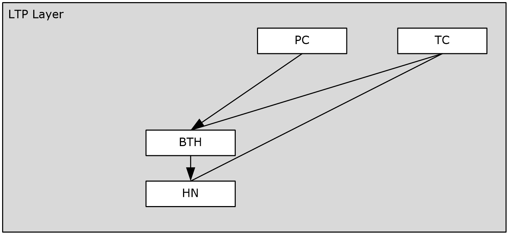

Figure 17: LTP layer

The following sections describe the most common operations performed at
the LTP layer, and specific implementation considerations.

1.  #### HN Operations

    1.  ##### Creating an HN

Creating a heap node. This is identical to creating a node in section
2.6.1.2.1, with a data BLOB that contains properly-formatted HNHDR and
HNPAGEMAP structures.

<table>
<colgroup>
<col style="width: 19%" />
<col style="width: 80%" />
</colgroup>
<thead>
<tr class="header">
<th>Requirement level</th>
<th><strong>Actions</strong></th>
</tr>
</thead>
<tbody>
<tr class="odd">
<td>Required</td>
<td>
See requirements for section 2.6.1.2.1.

The HNHDR and HNPAGEMAP structures MUST be properly initialized
(section 2.3.1).
</td>
</tr>
<tr class="even">
<td>Recommended</td>
<td>None.</td>
</tr>
<tr class="odd">
<td>Optional</td>
<td>None.</td>
</tr>
</tbody>
</table>

Possible side effects: See section 2.6.1.2.1.

##### Allocating from the HN

Allocates space out of the heap node. This is an extended case of
modifying node data in section 2.6.1.2.3.

<table>
<colgroup>
<col style="width: 19%" />
<col style="width: 80%" />
</colgroup>
<thead>
<tr class="header">
<th>Requirement level</th>
<th><strong>Actions</strong></th>
</tr>
</thead>
<tbody>
<tr class="odd">
<td>Required</td>
<td>
See requirements for section 2.6.1.2.3.

A heap allocation MUST fit within a single block.

Maximum size of a heap allocation is 3580 bytes.

HNPAGEMAP for any modified heap block MUST be maintained (section
2.3.1.5).

The Fill Level Map that corresponds to the modified block (HNs with a
data tree) is updated.
</td>
</tr>
<tr class="even">
<td>Recommended</td>
<td>Update the Fill Level Map that corresponds to the modified block
(HNs with a data tree).</td>
</tr>
<tr class="odd">
<td>Optional</td>
<td>None.</td>
</tr>
</tbody>
</table>

Possible side effects: See section 2.6.1.2.3.

When an HN no longer fits within a single data block, a data tree is
created to span multiple data blocks. When adding new data blocks,
implementers MUST use the correct block header format (that is, HNHDR,
HNPAGEHDR or HNBITMAPHDR). Refer to section 2.3.1.6 for details.

##### Freeing an Allocation

Freeing an allocated slot in the heap node. This is an extended case of
modifying node data in section 2.6.1.2.3.

<table>
<colgroup>
<col style="width: 19%" />
<col style="width: 80%" />
</colgroup>
<thead>
<tr class="header">
<th>Requirement level</th>
<th><strong>Actions</strong></th>
</tr>
</thead>
<tbody>
<tr class="odd">
<td>Required</td>
<td>
An existing HN (section 2.6.2.1.1).

See requirements for section 2.6.1.2.3.

If the freed allocation leaves a gap between allocations, the latter
entries MUST be moved up to fill in the gap.

The <strong>rgibAlloc</strong> field of HNPAGEMAP MUST also be
updated to reflect the new allocation offsets.

Update the Fill Level Map that corresponds to the freed space (HNs
with a data tree) (section 2.3.1.2 through section 2.3.1.4).
</td>
</tr>
<tr class="even">
<td>Recommended</td>
<td>None.</td>
</tr>
<tr class="odd">
<td>Optional</td>
<td>None.</td>
</tr>
</tbody>
</table>

Possible side effects: See section 2.6.1.2.3.

Because the HNPAGEMAP uses the starting offset of the next allocation
(or the end of the allocations) to determine the size of the current
allocation, any gaps in the allocated heap MUST be moved up to keep the
data tightly packed. The **rgibAlloc** array also needs to be adjusted
for the relocation of any subsequent entries.

##### Deleting an HN

Deleting a heap node. This is identical to deleting a node. See section
2.6.1.2.7.

| Requirement level | Actions                                 |
|-------------------|-----------------------------------------|
| Required          | See requirements for section 2.6.1.2.7. |
| Recommended       | None.                                   |
| Optional          | None.                                   |

Possible side effects: See section 2.6.1.2.7.

2.  #### BTH Operations

    1.  ##### Creating a BTH

Creating a new BTree-on-Heap. This is analogous to making a few
allocations from the HN for the BTH-related structures.

<table>
<colgroup>
<col style="width: 19%" />
<col style="width: 80%" />
</colgroup>
<thead>
<tr class="header">
<th>Requirement level</th>
<th><strong>Actions</strong></th>
</tr>
</thead>
<tbody>
<tr class="odd">
<td>Required</td>
<td>
An existing HN (section 2.6.2.1.1).

The BTHHEADER MUST be allocated from the HN (section 2.6.2.1.2), and
properly initialized (section 2.3.2.1).
</td>
</tr>
<tr class="even">
<td>Recommended</td>
<td>None.</td>
</tr>
<tr class="odd">
<td>Optional</td>
<td>None.</td>
</tr>
</tbody>
</table>

Possible side effects: See section 2.6.2.1.1 and 2.6.2.1.2.

##### Inserting into the BTH

Inserting a new entry into the BTH. This consists of modifying contents
of the existing HN allocations, and possibly making new allocations to
grow the BTH.

<table>
<colgroup>
<col style="width: 19%" />
<col style="width: 80%" />
</colgroup>
<thead>
<tr class="header">
<th>Requirement level</th>
<th><strong>Actions</strong></th>
</tr>
</thead>
<tbody>
<tr class="odd">
<td>Required</td>
<td>
An existing BTH (section 2.6.2.2.1).

A new HN allocation is made for the new data (section 2.6.2.1.2).

A new BTH record is created for the new item and inserted into the
corresponding BTH structure (section 2.6.2.2.3) .
</td>
</tr>
<tr class="even">
<td>Recommended</td>
<td>BTH index and leaf blocks SHOULD be maintained at under 90 percent
capacity.</td>
</tr>
<tr class="odd">
<td>Optional</td>
<td>None.</td>
</tr>
</tbody>
</table>

Possible side effects:

| Scenario                     | Impact                                                                                                              |
|------------------------------|---------------------------------------------------------------------------------------------------------------------|
| BTH index or leaf block Full | The index or leaf block needs to be split and a new index level created. Portions of the BTree MUST be re-balanced. |

To clarify the terminology, the word "block" referenced in "index / leaf
block" actually refers to an HN allocation instead of an actual data
block in the BBT.

The size of an index or leaf block for a BTH is 3580 bytes. The number
of index or leaf entries that can fit into each block depends on the
size of the index and data items.

##### Modifying Contents of a BTH Entry

Modifying contents of a BTH entry. This refers to modifying the data
value of an existing BTH entry. In essence, this is a particular case of
modifying node data in section 2.6.1.2.3.

<table>
<colgroup>
<col style="width: 19%" />
<col style="width: 80%" />
</colgroup>
<thead>
<tr class="header">
<th>Requirement level</th>
<th>Actions</th>
</tr>
</thead>
<tbody>
<tr class="odd">
<td>Required</td>
<td>
An existing BTH (section 2.6.2.2.1).

See requirements for section 2.6.1.2.3.
</td>
</tr>
<tr class="even">
<td>Recommended</td>
<td>None.</td>
</tr>
<tr class="odd">
<td>Optional</td>
<td>None.</td>
</tr>
</tbody>
</table>

Possible side effects: See section 2.6.1.2.3.

##### Deleting a BTH Entry

Deleting an entry from a BTH is a particular case of modifying node data
in section 2.6.1.2.3.

<table>
<colgroup>
<col style="width: 19%" />
<col style="width: 80%" />
</colgroup>
<thead>
<tr class="header">
<th>Requirement level</th>
<th><strong>Actions</strong></th>
</tr>
</thead>
<tbody>
<tr class="odd">
<td>Required</td>
<td>
See requirements for section 2.6.1.2.3.

The BTH entry MUST be deleted from the corresponding BTH structure
(section 2.3.2.3).
</td>
</tr>
<tr class="even">
<td>Recommended</td>
<td>None.</td>
</tr>
<tr class="odd">
<td>Optional</td>
<td>None.</td>
</tr>
</tbody>
</table>

Possible side effects:

| Scenario                                                                         | Impact                                                                                                                                                                                                                                                                                                                                                           |
|----------------------------------------------------------------------------------|------------------------------------------------------------------------------------------------------------------------------------------------------------------------------------------------------------------------------------------------------------------------------------------------------------------------------------------------------------------|
| The key of the deleted entry is also a key value used in the parent index block. | If the leaf block is not empty after the delete, then the index row in the parent index block MUST be updated to use the next key value in the leaf block. However, if the leaf block is empty, then the parent index row MUST be removed. In some cases (for example, the index block becomes empty as well) this can have cascading effects up the index path. |
|                                                                                  | Also see section 2.6.1.2.3.                                                                                                                                                                                                                                                                                                                                      |

##### Deleting a BTH

Deleting a BTH. This is identical to deleting a series of HN allocations
in section 2.6.2.1.3.

<table>
<colgroup>
<col style="width: 19%" />
<col style="width: 80%" />
</colgroup>
<thead>
<tr class="header">
<th>Requirement level</th>
<th>Actions</th>
</tr>
</thead>
<tbody>
<tr class="odd">
<td>Required</td>
<td>
Starting from the HID of the BTH header, walk down all the BTH
entry records (recursively if needed) and free all the HN allocations
associated with the BTH (section 2.6.2.1.3).

Once all the BTH entries are freed, free the BTH header (section
2.6.2.1.3).
</td>
</tr>
<tr class="even">
<td>Recommended</td>
<td>None.</td>
</tr>
<tr class="odd">
<td>Optional</td>
<td>None.</td>
</tr>
</tbody>
</table>

Possible side effects: See section 2.6.2.1.3.

3.  #### PC Operations

    1.  ##### Creating a PC

Creating a Property Context. This is a special case of creating a BTH in
section 2.6.2.2.1.

<table>
<colgroup>
<col style="width: 19%" />
<col style="width: 80%" />
</colgroup>
<thead>
<tr class="header">
<th>Requirement level</th>
<th><strong>Actions</strong></th>
</tr>
</thead>
<tbody>
<tr class="odd">
<td>Required</td>
<td>
See requirements for section 2.6.2.2.1.

Set the <strong>hidUserRoot</strong> to the HID of the BTH header
(section 2.3.2.1).

The key size of the underlying BTH MUST be 2 bytes (section
2.3.3.3).

The data size of the underlying BTH MUST be 6 bytes (section
2.3.3.3).
</td>
</tr>
<tr class="even">
<td>Recommended</td>
<td>None.</td>
</tr>
<tr class="odd">
<td>Optional</td>
<td>None.</td>
</tr>
</tbody>
</table>

Possible side effects: See section 2.6.2.2.1.

##### Inserting into the PC

Inserting properties into the Property Context. This is very similar to
inserting into the BTH in section 2.6.2.2.2, except that data that is
larger than 4 bytes in size is stored in a separate HN allocation or in
the subnode instead.

<table>
<colgroup>
<col style="width: 19%" />
<col style="width: 80%" />
</colgroup>
<thead>
<tr class="header">
<th>Requirement level</th>
<th>Actions</th>
</tr>
</thead>
<tbody>
<tr class="odd">
<td>Required</td>
<td>
An existing PC (section 2.6.2.3.1).

See requirements for section 2.6.2.2.2.
</td>
</tr>
<tr class="even">
<td>Recommended</td>
<td>None.</td>
</tr>
<tr class="odd">
<td>Optional</td>
<td>None.</td>
</tr>
</tbody>
</table>

Possible side effects: See section and 2.6.2.2.2 and 2.6.2.3.1 (if
applicable).

If the data is variable-size but less than or equal to 3580 bytes, then
the data is stored in a separate HN allocation. The HID of the
allocation is stored in the **dwValueHnid** field for the PC BTH record
(section 2.3.3.3).

If the data is variable-size and more than 3580 bytes, then the data is
stored in a separate subnode entry. The subnode NID is stored in the
**dwValueHnid** field of the PC BTH record (section 2.3.3.3).

Because an HID is a special NID with NID_TYPE of NID_TYPE_HID, HIDs and
subnode NIDs values never collide, implementations can easily determine
if **dwValueHnid** points to an HID or a subnode (section 2.2.2.1).

##### Modifying the Value of a Property

Modifying the value of an existing property in the Property Context.
This is similar to modifying contents of a BTH entry in section
2.6.2.2.3, except when the data is stored in a separate HN allocation
(section 2.6.1.2.3) or in the subnode (section 2.6.1.2.5).

<table>
<colgroup>
<col style="width: 19%" />
<col style="width: 80%" />
</colgroup>
<thead>
<tr class="header">
<th>Requirement level</th>
<th>Actions</th>
</tr>
</thead>
<tbody>
<tr class="odd">
<td>Required</td>
<td>
An existing PC (section 2.6.2.3.1).

See section 2.6.2.2.3, 2.6.1.2.3, and 2.6.1.2.5 (if
applicable).
</td>
</tr>
<tr class="even">
<td>Recommended</td>
<td>None.</td>
</tr>
<tr class="odd">
<td>Optional</td>
<td>None.</td>
</tr>
</tbody>
</table>

Possible side effects: See sections 2.6.2.3.1, 2.6.2.2.3, 2.6.1.2.3, and
2.6.1.2.5, where applicable.

##### Deleting a Property

Deleting an existing property from a Property Context. This is similar
to Deleting a BTH entry in section 2.6.2.2.4, except when the data is
stored in a separate HN allocation (section 2.6.2.1.3) or in the subnode
(section 2.6.1.2.6).

<table>
<colgroup>
<col style="width: 19%" />
<col style="width: 80%" />
</colgroup>
<thead>
<tr class="header">
<th>Requirement level</th>
<th>Actions</th>
</tr>
</thead>
<tbody>
<tr class="odd">
<td>Required</td>
<td>
An existing PC (section 2.6.2.3.1).

See section 2.6.2.2.4, 2.6.2.1.3 and 2.6.1.2.6 (if
applicable).
</td>
</tr>
<tr class="even">
<td>Recommended</td>
<td>None.</td>
</tr>
<tr class="odd">
<td>Optional</td>
<td>None.</td>
</tr>
</tbody>
</table>

Possible Side Effects: See sections 2.6.2.3.1, 2.6.2.2.4, 2.6.2.1.3, and
2.6.1.2.6, where applicable.

##### Deleting a PC

Deletes an existing Property Context altogether. This is identical to
deleting a node. See section 2.6.1.2.7.

| Requirement level | Actions                                 |
|-------------------|-----------------------------------------|
| Required          | See requirements for section 2.6.1.2.7. |
| Recommended       | None.                                   |
| Optional          | None.                                   |

Possible side effects: See section 2.6.1.2.7.

4.  #### TC Operations

    1.  ##### Creating a TC

Creating a Table Context. This involves creating a heap node with
specialized contents (section 2.6.2.1.1), and an embedded BTH within the
HN (section 2.6.2.2.1).

<table>
<colgroup>
<col style="width: 19%" />
<col style="width: 80%" />
</colgroup>
<thead>
<tr class="header">
<th>Requirement level</th>
<th><strong>Actions</strong></th>
</tr>
</thead>
<tbody>
<tr class="odd">
<td>Required</td>
<td>
See section 2.6.2.1.1 and 2.6.2.2.1.

The TCINFO (section 2.3.4.1) and <strong>TCOLDESC</strong> (section
2.3.4.2) structures MUST be properly initialized.

The embedded BTH key and data fields MUST be set up according to the
TCROWID structure (see section 2.3.4.3.1).
</td>
</tr>
<tr class="even">
<td>Recommended</td>
<td>None.</td>
</tr>
<tr class="odd">
<td>Optional</td>
<td>None.</td>
</tr>
</tbody>
</table>

Possible side effects: See section 2.6.2.1.1 and 2.6.2.2.1.

When setting up the **TCOLDESC** structures, special care MUST be given
when assigning the **iBit** fields to ensure the proper ordering of the
columns based on the column data size (section 2.3.4.2).

Also see section 2.3.4.2 for the rules regarding setting the **cbData**
field of **TCOLDESC**, noting the use of HNIDs for variable-size data or
fixed-size data that exceeds 8 bytes.

##### Inserting into the TC

Inserting a row into the Table Context. This is analogous to inserting
an entry into the embedded BTH (section 2.6.2.2.2). If the data is
variable-size or exceeds 8 bytes, then the data is either stored in a
separate HN allocation (section 2.6.2.1.2), or in the subnode
(2.6.1.2.2).

<table>
<colgroup>
<col style="width: 19%" />
<col style="width: 80%" />
</colgroup>
<thead>
<tr class="header">
<th>Requirement level</th>
<th><strong>Actions</strong></th>
</tr>
</thead>
<tbody>
<tr class="odd">
<td>Required</td>
<td>
An existing TC (section 2.6.2.4.1).

See requirements for section 2.6.2.2.2, 2.6.2.1.2, and 2.6.1.2.2 (if
applicable).

The row data record (section 2.3.4.4.1) MUST be properly formatted
and appended to the end of the existing Row Matrix.

A properly-formatted TCROWID structure (see section 2.3.4.3.1) that
corresponds to the row data record MUST be inserted into the embedded
BTH.
</td>
</tr>
<tr class="even">
<td>Recommended</td>
<td>None.</td>
</tr>
<tr class="odd">
<td>Optional</td>
<td>None.</td>
</tr>
</tbody>
</table>

Possible side effects: See sections 2.6.2.4.1, 2.6.2.2.2, 2.6.2.1.2, and
2.6.1.2.2, where applicable.

If the data is variable-size but less than or equal to 3580 bytes, then
the data is stored in a separate HN allocation. The HID of the
allocation is stored in the corresponding 4-byte data slot for the TC
row data record (section 2.3.4.4.1).

If the data is variable-size and more than 3580 bytes, then the data is
stored in a separate subnode entry. The subnode NID is stored in the
corresponding 4-byte data slot in the TC row data record (section
2.3.4.4.1).

If the data is fixed-size and more than 8 bytes in size, then the data
is stored in a separate HN allocation.

Because an HID is a special NID with NID_TYPE of NID_TYPE_HID, HIDs and
subnode NIDs values never collide, implementations can easily determine
if a data slot points to an HID or a subnode (section 2.2.2.1).

Also see sections 2.6.2.4.1, 2.6.2.2.2, 2.6.2.1.2, and 2.6.1.2.2, where
applicable.

##### Modifying Contents of a Table Row

Modifying the contents of a Table Row. This refers to changing the value
of a column in a particular Table Row. This involves re-allocating form
the HN, or modifying subnode entry data.

<table>
<colgroup>
<col style="width: 19%" />
<col style="width: 80%" />
</colgroup>
<thead>
<tr class="header">
<th>Requirement level</th>
<th><strong>Actions</strong></th>
</tr>
</thead>
<tbody>
<tr class="odd">
<td>Required</td>
<td>
An existing TC (section 2.6.2.4.1).

If the Row Matrix is in an HN, then see requirements for sections
2.6.2.1.2 and 2.6.2.1.3.

If the Row Matrix is in a subnode entry, then see requirements for
section 2.6.1.2.5.
</td>
</tr>
<tr class="even">
<td>Recommended</td>
<td>None.</td>
</tr>
<tr class="odd">
<td>Optional</td>
<td>None.</td>
</tr>
</tbody>
</table>

Possible side effects: See sections 2.6.2.4.1, 2.6.2.1.2, 2.6.2.1.3, and
2.6.1.2.5, where applicable..

##### Adding a Column

Adding a column to a TC. This involves modifying the TCINFO, adding a
new column definition to the **TCOLDESC** array, as well as widening
every row of the Row Matrix to add a new data slot (and also widen the
CEB array, if it runs out of unused bits). This involves allocating and
freeing HN entries, and modifying subnode data, if the Row Matrix is
stored in a subnode.

<table>
<colgroup>
<col style="width: 19%" />
<col style="width: 80%" />
</colgroup>
<thead>
<tr class="header">
<th>Requirement level</th>
<th><strong>Actions</strong></th>
</tr>
</thead>
<tbody>
<tr class="odd">
<td>Required</td>
<td>
An existing TC (section 2.6.2.4.1).

See requirements for sections 2.6.2.1.2, 2.6.2.1.3, and 2.6.1.2.5 (if
applicable).

The TCINFO (section 2.3.4.1) MUST be updated to account for the new
column.

A new <strong>TCOLDESC</strong> structure (section 2.3.4.2) MUST be
added for the new column.

Each row in the Row Matrix needs to be widened to add an data slot
for the new column.

It the CEB runs out of unused bits, then the CEB for each row MUST
grow to accommodate the new column.

The CEB for each row MUST also be updated to indicate that the new
column is "non-existent".
</td>
</tr>
<tr class="even">
<td>Recommended</td>
<td>None.</td>
</tr>
<tr class="odd">
<td>Optional</td>
<td>None.</td>
</tr>
</tbody>
</table>

Possible side effects: See sections 2.6.2.4.1, 2.6.2.1.2, 2.6.2.1.3, and
2.6.1.2.5, where applicable.

When setting up the new **TCOLDESC** structure, special care MUST be
given when assigning the **iBit** fields to ensure the proper ordering
of the columns based on the column data size (section 2.3.4.2). It is
also important to re-assign the **iBit** fields of any other
**TCOLDESC** structure that is shifted as a result of inserting the new
column.

Also refer to section 2.3.4.2 for the rules regarding setting the
**cbData** field of **TCOLDESC**, noting the use of HNIDs for
variable-size data or fixed-size data that exceeds 8 bytes.

##### Deleting the Value of a Column

Deleting the value of a column refers to setting the value of a column
in a particular Table Row as "non-existent". This is done by setting the
Cell Existence bit (CEB) that corresponds to that column in the row data
to "0". This is a particular case of modifying contents of a Table Row.

<table>
<colgroup>
<col style="width: 19%" />
<col style="width: 80%" />
</colgroup>
<thead>
<tr class="header">
<th>Requirement level</th>
<th>Actions</th>
</tr>
</thead>
<tbody>
<tr class="odd">
<td>Required</td>
<td>
An existing TC (section 2.6.2.4.1).

See section 2.6.2.4.3.
</td>
</tr>
<tr class="even">
<td>Recommended</td>
<td>None.</td>
</tr>
<tr class="odd">
<td>Optional</td>
<td>None.</td>
</tr>
</tbody>
</table>

Possible side effects: See sections 2.6.2.4.1 and 2.6.2.4.3.

##### Deleting a Column

Deleting an existing column in a Table Context.

Implementations SHOULD NOT delete existing columns in a Table Context.

##### Deleting a Row

Deleting an existing Row from a Table Context. This involves deleting an
entry from the embedded BTH (section 2.6.2.2.4) and modifying other BTH
entry values (section 2.6.2.2.3), and re-allocating HN entries (sections
2.6.2.1.2, 2.6.2.1.3) or modifying subnode entry data (section
2.6.1.2.5), depending where the Row Matrix is stored.

<table>
<colgroup>
<col style="width: 19%" />
<col style="width: 80%" />
</colgroup>
<thead>
<tr class="header">
<th>Requirement level</th>
<th><strong>Actions</strong></th>
</tr>
</thead>
<tbody>
<tr class="odd">
<td>Required</td>
<td>
An existing TC (section 2.6.2.4.1).

See requirements for sections 2.6.2.2.4, 2.6.2.2.3, 2.6.2.1.2,
2.6.2.1.3, and 2.6.1.2.5 (if applicable).

Subsequent rows in the Row Matrix MUST be moved up to replace the gap
caused by the deleted row.

Some TCROWID entries in the embedded BTH MUST also be updated
(specifically the <strong>RowIndex</strong> field) to account for the
shifting of their row index (section 2.3.4.3.1).
</td>
</tr>
<tr class="even">
<td>Recommended</td>
<td>None.</td>
</tr>
<tr class="odd">
<td>Optional</td>
<td>None.</td>
</tr>
</tbody>
</table>

Possible side effects: See sections 2.6.2.2.4, 2.6.2.2.3, 2.6.2.1.2,
2.6.2.1.3, and 2.6.1.2.5, where applicable.

##### Deleting a TC

Deleting an existing Table Context altogether. This is identical to
Deleting a node in section 2.6.1.2.7.

| Requirement level | Actions                                 |
|-------------------|-----------------------------------------|
| Required          | See requirements for section 2.6.1.2.7. |
| Recommended       | None.                                   |
| Optional          | None.                                   |

Possible side effects: See section 2.6.1.2.7.

Because Table Contexts are rarely used in a stand-alone manner, special
care MUST be taken to ensure that removing a TC does not cause
higher-level entities to malfunction.

### Messaging Layer

The Messaging layer provides a Messaging-oriented interface that
consists of concepts and objects that are consistent with structured
storage models such as **Folder objects**, **Message objects**, and
**Attachment objects**. The following diagram shows the various
structures exposed at the Messaging layer.

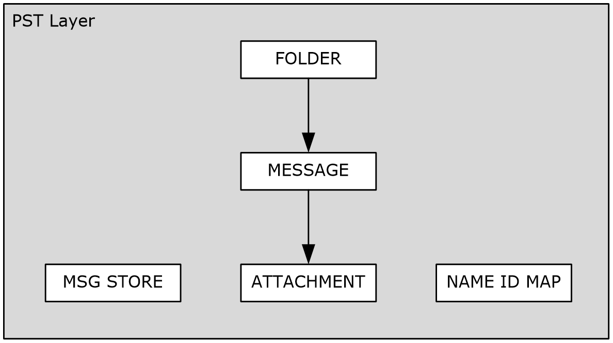

Figure 18: Messaging layer

The following sections describe the most common operations performed at
the Messaging layer, and specific implementation considerations.

1.  #### Message Store Operations

    1.  ##### Creating the Message Store

Creating the **message store**. This is identical to creating a PC
(section 2.6.2.3.1) with a special NID, and setting a minimal set of
properties (section 2.6.2.3.2).

<table>
<colgroup>
<col style="width: 19%" />
<col style="width: 80%" />
</colgroup>
<thead>
<tr class="header">
<th>Requirement level</th>
<th><strong>Actions</strong></th>
</tr>
</thead>
<tbody>
<tr class="odd">
<td>Required</td>
<td>
Identical to section 2.6.2.3.1 and 2.6.2.3.2.

NID MUST be NID_MESSAGE_STORE.

See minimal set of required properties in section 2.4.3.1.
</td>
</tr>
<tr class="even">
<td>Recommended</td>
<td>None.</td>
</tr>
<tr class="odd">
<td>Optional</td>
<td>None.</td>
</tr>
</tbody>
</table>

Possible side effects: See section 2.6.2.3.1 and 2.6.2.3.2.

Exactly one message store MUST exist in a PST file.

##### Modifying Properties of the Message Store

Modifying properties of the **message store**. This refers to the
adding, changing and deleting of properties to or from the message store
PC, which map directly to sections 2.6.2.3.2, 2.6.2.3.3 and 2.6.2.3.4.

<table>
<colgroup>
<col style="width: 19%" />
<col style="width: 80%" />
</colgroup>
<thead>
<tr class="header">
<th>Requirement level</th>
<th>Actions</th>
</tr>
</thead>
<tbody>
<tr class="odd">
<td>Required</td>
<td>
An existing message store (section 2.6.3.1.1).

See sections 2.6.2.3.2, 2.6.2.3.3 and 2.6.2.3.4, where
applicable.
</td>
</tr>
<tr class="even">
<td>Recommended</td>
<td>None.</td>
</tr>
<tr class="odd">
<td>Optional</td>
<td>None.</td>
</tr>
</tbody>
</table>

Possible side effects: See sections 2.6.2.3.2, 2.6.2.3.3 and 2.6.2.3.4,
where applicable.

2.  #### Folder Object Operations

    1.  ##### Creating a Folder Object

Creating a **Folder object**. This is equivalent to creating one PC with
a minimal set of properties, and three TCs.

<table>
<colgroup>
<col style="width: 19%" />
<col style="width: 80%" />
</colgroup>
<thead>
<tr class="header">
<th>Requirement level</th>
<th><strong>Actions</strong></th>
</tr>
</thead>
<tbody>
<tr class="odd">
<td>Required</td>
<td>
See sections 2.6.2.3.1, 2.6.2.4.1, 2.6.2.3.2.

All 4 entities (1 PC, 3 TCs) MUST exist to function properly.

All 4 entities MUST have the same <strong>nidIndex</strong>.

The PC MUST have NID_TYPE of NID_TYPE_NORMAL_FOLDER.

The 3 TCs MUST have <strong>nidType</strong> of
NID_TYPE_ASSOC_CONTENTS_TABLE, NID_TYPE_CONTENTS_TABLE and
NID_TYPE_HIERARCHY_TABLE.

See minimal set of required Folder object PC properties in section
2.4.4.1.1.

See minimal set of required columns for the Hierarchy TC in section
2.4.4.4.1.

See minimal set of required columns for the Contents TC in section
2.4.4.5.1.

See minimal set of required columns for the <strong>FAI contents
table</strong> TC in section 2.4.4.6.1.

MUST queue a properly-formatted SUD of type SUDT_FLD_ADD to the SMQ
(section 2.4.8.1).
</td>
</tr>
<tr class="even">
<td>Recommended</td>
<td>None.</td>
</tr>
<tr class="odd">
<td>Optional</td>
<td>None.</td>
</tr>
</tbody>
</table>

Possible side effects: See section 2.6.2.3.1, 2.6.2.4.1, and 2.6.2.3.2.

##### Modifying Properties of a Folder Object

Modifying properties of the **Folder object**. This refers to the
adding, changing and deleting of properties to/from the Folder object
PC, which map directly to section 2.6.2.3.2 2.6.2.3.3 and 2.6.2.3.4.

<table>
<colgroup>
<col style="width: 19%" />
<col style="width: 80%" />
</colgroup>
<thead>
<tr class="header">
<th>Requirement level</th>
<th>Actions</th>
</tr>
</thead>
<tbody>
<tr class="odd">
<td>Required</td>
<td>
An existing Folder object (section 2.5.2.2).

See sections 2.6.2.3.2, 2.6.2.3.3 and 2.6.2.3.4, where
applicable.

MUST queue a properly-formatted SUD of type SUDT_FLD_MOD to the SMQ
(section 2.4.8.1).
</td>
</tr>
<tr class="even">
<td>Recommended</td>
<td>None.</td>
</tr>
<tr class="odd">
<td>Optional</td>
<td>None.</td>
</tr>
</tbody>
</table>

Possible side effects: See sections 2.6.2.3.2, 2.6.2.3.3 and 2.6.2.3.4,
where applicable.

Some Folder object properties are also duplicated in the hierarchy TC of
the parent Folder object (See section 2.4.4.4.1). Implementations MUST
pay special attention to any properties that are duplicated elsewhere to
make sure all instances of the properties are properly updated.

Special calculated properties exist that do not map directly to
externally-published properties and therefore MUST be converted,
calculated or otherwise translated before persisting to or retrieving
from the PST. A list of such special properties is found in section 2.5.

##### Adding a Sub-Folder Object

Adding a sub-**Folder object** to an existing Folder object. This
involves creating a new Folder object, and then adding the new Folder
object to the existing parent Folder object's hierarchy. Creating a
Folder object is identical to section 2.6.3.2.1, and adding the new
Folder object to the parent means adding a new row (section 2.6.2.4.2)
to the Hierarchy TC of the parent Folder object. Also, some of the
properties in the parent Folder object (for example, folder count) need
to be updated (section 2.6.3.2.2).

<table>
<colgroup>
<col style="width: 19%" />
<col style="width: 80%" />
</colgroup>
<thead>
<tr class="header">
<th>Requirement level</th>
<th>Actions</th>
</tr>
</thead>
<tbody>
<tr class="odd">
<td>Required</td>
<td>
An existing parent Folder object (section 2.6.3.2.1).

See sections 2.6.3.2.1, 2.6.2.4.2.

<strong>nidParent</strong> of the new Folder object's NBT entry MUST
be set to the NID of the parent Folder object (section 2.2.2.7.7.4).

Parent properties MUST be updated to reflect new child Folder object
(section 2.6.3.2.2).

MUST queue a properly-formatted SUD of type SUDT_FLD_ADD for the
sub-Folder object to the SMQ (section 2.4.8.1).
</td>
</tr>
<tr class="even">
<td>Recommended</td>
<td>None.</td>
</tr>
<tr class="odd">
<td>Optional</td>
<td>None.</td>
</tr>
</tbody>
</table>

Possible side effects: See sections 2.6.3.2.1, 2.6.2.4.2 and 2.6.3.2.2.

##### Moving a Folder Object

Moving a **Folder object** refers to moving a child Folder object from
its parent Folder object to another Folder object. This involves
deleting the child Folder object row from the old parent's Hierarchy TC
(section 2.6.2.4.7), and adding it to the new parent's Hierarchy TC
(section 2.6.2.4.2). Also, some properties of both Folder object PCs
(for example, folder count) need to be updated (section 2.6.3.2.2.).

<table>
<colgroup>
<col style="width: 19%" />
<col style="width: 80%" />
</colgroup>
<thead>
<tr class="header">
<th>Requirement level</th>
<th>Actions</th>
</tr>
</thead>
<tbody>
<tr class="odd">
<td>Required</td>
<td>
An existing Folder object (section 2.6.3.2.1).

An existing new parent Folder object (section 2.6.3.2.1).

See sections 2.6.2.4.7, 2.6.2.4.2.

<strong>nidParent</strong> of the moved Folder object's NBT entry
MUST be set to the NID of the new parent Folder object (section
2.2.2.7.7.4).

Old and new parent Folder object properties MUST be updated
accordingly (section 2.6.3.2.2).

MUST queue a properly-formatted SUD of type SUDT_FLD_MOV to the SMQ
(section 2.4.8.1).
</td>
</tr>
<tr class="even">
<td>Recommended</td>
<td>None.</td>
</tr>
<tr class="odd">
<td>Optional</td>
<td>None.</td>
</tr>
</tbody>
</table>

Possible side effects: See sections 2.6.3.2.1, 2.6.2.4.7, 2.6.2.4.2 and
2.6.3.2.2.

##### Copying a Folder Object

Copying an existing **Folder object** to a new parent Folder object.
This involves creating a new Folder object PC for the new Folder object
and populating some properties (section 2.6.2.3.1 and 2.6.2.3.2),
followed by duplicating each of the 3 Folder object TC nodes of the
original Folder object to new top-level nodes for the new Folder object
(section 2.6.1.2.4). Also the new Folder object needs to be added to the
existing target Folder object hierarchy, which requires adding a new row
(section 2.6.2.4.2) to the Hierarchy TC of the target Folder object.
Also, some of the properties in the target Folder object (for example
folder count) need to be updated (section 2.6.3.2.2).

<table>
<colgroup>
<col style="width: 19%" />
<col style="width: 80%" />
</colgroup>
<thead>
<tr class="header">
<th>Requirement level</th>
<th>Actions</th>
</tr>
</thead>
<tbody>
<tr class="odd">
<td>Required</td>
<td>
An existing Folder object (section 2.6.3.2.1).

An existing target Folder object (section 2.6.3.2.1).

See sections 2.6.2.3.1, 2.6.2.3.2, 2.6.1.2.4 and 2.6.2.4.2.

See minimal set of required Folder object PC properties in
2.4.4.1.1.

<strong>nidParent</strong> of the new Folder object PC's NBT entry
MUST be set to the NID of the target Folder object (section
2.2.2.7.7.4).

Target Folder object properties MUST be updated accordingly (section
2.6.3.2.2).

MUST queue a properly-formatted SUD of type SUDT_FLD_ADD for the
copied Folder object to the SMQ (section 2.4.8.1).
</td>
</tr>
<tr class="even">
<td>Recommended</td>
<td>None.</td>
</tr>
<tr class="odd">
<td>Optional</td>
<td>None.</td>
</tr>
</tbody>
</table>

Possible side effects: See sections 2.6.3.2.1, 2.6.2.3.1, 2.6.2.3.2
2.6.1.2.4, 2.6.2.4.2, and 2.6.3.2.2.

The 3 TCs of the copied Folder object are single-instanced to the
original Folder object, which allows the Folder object copying process
to be efficient.

##### Adding a Message Object

Adding a **Message object** to an existing **Folder object**. This
involves creating a new Message object and adding it as a new row to the
Contents TC of the parent Folder object (section 2.6.2.4.2). Updating
the Message object count of the parent Folder object (section
2.6.2.3.3), which can have cascading effects to the parent-parent
Hierarchy TC as well. Creating a Message object involves creating a new
Message object PC (section 2.6.2.3.1), populating it with a minimal set
of required properties (section 2.6.2.3.2), and creating a Recipient TC
(section 2.6.2.4.1) in a subnode entry (section 2.6.1.2.2).

<table>
<colgroup>
<col style="width: 19%" />
<col style="width: 80%" />
</colgroup>
<thead>
<tr class="header">
<th>Requirement level</th>
<th>Actions</th>
</tr>
</thead>
<tbody>
<tr class="odd">
<td>Required</td>
<td>
An existing Folder object (section 2.6.3.2.1).

See sections 2.6.1.2.2, 2.6.2.3.1, 2.6.2.3.2, 2.6.2.3.3, 2.6.2.4.1
and 2.6.2.4.2.

See minimal set of required properties in section 2.4.5.1.1.

See minimal set of required columns for the Contents TC in
2.4.4.5.1.

See minimal set of required columns for the Recipients TC in section
2.4.5.3.1.

Parent Folder object properties MUST be updated accordingly.

MUST queue a properly-formatted SUD of type SUDT_MSG_ADD to the SMQ
(section 2.4.8.1).
</td>
</tr>
<tr class="even">
<td>Recommended</td>
<td>None.</td>
</tr>
<tr class="odd">
<td>Optional</td>
<td>None.</td>
</tr>
</tbody>
</table>

Possible side effects: See sections 2.6.3.2.1, 2.6.1.2.2, 2.6.2.3.1,
2.6.2.3.2, 2.6.2.3.3, 2.6.2.4.1 and 2.6.2.4.2.

##### Copying a Message Object

Copying a **Message object** from its parent **Folder object** to
another Folder object. To use single-instancing, this involves
duplicating the Message object PC node (section 2.6.1.2.4), and adding a
row to the Contents TC of the new parent Folder object (section
2.6.2.4.2). Some properties of the parent Folder object (for example,
message count) also need to be updated (section 2.6.2.3.2).

<table>
<colgroup>
<col style="width: 19%" />
<col style="width: 80%" />
</colgroup>
<thead>
<tr class="header">
<th>Requirement level</th>
<th><strong>Actions</strong></th>
</tr>
</thead>
<tbody>
<tr class="odd">
<td>Required</td>
<td>
An existing Message object (section 2.6.3.2.6).

An existing target Folder object (section 2.6.3.2.1).

See sections 2.6.1.2.4, 2.6.2.3.2, and 2.6.2.4.2.

See minimal set of required columns for the Contents TC in section
2.4.4.5.1.

<strong>nidParent</strong> of the copied Message object's NBT entry
MUST be set to the NID of the target Folder object (section
2.2.2.7.7.4).

Destination Folder object properties MUST be updated accordingly.

MUST queue a properly-formatted SUD of type SUDT_MSG_ADD for the
copied Message object to the SMQ (section 2.4.8.1).
</td>
</tr>
<tr class="even">
<td>Recommended</td>
<td>None.</td>
</tr>
<tr class="odd">
<td>Optional</td>
<td>None.</td>
</tr>
</tbody>
</table>

Possible side effects: See section 2.6.3.2.6, 2.6.3.2.1, 2.6.1.2.4,
2.6.2.3.2, and 2.6.2.4.2.

##### Moving a Message Object

Moving a **Message object** from its parent **Folder object** to another
Folder object. This involves deleting the Message object row from the
old parent's Contents TC (section 2.6.2.4.7), and adding it to the new
parent's Content TC (section 2.6.2.4.2). Also, some properties of both
Folder object PCs (for example, message count) need to be updated
(section 2.6.3.2.2).

<table>
<colgroup>
<col style="width: 19%" />
<col style="width: 80%" />
</colgroup>
<thead>
<tr class="header">
<th>Requirement level</th>
<th><strong>Actions</strong></th>
</tr>
</thead>
<tbody>
<tr class="odd">
<td>Required</td>
<td>
An existing Message object (section 2.6.3.2.6).

An existing new parent Folder object (section 2.6.3.2.1).

See sections 2.6.2.4.7, 2.6.2.4.2, and 2.6.3.2.2.

See minimal set of required columns for the Contents TC in section
2.4.4.5.1.

<strong>nidParent</strong> of the moved Message object's NBT entry
MUST be set to the NID of the new parent Folder object (section
2.2.2.7.7.4).

Old and new parent Folder object properties MUST be updated
accordingly.

MUST queue a properly-formatted SUD of type SUDT_MSG_MOV to the SMQ
(section 2.4.8.1).
</td>
</tr>
<tr class="even">
<td>Recommended</td>
<td>None.</td>
</tr>
<tr class="odd">
<td>Optional</td>
<td>None.</td>
</tr>
</tbody>
</table>

Possible side effects: See sections 2.6.3.2.6, 2.6.3.2.1, 2.6.2.4.2,
2.6.2.4.7 and 2.6.3.2.2.

##### Deleting a Sub-Folder Object

Deleting a sub-**Folder object** from its parent Folder object. This
involves deleting the sub-Folder object row from the Hierarchy TC of the
parent Folder object (section 2.6.2.4.7), updating some properties (for
example, folder count) of the parent Folder object (section 2.6.3.2.2),
and deleting the sub-Folder object. Deleting the sub-Folder object means
deleting the PC and three TCs associated with the sub-Folder object
(sections 2.6.2.3.5 and 2.6.2.4.8).

<table>
<colgroup>
<col style="width: 19%" />
<col style="width: 80%" />
</colgroup>
<thead>
<tr class="header">
<th>Requirement level</th>
<th>Actions</th>
</tr>
</thead>
<tbody>
<tr class="odd">
<td>Required</td>
<td>
An existing Folder object (section 2.6.3.2.1).

See sections 2.6.3.2.2, 2.6.2.3.5, 2.6.2.4.8 and 2.6.2.4.7.

Parent Folder object properties MUST be updated accordingly.

MUST queue a properly-formatted SUD of type SUDT_FLD_DEL to the SMQ
(section 2.4.8.1).
</td>
</tr>
<tr class="even">
<td>Recommended</td>
<td>None.</td>
</tr>
<tr class="odd">
<td>Optional</td>
<td>None.</td>
</tr>
</tbody>
</table>

Possible side effects: See section 2.6.3.2.1, 2.6.3.2.2, 2.6.2.3.5,
2.6.2.4.8 and 2.6.2.4.7.

Any Folder object can be deleted by first looking up its parent, and
then deleting the Folder object as a sub-Folder object of its parent.
There is a ROOT Folder object in the PST that cannot be deleted;
therefore, a parent Folder object MUST exist for any Folder object that
can be deleted.

If the sub-Folder object contains **Message objects** or has a
sub-hierarchy, then its child Folder objects and Message objects MUST be
recursively deleted before the sub-Folder object itself can be deleted.

##### Deleting a Message Object

Deleting an existing **Message object** from its parent **Folder
object**. This involves deleting the Message object row from the
Contents TC of the parent Folder object (section 2.6.2.4.7), updating
some properties (for example, message count) of the parent Folder object
(section 2.6.3.2.2), and deleting the Message object PC node (section
2.6.2.3.5).

<table>
<colgroup>
<col style="width: 19%" />
<col style="width: 80%" />
</colgroup>
<thead>
<tr class="header">
<th>Requirement level</th>
<th><strong>Actions</strong></th>
</tr>
</thead>
<tbody>
<tr class="odd">
<td>Required</td>
<td>
An existing Message object (section 2.6.3.2.6).

See sections 2.6.3.2.2, 2.6.2.3.5, and 2.6.2.4.7.

Parent Folder object properties MUST be updated accordingly.

MUST queue a properly-formatted SUD of type SUDT_MSG_DEL to the SMQ
(section 2.4.8.1).
</td>
</tr>
<tr class="even">
<td>Recommended</td>
<td>None.</td>
</tr>
<tr class="odd">
<td>Optional</td>
<td>None.</td>
</tr>
</tbody>
</table>

Possible side effects: See section 2.6.3.2.6, 2.6.3.2.2, 2.6.2.3.5 and
2.6.2.4.7.

3.  #### Message Object Operations

    1.  ##### Creating a Message Object

Creating a **Message object** in an existing **Folder object**. This is
identical to section 2.6.3.2.6.

##### Modifying Properties of a Message Object

Modifying properties of a **Message object**. This refers to the adding,
changing and deleting of properties to/from the Message object PC, which
map directly to sections 2.6.2.3.2, 2.6.2.3.3 and 2.6.2.3.4.

<table>
<colgroup>
<col style="width: 19%" />
<col style="width: 80%" />
</colgroup>
<thead>
<tr class="header">
<th>Requirement level</th>
<th><strong>Actions</strong></th>
</tr>
</thead>
<tbody>
<tr class="odd">
<td>Required</td>
<td>
An existing Message object (section 2.6.3.2.6).

See requirements for sections 2.6.2.3.2, 2.6.2.3.3 and 2.6.2.3.4,
where applicable.

MUST queue a properly-formatted SUD of type SUDT_MSG_MOD to the SMQ
(section 2.4.8.1).

If any of the modified properties also affect the cached properties
in the Contents TC of the parent <strong>Folder object</strong>, a
properly-formatted SUD of type SUDT_MSG_ROW_MOD MUST also be
queued.
</td>
</tr>
<tr class="even">
<td>Recommended</td>
<td>None.</td>
</tr>
<tr class="odd">
<td>Optional</td>
<td>None.</td>
</tr>
</tbody>
</table>

Possible side effects: See sections 2.6.3.2.6, 2.6.2.3.2, 2.6.2.3.3 and
2.6.2.3.4, where applicable.

Some Message object properties are also duplicated in the Contents TC of
the parent Folder object (section 2.4.4.5.1). Implementations MUST pay
special attention to any properties that are duplicated elsewhere to
make sure all instances of the properties are properly updated.

Special calculated properties exist that do not map directly to
externally-published properties and therefore MUST be converted,
calculated or otherwise translated before persisting to or retrieving
from the PST. A list of such special properties is found in section 2.5.

##### Adding a Recipient

Adding a recipient to an existing **Message object**. This involves
adding a row to the Recipient TC of the Message object (section
2.6.2.4.2), and updating some properties (for example, recipient count)
in the Message object PC (section 2.6.3.3.2).

<table>
<colgroup>
<col style="width: 19%" />
<col style="width: 80%" />
</colgroup>
<thead>
<tr class="header">
<th>Requirement level</th>
<th><strong>Actions</strong></th>
</tr>
</thead>
<tbody>
<tr class="odd">
<td>Required</td>
<td>
An existing Message object (section 2.6.3.2.6).

See sections 2.6.3.3.2 and 2.6.2.4.2.

See minimal set of required columns for the Recipients TC in section
2.4.5.3.1.

The Message object properties MUST be updated.

MUST queue a properly-formatted SUD of type SUDT_MSG_MOD to the SMQ
(section 2.4.8.1).
</td>
</tr>
<tr class="even">
<td>Recommended</td>
<td>None.</td>
</tr>
<tr class="odd">
<td>Optional</td>
<td>None.</td>
</tr>
</tbody>
</table>

Possible side effects: See sections 2.6.3.2.6, 2.6.3.3.2 and 2.6.2.4.2.

##### Modifying Recipient Properties

Modifying the properties of an existing recipient. This is identical to
modifying Content of a Table Row (section 2.6.2.4.3) or Deleting the
value of a Column (section 2.6.2.4.5).

<table>
<colgroup>
<col style="width: 19%" />
<col style="width: 80%" />
</colgroup>
<thead>
<tr class="header">
<th>Requirement level</th>
<th><strong>Actions</strong></th>
</tr>
</thead>
<tbody>
<tr class="odd">
<td>Required</td>
<td>
An existing <strong>Message object</strong> (section
2.6.3.2.6).

See section 2.6.2.4.3 and 2.6.2.4.5.

MUST queue a properly-formatted SUD of type SUDT_MSG_MOD to the SMQ
(section 2.4.8.1).
</td>
</tr>
<tr class="even">
<td>Recommended</td>
<td>None.</td>
</tr>
<tr class="odd">
<td>Optional</td>
<td>None.</td>
</tr>
</tbody>
</table>

Possible side effects: See sections 2.6.3.2.6, 2.6.2.4.3 and 2.6.2.4.5.

##### Adding an Attachment Object

Adding an **Attachment object** to a **Message object**. This involves
creating an Attachments TC in a subnode entry if it does not already
exist (sections 2.6.1.2.2 and 2.6.2.4.1), creating an Attachment object
PC (section 2.6.2.3.1) and adding it as a new row to the Attachments TC
(section 2.6.2.4.2), and updating some properties (for example,
attachment count) in the Message object PC (section 2.6.3.3.2).

<table>
<colgroup>
<col style="width: 19%" />
<col style="width: 80%" />
</colgroup>
<thead>
<tr class="header">
<th>Requirement level</th>
<th><strong>Actions</strong></th>
</tr>
</thead>
<tbody>
<tr class="odd">
<td>Required</td>
<td>
An existing Message object (section 2.6.3.2.6).

See sections 2.6.1.2.2, 2.6.2.3.1, 2.6.3.3.2, 2.6.2.4.1 and
2.6.2.4.2.

See minimal set of required columns for the Attachments TC in section
2.4.6.1.1.

See minimal set of required properties for the Attachment object PC
in section 2.4.6.2.1.

The Message object properties MUST be updated.

MUST queue a properly-formatted SUD of type SUDT_MSG_MOD to the SMQ
(section 2.4.8.1).
</td>
</tr>
<tr class="even">
<td>Recommended</td>
<td>None.</td>
</tr>
<tr class="odd">
<td>Optional</td>
<td>None.</td>
</tr>
</tbody>
</table>

Possible side effects: See sections 2.6.3.2.6, 2.6.1.2.2, 2.6.2.3.1,
2.6.3.3.2, 2.6.2.4.1 and 2.6.2.4.2.

Attachment objects are optional and the Attachments TC is not created
until the first Attachment object is added to a Message object.

##### Modifying Properties of an Attachment Object

Modifying properties of an **Attachment object**. This refers to the
adding, changing and deleting of properties to/from the Attachment
object PC, which map directly to sections 2.6.2.3.2, 2.6.2.3.3, and
2.6.2.3.4.

<table>
<colgroup>
<col style="width: 19%" />
<col style="width: 80%" />
</colgroup>
<thead>
<tr class="header">
<th>Requirement level</th>
<th>Actions</th>
</tr>
</thead>
<tbody>
<tr class="odd">
<td>Required</td>
<td>
An existing Attachment object (section 2.6.3.3.5).

See sections 2.6.2.3.2, 2.6.2.3.3, and 2.6.2.3.4, where
applicable.

MUST queue a properly-formatted SUD of type SUDT_MSG_MOD to the SMQ
(section 2.4.8.1).
</td>
</tr>
<tr class="even">
<td>Recommended</td>
<td>None.</td>
</tr>
<tr class="odd">
<td>Optional</td>
<td>None.</td>
</tr>
</tbody>
</table>

Possible side effects: See sections 2.6.3.3.5, 2.6.2.3.2, 2.6.2.3.3, and
2.6.2.3.4, where applicable.

Some Attachment object properties are also duplicated in the Attachments
TC (section 2.4.6.1.1). Implementations MUST pay special attention to
any properties that are duplicated elsewhere to make sure all instances
of the properties are properly updated.

##### Deleting a Recipient

Deleting an existing recipient from a **Message object**. This involves
deleting the corresponding row in the Recipients TC (section 2.6.2.4.7)
and updating some properties (for example, recipient count) in the
Message object PC (section 2.6.3.3.2).

<table>
<colgroup>
<col style="width: 19%" />
<col style="width: 80%" />
</colgroup>
<thead>
<tr class="header">
<th>Requirement level</th>
<th><strong>Actions</strong></th>
</tr>
</thead>
<tbody>
<tr class="odd">
<td>Required</td>
<td>
An existing Recipient (section 2.6.3.3.3).

See sections 2.6.2.4.7 and 2.6.3.3.2.

The Message object properties MUST be updated.

MUST queue a properly-formatted SUD of type SUDT_MSG_MOD to the SMQ
(section 2.4.8.1).
</td>
</tr>
<tr class="even">
<td>Recommended</td>
<td>None.</td>
</tr>
<tr class="odd">
<td>Optional</td>
<td>None.</td>
</tr>
</tbody>
</table>

Possible side effects: See sections 2.6.3.3.3, 2.6.3.3.2 and 2.6.2.4.7.

##### Deleting an Attachment Object

Deleting an existing **Attachment object** from a **Message object**.
This involves deleting the Attachment object PC (section 2.6.2.3.5) and
its corresponding row in the Attachments TC (section 2.6.2.4.7) and
updating some properties (for example, attachment count) in the Message
object PC (section 2.6.3.3.2).

<table>
<colgroup>
<col style="width: 19%" />
<col style="width: 80%" />
</colgroup>
<thead>
<tr class="header">
<th>Requirement level</th>
<th><strong>Actions</strong></th>
</tr>
</thead>
<tbody>
<tr class="odd">
<td>Required</td>
<td>
An existing Attachment object (section 2.6.3.3.5).

See sections 2.6.3.3.2 and 2.6.2.4.7.

The Message object properties MUST be updated.

MUST queue a properly-formatted SUD of type SUDT_MSG_MOD to the SMQ
(section 2.4.8.1).
</td>
</tr>
<tr class="even">
<td>Recommended</td>
<td>None.</td>
</tr>
<tr class="odd">
<td>Optional</td>
<td>None.</td>
</tr>
</tbody>
</table>

Possible side effects: See sections 2.6.3.3.5, 2.6.3.3.2 and 2.6.2.4.7.

4.  #### Name-to-ID Map Operations

    1.  ##### Creating the Name-to-ID Map

Creating the Name-to-ID Map. This involves creating a PC with a special
NID (section 2.6.2.3.1), with one special property (section 2.6.2.3.2).

<table>
<colgroup>
<col style="width: 19%" />
<col style="width: 80%" />
</colgroup>
<thead>
<tr class="header">
<th>Requirement level</th>
<th><strong>Actions</strong></th>
</tr>
</thead>
<tbody>
<tr class="odd">
<td>Required</td>
<td>
See sections 2.6.2.3.1 and 2.6.2.3.2.

<strong>PidTagNameidBucketCount</strong> MUST be added to the PC with
a value of 251 (0xFB)
</td>
</tr>
<tr class="even">
<td>Recommended</td>
<td>None</td>
</tr>
<tr class="odd">
<td>Optional</td>
<td>None</td>
</tr>
</tbody>
</table>

Possible side effects: See sections 2.6.2.3.1 and 2.6.2.3.2.

The Name-to-ID Map MUST exist.

##### Adding a Named Property

Adding a **named property** to the Name-to-ID Map. This involves adding
or modifying the **PidTagNameidStreamEntry** property, adding or
modifying the **PidTagNameidStreamString** or **PidTagNameidStreamGuid**
properties depending on named property type, and finally adding or
modifying the corresponding hash bucket properties (sections 2.6.2.3.2,
2.6.2.3.3).

<table>
<colgroup>
<col style="width: 19%" />
<col style="width: 80%" />
</colgroup>
<thead>
<tr class="header">
<th>Requirement level</th>
<th>Actions</th>
</tr>
</thead>
<tbody>
<tr class="odd">
<td>Required</td>
<td>
An existing Name-to-ID Map (section 2.6.3.4.1).

See sections 2.6.2.3.2 and 2.6.2.3.3.
</td>
</tr>
<tr class="even">
<td>Recommended</td>
<td>None.</td>
</tr>
<tr class="odd">
<td>Optional</td>
<td>None.</td>
</tr>
</tbody>
</table>

Possible side effects: See sections 2.6.3.4.1, 2.6.2.3.2 and 2.6.2.3.3.

##### Deleting a Named Property

Deleting a **named property** from the Name-to-ID Map.

Implementations SHOULD NOT remove named properties from the Name-to-ID
Map.

## Minimum PST Requirements

This section covers the specific requirement for a PST. While the
previous sections have provided detailed technical requirements of how
to create and maintain a structurally-correct PST file, the following
sections cover the additional requirements on the actual contents of the
PST.

The essential elements of a minimal working PST file are visually
represented in the following diagram.
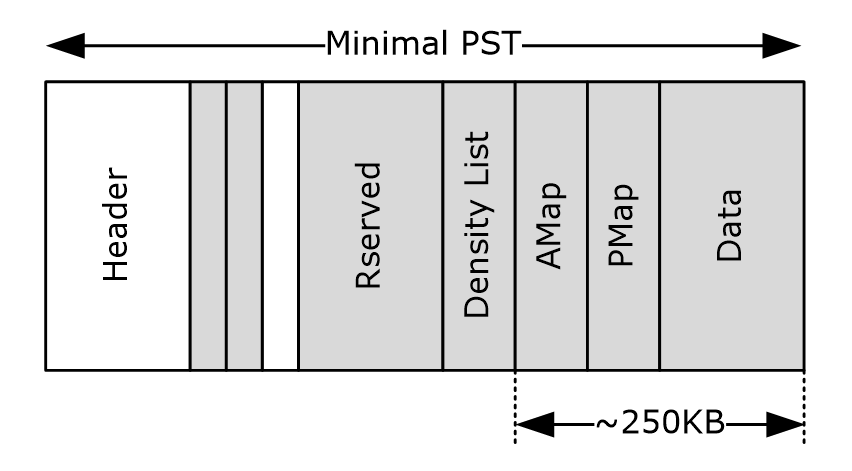

Figure 19: Minimal PST

### Mandatory Nodes

The following table lists the absolute minimum list of nodes that MUST
be present in a PST. Implementations SHOULD consider the PST invalid if
any of the nodes are missing or are incorrectly formed. The NIDs in bold
are fixed NID values, where the others are sample NIDs that can be any
valid NID value for its respective NID_TYPE.

| NID    | NID_TYPE                       | Special NID (if applicable)        | Object | Minimal state |
|--------|--------------------------------|------------------------------------|--------|---------------|
| 0x0021 | NID_TYPE_INTERNAL              | NID_MESSAGE_STORE                  | PC     | Schema Props  |
| 0x0061 | NID_TYPE_INTERNAL              | NID_NAME_TO_ID_MAP                 | PC     | Empty         |
| 0x0122 | NID_TYPE_NORMAL_FOLDER         | NID_ROOT_FOLDER                    | PC     | Schema Props  |
| 0x012D | NID_TYPE_HIERARCHY_TABLE       | \<Root **Folder object**\>         | TC     | 2 Rows        |
| 0x012E | NID_TYPE_CONTENTS_TABLE        | \<Root Folder object\>             | TC     | Columns Only  |
| 0x012F | NID_TYPE_ASSOC_CONTENTS_TABLE  | \<Root Folder object\>             | TC     | Columns Only  |
| 0x01E1 | NID_TYPE_INTERNAL              | NID_SEARCH_MANAGEMENT_QUEUE        | node   |               |
| 0x0201 | NID_TYPE_INTERNAL              | NID_SEARCH_ACTIVITY_LIST           | node   | Empty         |
| 0x060D | NID_TYPE_HIERRCHY_TABLE        | NID_HIERARCHY_TABLE_TEMPLATE       | TC     | Columns Only  |
| 0x060E | NID_TYPE_CONTENTS_TABLE        | NID_CONTENTS_TABLE_TEMPLATE        | TC     | Columns Only  |
| 0x060F | NID_TYPE_ASSOC_CONTENTS_TABLE  | NID_ASSOC_CONTENTS_TABLE_TEMPLATE  | TC     | Columns Only  |
| 0x0610 | NID_TYPE_SEARCH_CONTENTS_TABLE | NID_SEARCH_CONTENTS_TABLE_TEMPLATE | TC     | Columns Only  |
| 0x0692 | NID_TYPE_RECIPIENT_TABLE       | NID_RECIPIENT_TABLE                | TC     | Columns Only  |
| 0x0671 | NID_TYPE_ATTACHMENT_TABLE      | NID_ATTACHMENT_TABLE               | TC     | Columns Only  |
| 0x2223 | NID_TYPE_SEARCH_FOLDER         | \<Spam search Folder object\>      | PC     | Columns Only  |
| 0x8022 | NID_TYPE_NORMAL_FOLDER         | \<IPM SuBTree\>                    | PC     | Schema Props  |
| 0x802D | NID_TYPE_HIERARCHY_TABLE       | \<IPM SuBTree\>                    | TC     | 2 Rows        |
| 0x802E | NID_TYPE_CONTENTS_TABLE        | \<IPM SuBTree\>                    | TC     | Columns Only  |
| 0x802F | NID_TYPE_ASSOC_CONTENTS_TABLE  | \<IPM SuBTree\>                    | TC     | Columns Only  |
| 0x8042 | NID_TYPE_NORMAL_FOLDER         | \<Search Folder objects\>          | PC     | Schema Props  |
| 0x804D | NID_TYPE_HIERARCHY_TABLE       | \<Search Folder objects\>          | TC     | Columns Only  |
| 0x804E | NID_TYPE_CONTENTS_TABLE        | \<Search Folder objects\>          | TC     | Columns Only  |
| 0x804F | NID_TYPE_ASSOC_CONTENTS_TABLE  | \<Search Folder objects\>          | TC     | Columns Only  |
| 0x8062 | NID_TYPE_NORMAL_FOLDER         | \<Deleted Items\>                  | PC     | Schema Props  |
| 0x806D | NID_TYPE_HIERARCHY_TABLE       | \<Deleted Items\>                  | TC     | Columns Only  |
| 0x806E | NID_TYPE_CONTENTS_TABLE        | \<Deleted Items\>                  | TC     | Columns Only  |
| 0x806F | NID_TYPE_ASSOC_CONTENTS_TABLE  | \<Deleted Items\>                  | TC     | Columns Only  |

### Minimum Folder Hierarchy

The following is the minimum folder hierarchy required for a PST:

- Root Folder (section 2.7.3.4.1)

  - Top of Personal Folders (IPM SuBTree) (section 2.7.3.4.2)

    - Deleted Items (section 2.7.3.4.5)

  - Search Root (section 2.7.3.4.3)

  - Spam search Folder (section 2.7.3.4.4)

    1.  ### Minimum Object Requirements

This section presents the minimum requirements for a PST, which include
the mandatory nodes as well as the minimum set of properties that is
required for each type of PST Object.

#### Message Store

See section 2.4.3.1 for the minimum requirements of the **message
store**.

#### Name-to-ID Map

The minimum requirement for the Name-to-ID Map is a PC node with a
single property **PidTagNameidBucketCount** set to a value of 251
(0xFB). Refer to section 2.4.7 for details.

#### Template Objects

The following template Objects MUST be present in the PST. Each template
object is a TC with a pre-defined set of columns, but no data rows.

- **NID_HIERARCHY_TABLE_TEMPLATE:** See section 2.4.4.4.1 for column
  list.

<!-- -->

- **NID_CONTENTS_TABLE_TEMPLATE:** See section 2.4.4.5.1 for column
  list.

<!-- -->

- **NID_ASSOC_CONTENTS_TABLE_TEMPLATE:** See section 2.4.4.6.1 for
  column list.

<!-- -->

- **NID_SEARCH_CONTENTS_TABLE_TEMPLATE:** See section 2.4.8.6.2.1 for
  column list.

<!-- -->

- **NID_RECIPIENT_TABLE:** See section 2.4.5.3.1 for column list.

<!-- -->

- **NID_ATTACHMENT_TABLE:** See section 2.4.6.1.1 for column list.

  1.  #### Folders

      1.  ##### Root Folder

**Folder object** PC – nidParent = self; Schema properties initialized
as follows.

| Property identifier | Property type     | Friendly name                | Value             |
|---------------------|-------------------|------------------------------|-------------------|
| 0x3001              | **PtypString**    | **PidTagDisplayName**        | "" (empty string) |
| 0x3602              | **PtypInteger32** | **PidTagContentCount**       | 3                 |
| 0x3603              | **PtypInteger32** | **PidTagContentUnreadCount** | 0                 |
| 0x360A              | **PtypBoolean**   | **PidTagSubfolders**         | 1 (**true**)      |

**Hierarchy TC:** Columns from section 2.4.4.4.1; 3 rows: "IPM SuBTree",
"Search Root" and "Spam Search Folder"

**Contents TC:** Columns from section 2.4.4.5.1; no rows.

**FAI contents table TC:** Columns from section 2.4.4.6.1; no rows.

##### Top of Personal Folders (IPM SuBTree)

**Folder object** PC – nidParent = Root Folder; Schema properties
initialized as follows.

| Property identifier | Property type     | Friendly name                | Value                   |
|---------------------|-------------------|------------------------------|-------------------------|
| 0x3001              | **PtypString**    | **PidTagDisplayName**        | Top of Personal Folders |
| 0x3602              | **PtypInteger32** | **PidTagContentCount**       | 1                       |
| 0x3603              | **PtypInteger32** | **PidTagContentUnreadCount** | 0                       |
| 0x360A              | **PtypBoolean**   | **PidTagSubfolders**         | 1 (**true**)            |

**Hierarchy TC:** Columns from section 2.4.4.4.1; 1 row: "Deleted Items"

**Contents TC:** Columns from section 2.4.4.5.1; no rows.

**FAI contents table TC:** Columns from section 2.4.4.6.1; no rows.

##### Search Root

**Folder object** PC – nidParent = Root Folder; Schema properties
initialized as follows.

| Property identifier | Property type     | Friendly name                | Value         |
|---------------------|-------------------|------------------------------|---------------|
| 0x3001              | **PtypString**    | **PidTagDisplayName**        | Search Root   |
| 0x3602              | **PtypInteger32** | **PidTagContentCount**       | 0             |
| 0x3603              | **PtypInteger32** | **PidTagContentUnreadCount** | 0             |
| 0x360A              | **PtypBoolean**   | **PidTagSubfolders**         | 0 (**FALSE**) |

**Hierarchy TC:** Columns from section 2.4.4.4.1; no rows.

**Contents TC:** Columns from section 2.4.4.5.1; no rows.

**FAI contents table TC:** Columns from section 2.4.4.6.1; no rows.

##### Spam Search Folder

**Folder object** PC – nidParent = Root Folder; Schema properties
initialized as follows.

| Property identifier | Property type     | Friendly name                | Value                |
|---------------------|-------------------|------------------------------|----------------------|
| 0x3001              | **PtypString**    | **PidTagDisplayName**        | SPAM Search Folder 2 |
| 0x3602              | **PtypInteger32** | **PidTagContentCount**       | 0                    |
| 0x3603              | **PtypInteger32** | **PidTagContentUnreadCount** | 0                    |
| 0x360A              | **PtypBoolean**   | **PidTagSubfolders**         | 0 (**false**)        |

**Hierarchy TC:** Columns from section 2.4.4.4.1; no rows.

**Contents TC:** Columns from section 2.4.4.5.1; no rows.

**FAI contents table TC:** Columns from section 2.4.4.6.1; no rows.

##### Deleted Items

**Folder object** PC – nidParent = IPM SuBTree; Schema properties
initialized as follows:

| Property identifier | Property type     | Friendly name                | Value         |
|---------------------|-------------------|------------------------------|---------------|
| 0x3001              | **PtypString**    | **PidTagDisplayName**        | Deleted Items |
| 0x3602              | **PtypInteger32** | **PidTagContentCount**       | 0             |
| 0x3603              | **PtypInteger32** | **PidTagContentUnreadCount** | 0             |
| 0x360A              | **PtypBoolean**   | **PidTagSubfolders**         | 0 (**false**) |

**Hierarchy TC:** Columns from section 2.4.4.4.1; no rows.

**Contents TC:** Columns from section 2.4.4.5.1; no rows.

**FAI contents table TC:** Columns from section 2.4.4.6.1; no rows.

#### Search-Related Objects

**Search Management Queue:** see section 2.4.8.4.1 for details. An empty
queue node MUST be created for the minimal PST.

**Search Activity List:** See section 2.4.8.4.2 for details. An empty
SAL node MUST be created for the minimal PST.

3.  # Structure Examples

    1.  ## Sample Node Database (NDB)

The following is a sample illustration of how various pages and blocks
are used to represent various entities of the NDB Layer.

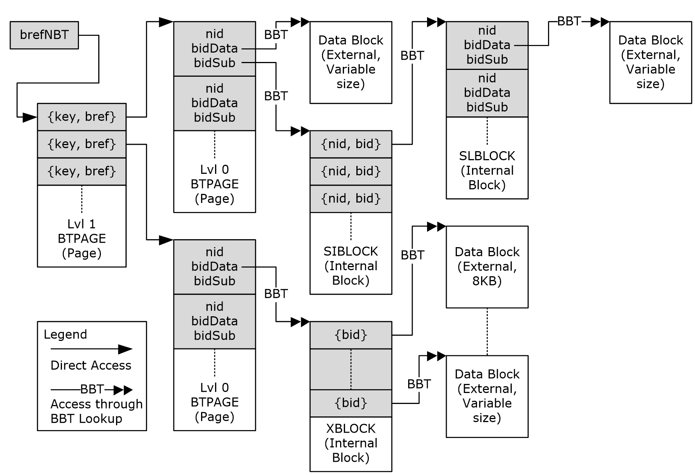

Figure 20: Application of pages and blocks

The first and second columns of the diagram represent the NBT, which is
accessed through the **BREFNBT** structure in the ROOT structure. In
this example, the NBT consists of a 2-level BTree that contains a number
of top-level nodes. In the second column, the node on the top contains
both a data BID (**bidData**) and a subnode BID (**bidSub**), whereas
the node on the bottom only contains a data BID but no subnode.

In the Legend, that there are two types of arrow notations. The single
arrowhead indicates data that can be directly accessed by means of a
**BREF** structure (which contains the absolute file offset of the
target); and the double-arrowhead with "BBT" indicates data that needs
to be accessed indirectly using a BBT search to lookup the data block
that is associated with the BID.

The top node's **bidData** points directly to a data block, which
contains the external, end-user data associated with this node.

In addition, the top node also contains a subnode, which points to a
2-level subnode BTree. The Level 1 SIBLOCK fans out to a number of
different Level 0 SLBLOCKs (only one is shown in the diagram for
simplicity). Each SLBLOCK further contains a number of internal subnodes
(4th column). In this example, the internal subnode points to
a single data block (5th column). The subnode can recursively
contain any number of levels of subnodes to create a hierarchical tree
of subnodes.

The second top-level node (bottom node in 2nd column) is an
example of a data tree with one XBLOCK, which contains an array of BIDs
that point to several data blocks that contains the end-user data.

## Sample Header

The following is a sample binary dump of a Unicode PST File header
(section 2.2.2.6), followed by the corresponding annotated, parsed
contents.

3.  

4.  0000000000000000 21 42 44 4E 0E A9 9A 37-53 4D 17 00 13 00 01 01
    \*!BDN...7SM......\*

5.  0000000000000010 5C 07 00 00 D0 7B 99 0B-04 00 00 00 01 00 00 00
    \*\\....{..........\*

6.  0000000000000020 54 02 00 00 00 00 00 00-45 00 00 00 00 04 00 00
    \*T.......E.......\*

7.  0000000000000030 00 04 00 00 04 04 00 00-00 40 00 00 02 00 01 00
    \*.........@......\*

8.  0000000000000040 04 04 00 00 00 04 00 00-00 04 00 00 00 80 00 00
    \*................\*

9.  0000000000000050 00 04 00 00 00 04 00 00-00 04 00 00 00 04 00 00
    \*................\*

10. 0000000000000060 04 04 00 00 04 04 00 00-04 04 00 00 00 04 00 00
    \*................\*

11. 0000000000000070 00 04 00 00 00 04 00 00-00 04 00 00 00 04 00 00
    \*................\*

12. 0000000000000080 00 04 00 00 00 04 00 00-00 04 00 00 00 04 00 00
    \*................\*

13. 0000000000000090 00 04 00 00 00 04 00 00-00 04 00 00 00 04 00 00
    \*................\*

14. 00000000000000A0 00 04 00 00 00 04 00 00-0F 04 00 00 00 00 00 00
    \*................\*

15. 00000000000000B0 00 00 00 00 00 00 00 00-00 24 9F 00 00 00 00 00
    \*.........\$......\*

16. 00000000000000C0 00 44 9B 00 00 00 00 00-40 F2 12 00 00 00 00 00
    \*.D......@.......\*

17. 00000000000000D0 00 00 00 00 00 00 00 00-4B 02 00 00 00 00 00 00
    \*........K.......\*

18. 00000000000000E0 00 52 90 00 00 00 00 00-53 02 00 00 00 00 00 00
    \*.R......S.......\*

19. 00000000000000F0 00 0A 90 00 00 00 00 00-02 00 00 00 00 00 00 00
    \*................\*

20. 0000000000000100 FF FF FF FF FF FF FF FF-FF FF FF FF FF FF FF FF
    \*................\*

21. 0000000000000110 FF FF FF FF FF FF FF FF-FF FF FF FF FF FF FF FF
    \*................\*

22. 0000000000000120 FF FF FF FF FF FF FF FF-FF FF FF FF FF FF FF FF
    \*................\*

23. 0000000000000130 FF FF FF FF FF FF FF FF-FF FF FF FF FF FF FF FF
    \*................\*

24. 0000000000000140 FF FF FF FF FF FF FF FF-FF FF FF FF FF FF FF FF
    \*................\*

25. 0000000000000150 FF FF FF FF FF FF FF FF-FF FF FF FF FF FF FF FF
    \*................\*

26. 0000000000000160 FF FF FF FF FF FF FF FF-FF FF FF FF FF FF FF FF
    \*................\*

27. 0000000000000170 FF FF FF FF FF FF FF FF-FF FF FF FF FF FF FF FF
    \*................\*

28. 0000000000000180 FF FF FF FF FF FF FF FF-FF FF FF FF FF FF FF FF
    \*................\*

29. 0000000000000190 FF FF FF FF FF FF FF FF-FF FF FF FF FF FF FF FF
    \*................\*

30. 00000000000001A0 FF FF FF FF FF FF FF FF-FF FF FF FF FF FF FF FF
    \*................\*

31. 00000000000001B0 FF FF FF FF FF FF FF FF-FF FF FF FF FF FF FF FF
    \*................\*

32. 00000000000001C0 FF FF FF FF FF FF FF FF-FF FF FF FF FF FF FF FF
    \*................\*

33. 00000000000001D0 FF FF FF FF FF FF FF FF-FF FF FF FF FF FF FF FF
    \*................\*

34. 00000000000001E0 FF FF FF FF FF FF FF FF-FF FF FF FF FF FF FF FF
    \*................\*

35. 00000000000001F0 FF FF FF FF FF FF FF FF-FF FF FF FF FF FF FF FF
    \*................\*

36. 0000000000000200 80 01 00 00 34 14 00 00-00 00 00 00 D6 83 D2 1F
    \*....4...........\*

37. 

38. Structure Header:

39. dwMagic DWORD 0x4e444221 (1313096225)

40. dwCRCPartial DWORD 0x379aa90e (932882702)

41. wMagicClient WORD 0x4d53 (19795)

42. wVer WORD 0x0017 (23)

43. wVerClient WORD 0x0013 (19)

44. bPlatformCreate byte 0x01 (1)

45. bPlatformAccess byte 0x01 (1)

46. dwReserved1 DWORD 0x0000075c (1884)

47. dwReserved2 DWORD 0x0b997bd0 (194608080)

48. bidUnused BID 0x0000000100000004 (4294967300)

49. bidNextP BID 0x0000000000000254 (596)

50. dwUnique DWORD 0x00000045 (69)

51. rgnid\[\] **PtypMultipleInteger32** 32 Element(s)

52. rgnid\[0\] 0x00000400 (1024)

53. rgnid\[1\] 0x00000400 (1024)

54. rgnid\[2\] 0x00000404 (1028)

55. rgnid\[3\] 0x00004000 (16384)

56. rgnid\[4\] 0x00010002 (65538)

57. rgnid\[5\] 0x00000404 (1028)

58. rgnid\[6\] 0x00000400 (1024)

59. rgnid\[7\] 0x00000400 (1024)

60. rgnid\[8\] 0x00008000 (32768)

61. rgnid\[9\] 0x00000400 (1024)

62. rgnid\[10\] 0x00000400 (1024)

63. rgnid\[11\] 0x00000400 (1024)

64. rgnid\[12\] 0x00000400 (1024)

65. rgnid\[13\] 0x00000404 (1028)

66. rgnid\[14\] 0x00000404 (1028)

67. rgnid\[15\] 0x00000404 (1028)

68. rgnid\[16\] 0x00000400 (1024)

69. rgnid\[17\] 0x00000400 (1024)

70. rgnid\[18\] 0x00000400 (1024)

71. rgnid\[19\] 0x00000400 (1024)

72. rgnid\[20\] 0x00000400 (1024)

73. rgnid\[21\] 0x00000400 (1024)

74. rgnid\[22\] 0x00000400 (1024)

75. rgnid\[23\] 0x00000400 (1024)

76. rgnid\[24\] 0x00000400 (1024)

77. rgnid\[25\] 0x00000400 (1024)

78. rgnid\[26\] 0x00000400 (1024)

79. rgnid\[27\] 0x00000400 (1024)

80. rgnid\[28\] 0x00000400 (1024)

81. rgnid\[29\] 0x00000400 (1024)

82. rgnid\[30\] 0x00000400 (1024)

83. rgnid\[31\] 0x0000040f (1039)

84. qwUnused QWORD 0x0000000000000000 (0)

85. Structure root:

86. dwReserved ULONG 0x00000000 (0)

87. ibFileEof IB 0x00000000009f2400 (10429440)

88. ibAMapLast IB 0x00000000009b4400 (10175488)

89. cbAMapFree CB 0x000000000012f240 (1241664)

90. cbPMapFree CB 0x0000000000000000 (0)

91. Structure **BREF**NBT:

92. bid BID 0x000000000000024b (587)

93. ib IB 0x0000000000905200 (9458176)

94. Structure **BREF**BBT:

95. bid BID 0x0000000000000253 (595)

96. ib IB 0x0000000000900a00 (9439744)

97. fAMapValid byte 0x02 (2)

98. bReserved byte 0x00 (0)

99. wReserved WORD 0x0000 (0)

100. rgbFM byte 128 Byte(s)

101. 0000: FF FF FF FF FF FF FF FF FF FF FF FF FF FF FF FF -
     ................

102. 0010: FF FF FF FF FF FF FF FF FF FF FF FF FF FF FF FF -
     ................

103. 0020: FF FF FF FF FF FF FF FF FF FF FF FF FF FF FF FF -
     ................

104. 0030: FF FF FF FF FF FF FF FF FF FF FF FF FF FF FF FF -
     ................

105. 0040: FF FF FF FF FF FF FF FF FF FF FF FF FF FF FF FF -
     ................

106. 0050: FF FF FF FF FF FF FF FF FF FF FF FF FF FF FF FF -
     ................

107. 0060: FF FF FF FF FF FF FF FF FF FF FF FF FF FF FF FF -
     ................

108. 0070: FF FF FF FF FF FF FF FF FF FF FF FF FF FF FF FF -
     ................

109. 

110. rgbFP byte 128 Byte(s)

111. 0000: FF FF FF FF FF FF FF FF FF FF FF FF FF FF FF FF -
     ................

112. 0010: FF FF FF FF FF FF FF FF FF FF FF FF FF FF FF FF -
     ................

113. 0020: FF FF FF FF FF FF FF FF FF FF FF FF FF FF FF FF -
     ................

114. 0030: FF FF FF FF FF FF FF FF FF FF FF FF FF FF FF FF -
     ................

115. 0040: FF FF FF FF FF FF FF FF FF FF FF FF FF FF FF FF -
     ................

116. 0050: FF FF FF FF FF FF FF FF FF FF FF FF FF FF FF FF -
     ................

117. 0060: FF FF FF FF FF FF FF FF FF FF FF FF FF FF FF FF -
     ................

118. 0070: FF FF FF FF FF FF FF FF FF FF FF FF FF FF FF FF -
     ................

119. 

120. bSentinel byte 0x80 (128)

121. bCryptMethod byte 0x01 (1)

122. rgbReserved byte 0x0000 (0)

123. bidNextB BID 0x0000000000001434 (5172)

124. dwCRCFull DWORD 0x1fd283d6 (533890006)

125. 1.  ## Sample Intermediate BT Page

The following is a binary dump of a sample intermediate BT page (both
intermediate NBT and BBT pages share this format). The page itself is
512 bytes in size, including the PAGETRAILER structure (section
2.2.2.7.1), which is indicated by 16 bytes at the end of the page. The
page contains BTENTRY structures (section 2.2.2.7.2), which start from
the very beginning of the page, and the 4 bytes before the PAGETRAILER
are the 4 byte values of the BTPAGE structure (section 2.2.2.7.7.1).

In this particular example, this is an intermediate BT page
(**cLevel**=1), with 3 BTENTRY items (**cEnt**=3), each of size 0x18
bytes (**cbEnt**=0x18), and the maximum capacity of the page is 0x14
BTENTRY structures (**cEntMax**=0x14). Note the unused space in this
example is zero-filled. However, in practice, the unused space can
contain any value, as long as the **dwCRC** in the PAGETRAILER match its
contents.

126. 

127. 0000000000008200 21 00 00 00 00 00 00 00-05 02 00 00 00 00 00 00
     \*!...............\*

128. 0000000000008210 00 7E 00 00 00 00 00 00-0F 06 00 00 00 00 00 00
     \*.\~..............\*

129. 0000000000008220 41 01 00 00 00 00 00 00-00 70 00 00 00 00 00 00
     \*A........p......\*

130. 0000000000008230 22 80 00 00 00 00 00 00-FD 00 00 00 00 00 00 00
     \*"...............\*

131. 0000000000008240 00 84 00 00 00 00 00 00-00 00 00 00 00 00 00 00
     \*................\*

132. 0000000000008250 00 00 00 00 00 00 00 00-00 00 00 00 00 00 00 00
     \*................\*

133. 0000000000008260 00 00 00 00 00 00 00 00-00 00 00 00 00 00 00 00
     \*................\*

134. 0000000000008270 00 00 00 00 00 00 00 00-00 00 00 00 00 00 00 00
     \*................\*

135. 0000000000008280 00 00 00 00 00 00 00 00-00 00 00 00 00 00 00 00
     \*................\*

136. 0000000000008290 00 00 00 00 00 00 00 00-00 00 00 00 00 00 00 00
     \*................\*

137. 00000000000082A0 00 00 00 00 00 00 00 00-00 00 00 00 00 00 00 00
     \*................\*

138. 00000000000082B0 00 00 00 00 00 00 00 00-00 00 00 00 00 00 00 00
     \*................\*

139. 00000000000082C0 00 00 00 00 00 00 00 00-00 00 00 00 00 00 00 00
     \*................\*

140. 00000000000082D0 00 00 00 00 00 00 00 00-00 00 00 00 00 00 00 00
     \*................\*

141. 00000000000082E0 00 00 00 00 00 00 00 00-00 00 00 00 00 00 00 00
     \*................\*

142. 00000000000082F0 00 00 00 00 00 00 00 00-00 00 00 00 00 00 00 00
     \*................\*

143. 0000000000008300 00 00 00 00 00 00 00 00-00 00 00 00 00 00 00 00
     \*................\*

144. 0000000000008310 00 00 00 00 00 00 00 00-00 00 00 00 00 00 00 00
     \*................\*

145. 0000000000008320 00 00 00 00 00 00 00 00-00 00 00 00 00 00 00 00
     \*................\*

146. 0000000000008330 00 00 00 00 00 00 00 00-00 00 00 00 00 00 00 00
     \*................\*

147. 0000000000008340 00 00 00 00 00 00 00 00-00 00 00 00 00 00 00 00
     \*................\*

148. 0000000000008350 00 00 00 00 00 00 00 00-00 00 00 00 00 00 00 00
     \*................\*

149. 0000000000008360 00 00 00 00 00 00 00 00-00 00 00 00 00 00 00 00
     \*................\*

150. 0000000000008370 00 00 00 00 00 00 00 00-00 00 00 00 00 00 00 00
     \*................\*

151. 0000000000008380 00 00 00 00 00 00 00 00-00 00 00 00 00 00 00 00
     \*................\*

152. 0000000000008390 00 00 00 00 00 00 00 00-00 00 00 00 00 00 00 00
     \*................\*

153. 00000000000083A0 00 00 00 00 00 00 00 00-00 00 00 00 00 00 00 00
     \*................\*

154. 00000000000083B0 00 00 00 00 00 00 00 00-00 00 00 00 00 00 00 00
     \*................\*

155. 00000000000083C0 00 00 00 00 00 00 00 00-00 00 00 00 00 00 00 00
     \*................\*

156. 00000000000083D0 00 00 00 00 00 00 00 00-00 00 00 00 00 00 00 00
     \*................\*

157. 00000000000083E0 00 00 00 00 00 00 00 00-03 14 18 01 00 00 00 00
     \*................\*

158. 00000000000083F0 81 81 06 80 64 B1 E8 02-06 02 00 00 00 00 00 00
     \*....d...........\*

The following 16 bytes of the preceding binary dump of a sample
intermediate BT page indicate the PAGETRAILER structure (section
2.2.2.7.1).

159. 00000000000083F0 81 81 06 80 64 B1 E8 02-06 02 00 00 00 00 00 00
     \*....d...........\*

The 4 bytes (03 14 18 01) of the preceding binary dump of a sample
intermediate BT page indicate the BTPAGE structure (section
2.2.2.7.7.1).

160. 00000000000083E0 00 00 00 00 00 00 00 00-03 14 18 01 00 00 00 00
     \*................\*

     1.  ## Sample Leaf NBT Page

The following is a binary dump of a sample leaf NBT page (section
2.2.2.7.7.4). The page itself is 512 bytes in size, including the
PAGETRAILER structure (section 2.2.2.7.1), which is indicated by the 16
bytes at the end of the page. The NBTENTRY structures start from the
very beginning of the page, and the 4 bytes before the PAGETRAILER are
the 4 byte values of the BTPAGE structure (section 2.2.2.7.7.1).

In this particular example, this is a leaf NBT page (**cLevel**=0), with
0x0E NBTENTRY items (**cEnt**=0x0E), each of size 0x20 bytes
(**cbEnt**=0x20), and the maximum capacity of the page is 0x0F NBTENTRY
structures (**cEntMax**=0x0F).

Note that the actual size of the NBTENTRY is only 0x1C bytes, but the
**cbEnt** field in the BTPAGE is 0x20 instead. Implementations will use
the length specified in the **cbEnt** field, regardless of the native
size of the actual data records. Also note that the unused bytes can
contain any value as long as the **dwCRC** in the PAGETRAILER match its
contents.

161. 

162. 0000000000007000 0F 06 00 00 00 00 00 00-0C 00 00 00 00 00 00 00
     \*................\*

163. 0000000000007010 00 00 00 00 00 00 00 00-00 00 00 00 02 00 00 00
     \*................\*

164. 0000000000007020 10 06 00 00 00 00 00 00-10 00 00 00 00 00 00 00
     \*................\*

165. 0000000000007030 00 00 00 00 00 00 00 00-00 00 00 00 02 00 00 00
     \*................\*

166. 0000000000007040 2B 06 00 00 00 00 00 00-30 00 00 00 00 00 00 00
     \*+.......0.......\*

167. 0000000000007050 00 00 00 00 00 00 00 00-00 00 00 00 02 00 00 00
     \*................\*

168. 0000000000007060 4C 06 00 00 00 00 00 00-1C 00 00 00 00 00 00 00
     \*L...............\*

169. 0000000000007070 00 00 00 00 00 00 00 00-00 00 00 00 02 00 00 00
     \*................\*

170. 0000000000007080 71 06 00 00 00 00 00 00-18 00 00 00 00 00 00 00
     \*q...............\*

171. 0000000000007090 00 00 00 00 00 00 00 00-00 00 00 00 02 00 00 00
     \*................\*

172. 00000000000070A0 92 06 00 00 00 00 00 00-14 00 00 00 00 00 00 00
     \*................\*

173. 00000000000070B0 00 00 00 00 00 00 00 00-00 00 00 00 02 00 00 00
     \*................\*

174. 00000000000070C0 B6 06 00 00 00 00 00 00-24 00 00 00 00 00 00 00
     \*........\$.......\*

175. 00000000000070D0 00 00 00 00 00 00 00 00-00 00 00 00 02 00 00 00
     \*................\*

176. 00000000000070E0 D7 06 00 00 00 00 00 00-28 00 00 00 00 00 00 00
     \*........(.......\*

177. 00000000000070F0 00 00 00 00 00 00 00 00-00 00 00 00 02 00 00 00
     \*................\*

178. 0000000000007100 F8 06 00 00 00 00 00 00-2C 00 00 00 00 00 00 00
     \*........,.......\*

179. 0000000000007110 00 00 00 00 00 00 00 00-00 00 00 00 02 00 00 00
     \*................\*

180. 0000000000007120 01 0C 00 00 00 00 00 00-48 00 00 00 00 00 00 00
     \*........H.......\*

181. 0000000000007130 00 00 00 00 00 00 00 00-00 00 00 00 02 00 00 00
     \*................\*

182. 0000000000007140 22 80 00 00 00 00 00 00-54 00 00 00 00 00 00 00
     \*".......T.......\*

183. 0000000000007150 00 00 00 00 00 00 00 00-22 01 00 00 02 00 00 00
     \*........".......\*

184. 0000000000007160 2D 80 00 00 00 00 00 00-04 00 00 00 00 00 00 00
     \*-...............\*

185. 0000000000007170 00 00 00 00 00 00 00 00-00 00 00 00 02 00 00 00
     \*................\*

186. 0000000000007180 2E 80 00 00 00 00 00 00-08 00 00 00 00 00 00 00
     \*................\*

187. 0000000000007190 00 00 00 00 00 00 00 00-00 00 00 00 02 00 00 00
     \*................\*

188. 00000000000071A0 2F 80 00 00 00 00 00 00-0C 00 00 00 00 00 00 00
     \*/...............\*

189. 00000000000071B0 00 00 00 00 00 00 00 00-00 00 00 00 02 00 00 00
     \*................\*

190. 00000000000071C0 42 80 00 00 00 00 00 00-64 00 00 00 00 00 00 00
     \*B.......d.......\*

191. 00000000000071D0 00 00 00 00 00 00 00 00-22 01 00 00 02 00 00 00
     \*........".......\*

192. 00000000000071E0 00 00 00 00 00 00 00 00-0E 0F 20 00 00 00 00 00
     \*.......... .....\*

193. 00000000000071F0 81 81 6B 70 49 19 C2 39-6B 00 00 00 00 00 00 00
     \*..kpI..9k.......\*

The following 16 bytes of the preceding binary dump of a sample leaf NBT
entry indicate the PAGETRAILER structure (section 2.2.2.7.1).

194. 00000000000071F0 81 81 6B 70 49 19 C2 39-6B 00 00 00 00 00 00 00
     \*..kpI..9k.......\*

The 4 bytes (0E 0F 20 00) of the preceding binary dump of a sample leaf
NBT entry indicate the BTPAGE structure (section 2.2.2.7.7.1).

195. 00000000000071E0 00 00 00 00 00 00 00 00-0E 0F 20 00 00 00 00 00
     \*.......... .....\*

     1.  ## Sample Leaf BBT Page

The following is a binary dump of a sample leaf BBT page (section
2.2.2.7.7.3). The page itself is 512 bytes in size, including the
PAGETRAILER structure (section 2.2.2.7.1), which is indicated by 16
bytes at the end of the page. The BBTENTRY structures start from the
very beginning of the page, and the 4 bytes before the PAGETRAILER are
the 4 byte values of the BTPAGE structure (section 2.2.2.7.7.1).

In this particular example, this is a leaf BBT page (**cLevel**=0), with
8 NBTENTRY items (**cEnt**=8), each of size 0x18 bytes (**cbEnt**=0x18),
and the maximum capacity of the page is 0x14 NBTENTRY structures
(**cEntMax**=0x14). Note the unused space in this example is
zero-filled. However, in practice, the unused space can contain any
value, as long as the **dwCRC** in the PAGETRAILER match its contents.

196. 

197. 0000000000900200 68 11 00 00 00 00 00 00-0B 02 00 00 00 00 00 00
     \*h...............\*

198. 0000000000900210 00 28 7C 00 00 00 00 00-B0 11 00 00 00 00 00 00
     \*.(\|.............\*

199. 0000000000900220 0C 02 00 00 00 00 00 00-00 08 80 00 00 00 00 00
     \*................\*

200. 0000000000900230 F8 11 00 00 00 00 00 00-0D 02 00 00 00 00 00 00
     \*................\*

201. 0000000000900240 00 0A 80 00 00 00 00 00-40 12 00 00 00 00 00 00
     \*........@.......\*

202. 0000000000900250 0F 02 00 00 00 00 00 00-00 E6 83 00 00 00 00 00
     \*................\*

203. 0000000000900260 88 12 00 00 00 00 00 00-10 02 00 00 00 00 00 00
     \*................\*

204. 0000000000900270 00 C6 87 00 00 00 00 00-D0 12 00 00 00 00 00 00
     \*................\*

205. 0000000000900280 11 02 00 00 00 00 00 00-00 C8 87 00 00 00 00 00
     \*................\*

206. 0000000000900290 18 13 00 00 00 00 00 00-12 02 00 00 00 00 00 00
     \*................\*

207. 00000000009002A0 00 A6 8B 00 00 00 00 00-86 13 00 00 00 00 00 00
     \*................\*

208. 00000000009002B0 44 02 00 00 00 00 00 00-00 FC 8F 00 00 00 00 00
     \*D...............\*

209. 00000000009002C0 00 00 00 00 00 00 00 00-00 00 00 00 00 00 00 00
     \*................\*

210. 00000000009002D0 00 00 00 00 00 00 00 00-00 00 00 00 00 00 00 00
     \*................\*

211. 00000000009002E0 00 00 00 00 00 00 00 00-00 00 00 00 00 00 00 00
     \*................\*

212. 00000000009002F0 00 00 00 00 00 00 00 00-00 00 00 00 00 00 00 00
     \*................\*

213. 0000000000900300 00 00 00 00 00 00 00 00-00 00 00 00 00 00 00 00
     \*................\*

214. 0000000000900310 00 00 00 00 00 00 00 00-00 00 00 00 00 00 00 00
     \*................\*

215. 0000000000900320 00 00 00 00 00 00 00 00-00 00 00 00 00 00 00 00
     \*................\*

216. 0000000000900330 00 00 00 00 00 00 00 00-00 00 00 00 00 00 00 00
     \*................\*

217. 0000000000900340 00 00 00 00 00 00 00 00-00 00 00 00 00 00 00 00
     \*................\*

218. 0000000000900350 00 00 00 00 00 00 00 00-00 00 00 00 00 00 00 00
     \*................\*

219. 0000000000900360 00 00 00 00 00 00 00 00-00 00 00 00 00 00 00 00
     \*................\*

220. 0000000000900370 00 00 00 00 00 00 00 00-00 00 00 00 00 00 00 00
     \*................\*

221. 0000000000900380 00 00 00 00 00 00 00 00-00 00 00 00 00 00 00 00
     \*................\*

222. 0000000000900390 00 00 00 00 00 00 00 00-00 00 00 00 00 00 00 00
     \*................\*

223. 00000000009003A0 00 00 00 00 00 00 00 00-00 00 00 00 00 00 00 00
     \*................\*

224. 00000000009003B0 00 00 00 00 00 00 00 00-00 00 00 00 00 00 00 00
     \*................\*

225. 00000000009003C0 00 00 00 00 00 00 00 00-00 00 00 00 00 00 00 00
     \*................\*

226. 00000000009003D0 00 00 00 00 00 00 00 00-00 00 00 00 00 00 00 00
     \*................\*

227. 00000000009003E0 00 00 00 00 00 00 00 00-08 14 18 01 00 00 00 00
     \*................\*

228. 00000000009003F0 80 80 D6 00 2F A0 F6 A1-46 02 00 00 00 00 00 00
     \*..../...F.......\*

The following 16 bytes of the preceding binary dump of a sample leaf BBT
entry indicate the PAGETRAILER structure (section 2.2.2.7.1).

229. 00000000009003F0 80 80 D6 00 2F A0 F6 A1-46 02 00 00 00 00 00 00
     \*..../...F.......\*

The 4 bytes ( 08 14 18 01) of the preceding binary dump of a sample leaf
NBT entry indicate the BTPAGE structure (section 2.2.2.7.7.1).

230. 00000000009003E0 00 00 00 00 00 00 00 00-08 14 18 01 00 00 00 00
     \*................\*

     1.  ## Sample Data Tree

The following is a binary dump of a data tree (section 2.2.2.8.3.2),
which is identified by a data block (that is, **bidData**) that has the
**i** bit set. In this example, the data tree consists of a single
XBLOCK. The first 8 bytes of the XBLOCK (01 01 35 00 49 9C 06 00)
contain metadata about the XBLOCK, and the rest of the data contains an
array of BIDs that refer to the data blocks that contain the actual
end-user data.

The size of an XBLOCK varies anywhere from 64 to 8192 bytes, including
the BLOCKTRAILER structure (section 2.2.2.8.1). The last 16 bytes at the
end of this example (B0 01 38 67 51 CD EE 3F-62 01 00 00 00 00 00 00)
represent the BLOCKTRAILER.

In this specific example, the XBLOCK contains 0x35 BIDs (**cEnt**=0x35),
which contains 0x69C49 bytes of actual data (**lcbTotal**=0x00069C49).

231. 

232. 00000000005A6600 01 01 35 00 49 9C 06 00-5C 01 00 00 00 00 00 00
     \*..5.I...\\.......\*

233. 00000000005A6610 64 01 00 00 00 00 00 00-68 01 00 00 00 00 00 00
     \*d.......h.......\*

234. 00000000005A6620 6C 01 00 00 00 00 00 00-70 01 00 00 00 00 00 00
     \*l.......p.......\*

235. 00000000005A6630 74 01 00 00 00 00 00 00-78 01 00 00 00 00 00 00
     \*t.......x.......\*

236. 00000000005A6640 7C 01 00 00 00 00 00 00-80 01 00 00 00 00 00 00
     \*\|...............\*

237. 00000000005A6650 84 01 00 00 00 00 00 00-88 01 00 00 00 00 00 00
     \*................\*

238. 00000000005A6660 8C 01 00 00 00 00 00 00-90 01 00 00 00 00 00 00
     \*................\*

239. 00000000005A6670 94 01 00 00 00 00 00 00-98 01 00 00 00 00 00 00
     \*................\*

240. 00000000005A6680 9C 01 00 00 00 00 00 00-A0 01 00 00 00 00 00 00
     \*................\*

241. 00000000005A6690 A4 01 00 00 00 00 00 00-A8 01 00 00 00 00 00 00
     \*................\*

242. 00000000005A66A0 AC 01 00 00 00 00 00 00-B0 01 00 00 00 00 00 00
     \*................\*

243. 00000000005A66B0 B4 01 00 00 00 00 00 00-B8 01 00 00 00 00 00 00
     \*................\*

244. 00000000005A66C0 BC 01 00 00 00 00 00 00-C0 01 00 00 00 00 00 00
     \*................\*

245. 00000000005A66D0 C4 01 00 00 00 00 00 00-C8 01 00 00 00 00 00 00
     \*................\*

246. 00000000005A66E0 CC 01 00 00 00 00 00 00-D0 01 00 00 00 00 00 00
     \*................\*

247. 00000000005A66F0 D4 01 00 00 00 00 00 00-D8 01 00 00 00 00 00 00
     \*................\*

248. 00000000005A6700 DC 01 00 00 00 00 00 00-E0 01 00 00 00 00 00 00
     \*................\*

249. 00000000005A6710 E4 01 00 00 00 00 00 00-E8 01 00 00 00 00 00 00
     \*................\*

250. 00000000005A6720 EC 01 00 00 00 00 00 00-F0 01 00 00 00 00 00 00
     \*................\*

251. 00000000005A6730 F4 01 00 00 00 00 00 00-F8 01 00 00 00 00 00 00
     \*................\*

252. 00000000005A6740 FC 01 00 00 00 00 00 00-00 02 00 00 00 00 00 00
     \*................\*

253. 00000000005A6750 04 02 00 00 00 00 00 00-08 02 00 00 00 00 00 00
     \*................\*

254. 00000000005A6760 0C 02 00 00 00 00 00 00-10 02 00 00 00 00 00 00
     \*................\*

255. 00000000005A6770 14 02 00 00 00 00 00 00-18 02 00 00 00 00 00 00
     \*................\*

256. 00000000005A6780 1C 02 00 00 00 00 00 00-20 02 00 00 00 00 00 00
     \*........ .......\*

257. 00000000005A6790 24 02 00 00 00 00 00 00-28 02 00 00 00 00 00 00
     \*\$.......(.......\*

258. 00000000005A67A0 2C 02 00 00 00 00 00 00-30 02 00 00 00 00 00 00
     \*,.......0.......\*

259. 00000000005A67B0 B0 01 38 67 51 CD EE 3F-62 01 00 00 00 00 00 00
     \*..8gQ..?b.......\*

     1.  ## Sample SLBLOCK

The following is a binary dump of a SLBLOCK structure (section
2.2.2.8.3.3.1), which is used to represent a subnode. The first 8 (02 00
01 00 00 00 00 00) bytes contain the metadata about the SLBLOCK, which
are followed by an SLENTRY structure (section 2.2.2.8.3.3.1.1). SIBLOCK
structures, which are not shown in this example, have the same general
format, but contain SIENTRY structures (section 2.2.2.8.3.3.2.1)
instead.

The size of an SLBLOCK varies anywhere from 64 to 8192 bytes, including
the BLOCKTRAILER structure (section 2.2.2.8.1). The last 16 bytes at the
end of this example (20 00 5F 5E 50 5E D4 D9-86 13 00 00 00 00 00 00)
represent the BLOCKTRAILER.

In this particular example, this is an SLBLOCK (**cLevel**=0) with only
1 SLENTRY (**cEnt**=1). This example also illustrates the smallest
possible SLBLOCK (64 bytes).

260. 

261. 0000000000594D80 02 00 01 00 00 00 00 00-7F 81 00 00 00 00 00 00
     \*................\*

262. 0000000000594D90 80 13 00 00 00 00 00 00-00 00 00 00 00 00 00 00
     \*................\*

263. 0000000000594DA0 00 00 00 00 00 00 00 00-00 00 00 00 00 00 00 00
     \*................\*

264. 0000000000594DB0 20 00 5F 5E 50 5E D4 D9-86 13 00 00 00 00 00 00 \*
     .\_^P^..........\*

     1.  ## Sample Heap-on-Node (HN)

The following is the binary dump of an HN (section 2.3.1). The first 12
bytes (EC 00 EC BC 20 00 00 00-00 00 00 00) indicate the HNHDR structure
(section 2.3.1.2), which contain information about the HN. The last 22
bytes (shown following) represent the HNPAGEMAP structure (section
2.3.1.5), which contains the information about each allocated heap
block.

265. 08 00 00 00 \*.....}.pb.......\*

266. 00000000000048F0 0C 00 14 00 6C 00 7C 00-8C 00 A4 00 BC 00 D4 00
     \*....l.\|.........\*

267. 0000000000004900 EC 00 \*

In this particular example, the signature indicates an HN
(**bSig**=0xEC) which ultimately contains a PC (**bClientSig**=0xBC
(**bTypePC**)). The metadata of the next-level client is stored in HID
0x20 (**hidUserRoot**=0x00000020). The HNPAGEMAP structure can be found
at offset 0xEC with respect to the beginning of the HN
(**ibHnpm**=0x00EC).

The HNPAGEMAP indicate that the HN has 8 allocations (**cAlloc**=8), and
the starting offsets of the allocations (with respect to the beginning
of the HN) are: 0x0C, 0x14, 0x6C, 0x7C, 0x8C, 0xA4, 0xBC, 0xD4,
respectively. And finally, the next allocation starts at offset 0xEC.

268. 

269. 0000000000004800 EC 00 EC BC 20 00 00 00-00 00 00 00 B5 02 06 00

270. 0000000000004810 40 00 00 00 34 0E 02 01-A0 00 00 00 38 0E 03 00
     \*@...4.......8...\*

271. 0000000000004820 00 00 00 00 F9 0F 02 01-60 00 00 00 01 30 1F 00
     \*........\`....0..\*

272. 0000000000004830 80 00 00 00 DF 35 03 00-89 00 00 00 E0 35 02 01
     \*.....5.......5..\*

273. 0000000000004840 C0 00 00 00 E3 35 02 01-00 01 00 00 E7 35 02 01
     \*.....5.......5..\*

274. 0000000000004850 E0 00 00 00 33 66 0B 00-01 00 00 00 FA 66 03 00
     \*....3f.......f..\*

275. 0000000000004860 0D 00 0E 00 FF 67 03 00-00 00 00 00 22 9D B5 0A
     \*.....g......"...\*

276. 0000000000004870 DC D9 94 43 85 DE 90 AE-B0 7D 12 70 55 00 4E 00
     \*...C.....}.pU.N.\*

277. 0000000000004880 49 00 43 00 4F 00 44 00-45 00 31 00 01 00 00 00
     \*I.C.O.D.E.1.....\*

278. 0000000000004890 F5 5E F6 66 95 69 CC 4C-83 D1 D8 73 98 99 02 85
     \*.^.f.i.L...s....\*

279. 00000000000048A0 01 00 00 00 00 00 00 00-22 9D B5 0A DC D9 94 43
     \*........"......C\*

280. 00000000000048B0 85 DE 90 AE B0 7D 12 70-22 80 00 00 00 00 00 00
     \*.....}.p".......\*

281. 00000000000048C0 22 9D B5 0A DC D9 94 43-85 DE 90 AE B0 7D 12 70
     \*"......C.....}.p\*

282. 00000000000048D0 42 80 00 00 00 00 00 00-22 9D B5 0A DC D9 94 43
     \*B......."......C\*

283. 00000000000048E0 85 DE 90 AE B0 7D 12 70-62 80 00 00 08 00 00 00
     \*.....}.pb.......\*

284. 00000000000048F0 0C 00 14 00 6C 00 7C 00-8C 00 A4 00 BC 00 D4 00
     \*....l.\|.........\*

285. 0000000000004900 EC 00 \*

     1.  ## Sample BTH

Because the binary dump in the preceding example contains a PC, by
definition it follows that the HN contains a BTH. This example uses the
same binary dump form the last example to further examine the inner BTH
structure (section 2.3.2). Because **hidUserRoot** is 0x20, this maps to
the first HN allocation (section 2.3.1.1), which starts at offset 0x0C.
Because the next allocation starts at offset 0x14, its size is 8 bytes.

These 8 bytes (B5 02 06 00 40 00 00 00 ) actually maps to the BTHHEADER
structure (section 2.3.2.1) of this BTH. According to the information in
the BTHHEADER, each record in this BTH has a 2-byte key (**cbKey**=2)
and 6 bytes of data (**cbEnt**=6). It also indicates that the BTH entry
table is located in HID 0x40 (**hidRoot**=0x00000040), and it contains
leaf BTH Records (**bIdxLevels**=0, see section 2.3.2.3).

HID 0x40 maps to the second allocation, which spans 0x58 bytes from
offset 0x14 to 0x6C (shown following). Because each record is 8 bytes
(2+6), the BTH contains 11 records.

286. 34 0E 02 01-A0 00 00 00 38 0E 03 00 \*@...4.......8...\*

287. 0000000000004820 00 00 00 00 F9 0F 02 01-60 00 00 00 01 30 1F 00
     \*........\`....0..\*

288. 0000000000004830 80 00 00 00 DF 35 03 00-89 00 00 00 E0 35 02 01
     \*.....5.......5..\*

289. 0000000000004840 C0 00 00 00 E3 35 02 01-00 01 00 00 E7 35 02 01
     \*.....5.......5..\*

290. 0000000000004850 E0 00 00 00 33 66 0B 00-01 00 00 00 FA 66 03 00
     \*....3f.......f..\*

291. 0000000000004860 0D 00 0E 00 FF 67 03 00-00 00 00 00

Recall that the HN has 8 allocations, but so far the BTH only used
accounted for 2 of them. The remaining 6 allocations are being used by
the higher-level client (that is, the PC).

292. 

293. 0000000000004800 EC 00 EC BC 20 00 00 00-00 00 00 00 B5 02 06 00
     \*.... ...........\*

294. 0000000000004810 40 00 00 00 34 0E 02 01-A0 00 00 00 38 0E 03 00
     \*@...4.......8...\*

295. 0000000000004820 00 00 00 00 F9 0F 02 01-60 00 00 00 01 30 1F 00
     \*........\`....0..\*

296. 0000000000004830 80 00 00 00 DF 35 03 00-89 00 00 00 E0 35 02 01
     \*.....5.......5..\*

297. 0000000000004840 C0 00 00 00 E3 35 02 01-00 01 00 00 E7 35 02 01
     \*.....5.......5..\*

298. 0000000000004850 E0 00 00 00 33 66 0B 00-01 00 00 00 FA 66 03 00
     \*....3f.......f..\*

299. 0000000000004860 0D 00 0E 00 FF 67 03 00-00 00 00 00 22 9D B5 0A
     \*.....g......"...\*

300. 0000000000004870 DC D9 94 43 85 DE 90 AE-B0 7D 12 70 55 00 4E 00
     \*...C.....}.pU.N.\*

301. 0000000000004880 49 00 43 00 4F 00 44 00-45 00 31 00 01 00 00 00
     \*I.C.O.D.E.1.....\*

302. 0000000000004890 F5 5E F6 66 95 69 CC 4C-83 D1 D8 73 98 99 02 85
     \*.^.f.i.L...s....\*

303. 00000000000048A0 01 00 00 00 00 00 00 00-22 9D B5 0A DC D9 94 43
     \*........"......C\*

304. 00000000000048B0 85 DE 90 AE B0 7D 12 70-22 80 00 00 00 00 00 00
     \*.....}.p".......\*

305. 00000000000048C0 22 9D B5 0A DC D9 94 43-85 DE 90 AE B0 7D 12 70
     \*"......C.....}.p\*

306. 00000000000048D0 42 80 00 00 00 00 00 00-22 9D B5 0A DC D9 94 43
     \*B......."......C\*

307. 00000000000048E0 85 DE 90 AE B0 7D 12 70-62 80 00 00 08 00 00 00
     \*.....}.pb.......\*

308. 00000000000048F0 0C 00 14 00 6C 00 7C 00-8C 00 A4 00 BC 00 D4 00
     \*....l.\|.........\*

309. 0000000000004900 EC 00 \*.. \*

     1.  ## Sample Message Store

The binary data used in the last two examples (HN, BTH) is actually that
of the message store PC of a PST. The following is the decoded content
of the PC in the preceding example, which contains all the properties of
the message store.

310. NID: 33 (0x00000021) \< NID_TYPE_INTERNAL \> \< NID_MESSAGE_STORE
     \>

311. 

312. Parent NID: 0x00000000

313. Data BID: 168 (0xa8)

314. Subnode BID: 0 (0x0)

315. 

316. Block: IB=18432 (0x4800), 258 (0x102) bytes

317. Block Signature: 0xec \< HEAP_SIGNATURE \>

318. Client Signature: 0xbc \< bTypePC \>

319. Fill Level: 0x00 0x00 0x00 0x00

320. User Root HID: 32 (0x00000020)

321. 

322. Property Context (9 Items)

323. 

324. 0x0e340102 PidTagReplVersionhistory PtypBinary 24 Byte(s)

325. 0000: 01 00 00 00 F5 5E F6 66 95 69 CC 4C 83 D1 D8 73 -
     .....^.f.i.L...s

326. 0010: 98 99 02 85 01 00 00 00 - ........

327. 

328. 0x0e380003 PidTagReplFlags PtypInteger32 0x00000000 (0)

329. 0x0ff90102 PidTagRecordKey PtypBinary 16 Byte(s)

330. 0000: 22 9D B5 0A DC D9 94 43 85 DE 90 AE B0 7D 12 70 -
     "......C.....}.p

331. 

332. 0x3001001f PidTagDisplayName PtypString 16 Byte(s)

333. 0000: 55 00 4E 00 49 00 43 00 4F 00 44 00 45 00 31 00 -
     U.N.I.C.O.D.E.1.

334. 

335. 0x35df0003 PidTagValidFolderMask PtypInteger32 0x00000089 (137)

336. 0x35e00102 PidTagIpmSubTreeEntryId PtypBinary 24 Byte(s)

337. 0000: 00 00 00 00 22 9D B5 0A DC D9 94 43 85 DE 90 AE -
     ...."......C....

338. 0010: B0 7D 12 70 22 80 00 00 - .}.p"...

339. 

340. 0x35e30102 PidTagIpmWastebasketEntryId PtypBinary 24 Byte(s)

341. 0000: 00 00 00 00 22 9D B5 0A DC D9 94 43 85 DE 90 AE -
     ...."......C....

342. 0010: B0 7D 12 70 62 80 00 00 - .}.pb...

343. 

344. 0x35e70102 PidTagFinderEntryId PtypBinary 24 Byte(s)

345. 0000: 00 00 00 00 22 9D B5 0A DC D9 94 43 85 DE 90 AE -
     ...."......C....

346. 0010: B0 7D 12 70 42 80 00 00 - .}.pB...

347. 

348. 

349. 0x67ff0003 PidTagPstPassword PtypInteger32 0x00000000 (0)

     1.  ## Sample TC

The following is a binary dump of a TC (section 2.3.4), which is small
enough to be self-contained in a data block (that is, not subnode) to
keep things simple. Because of the complexity of the TC, a number of
decorations are used to represent the different constructs in the binary
data.

A TC is constructed on top of an HN structure, which is shown following
by the 32 bytes from the beginning and end of the data.

350. 0000000000004A00 BC 01 EC 7C 40 00 00 00-00 00 00 00

351. …

352. …

353. 07 00 00 00 \*.d.e.r. .2......\*

     0000000000004BC0 0C 00 14 00 92 00 AA 00-4F 01 7D 01 93 01 BB 01
     \*........O.}.....\*

The **hidUserRoot** of the HN points to the TCINFO structure (section
2.3.4.1), which is at HID 0x40 and indicated by the underlined bytes. In
this example, the TC contains 0x0D columns (**cCols**=0x0D), and
contains an embedded BTH (**RowIndex**, section 2.3.4.3) at HID 0x20.
The Row Matrix (actual row data, section 2.3.4.4) is found at HID 0x80.
The items that are shown following represent the **TCOLDESC** structures
that describe each of the columns in the TC (section 2.3.4.2).

354. 02 01 30 0E 14 00 \*............0...\*

355. 0000000000004A30 04 06 14 00 33 0E 18 00-08 07 02 01 34 0E 20 00
     \*....3.......4. .\*

356. 0000000000004A40 04 08 03 00 38 0E 24 00-04 09 1F 00 01 30 08 00
     \*....8.\$......0..\*

357. 0000000000004A50 04 02 03 00 02 36 0C 00-04 03 03 00 03 36 10 00
     \*.....6.......6..\*

358. 0000000000004A60 04 04 0B 00 0A 36 34 00-01 05 1F 00 13 36 28 00
     \*.....64......6(.\*

359. 0000000000004A70 04 0A 03 00 35 66 2C 00-04 0B 03 00 36 66 30 00
     \*....5f,.....6f0.\*

360. 0000000000004A80 04 0C 03 00 F2 67 00 00-04 00 03 00 F3 67 04 00
     \*.....g.......g..\*

361. 0000000000004A90 04 01

The two following pieces of data collectively make up the **RowIndex**,
which associate each row in the TC with the corresponding NID of the
item it refers to.

362. B5 04 04 00 \*...\|@...........\*

363. 0000000000004A10 60 00 00 00

364. …

365. …

366. 23 22 00 00 02 00-00 00 22 80 00 00 00 00 \*..#"......".....\*

367. 0000000000004AA0 00 00 42 80 00 00 01 00-00 00

Finally, the following data constitutes the Row Matrix. The remaining,
undecorated data near the end are additional allocations off the HN to
store variable-size property data in the Row Matrix.

368. 22 80 00 00 0E 00 \*..B.......".....\*

369. 0000000000004AB0 00 00 A0 00 00 00 00 00-00 00 00 00 00 00 00 00
     \*................\*

370. 0000000000004AC0 00 00 00 00 00 00 00 00-00 00 00 00 00 00 00 00
     \*................\*

371. 0000000000004AD0 00 00 00 00 00 00 00 00-00 00 00 00 00 00 01 FC
     \*................\*

372. 0000000000004AE0 00 42 80 00 00 06 00 00-00 C0 00 00 00 00 00 00
     \*.B..............\*

373. 0000000000004AF0 00 00 00 00 00 00 00 00-00 00 00 00 00 00 00 00
     \*................\*

374. 0000000000004B00 00 00 00 00 00 00 00 00-00 00 00 00 00 00 00 00
     \*................\*

375. 0000000000004B10 00 00 00 00 00 00 FC 00-23 22 00 00 0B 00 00 00
     \*........#"......\*

376. 0000000000004B20 E0 00 00 00 00 00 00 00-00 00 00 00 00 00 00 00
     \*................\*

377. 0000000000004B30 00 00 00 00 00 00 00 00-00 00 00 00 00 00 00 00
     \*................\*

378. 0000000000004B40 00 00 00 00 00 00 00 00-00 00 00 00 00 FC 00 54
     \*...............T\*

379. 

For those interested in deciphering the data contained in this TC, refer
to the Hierarchy TC in the next example to view the parsed content.

380. 

381. 0000000000004A00 BC 01 EC 7C 40 00 00 00-00 00 00 00 B5 04 04 00
     \*...\|@...........\*

382. 0000000000004A10 60 00 00 00 7C 0D 34 00-34 00 35 00 37 00 20 00
     \*\`...\|.4.4.5.7. .\*

383. 0000000000004A20 00 00 80 00 00 00 00 00-00 00 02 01 30 0E 14 00
     \*............0...\*

384. 0000000000004A30 04 06 14 00 33 0E 18 00-08 07 02 01 34 0E 20 00
     \*....3.......4. .\*

385. 0000000000004A40 04 08 03 00 38 0E 24 00-04 09 1F 00 01 30 08 00
     \*....8.\$......0..\*

386. 0000000000004A50 04 02 03 00 02 36 0C 00-04 03 03 00 03 36 10 00
     \*.....6.......6..\*

387. 0000000000004A60 04 04 0B 00 0A 36 34 00-01 05 1F 00 13 36 28 00
     \*.....64......6(.\*

388. 0000000000004A70 04 0A 03 00 35 66 2C 00-04 0B 03 00 36 66 30 00
     \*....5f,.....6f0.\*

389. 0000000000004A80 04 0C 03 00 F2 67 00 00-04 00 03 00 F3 67 04 00
     \*.....g.......g..\*

390. 0000000000004A90 04 01 23 22 00 00 02 00-00 00 22 80 00 00 00 00
     \*..#"......".....\*

391. 0000000000004AA0 00 00 42 80 00 00 01 00-00 00 22 80 00 00 0E 00
     \*..B.......".....\*

392. 0000000000004AB0 00 00 A0 00 00 00 00 00-00 00 00 00 00 00 00 00
     \*................\*

393. 0000000000004AC0 00 00 00 00 00 00 00 00-00 00 00 00 00 00 00 00
     \*................\*

394. 0000000000004AD0 00 00 00 00 00 00 00 00-00 00 00 00 00 00 01 FC
     \*................\*

395. 0000000000004AE0 00 42 80 00 00 06 00 00-00 C0 00 00 00 00 00 00
     \*.B..............\*

396. 0000000000004AF0 00 00 00 00 00 00 00 00-00 00 00 00 00 00 00 00
     \*................\*

397. 0000000000004B00 00 00 00 00 00 00 00 00-00 00 00 00 00 00 00 00
     \*................\*

398. 0000000000004B10 00 00 00 00 00 00 FC 00-23 22 00 00 0B 00 00 00
     \*........#"......\*

399. 0000000000004B20 E0 00 00 00 00 00 00 00-00 00 00 00 00 00 00 00
     \*................\*

400. 0000000000004B30 00 00 00 00 00 00 00 00-00 00 00 00 00 00 00 00
     \*................\*

401. 0000000000004B40 00 00 00 00 00 00 00 00-00 00 00 00 00 FC 00 54
     \*...............T\*

402. 0000000000004B50 00 6F 00 70 00 20 00 6F-00 66 00 20 00 50 00 65
     \*.o.p. .o.f. .P.e\*

403. 0000000000004B60 00 72 00 73 00 6F 00 6E-00 61 00 6C 00 20 00 46
     \*.r.s.o.n.a.l. .F\*

404. 0000000000004B70 00 6F 00 6C 00 64 00 65-00 72 00 73 00 53 00 65
     \*.o.l.d.e.r.s.S.e\*

405. 0000000000004B80 00 61 00 72 00 63 00 68-00 20 00 52 00 6F 00 6F
     \*.a.r.c.h. .R.o.o\*

406. 0000000000004B90 00 74 00 53 00 50 00 41-00 4D 00 20 00 53 00 65
     \*.t.S.P.A.M. .S.e\*

407. 0000000000004BA0 00 61 00 72 00 63 00 68-00 20 00 46 00 6F 00 6C
     \*.a.r.c.h. .F.o.l\*

408. 0000000000004BB0 00 64 00 65 00 72 00 20-00 32 00 00 07 00 00 00
     \*.d.e.r. .2......\*

     0000000000004BC0 0C 00 14 00 92 00 AA 00-4F 01 7D 01 93 01 BB 01
     \*........O.}.....\*

     1.  ## Sample Folder Object

The following is a full content dump of the Root Folder. Note the 4
constituents that collectively make up a **Folder object**. The
Hierarchy TC indicates that the Root Folder has 3 sub-Folder objects:
"Top of Personal Folders", "Search Root" and "SPAM Search Folder 2". The
Contents TC and **FAI contents table** TC indicate that the Root Folder
has no **Message objects** or **FAI** Message objects. Also note that
the parent NID of the Root Folder points to itself.

409. 

410. NID: 290 (0x00000122) \< NID_TYPE_NORMAL_FOLDER \> \<
     NID_ROOT_FOLDER \>

411. 

412. Parent NID: 0x00000122

413. Data BID: 96 (0x60)

414. Subnode BID: 0 (0x0)

415. 

416. Block Signature: 0xec \< HEAP_SIGNATURE \>

417. Client Signature: 0xbc \< bTypePC \>

418. Fill Level: 0x00 0x00 0x00 0x00

419. User Root HID: 32 (0x00000020)

420. 

421. Property Context (4 Items)

422. 

423. 0x3001001f PidTagDisplayName PtypString

424. 0x36020003 PidTagContentCount PtypInteger32 0x00000000 (0)

425. 0x36030003 PidTagContentUnreadCount PtypInteger32 0x00000000 (0)

426. 0x360a000b PidTagSubfolders PtypBoolean 0x01 (1)

427. 

428. =======================================================================

429. 

430. NID: 301 (0x0000012d) \< NID_TYPE_HIERARCHY_TABLE \> \< none \>

431. 

432. Parent NID: 0x00000000

433. Data BID: 164 (0xa4)

434. Subnode BID: 0 (0x0)

435. 

436. Block Signature: 0xec \< HEAP_SIGNATURE \>

437. Client Signature: 0x7c \< bTypeTC \>

438. Fill Level: 0x00 0x00 0x00 0x00

439. User Root HID: 64 (0x00000040)

440. 

441. Table Context (13 Sparse Columns)

442. 

443. Columns:

444. 0x0e300003 PidTagReplItemid (IB: 20, CB: 4, iBit: 6)

445. 0x0e330014 PidTagReplChangenum (IB: 24, CB: 8, iBit: 7)

446. 0x0e340102 PidTagReplVersionhistory (IB: 32, CB: 4, iBit: 8)

447. 0x0e380003 PidTagReplFlags (IB: 36, CB: 4, iBit: 9)

448. 0x3001001f PidTagDisplayName_W (IB: 8, CB: 4, iBit: 2)

449. 0x36020003 PidTagContentCount (IB: 12, CB: 4, iBit: 3)

450. 0x36030003 PidTagContentUnreadCount (IB: 16, CB: 4, iBit: 4)

451. 0x360a000b PidTagSubfolders (IB: 52, CB: 1, iBit: 5)

452. 0x3613001f PidTagContainerClass_W (IB: 40, CB: 4, iBit: 10)

453. 0x66350003 PidTagProfileOabCountAttemptedFulldn OR

454. PidTagPstHiddenCount (IB: 44, CB: 4, iBit: 11)

455. 0x66360003 PidTagProfileOabCountAttemptedIncrdn OR

456. PidTagPstHiddenUnread (IB: 48, CB: 4, iBit: 12)

457. 0x67f20003 PidTagLtpRowId (IB: 0, CB: 4, iBit: 0)

458. 0x67f30003 PidTagLtpRowVer (IB: 4, CB: 4, iBit: 1)

459. 

460. Row Matrix Data (3 Rows) \[HID: 0x00000080\]

461. 

462. Row 0:

463. 0x0e330014 PidTagReplChangenum 0x0000000000000000 (0)

464. 0x3001001f PidTagDisplayName_W 46 Byte(s)

465. 0000: 54 00 6F 00 70 00 20 00 6F 00 66 00 20 00 50 00 - T.o.p.
     .o.f. .P.

466. 0010: 65 00 72 00 73 00 6F 00 6E 00 61 00 6C 00 20 00 -
     e.r.s.o.n.a.l. .

467. 0020: 46 00 6F 00 6C 00 64 00 65 00 72 00 73 00 - F.o.l.d.e.r.s.

468. 

469. 0x36020003 PidTagContentCount 0x00000000 (0)

470. 0x36030003 PidTagContentUnreadCount 0x00000000 (0)

471. 0x360a000b PidTagSubfolders 0x01 (1)

472. 

473. Row 1:

474. 0x0e330014 PidTagReplChangenum 0x0000000000000000 (0)

475. 0x3001001f PidTagDisplayName_W 22 Byte(s)

476. 0000: 53 00 65 00 61 00 72 00 63 00 68 00 20 00 52 00 -
     S.e.a.r.c.h. .R.

477. 0010: 6F 00 6F 00 74 00 - o.o.t.

478. 

479. 0x36020003 PidTagContentCount 0x00000000 (0)

480. 0x36030003 PidTagContentUnreadCount 0x00000000 (0)

481. 0x360a000b PidTagSubfolders 0x00 (0)

482. 

483. Row 2:

484. 0x0e330014 PidTagReplChangenum 0x0000000000000000 (0)

485. 0x3001001f PidTagDisplayName_W 40 Byte(s)

486. 0000: 53 00 50 00 41 00 4D 00 20 00 53 00 65 00 61 00 - S.P.A.M.
     .S.e.a.

487. 0010: 72 00 63 00 68 00 20 00 46 00 6F 00 6C 00 64 00 - r.c.h.
     .F.o.l.d.

488. 0020: 65 00 72 00 20 00 32 00 - e.r. .2.

489. 

490. 0x36020003 PidTagContentCount 0x00000000 (0)

491. 0x36030003 PidTagContentUnreadCount 0x00000000 (0)

492. 0x360a000b PidTagSubfolders 0x00 (0)

493. 

494. RowIndex \[HID: 0x00000020\]

495. 

496. Property Context (3 Items)

497. 

498. 0x00002223, 2

499. 0x00008022, 0

500. 0x00008042, 1

501. 

502. =======================================================================

503. 

504. NID: 302 (0x0000012e) \< NID_TYPE_CONTENTS_TABLE \> \< none \>

505. 

506. Parent NID: 0x00000000

507. Data BID: 8 (0x8)

508. Subnode BID: 0 (0x0)

509. 

510. Block Signature: 0xec \< HEAP_SIGNATURE \>

511. Client Signature: 0x7c \< bTypeTC \>

512. Fill Level: 0x00 0x00 0x00 0x00

513. User Root HID: 64 (0x00000040)

514. 

515. Table Context (27 Sparse Columns)

516. 

517. Columns:

518. 0x00170003 PidTagImportance (IB: 20, CB: 4, iBit: 5)

519. 0x001a001f PidTagMessageClass_W (IB: 12, CB: 4, iBit: 3)

520. 0x00360003 PidTagSensitivity (IB: 60, CB: 4, iBit: 15)

521. 0x0037001f PidTagSubject_W (IB: 28, CB: 4, iBit: 7)

522. 0x00390040 PidTagClientSubmitTime (IB: 40, CB: 8, iBit: 9)

523. 0x0042001f PidTagSentRepresentingName_W (IB: 24, CB: 4, iBit: 6)

524. 0x0057000b PidTagMessageToMe (IB: 116, CB: 1, iBit: 13)

525. 0x0058000b PidTagMessageCcMe (IB: 117, CB: 1, iBit: 14)

526. 0x0070001f PidTagConversationTopic_W (IB: 68, CB: 4, iBit: 17)

527. 0x00710102 PidTagConversationIndex (IB: 72, CB: 4, iBit: 18)

528. 0x0e03001f PidTagDisplayCc_W (IB: 56, CB: 4, iBit: 12)

529. 0x0e04001f PidTagDisplayTo_W (IB: 52, CB: 4, iBit: 11)

530. 0x0e060040 PidTagMessageDeliveryTime (IB: 32, CB: 8, iBit: 8)

531. 0x0e070003 PidTagMessageFlags (IB: 16, CB: 4, iBit: 4)

532. 0x0e080003 PidTagMessageSize (IB: 48, CB: 4, iBit: 10)

533. 0x0e170003 PidTagMessageStatus (IB: 8, CB: 4, iBit: 2)

534. 0x0e300003 PidTagReplItemId (IB: 88, CB: 4, iBit: 21)

535. 0x0e330014 PidTagReplChangenum (IB: 92, CB: 8, iBit: 22)

536. 0x0e340102 PidTagReplVersionhistory (IB: 100, CB: 4, iBit: 23)

537. 0x0e380003 PidTagReplFlags (IB: 112, CB: 4, iBit: 26)

538. 0x0e3c0102 PidTagReplCopiedfromVersionhistory (IB: 108, CB: 4,
     iBit: 25)

539. 0x0e3d0102 PidTagReplCopiedfromItemid (IB: 104, CB: 4, iBit: 24)

540. 0x10970003 PidTagItemTemporaryFlags (IB: 64, CB: 4, iBit: 16)

541. 0x30080040 PidTagLastModificationTime (IB: 80, CB: 8, iBit: 20)

542. 0x65c60003 PidTagSecureSubmitFlags (IB: 76, CB: 4, iBit: 19)

543. 0x67f20003 PidTagLtpRowId (IB: 0, CB: 4, iBit: 0)

544. 0x67f30003 PidTagLtpRowVer (IB: 4, CB: 4, iBit: 1)

545. 

546. Row Matrix Data Not Present (0 Rows)

547. 

548. RowIndex \[HID: 0x00000020\]

549. 

550. =======================================================================

551. 

552. NID: 303 (0x0000012f) \< NID_TYPE_ASSOC_CONTENTS_TABLE \> \< none
     \>

553. 

554. Parent NID: 0x00000000

555. Data BID: 284 (0x11c)

556. Subnode BID: 0 (0x0)

557. 

558. Block Signature: 0xec \< HEAP_SIGNATURE \>

559. Client Signature: 0x7c \< bTypeTC \>

560. Fill Level: 0x00 0x00 0x00 0x00

561. User Root HID: 64 (0x00000040)

562. 

563. Table Context (17 Sparse Columns)

564. 

565. Columns:

566. 0x001a001f PidTagMessageClass_W (IB: 12, CB: 4, iBit: 3)

567. 0x003a001f PidTagReportName_W (IB: 60, CB: 4, iBit: 16)

568. 0x0070001f PidTagConversationTopic_W (IB: 56, CB: 4, iBit: 15)

569. 0x0e070003 PidTagMessageFlags (IB: 16, CB: 4, iBit: 4)

570. 0x0e170003 PidTagMessageStatus (IB: 8, CB: 4, iBit: 2)

571. 0x3001001f PidTagDisplayName_W (IB: 20, CB: 4, iBit: 5)

572. 0x67f20003 PidTagLtpRowId (IB: 0, CB: 4, iBit: 0)

573. 0x67f30003 PidTagLtpRowVer (IB: 4, CB: 4, iBit: 1)

574. 0x6800001f PidTagMapiformMessageclass_W OR

575. PidTagIabRemoteServer_W OR

576. PidTagOfflineAddressBookName_W (IB: 44, CB: 4, iBit: 11)

577. 0x6803000b PidTagFormMultCategorized OR

578. PidTagSendOutlookRecallReport (IB: 64, CB: 1, iBit: 12)

579. 0x68051003 PidTagOfflineAddressBookTruncatedProperties (IB: 48, CB:
     4, iBit: 13)

580. 0x682f001f PidTagReplItemid (IB: 52, CB: 4, iBit: 14)

581. 0x70030003 PidTagViewDescriptorFlags (IB: 24, CB: 4, iBit: 6)

582. 0x70040102 PidTagViewDescriptorLinkTo (IB: 28, CB: 4, iBit: 7)

583. 0x70050102 PidTagViewDescriptorViewFolder (IB: 32, CB: 4, iBit: 8)

584. 0x7006001f PidTagViewDescriptorName OR

585. PidTagViewDescriptorName_W (IB: 36, CB: 4, iBit: 9)

586. 0x70070003 PidTagViewDescriptorVersion (IB: 40, CB: 4, iBit: 10)

587. 

588. Row Matrix Data Not Present (0 Rows)

589. 

590. RowIndex \[HID: 0x00000020\]

591. 1.  ## Sample Message Object

The following is the parsed content of a sample Message object that is
sent from an imaginary user account to itself. The intention of this is
to provide a SAMPLE of what types of properties can be found in a
typical Message object and is by no means a definitive reference. Note
the presence of a Recipient TC in addition to the Message object PC.

592. 

593. NID: 2097252 (0x00200064) \< NID_TYPE_NORMAL_MESSAGE \> \< none \>

594. 

595. Parent NID: 0x00008082

596. Data BID: 5400 (0x1518)

597. Subnode BID: 5394 (0x1512)

598. 

599. Block: IB=9472512 (0x908a00), 4092 (0xffc) bytes

600. Block Signature: 0xec \< HEAP_SIGNATURE \>

601. Client Signature: 0xbc \< bTypePC \>

602. Fill Level: 0x00 0x00 0x00 0x00

603. User Root HID: 32 (0x00000020)

604. 

605. Property Context (100 Items)

606. 

607. 0x0002000b PidTagAlternateRecipientAllowed PtypBoolean 0x01 (1)

608. 0x00170003 PidTagImportance PtypInteger32 0x00000001 (1)

609. 0x001a001f PidTagMessageClass_W PtypString 16 Byte(s)

610. 0000: 49 00 50 00 4D 00 2E 00 4E 00 6F 00 74 00 65 00 -
     I.P.M...N.o.t.e.

611. 

612. 0x0023000b PidTagOriginatorDeliveryReportRequested

613. PtypBoolean 0x00 (0)

614. 0x00260003 PidTagPriority PtypInteger32 0x00000000 (0)

615. 0x0029000b PidTagReadReceiptRequested PtypBoolean 0x00 (0)

616. 0x00360003 PidTagSensitivity PtypInteger32 0x00000000 (0)

617. 0x0037001f PidTagSubject_W PtypBinary 28 Byte(s)

618. 0000: 53 00 61 00 6D 00 70 00 6C 00 65 00 20 00 4D 00 -
     S.a.m.p.l.e. .M.

619. 0010: 65 00 73 00 73 00 61 00 67 00 65 00 - e.s.s.a.g.e.

620. 

621. 0x00390040 PidTagClientSubmitTime PtypTime 2009/10/22 16:32:03.000

622. 0x003b0102 PidTagSentRepresentingSearchKey PtypBinary 93 Byte(s)

623. 0000: 45 58 3A 2F 4F 3D 4D 49 43 52 4F 53 4F 46 54 2F -
     EX:/O=MICROSOFT/

624. 0010: 4F 55 3D 45 58 43 48 41 4E 47 45 20 41 44 4D 49 - OU=EXCHANGE
     ADMI

625. 0020: 4E 49 53 54 52 41 54 49 56 45 20 47 52 4F 55 50 - NISTRATIVE
     GROUP

626. 0030: 20 28 46 59 44 49 42 4F 48 46 32 33 53 50 44 4C -
     (FYDIBOHF23SPDL

627. 0040: 54 29 2F 43 4E 3D 52 45 43 49 50 49 45 4E 54 53 -
     T)/CN=RECIPIENTS

628. 0050: 2F 43 4E 3D 4A 4F 48 4E 2E 44 4F 45 00 - /CN=JOHN.DOE.

629. 

630. 0x003f0102 PidTagReceivedByEntryId PtypBinary 118 Byte(s)

631. 0000: 00 00 00 00 DC A7 40 C8 C0 42 10 1A B4 B9 08 00 -
     ......@..B......

632. 0010: 2B 2F E1 82 01 00 00 00 00 00 00 00 2F 4F 3D 4D -
     +/........../O=M

633. 0020: 49 43 52 4F 53 4F 46 54 2F 4F 55 3D 45 58 43 48 -
     ICROSOFT/OU=EXCH

634. 0030: 41 4E 47 45 20 41 44 4D 49 4E 49 53 54 52 41 54 - ANGE
     ADMINISTRAT

635. 0040: 49 56 45 20 47 52 4F 55 50 20 28 46 59 44 49 42 - IVE GROUP
     (FYDIB

636. 0050: 4F 48 46 32 33 53 50 44 4C 54 29 2F 43 4E 3D 52 -
     OHF23SPDLT)/CN=R

637. 0060: 45 43 49 50 49 45 4E 54 53 2F 43 4E 3D 4A 4F 48 -
     ECIPIENTS/CN=JOH

638. 0070: 4E 2E 44 4F 45 00 - N.DOE.

639. 

640. 0x0040001f PidTagReceivedByName_W PtypBinary 58 Byte(s)

641. 0000: 4A 00 6F 00 68 00 6E 00 20 00 44 00 6F 00 65 00 - J.o.h.n.
     .D.o.e.

642. 0010: 20 00 28 00 6E 00 6F 00 74 00 20 00 61 00 20 00 - .(.n.o.t.
     .a. .

643. 0020: 72 00 65 00 61 00 6C 00 20 00 61 00 64 00 64 00 - r.e.a.l.
     .a.d.d.

644. 0030: 72 00 65 00 73 00 73 00 29 00 - r.e.s.s.).

645. 

646. 0x00410102 PidTagSentRepresentingEntryId PtypBinary 118 Byte(s)

647. 0000: 00 00 00 00 DC A7 40 C8 C0 42 10 1A B4 B9 08 00 -
     ......@..B......

648. 0010: 2B 2F E1 82 01 00 00 00 00 00 00 00 2F 4F 3D 4D -
     +/........../O=M

649. 0020: 49 43 52 4F 53 4F 46 54 2F 4F 55 3D 45 58 43 48 -
     ICROSOFT/OU=EXCH

650. 0030: 41 4E 47 45 20 41 44 4D 49 4E 49 53 54 52 41 54 - ANGE
     ADMINISTRAT

651. 0040: 49 56 45 20 47 52 4F 55 50 20 28 46 59 44 49 42 - IVE GROUP
     (FYDIB

652. 0050: 4F 48 46 32 33 53 50 44 4C 54 29 2F 43 4E 3D 52 -
     OHF23SPDLT)/CN=R

653. 0060: 45 43 49 50 49 45 4E 54 53 2F 43 4E 3D 4A 4F 48 -
     ECIPIENTS/CN=JOH

654. 0070: 4E 2E 44 4F 45 00 - N.DOE.

655. 

656. 0x0042001f PidTagSentRepresentingName_W PtypBinary 58 Byte(s)

657. 0000: 4A 00 6F 00 68 00 6E 00 20 00 44 00 6F 00 65 00 - J.o.h.n.
     .D.o.e.

658. 0010: 20 00 28 00 6E 00 6F 00 74 00 20 00 61 00 20 00 - .(.n.o.t.
     .a. .

659. 0020: 72 00 65 00 61 00 6C 00 20 00 61 00 64 00 64 00 - r.e.a.l.
     .a.d.d.

660. 0030: 72 00 65 00 73 00 73 00 29 00 - r.e.s.s.).

661. 

662. 0x00430102 PidTagReceivedRepresentingEntryId PtypBinary 118 Byte(s)

663. 0000: 00 00 00 00 DC A7 40 C8 C0 42 10 1A B4 B9 08 00 -
     ......@..B......

664. 0010: 2B 2F E1 82 01 00 00 00 00 00 00 00 2F 4F 3D 4D -
     +/........../O=M

665. 0020: 49 43 52 4F 53 4F 46 54 2F 4F 55 3D 45 58 43 48 -
     ICROSOFT/OU=EXCH

666. 0030: 41 4E 47 45 20 41 44 4D 49 4E 49 53 54 52 41 54 - ANGE
     ADMINISTRAT

667. 0040: 49 56 45 20 47 52 4F 55 50 20 28 46 59 44 49 42 - IVE GROUP
     (FYDIB

668. 0050: 4F 48 46 32 33 53 50 44 4C 54 29 2F 43 4E 3D 52 -
     OHF23SPDLT)/CN=R

669. 0060: 45 43 49 50 49 45 4E 54 53 2F 43 4E 3D 4A 4F 48 -
     ECIPIENTS/CN=JOH

670. 0070: 4E 2E 44 4F 45 00 - N.DOE.

671. 

672. 0x0044001f PidTagReceivedRepresentingName_W PtypBinary 58 Byte(s)

673. 0000: 4A 00 6F 00 68 00 6E 00 20 00 44 00 6F 00 65 00 - J.o.h.n.
     .D.o.e.

674. 0010: 20 00 28 00 6E 00 6F 00 74 00 20 00 61 00 20 00 - .(.n.o.t.
     .a. .

675. 0020: 72 00 65 00 61 00 6C 00 20 00 61 00 64 00 64 00 - r.e.a.l.
     .a.d.d.

676. 0030: 72 00 65 00 73 00 73 00 29 00 - r.e.s.s.).

677. 

678. 0x00470102 PidTagMessageSubmissionId PtypBinary 53 Byte(s)

679. 0000: 63 3D 55 53 3B 61 3D 4D 43 49 3B 70 3D 6D 73 66 -
     c=US;a=MCI;p=msf

680. 0010: 74 3B 6C 3D 54 4B 35 45 58 31 34 4D 42 58 43 31 -
     t;l=TK5EX14MBXC1

681. 0020: 2D 30 39 31 30 32 32 31 36 33 32 30 34 5A 2D 35 -
     -091022163204Z-5

682. 0030: 36 34 38 30 00 - 6480.

683. 

684. 0x00510102 PidTagReceivedBySearchKey PtypBinary 93 Byte(s)

685. 0000: 45 58 3A 2F 4F 3D 4D 49 43 52 4F 53 4F 46 54 2F -
     EX:/O=MICROSOFT/

686. 0010: 4F 55 3D 45 58 43 48 41 4E 47 45 20 41 44 4D 49 - OU=EXCHANGE
     ADMI

687. 0020: 4E 49 53 54 52 41 54 49 56 45 20 47 52 4F 55 50 - NISTRATIVE
     GROUP

688. 0030: 20 28 46 59 44 49 42 4F 48 46 32 33 53 50 44 4C -
     (FYDIBOHF23SPDL

689. 0040: 54 29 2F 43 4E 3D 52 45 43 49 50 49 45 4E 54 53 -
     T)/CN=RECIPIENTS

690. 0050: 2F 43 4E 3D 4A 4F 48 4E 2E 44 4F 45 00 - /CN=JOHN.DOE.

691. 

692. 0x00520102 PidTagReceivedRepresentingSearchKey PtypBinary 93
     Byte(s)

693. 0000: 45 58 3A 2F 4F 3D 4D 49 43 52 4F 53 4F 46 54 2F -
     EX:/O=MICROSOFT/

694. 0010: 4F 55 3D 45 58 43 48 41 4E 47 45 20 41 44 4D 49 - OU=EXCHANGE
     ADMI

695. 0020: 4E 49 53 54 52 41 54 49 56 45 20 47 52 4F 55 50 - NISTRATIVE
     GROUP

696. 0030: 20 28 46 59 44 49 42 4F 48 46 32 33 53 50 44 4C -
     (FYDIBOHF23SPDL

697. 0040: 54 29 2F 43 4E 3D 52 45 43 49 50 49 45 4E 54 53 -
     T)/CN=RECIPIENTS

698. 0050: 2F 43 4E 3D 4A 4F 48 4E 2E 44 4F 45 00 - /CN=JOHN.DOE.

699. 

700. 0x0057000b PidTagMessageToMe PtypBoolean 0x01 (1)

701. 0x0058000b PidTagMessageCcMe PtypBoolean 0x00 (0)

702. 0x0064001f PidTagSentRepresentingAddressType_W PtypBinary 4 Byte(s)

703. 0000: 45 00 58 00 - E.X.

704. 

705. 0x0065001f PidTagSentRepresentingEmailAddress_W PtypBinary 178
     Byte(s)

706. 0000: 2F 00 4F 00 3D 00 4D 00 49 00 43 00 52 00 4F 00 -
     /.O.=.M.I.C.R.O.

707. 0010: 53 00 4F 00 46 00 54 00 2F 00 4F 00 55 00 3D 00 -
     S.O.F.T./.O.U.=.

708. 0020: 45 00 58 00 43 00 48 00 41 00 4E 00 47 00 45 00 -
     E.X.C.H.A.N.G.E.

709. 0030: 20 00 41 00 44 00 4D 00 49 00 4E 00 49 00 53 00 -
     .A.D.M.I.N.I.S.

710. 0040: 54 00 52 00 41 00 54 00 49 00 56 00 45 00 20 00 -
     T.R.A.T.I.V.E. .

711. 0050: 47 00 52 00 4F 00 55 00 50 00 20 00 28 00 46 00 - G.R.O.U.P.
     .(.F.

712. 0060: 59 00 44 00 49 00 42 00 4F 00 48 00 46 00 32 00 -
     Y.D.I.B.O.H.F.2.

713. 0070: 33 00 53 00 50 00 44 00 4C 00 54 00 29 00 2F 00 -
     3.S.P.D.L.T.)./.

714. 0080: 43 00 4E 00 3D 00 52 00 45 00 43 00 49 00 50 00 -
     C.N.=.R.E.C.I.P.

715. 0090: 49 00 45 00 4E 00 54 00 53 00 2F 00 43 00 4E 00 -
     I.E.N.T.S./.C.N.

716. 00a0: 3D 00 4A 00 4F 00 48 00 4E 00 2E 00 44 00 4F 00 -
     =.J.O.H.N...D.O.

717. 00b0: 45 00 - E.

718. 

719. 0x0070001f PidTagConversationTopic_W PtypBinary 28 Byte(s)

720. 0000: 53 00 61 00 6D 00 70 00 6C 00 65 00 20 00 4D 00 -
     S.a.m.p.l.e. .M.

721. 0010: 65 00 73 00 73 00 61 00 67 00 65 00 - e.s.s.a.g.e.

722. 

723. 0x00710102 PidTagConversationIndex PtypBinary 22 Byte(s)

724. 0000: 01 CA 53 35 2F 90 75 0B 59 C7 AD 04 40 69 8F 29 -
     ..S5/.u.Y...@i.)

725. 0010: 73 86 73 6D 29 E1 - s.sm).

726. 

727. 0x0075001f PidTagReceivedByAddressType_W PtypBinary 4 Byte(s)

728. 0000: 45 00 58 00 - E.X.

729. 

730. 0x0076001f PidTagReceivedByEmailAddress_W PtypBinary 178 Byte(s)

731. 0000: 2F 00 4F 00 3D 00 4D 00 49 00 43 00 52 00 4F 00 -
     /.O.=.M.I.C.R.O.

732. 0010: 53 00 4F 00 46 00 54 00 2F 00 4F 00 55 00 3D 00 -
     S.O.F.T./.O.U.=.

733. 0020: 45 00 58 00 43 00 48 00 41 00 4E 00 47 00 45 00 -
     E.X.C.H.A.N.G.E.

734. 0030: 20 00 41 00 44 00 4D 00 49 00 4E 00 49 00 53 00 -
     .A.D.M.I.N.I.S.

735. 0040: 54 00 52 00 41 00 54 00 49 00 56 00 45 00 20 00 -
     T.R.A.T.I.V.E. .

736. 0050: 47 00 52 00 4F 00 55 00 50 00 20 00 28 00 46 00 - G.R.O.U.P.
     .(.F.

737. 0060: 59 00 44 00 49 00 42 00 4F 00 48 00 46 00 32 00 -
     Y.D.I.B.O.H.F.2.

738. 0070: 33 00 53 00 50 00 44 00 4C 00 54 00 29 00 2F 00 -
     3.S.P.D.L.T.)./.

739. 0080: 43 00 4E 00 3D 00 52 00 45 00 43 00 49 00 50 00 -
     C.N.=.R.E.C.I.P.

740. 0090: 49 00 45 00 4E 00 54 00 53 00 2F 00 43 00 4E 00 -
     I.E.N.T.S./.C.N.

741. 00a0: 3D 00 4A 00 4F 00 48 00 4E 00 2E 00 44 00 4F 00 -
     =.J.O.H.N...D.O.

742. 00b0: 45 00 - E.

743. 

744. 0x0077001f PidTagReceivedRepresentingAddressType_W PtypBinary 4
     Byte(s)

745. 0000: 45 00 58 00 - E.X.

746. 

747. 0x0078001f PidTagReceivedRepresentingEmailAddress_W PtypBinary 178
     Byte(s)

748. 0000: 2F 00 4F 00 3D 00 4D 00 49 00 43 00 52 00 4F 00 -
     /.O.=.M.I.C.R.O.

749. 0010: 53 00 4F 00 46 00 54 00 2F 00 4F 00 55 00 3D 00 -
     S.O.F.T./.O.U.=.

750. 0020: 45 00 58 00 43 00 48 00 41 00 4E 00 47 00 45 00 -
     E.X.C.H.A.N.G.E.

751. 0030: 20 00 41 00 44 00 4D 00 49 00 4E 00 49 00 53 00 -
     .A.D.M.I.N.I.S.

752. 0040: 54 00 52 00 41 00 54 00 49 00 56 00 45 00 20 00 -
     T.R.A.T.I.V.E. .

753. 0050: 47 00 52 00 4F 00 55 00 50 00 20 00 28 00 46 00 - G.R.O.U.P.
     .(.F.

754. 0060: 59 00 44 00 49 00 42 00 4F 00 48 00 46 00 32 00 -
     Y.D.I.B.O.H.F.2.

755. 0070: 33 00 53 00 50 00 44 00 4C 00 54 00 29 00 2F 00 -
     3.S.P.D.L.T.)./.

756. 0080: 43 00 4E 00 3D 00 52 00 45 00 43 00 49 00 50 00 -
     C.N.=.R.E.C.I.P.

757. 0090: 49 00 45 00 4E 00 54 00 53 00 2F 00 43 00 4E 00 -
     I.E.N.T.S./.C.N.

758. 00a0: 3D 00 4A 00 4F 00 48 00 4E 00 2E 00 44 00 4F 00 -
     =.J.O.H.N...D.O.

759. 00b0: 45 00 - E.

760. 

761. 0x007f0102 PidTagTnefCorrelationKey PtypBinary 83 Byte(s)

762. 0000: 3C 36 43 35 37 46 41 35 30 30 34 36 37 39 42 34 -
     \<6C57FA5004679B4

763. 0010: 31 38 31 37 46 44 46 39 30 32 45 45 42 42 38 39 -
     1817FDF902EEBB89

764. 0020: 36 35 44 37 44 33 33 40 54 4B 35 45 58 31 34 4D -
     65D7D33@TK5EX14M

765. 0030: 42 58 43 31 31 31 2E 72 65 64 6D 6F 6E 64 2E 63 -
     BXC111.redmond.c

766. 0040: 6F 72 70 2E 6D 69 63 72 6F 73 6F 66 74 2E 63 6F -
     orp.microsoft.co

767. 0050: 6D 3E 00 - m\>.

768. 

769. 0x0c190102 PidTagSenderEntryId PtypBinary 118 Byte(s)

770. 0000: 00 00 00 00 DC A7 40 C8 C0 42 10 1A B4 B9 08 00 -
     ......@..B......

771. 0010: 2B 2F E1 82 01 00 00 00 00 00 00 00 2F 4F 3D 4D -
     +/........../O=M

772. 0020: 49 43 52 4F 53 4F 46 54 2F 4F 55 3D 45 58 43 48 -
     ICROSOFT/OU=EXCH

773. 0030: 41 4E 47 45 20 41 44 4D 49 4E 49 53 54 52 41 54 - ANGE
     ADMINISTRAT

774. 0040: 49 56 45 20 47 52 4F 55 50 20 28 46 59 44 49 42 - IVE GROUP
     (FYDIB

775. 0050: 4F 48 46 32 33 53 50 44 4C 54 29 2F 43 4E 3D 52 -
     OHF23SPDLT)/CN=R

776. 0060: 45 43 49 50 49 45 4E 54 53 2F 43 4E 3D 4A 4F 48 -
     ECIPIENTS/CN=JOH

777. 0070: 4E 2E 44 4F 45 00 - N.DOE.

778. 

779. 0x0c1a001f PidTagSenderName_W PtypBinary 58 Byte(s)

780. 0000: 4A 00 6F 00 68 00 6E 00 20 00 44 00 6F 00 65 00 - J.o.h.n.
     .D.o.e.

781. 0010: 20 00 28 00 6E 00 6F 00 74 00 20 00 61 00 20 00 - .(.n.o.t.
     .a. .

782. 0020: 72 00 65 00 61 00 6C 00 20 00 61 00 64 00 64 00 - r.e.a.l.
     .a.d.d.

783. 0030: 72 00 65 00 73 00 73 00 29 00 - r.e.s.s.).

784. 

785. 0x0c1d0102 PidTagSenderSearchKey PtypBinary 93 Byte(s)

786. 0000: 45 58 3A 2F 4F 3D 4D 49 43 52 4F 53 4F 46 54 2F -
     EX:/O=MICROSOFT/

787. 0010: 4F 55 3D 45 58 43 48 41 4E 47 45 20 41 44 4D 49 - OU=EXCHANGE
     ADMI

788. 0020: 4E 49 53 54 52 41 54 49 56 45 20 47 52 4F 55 50 - NISTRATIVE
     GROUP

789. 0030: 20 28 46 59 44 49 42 4F 48 46 32 33 53 50 44 4C -
     (FYDIBOHF23SPDL

790. 0040: 54 29 2F 43 4E 3D 52 45 43 49 50 49 45 4E 54 53 -
     T)/CN=RECIPIENTS

791. 0050: 2F 43 4E 3D 4A 4F 48 4E 2E 44 4F 45 00 - /CN=JOHN.DOE.

792. 

793. 0x0c1e001f PidTagSenderAddressType_W PtypBinary 4 Byte(s)

794. 0000: 45 00 58 00 - E.X.

795. 

796. 0x0c1f001f PidTagSenderEmailAddress_W PtypBinary 178 Byte(s)

797. 0000: 2F 00 4F 00 3D 00 4D 00 49 00 43 00 52 00 4F 00 -
     /.O.=.M.I.C.R.O.

798. 0010: 53 00 4F 00 46 00 54 00 2F 00 4F 00 55 00 3D 00 -
     S.O.F.T./.O.U.=.

799. 0020: 45 00 58 00 43 00 48 00 41 00 4E 00 47 00 45 00 -
     E.X.C.H.A.N.G.E.

800. 0030: 20 00 41 00 44 00 4D 00 49 00 4E 00 49 00 53 00 -
     .A.D.M.I.N.I.S.

801. 0040: 54 00 52 00 41 00 54 00 49 00 56 00 45 00 20 00 -
     T.R.A.T.I.V.E. .

802. 0050: 47 00 52 00 4F 00 55 00 50 00 20 00 28 00 46 00 - G.R.O.U.P.
     .(.F.

803. 0060: 59 00 44 00 49 00 42 00 4F 00 48 00 46 00 32 00 -
     Y.D.I.B.O.H.F.2.

804. 0070: 33 00 53 00 50 00 44 00 4C 00 54 00 29 00 2F 00 -
     3.S.P.D.L.T.)./.

805. 0080: 43 00 4E 00 3D 00 52 00 45 00 43 00 49 00 50 00 -
     C.N.=.R.E.C.I.P.

806. 0090: 49 00 45 00 4E 00 54 00 53 00 2F 00 43 00 4E 00 -
     I.E.N.T.S./.C.N.

807. 00a0: 3D 00 4A 00 4F 00 48 00 4E 00 2E 00 44 00 4F 00 -
     =.J.O.H.N...D.O.

808. 00b0: 45 00 - E.

809. 

810. 0x0e04001f PidTagDisplayTo_W PtypBinary 58 Byte(s)

811. 0000: 4A 00 6F 00 68 00 6E 00 20 00 44 00 6F 00 65 00 - J.o.h.n.
     .D.o.e.

812. 0010: 20 00 28 00 6E 00 6F 00 74 00 20 00 61 00 20 00 - .(.n.o.t.
     .a. .

813. 0020: 72 00 65 00 61 00 6C 00 20 00 61 00 64 00 64 00 - r.e.a.l.
     .a.d.d.

814. 0030: 72 00 65 00 73 00 73 00 29 00 - r.e.s.s.).

815. 

816. 0x0e060040 PidTagMessageDeliveryTime PtypTime 2009/10/22
     16:32:05.902

817. 0x0e070003 PidTagMessageFlags PtypInteger32 0x00000021 (33)

818. 0x0e080003 PidTagMessageSize PtypInteger32 0x00002418 (9240)

819. 0x0e230003 PidTagInternetArticleNumber PtypInteger32 0x0000135f
     (4959)

820. 0x0e2f0003 \*\[ptagIMAPId\] PtypInteger32 0x0000135f (4959)

821. 0x0e790003 PidTagTrustSender PtypInteger32 0x00000001 (1)

822. 0x1000001f PidTagBody_W PtypBinary 58 Byte(s)

823. 0000: 54 00 68 00 69 00 73 00 20 00 69 00 73 00 20 00 - T.h.i.s.
     .i.s. .

824. 0010: 61 00 20 00 73 00 61 00 6D 00 70 00 6C 00 65 00 - a.
     .s.a.m.p.l.e.

825. 0020: 20 00 6D 00 65 00 73 00 73 00 61 00 67 00 65 00 -
     .m.e.s.s.a.g.e.

826. 0030: 2E 00 0D 00 0A 00 0D 00 0A 00 - ..........

827. 

828. 0x10130102 PidTagHtml PtypBinary 1638 Byte(s)

829. 0000: 3C 68 74 6D 6C 20 78 6D 6C 6E 73 3A 76 3D 22 75 - \<html
     xmlns:v="u

830. 0010: 72 6E 3A 73 63 68 65 6D 61 73 2D 6D 69 63 72 6F -
     rn:schemas-micro

831. 0020: 73 6F 66 74 2D 63 6F 6D 3A 76 6D 6C 22 20 78 6D -
     soft-com:vml" xm

832. 0030: 6C 6E 73 3A 6F 3D 22 75 72 6E 3A 73 63 68 65 6D -
     lns:o="urn:schem

833. 0040: 61 73 2D 6D 69 63 72 6F 73 6F 66 74 2D 63 6F 6D -
     as-microsoft-com

834. 0050: 3A 6F 66 66 69 63 65 3A 6F 66 66 69 63 65 22 20 -
     :office:office"

835. 0060: 78 6D 6C 6E 73 3A 77 3D 22 75 72 6E 3A 73 63 68 -
     xmlns:w="urn:sch

836. 0070: 65 6D 61 73 2D 6D 69 63 72 6F 73 6F 66 74 2D 63 -
     emas-microsoft-c

837. 0080: 6F 6D 3A 6F 66 66 69 63 65 3A 77 6F 72 64 22 20 -
     om:office:word"

838. 0090: 78 6D 6C 6E 73 3A 6D 3D 22 68 74 74 70 3A 2F 2F -
     xmlns:m="http://

839. 00a0: 73 63 68 65 6D 61 73 2E 6D 69 63 72 6F 73 6F 66 -
     schemas.microsof

840. 00b0: 74 2E 63 6F 6D 2F 6F 66 66 69 63 65 2F 32 30 30 -
     t.com/office/200

841. 00c0: 34 2F 31 32 2F 6F 6D 6D 6C 22 20 78 6D 6C 6E 73 - 4/12/omml"
     xmlns

842. 00d0: 3D 22 68 74 74 70 3A 2F 2F 77 77 77 2E 77 33 2E -
     ="http://www.w3.

843. 00e0: 6F 72 67 2F 54 52 2F 52 45 43 2D 68 74 6D 6C 34 -
     org/TR/REC-html4

844. 00f0: 30 22 3E 0D 0A 0D 0A 3C 68 65 61 64 3E 0D 0A 3C -
     0"\>....\<head\>..\<

845. ... (Only 256 of 1638 bytes dumped)

846. 

847. 0x1035001f PidTagInternetMessageId_W PtypBinary 164 Byte(s)

848. 0000: 3C 00 36 00 43 00 35 00 37 00 46 00 41 00 35 00 -
     \<.6.C.5.7.F.A.5.

849. 0010: 30 00 30 00 34 00 36 00 37 00 39 00 42 00 34 00 -
     0.0.4.6.7.9.B.4.

850. 0020: 31 00 38 00 31 00 37 00 46 00 44 00 46 00 39 00 -
     1.8.1.7.F.D.F.9.

851. 0030: 30 00 32 00 45 00 45 00 42 00 42 00 38 00 39 00 -
     0.2.E.E.B.B.8.9.

852. 0040: 36 00 35 00 44 00 37 00 44 00 33 00 33 00 40 00 -
     6.5.D.7.D.3.3.@.

853. 0050: 54 00 4B 00 35 00 45 00 58 00 31 00 34 00 4D 00 -
     T.K.5.E.X.1.4.M.

854. 0060: 42 00 58 00 43 00 31 00 31 00 31 00 2E 00 72 00 -
     B.X.C.1.1.1...r.

855. 0070: 65 00 64 00 6D 00 6F 00 6E 00 64 00 2E 00 63 00 -
     e.d.m.o.n.d...c.

856. 0080: 6F 00 72 00 70 00 2E 00 6D 00 69 00 63 00 72 00 -
     o.r.p...m.i.c.r.

857. 0090: 6F 00 73 00 6F 00 66 00 74 00 2E 00 63 00 6F 00 -
     o.s.o.f.t...c.o.

858. 00a0: 6D 00 3E 00 - m.\>.

859. 

860. 0x10800003 PidTagIconIndex PtypInteger32 0xffffffff (4294967295)

861. 0x30070040 PidTagCreationTime PtypTime 2009/10/22 16:32:05.886

862. 0x30080040 PidTagLastModificationTime PtypTime 2009/10/22
     16:38:03.559

863. 0x300b0102 PidTagSearchKey PtypBinary 16 Byte(s)

864. 0000: 2E 5C D2 C6 51 3E 4F 41 80 78 06 4C 55 9D 39 4B -
     .\\..Q\>OA.x.LU.9K

865. 

866. 0x30100102 PidTagTargetEntryId PtypBinary 70 Byte(s)

867. 0000: 00 00 00 00 9E 5F D9 7C 9F E1 4E 4B BE B2 87 E6 -
     .....\_.\|..NK....

868. 0010: 47 60 74 EC 07 00 40 B3 02 86 AD 76 0A 43 8A 86 -
     G\`t...@....v.C..

869. 0020: B8 3D 48 81 5C DD 00 20 22 81 3D DB 00 00 FE 25 - .=H.\\..
     ".=....%%

870. 0030: 4C B6 2C B6 BD 48 9B 92 DF 3F 31 6E 58 AD 00 22 -
     L.,..H...?1nX.."

871. 0040: F9 49 6D D4 00 00 - .Im...

872. 

873. 0x30140102 PidTagBody PtypBinary 12 Byte(s)

874. 0000: 05 00 00 00 13 75 8B ED F2 4E 2B 8C - .....u...N+.

875. 

876. 0x30150014 PidTagConversationIndexTrackingObsolete

877. PtypInteger64 0x0000000000000000 (0)

878. 0x3016000b PidTagConversationIndexTracking PtypBoolean 0x01 (1)

879. 0x3a40000b PidTagSendRichInfo PtypBoolean 0x01 (1)

880. 0x3fde0003 PidTagInternetCodepage PtypInteger32 0x00004e9f (20127)

881. 0x3ff10003 PidTagMessageLocaleId PtypInteger32 0x00000409 (1033)

882. 0x3ffa001f PidTagLastModifierName_W PtypBinary 58 Byte(s)

883. 0000: 4A 00 6F 00 68 00 6E 00 20 00 44 00 6F 00 65 00 - J.o.h.n.
     .D.o.e.

884. 0010: 20 00 28 00 6E 00 6F 00 74 00 20 00 61 00 20 00 - .(.n.o.t.
     .a. .

885. 0020: 72 00 65 00 61 00 6C 00 20 00 61 00 64 00 64 00 - r.e.a.l.
     .a.d.d.

886. 0030: 72 00 65 00 73 00 73 00 29 00 - r.e.s.s.).

887. 

888. 0x3ffd0003 PidTagMessageCodepage PtypInteger32 0x000004e4 (1252)

889. 0x40190003 PidTagSenderFlags PtypInteger32 0x00000000 (0)

890. 0x401a0003 PidTagSentRepresentingFlags PtypInteger32 0x00000000 (0)

891. 0x401b0003 PidTagReceivedByFlags PtypInteger32 0x00000000 (0)

892. 0x401c0003 PidTagReceivedRepresentingFlags PtypInteger32 0x00000000
     (0)

893. 0x59020003 PidTagInternetMailOverrideFormat PtypInteger32
     0x00160000 (1441792)

894. 0x59090003 PidTagMessageEditorFormat PtypInteger32 0x00000002 (2)

895. 0x5d01001f PidTagRecipientSenderSMTPAddress_W PtypBinary 44 Byte(s)

896. 0000: 6A 00 6F 00 68 00 6E 00 2E 00 64 00 6F 00 65 00 -
     j.o.h.n...d.o.e.

897. 0010: 40 00 6D 00 69 00 63 00 72 00 6F 00 73 00 6F 00 -
     @.m.i.c.r.o.s.o.

898. 0020: 66 00 74 00 2E 00 63 00 6F 00 6D 00 - f.t...c.o.m.

899. 

900. 0x5d02001f \*\[ptagRecipientSentRepresentingSMTPAddress_W\]
     PtypBinary 44 Byte(s)

901. 0000: 6A 00 6F 00 68 00 6E 00 2E 00 64 00 6F 00 65 00 -
     j.o.h.n...d.o.e.

902. 0010: 40 00 6D 00 69 00 63 00 72 00 6F 00 73 00 6F 00 -
     @.m.i.c.r.o.s.o.

903. 0020: 66 00 74 00 2E 00 63 00 6F 00 6D 00 - f.t...c.o.m.

904. 

905. 0x65e20102 PidTagChangeKey PtypBinary 22 Byte(s)

906. 0000: 6C 57 FA 50 04 67 9B 41 81 7F DF 90 2E EB B8 96 -
     lW.P.g.A........

907. 0010: 00 00 00 5D 7D 4C - ...\]}L

908. 

909. 0x65e30102 PidTagPredecessorChangeList PtypBinary 23 Byte(s)

910. 0000: 16 6C 57 FA 50 04 67 9B 41 81 7F DF 90 2E EB B8 -
     .lW.P.g.A.......

911. 0010: 96 00 00 00 5D 7D 4C - ....\]}L

912. 

913. 0x80100003 \<PSETID_Common\> PidLidSideEffects PtypInteger32
     0x00000000 (0)

914. 0x8016000b \<PSETID_Common\> PidLidReminderSet PtypBoolean 0x00 (0)

915. 0x801b000b \<PSETID_Task\> PidLidTaskComplete PtypBoolean 0x00 (0)

916. 0x801d0003 \<PSETID_Task\> PidLidTaskStatus PtypInteger32
     0x00000000 (0)

917. 0x8020000b \<PSETID_Common\> PidLidPrivate PtypBoolean 0x00 (0)

918. 0x8021000b \<PSETID_Common\> PidLidAgingDontAgeMe PtypBoolean 0x00
     (0)

919. 0x80220003 \<PSETID_Common\> PidLidReminderDelta PtypInteger32
     0x00000000 (0)

920. 0x80230003 \<PSETID_Common\> PidLidTaskMode PtypInteger32
     0x00000000 (0)

921. 0x8024000b \<PSETID_Common\> PidLidSendRichInfo PtypBoolean 0x00
     (0)

922. 0x8027001f acceptlanguage PtypBinary 10 Byte(s)

923. 0000: 65 00 6E 00 2D 00 55 00 53 00 - e.n.-.U.S.

924. 

925. 0x8028001f x-ms-exchange-organization-authas PtypBinary 16 Byte(s)

926. 0000: 49 00 6E 00 74 00 65 00 72 00 6E 00 61 00 6C 00 -
     I.n.t.e.r.n.a.l.

927. 

928. 0x8029001f x-ms-exchange-organization-authmechanism PtypBinary 4
     Byte(s)

929. 0000: 30 00 34 00 - 0.4.

930. 

931. 0x802a001f x-ms-exchange-organization-authsource PtypBinary 82
     Byte(s)

932. 0000: 54 00 4B 00 35 00 45 00 58 00 31 00 34 00 4D 00 -
     T.K.5.E.X.1.4.M.

933. 0010: 4C 00 54 00 43 00 31 00 30 00 32 00 2E 00 72 00 -
     L.T.C.1.0.2...r.

934. 0020: 65 00 64 00 6D 00 6F 00 6E 00 64 00 2E 00 63 00 -
     e.d.m.o.n.d...c.

935. 0030: 6F 00 72 00 70 00 2E 00 6D 00 69 00 63 00 72 00 -
     o.r.p...m.i.c.r.

936. 0040: 6F 00 73 00 6F 00 66 00 74 00 2E 00 63 00 6F 00 -
     o.s.o.f.t...c.o.

937. 0050: 6D 00 - m.

938. 

939. 0x802b0005 \<PSETID_Task\> PidLidPercentComplete PT_DOUBLE 0

940. 0x802c0003 \<PSETID_Task\> PidLidTaskActualEffort PtypInteger32
     0x00000000 (0)

941. 0x802d0003 \<PSETID_Task\> PidLidTaskEstimatedEffort PtypInteger32
     0x00000000 (0)

942. 0x8035000b \<PSETID_Task\> PidLidTaskNoCompute PtypBoolean 0x00 (0)

943. 0x8036000b \<PSETID_Task\> PidLidTaskFFixOffline PtypBoolean 0x00
     (0)

944. 0x80370003 \<PSETID_Task\> PidLidTaskOwnership PtypInteger32
     0x00000000 (0)

945. 0x80380003 \<PSETID_Task\> PidLidTaskAcceptanceState PtypInteger32
     0x00000000 (0)

946. 0x803d001f \<PSETID_Task\> PidLidTaskRole PtypString

947. 0x80450003 \<PSETID_Task\> PidLidTaskVersion PtypInteger32
     0x00000001 (1)

948. 0x80460003 \<PSETID_Task\> PidLidTaskState PtypInteger32 0x00000001
     (1)

949. 0x804a001f \<PSETID_Task\> PidLidTaskAssigner PtypString

950. 0x804d000b \<PSETID_Task\> PidLidTeamTask PtypBoolean 0x00 (0)

951. 0x804e0003 \<PSETID_Task\> PidLidTaskOrdinal PtypInteger32
     0x7fffffff (2147483647)

952. 0x804f000b \<PSETID_Task\> PidLidTaskFRecurring PtypBoolean 0x00
     (0)

953. 0x809c001f ConversationIndexTrackingEx PtypBinary 220 Byte(s)

954. 0000: 42 00 54 00 3D 00 30 00 3B 00 49 00 49 00 3D 00 -
     B.T.=.0.;.I.I.=.

955. 0010: 30 00 31 00 43 00 41 00 35 00 33 00 33 00 35 00 -
     0.1.C.A.5.3.3.5.

956. 0020: 32 00 46 00 39 00 30 00 37 00 35 00 30 00 42 00 -
     2.F.9.0.7.5.0.B.

957. 0030: 35 00 39 00 43 00 37 00 41 00 44 00 30 00 34 00 -
     5.9.C.7.A.D.0.4.

958. 0040: 34 00 30 00 36 00 39 00 38 00 46 00 32 00 39 00 -
     4.0.6.9.8.F.2.9.

959. 0050: 37 00 33 00 38 00 36 00 37 00 33 00 36 00 44 00 -
     7.3.8.6.7.3.6.D.

960. 0060: 32 00 39 00 45 00 31 00 3B 00 46 00 49 00 58 00 -
     2.9.E.1.;.F.I.X.

961. 0070: 55 00 50 00 3D 00 30 00 2E 00 35 00 31 00 35 00 -
     U.P.=.0...5.1.5.

962. 0080: 31 00 3B 00 56 00 65 00 72 00 73 00 69 00 6F 00 -
     1.;.V.e.r.s.i.o.

963. 0090: 6E 00 3D 00 56 00 65 00 72 00 73 00 69 00 6F 00 -
     n.=.V.e.r.s.i.o.

964. 00a0: 6E 00 20 00 31 00 34 00 2E 00 30 00 20 00 28 00 - n.
     .1.4...0. .(.

965. 00b0: 42 00 75 00 69 00 6C 00 64 00 20 00 36 00 33 00 - B.u.i.l.d.
     .6.3.

966. 00c0: 39 00 2E 00 30 00 29 00 2C 00 20 00 53 00 74 00 - 9...0.).,.
     .S.t.

967. 00d0: 61 00 67 00 65 00 3D 00 48 00 34 00 - a.g.e.=.H.4.

968. 

969. 0x809d000b IsSigned PtypBoolean 0x00 (0)

970. 0x809e000b IsReadReceipt PtypBoolean 0x00 (0)

971. 

972. Message Recipient Table:

973. 

974. Block: IB=9476672 (0x909a40), 1272 (0x4f8) bytes

975. Block Signature: 0xec \< HEAP_SIGNATURE \>

976. Client Signature: 0x7c \< bTypeTC \>

977. Fill Level: 0x00 0x00 0x00 0x00

978. User Root HID: 64 (0x00000040)

979. 

980. Table Context (29 Sparse Columns)

981. 

982. Columns:

983. 0x0c150003 PidTagRecipientType (IB: 24, CB: 4, iBit: 7)

984. 0x0e0f000b PidTagResponsibility (IB: 108, CB: 1, iBit: 2)

985. 0x0ff90102 PidTagRecordKey (IB: 32, CB: 4, iBit: 9)

986. 0x0ffe0003 PidTagObjectType (IB: 36, CB: 4, iBit: 10)

987. 0x0fff0102 PidTagEntryId (IB: 16, CB: 4, iBit: 5)

988. 0x3001001f PidTagDisplayName_W (IB: 20, CB: 4, iBit: 6)

989. 0x3002001f PidTagAddressType_W (IB: 8, CB: 4, iBit: 3)

990. 0x3003001f PidTagEmailAddress_W (IB: 12, CB: 4, iBit: 4)

991. 0x300b0102 PidTagSearchKey (IB: 28, CB: 4, iBit: 8)

992. 0x39000003 PidTagDisplayType (IB: 40, CB: 4, iBit: 11)

993. 0x39050003 PidTagDisplayTypeEx (IB: 48, CB: 4, iBit: 14)

994. 0x39fe001f PidTagPrimarySmtpAddress_W OR

995. PidTagSmtpAddress_W (IB: 52, CB: 4, iBit: 15)

996. 0x39ff001f PidTag7BitDisplayName_W (IB: 44, CB: 4, iBit: 13)

997. 0x3a00001f PidTagAccount_W (IB: 56, CB: 4, iBit: 16)

998. 0x3a20001f PidTagTransmittableDisplayName_W (IB: 60, CB: 4, iBit:
     17)

999. 0x3a40000b PidTagSendRichInfo (IB: 109, CB: 1, iBit: 12)

1000. 0x5fde0003 PidTagRecipientResourceState (IB: 64, CB: 4, iBit: 18)

1001. 0x5fdf0003 PidTagRecipientOrder (IB: 68, CB: 4, iBit: 19)

1002. 0x5feb0003 PidTagRecipientTrackStatusRecall (IB: 76, CB: 4, iBit:
      21)

1003. 0x5fef0003 PidTagRecipientTrackStatusResponse (IB: 80, CB: 4,
      iBit: 22)

1004. 0x5ff20003 PidTagRecipientTrackStatusRead (IB: 84, CB: 4, iBit:
      23)

1005. 0x5ff50003 PidTagRecipientTrackStatusDelivery (IB: 88, CB: 4,
      iBit: 24)

1006. 0x5ff6001f PidTagRecipientDisplayName_W (IB: 92, CB: 4, iBit: 25)

1007. 0x5ff70102 PidTagRecipientEntryId (IB: 96, CB: 4, iBit: 26)

1008. 0x5ffd0003 PidTagRecipientFlags (IB: 100, CB: 4, iBit: 27)

1009. 0x5fff0003 PidTagRecipientTrackStatus (IB: 104, CB: 4, iBit: 28)

1010. 0x67f20003 PidTagLtpRowId (IB: 0, CB: 4, iBit: 0)

1011. 0x67f30003 PidTagLtpRowVer (IB: 4, CB: 4, iBit: 1)

1012. 

1013. Row Matrix Data (1 Rows) \[HID: 0x00000080\]

1014. 

1015. Row 0:

1016. 0x0c150003 PidTagRecipientType 0x00000001 (1)

1017. 0x0e0f000b PidTagResponsibility 0x01 (1)

1018. 0x0ff90102 PidTagRecordKey 0x8004010f (ecNotFound)

1019. 0x0fff0102 PidTagEntryId 118 Byte(s)

1020. 0000: 00 00 00 00 DC A7 40 C8 C0 42 10 1A B4 B9 08 00 -
      ......@..B......

1021. 0010: 2B 2F E1 82 01 00 00 00 00 00 00 00 2F 4F 3D 4D -
      +/........../O=M

1022. 0020: 49 43 52 4F 53 4F 46 54 2F 4F 55 3D 45 58 43 48 -
      ICROSOFT/OU=EXCH

1023. 0030: 41 4E 47 45 20 41 44 4D 49 4E 49 53 54 52 41 54 - ANGE
      ADMINISTRAT

1024. 0040: 49 56 45 20 47 52 4F 55 50 20 28 46 59 44 49 42 - IVE GROUP
      (FYDIB

1025. 0050: 4F 48 46 32 33 53 50 44 4C 54 29 2F 43 4E 3D 52 -
      OHF23SPDLT)/CN=R

1026. 0060: 45 43 49 50 49 45 4E 54 53 2F 43 4E 3D 4A 4F 48 -
      ECIPIENTS/CN=JOH

1027. 0070: 4E 2E 44 4F 45 00 - N.DOE.

1028. 

1029. 0x3001001f PidTagDisplayName_W 58 Byte(s)

1030. 0000: 4A 00 6F 00 68 00 6E 00 20 00 44 00 6F 00 65 00 - J.o.h.n.
      .D.o.e.

1031. 0010: 20 00 28 00 6E 00 6F 00 74 00 20 00 61 00 20 00 - .(.n.o.t.
      .a. .

1032. 0020: 72 00 65 00 61 00 6C 00 20 00 61 00 64 00 64 00 - r.e.a.l.
      .a.d.d.

1033. 0030: 72 00 65 00 73 00 73 00 29 00 - r.e.s.s.).

1034. 

1035. 0x3002001f PidTagAddressType_W 4 Byte(s)

1036. 0000: 45 00 58 00 - E.X.

1037. 

1038. 0x3003001f PidTagEmailAddress_W 178 Byte(s)

1039. 0000: 2F 00 4F 00 3D 00 4D 00 49 00 43 00 52 00 4F 00 -
      /.O.=.M.I.C.R.O.

1040. 0010: 53 00 4F 00 46 00 54 00 2F 00 4F 00 55 00 3D 00 -
      S.O.F.T./.O.U.=.

1041. 0020: 45 00 58 00 43 00 48 00 41 00 4E 00 47 00 45 00 -
      E.X.C.H.A.N.G.E.

1042. 0030: 20 00 41 00 44 00 4D 00 49 00 4E 00 49 00 53 00 -
      .A.D.M.I.N.I.S.

1043. 0040: 54 00 52 00 41 00 54 00 49 00 56 00 45 00 20 00 -
      T.R.A.T.I.V.E. .

1044. 0050: 47 00 52 00 4F 00 55 00 50 00 20 00 28 00 46 00 - G.R.O.U.P.
      .(.F.

1045. 0060: 59 00 44 00 49 00 42 00 4F 00 48 00 46 00 32 00 -
      Y.D.I.B.O.H.F.2.

1046. 0070: 33 00 53 00 50 00 44 00 4C 00 54 00 29 00 2F 00 -
      3.S.P.D.L.T.)./.

1047. 0080: 43 00 4E 00 3D 00 52 00 45 00 43 00 49 00 50 00 -
      C.N.=.R.E.C.I.P.

1048. 0090: 49 00 45 00 4E 00 54 00 53 00 2F 00 43 00 4E 00 -
      I.E.N.T.S./.C.N.

1049. 00a0: 3D 00 4A 00 4F 00 48 00 4E 00 2E 00 44 00 4F 00 -
      =.J.O.H.N...D.O.

1050. 00b0: 45 00 - E.

1051. 

1052. 0x300b0102 PidTagSearchKey 93 Byte(s)

1053. 0000: 45 58 3A 2F 4F 3D 4D 49 43 52 4F 53 4F 46 54 2F -
      EX:/O=MICROSOFT/

1054. 0010: 4F 55 3D 45 58 43 48 41 4E 47 45 20 41 44 4D 49 -
      OU=EXCHANGE ADMI

1055. 0020: 4E 49 53 54 52 41 54 49 56 45 20 47 52 4F 55 50 - NISTRATIVE
      GROUP

1056. 0030: 20 28 46 59 44 49 42 4F 48 46 32 33 53 50 44 4C -
      (FYDIBOHF23SPDL

1057. 0040: 54 29 2F 43 4E 3D 52 45 43 49 50 49 45 4E 54 53 -
      T)/CN=RECIPIENTS

1058. 0050: 2F 43 4E 3D 4A 4F 48 4E 2E 44 4F 45 00 - /CN=JOHN.DOE.

1059. 

1060. 0x39000003 PidTagDisplayType 0x00000000 (0)

1061. 0x39fe001f PidTagSmtpAddress_W 44 Byte(s)

1062. 0000: 6A 00 6F 00 68 00 6E 00 2E 00 64 00 6F 00 65 00 -
      j.o.h.n...d.o.e.

1063. 0010: 40 00 6D 00 69 00 63 00 72 00 6F 00 73 00 6F 00 -
      @.m.i.c.r.o.s.o.

1064. 0020: 66 00 74 00 2E 00 63 00 6F 00 6D 00 - f.t...c.o.m.

1065. 

1066. 0x3a20001f PidTagTransmittableDisplayName_W 58 Byte(s)

1067. 0000: 4A 00 6F 00 68 00 6E 00 20 00 44 00 6F 00 65 00 - J.o.h.n.
      .D.o.e.

1068. 0010: 20 00 28 00 6E 00 6F 00 74 00 20 00 61 00 20 00 - .(.n.o.t.
      .a. .

1069. 0020: 72 00 65 00 61 00 6C 00 20 00 61 00 64 00 64 00 - r.e.a.l.
      .a.d.d.

1070. 0030: 72 00 65 00 73 00 73 00 29 00 - r.e.s.s.).

1071. 

1072. 0x3a40000b PidTagSendRichInfo 0x01 (1)

1073. 0x5fde0003 PidTagRecipientResourceState 0x00000000 (0)

1074. 0x5fdf0003 PidTagRecipientOrder 0x00000000 (0)

1075. 0x5feb0003 PidTagRecipientTrackStatusRecall 0x00000000 (0)

1076. 0x5fef0003 PidTagRecipientTrackStatusResponse 0x00000000 (0)

1077. 0x5ff20003 PidTagRecipientTrackStatusRead 0x00000000 (0)

1078. 0x5ffd0003 PidTagRecipientFlags 0x00000001 (1)

1079. 0x5fff0003 PidTagRecipientTrackStatus 0x00000000 (0)

1080. 0x67f20003 PidTagLtpRowId 0x00000063 (99)

1081. 0x67f30003 PidTagLtpRowVer 0x00000065 (101)

1082. 

1083. RowIndex \[HID: 0x00000020\]

1084. 

1085. Property Context (1 Items)

1086. 

1087. 0x00000063, 0

1088. 

1089. Message Attachment Table:

1090. 

1091. \<No Attachments\>

<!-- -->

4.  # Security Considerations

    1.  ## Strength of Encoded PST Data Blocks

This file format specification uses two keyless cipher algorithms to
encode the data blocks in the PST. These algorithms only provide data
obfuscation and can be conveniently decoded once the exact encoding
algorithm is understood.

Moreover, only end-user data blocks are encoded in the PST. All the
other infrastructure information, including the header, allocation
metadata pages and BTree pages are stored without obfuscation.

In summary, the strength of the encoded PST data blocks provides no
additional security beyond data obfuscation.

## Strength of PST Password

The PST Password, which is stored as a property value in the **message
store**, is a superficial mechanism that requires the client
implementation to enforce the stored password. Because the password
itself is not used as a key to the encoding and decoding cipher
algorithms, it does not provide any security benefit to preventing the
PST data to be read by unauthorized parties.

Moreover, the password is stored as a CRC-32 hash of the original
password string, which is prone to collisions and is relatively weak
against a brute-force approach.

# Appendix A: PST Data Algorithms

This section contains source code listings for the various algorithms
that have been referenced in this document. While every effort has been
made to ensure the correctness of the source code, please note that the
source code is presented here as a reference, and is not intended for
direct adoption for production use. All source code in the following
sections is in C++.

## Permutative Encoding

The following algorithm is used for NDB_CRYPT_PERMUTE. While pv and cb
represent the buffer and size for the data to encode/decode, the value
for fEncrypt specifies whether the input data is encoded (TRUE) or
decoded (FALSE). Note that the data is encoded or decoded in place.

1092. 

1093. byte mpbbCrypt\[\] =

1094. {

1095. 65, 54, 19, 98, 168, 33, 110, 187,

1096. 244, 22, 204, 4, 127, 100, 232, 93,

1097. 30, 242, 203, 42, 116, 197, 94, 53,

1098. 210, 149, 71, 158, 150, 45, 154, 136,

1099. 76, 125, 132, 63, 219, 172, 49, 182,

1100. 72, 95, 246, 196, 216, 57, 139, 231,

1101. 35, 59, 56, 142, 200, 193, 223, 37,

1102. 177, 32, 165, 70, 96, 78, 156, 251,

1103. 170, 211, 86, 81, 69, 124, 85, 0,

1104. 7, 201, 43, 157, 133, 155, 9, 160,

1105. 143, 173, 179, 15, 99, 171, 137, 75,

1106. 215, 167, 21, 90, 113, 102, 66, 191,

1107. 38, 74, 107, 152, 250, 234, 119, 83,

1108. 178, 112, 5, 44, 253, 89, 58, 134,

1109. 126, 206, 6, 235, 130, 120, 87, 199,

1110. 141, 67, 175, 180, 28, 212, 91, 205,

1111. 226, 233, 39, 79, 195, 8, 114, 128,

1112. 207, 176, 239, 245, 40, 109, 190, 48,

1113. 77, 52, 146, 213, 14, 60, 34, 50,

1114. 229, 228, 249, 159, 194, 209, 10, 129,

1115. 18, 225, 238, 145, 131, 118, 227, 151,

1116. 230, 97, 138, 23, 121, 164, 183, 220,

1117. 144, 122, 92, 140, 2, 166, 202, 105,

1118. 222, 80, 26, 17, 147, 185, 82, 135,

1119. 88, 252, 237, 29, 55, 73, 27, 106,

1120. 224, 41, 51, 153, 189, 108, 217, 148,

1121. 243, 64, 84, 111, 240, 198, 115, 184,

1122. 214, 62, 101, 24, 68, 31, 221, 103,

1123. 16, 241, 12, 25, 236, 174, 3, 161,

1124. 20, 123, 169, 11, 255, 248, 163, 192,

1125. 162, 1, 247, 46, 188, 36, 104, 117,

1126. 13, 254, 186, 47, 181, 208, 218, 61,

1127. 20, 83, 15, 86, 179, 200, 122, 156,

1128. 235, 101, 72, 23, 22, 21, 159, 2,

1129. 204, 84, 124, 131, 0, 13, 12, 11,

1130. 162, 98, 168, 118, 219, 217, 237, 199,

1131. 197, 164, 220, 172, 133, 116, 214, 208,

1132. 167, 155, 174, 154, 150, 113, 102, 195,

1133. 99, 153, 184, 221, 115, 146, 142, 132,

1134. 125, 165, 94, 209, 93, 147, 177, 87,

1135. 81, 80, 128, 137, 82, 148, 79, 78,

1136. 10, 107, 188, 141, 127, 110, 71, 70,

1137. 65, 64, 68, 1, 17, 203, 3, 63,

1138. 247, 244, 225, 169, 143, 60, 58, 249,

1139. 251, 240, 25, 48, 130, 9, 46, 201,

1140. 157, 160, 134, 73, 238, 111, 77, 109,

1141. 196, 45, 129, 52, 37, 135, 27, 136,

1142. 170, 252, 6, 161, 18, 56, 253, 76,

1143. 66, 114, 100, 19, 55, 36, 106, 117,

1144. 119, 67, 255, 230, 180, 75, 54, 92,

1145. 228, 216, 53, 61, 69, 185, 44, 236,

1146. 183, 49, 43, 41, 7, 104, 163, 14,

1147. 105, 123, 24, 158, 33, 57, 190, 40,

1148. 26, 91, 120, 245, 35, 202, 42, 176,

1149. 175, 62, 254, 4, 140, 231, 229, 152,

1150. 50, 149, 211, 246, 74, 232, 166, 234,

1151. 233, 243, 213, 47, 112, 32, 242, 31,

1152. 5, 103, 173, 85, 16, 206, 205, 227,

1153. 39, 59, 218, 186, 215, 194, 38, 212,

1154. 145, 29, 210, 28, 34, 51, 248, 250,

1155. 241, 90, 239, 207, 144, 182, 139, 181,

1156. 189, 192, 191, 8, 151, 30, 108, 226,

1157. 97, 224, 198, 193, 89, 171, 187, 88,

1158. 222, 95, 223, 96, 121, 126, 178, 138,

1159. 71, 241, 180, 230, 11, 106, 114, 72,

1160. 133, 78, 158, 235, 226, 248, 148, 83,

1161. 224, 187, 160, 2, 232, 90, 9, 171,

1162. 219, 227, 186, 198, 124, 195, 16, 221,

1163. 57, 5, 150, 48, 245, 55, 96, 130,

1164. 140, 201, 19, 74, 107, 29, 243, 251,

1165. 143, 38, 151, 202, 145, 23, 1, 196,

1166. 50, 45, 110, 49, 149, 255, 217, 35,

1167. 209, 0, 94, 121, 220, 68, 59, 26,

1168. 40, 197, 97, 87, 32, 144, 61, 131,

1169. 185, 67, 190, 103, 210, 70, 66, 118,

1170. 192, 109, 91, 126, 178, 15, 22, 41,

1171. 60, 169, 3, 84, 13, 218, 93, 223,

1172. 246, 183, 199, 98, 205, 141, 6, 211,

1173. 105, 92, 134, 214, 20, 247, 165, 102,

1174. 117, 172, 177, 233, 69, 33, 112, 12,

1175. 135, 159, 116, 164, 34, 76, 111, 191,

1176. 31, 86, 170, 46, 179, 120, 51, 80,

1177. 176, 163, 146, 188, 207, 25, 28, 167,

1178. 99, 203, 30, 77, 62, 75, 27, 155,

1179. 79, 231, 240, 238, 173, 58, 181, 89,

1180. 4, 234, 64, 85, 37, 81, 229, 122,

1181. 137, 56, 104, 82, 123, 252, 39, 174,

1182. 215, 189, 250, 7, 244, 204, 142, 95,

1183. 239, 53, 156, 132, 43, 21, 213, 119,

1184. 52, 73, 182, 18, 10, 127, 113, 136,

1185. 253, 157, 24, 65, 125, 147, 216, 88,

1186. 44, 206, 254, 36, 175, 222, 184, 54,

1187. 200, 161, 128, 166, 153, 152, 168, 47,

1188. 14, 129, 101, 115, 228, 194, 162, 138,

1189. 212, 225, 17, 208, 8, 139, 42, 242,

1190. 237, 154, 100, 63, 193, 108, 249, 236

1191. };

1192. 

1193. \#define mpbbR (mpbbCrypt)

1194. \#define mpbbS (mpbbCrypt + 256)

1195. \#define mpbbI (mpbbCrypt + 512)

1196. 

1197. void CryptPermute(PVOID pv, int cb, BOOL fEncrypt)

1198. {

1199. byte \* pb = (byte \*)pv;

1200. byte \* pbTable = fEncrypt ? mpbbR : mpbbI;

1201. const DWORD \* pdw = (const DWORD \*) pv;

1202. DWORD dwCurr;

1203. byte b;

1204. 

1205. if (cb \>= sizeof(DWORD))

1206. {

1207. while (0 != (((DWORD_PTR) pb) % sizeof(DWORD)))

1208. {

1209. \*pb = pbTable\[\*pb\];

1210. pb++;

1211. cb--;

1212. }

1213. 

1214. pdw = (const DWORD \*) pb;

1215. for (; cb \>= 4; cb -= 4)

1216. {

1217. dwCurr = \*pdw;

1218. 

1219. b = (byte) (dwCurr & 0xFF);

1220. \*pb = pbTable\[b\];

1221. pb++;

1222. 

1223. dwCurr = dwCurr \>\> 8;

1224. b = (byte) (dwCurr & 0xFF);

1225. \*pb = pbTable\[b\];

1226. pb++;

1227. 

1228. dwCurr = dwCurr \>\> 8;

1229. b = (byte) (dwCurr & 0xFF);

1230. \*pb = pbTable\[b\];

1231. pb++;

1232. 

1233. dwCurr = dwCurr \>\> 8;

1234. b = (byte) (dwCurr & 0xFF);

1235. \*pb = pbTable\[b\];

1236. pb++;

1237. 

1238. pdw++;

1239. }

1240. 

1241. pb = (byte \*) pdw;

1242. }

1243. 

1244. for (; --cb \>= 0; ++pb)

1245. \*pb = pbTable\[\*pb\];

1246. }

      1.  ## Cyclic Encoding

1247. 

The following algorithm is used for NDB_CRYPT_CYCLIC. Note that this is
a symmetric cipher that is used to both encode and decode. While pv and
cb represent the buffer and size for the data to encode or decode, the
value to use for **dwKey** is the lower DWORD of the BID associated with
this data block. Note that the data is encoded or decoded in place

1248. 

1249. void CryptCyclic(PVOID pv, int cb, DWORD dwKey)

1250. {

1251. byte \* pb = (byte \*)pv;

1252. byte b;

1253. WORD w;

1254. 

1255. w = (WORD)(dwKey ^ (dwKey \>\> 16));

1256. 

1257. while (--cb \>= 0) {

1258. b = \*pb;

1259. b = (byte)(b + (byte)w);

1260. b = mpbbR\[b\];

1261. b = (byte)(b + (byte)(w \>\> 8));

1262. b = mpbbS\[b\];

1263. b = (byte)(b - (byte)(w \>\> 8));

1264. b = mpbbI\[b\];

1265. b = (byte)(b - (byte)w);

1266. \*pb++ = b;

1267. 

1268. w = (WORD)(w + 1);

1269. }

1270. }

      1.  ## CRC Calculation

The following is the algorithm used to calculate the all the CRCs
mentioned in this document. **dwCRC** is an optional seed value to be
used to initialize the CRC calculation, which MUST be zero in the
context of this document. The arguments pv and **cbLength** represent
the data for which the CRC is to be calculated. This function returns
the calculated CRC of the input arguments.

1271. 

1272. const DWORD CrcTableOffset32\[256\] =

1273. {

1274. 0x00000000, 0x77073096, 0xEE0E612C, 0x990951BA, 0x076DC419,
      0x706AF48F, 0xE963A535, 0x9E6495A3,

1275. 0x0EDB8832, 0x79DCB8A4, 0xE0D5E91E, 0x97D2D988, 0x09B64C2B,
      0x7EB17CBD, 0xE7B82D07, 0x90BF1D91,

1276. 0x1DB71064, 0x6AB020F2, 0xF3B97148, 0x84BE41DE, 0x1ADAD47D,
      0x6DDDE4EB, 0xF4D4B551, 0x83D385C7,

1277. 0x136C9856, 0x646BA8C0, 0xFD62F97A, 0x8A65C9EC, 0x14015C4F,
      0x63066CD9, 0xFA0F3D63, 0x8D080DF5,

1278. 0x3B6E20C8, 0x4C69105E, 0xD56041E4, 0xA2677172, 0x3C03E4D1,
      0x4B04D447, 0xD20D85FD, 0xA50AB56B,

1279. 0x35B5A8FA, 0x42B2986C, 0xDBBBC9D6, 0xACBCF940, 0x32D86CE3,
      0x45DF5C75, 0xDCD60DCF, 0xABD13D59,

1280. 0x26D930AC, 0x51DE003A, 0xC8D75180, 0xBFD06116, 0x21B4F4B5,
      0x56B3C423, 0xCFBA9599, 0xB8BDA50F,

1281. 0x2802B89E, 0x5F058808, 0xC60CD9B2, 0xB10BE924, 0x2F6F7C87,
      0x58684C11, 0xC1611DAB, 0xB6662D3D,

1282. 0x76DC4190, 0x01DB7106, 0x98D220BC, 0xEFD5102A, 0x71B18589,
      0x06B6B51F, 0x9FBFE4A5, 0xE8B8D433,

1283. 0x7807C9A2, 0x0F00F934, 0x9609A88E, 0xE10E9818, 0x7F6A0DBB,
      0x086D3D2D, 0x91646C97, 0xE6635C01,

1284. 0x6B6B51F4, 0x1C6C6162, 0x856530D8, 0xF262004E, 0x6C0695ED,
      0x1B01A57B, 0x8208F4C1, 0xF50FC457,

1285. 0x65B0D9C6, 0x12B7E950, 0x8BBEB8EA, 0xFCB9887C, 0x62DD1DDF,
      0x15DA2D49, 0x8CD37CF3, 0xFBD44C65,

1286. 0x4DB26158, 0x3AB551CE, 0xA3BC0074, 0xD4BB30E2, 0x4ADFA541,
      0x3DD895D7, 0xA4D1C46D, 0xD3D6F4FB,

1287. 0x4369E96A, 0x346ED9FC, 0xAD678846, 0xDA60B8D0, 0x44042D73,
      0x33031DE5, 0xAA0A4C5F, 0xDD0D7CC9,

1288. 0x5005713C, 0x270241AA, 0xBE0B1010, 0xC90C2086, 0x5768B525,
      0x206F85B3, 0xB966D409, 0xCE61E49F,

1289. 0x5EDEF90E, 0x29D9C998, 0xB0D09822, 0xC7D7A8B4, 0x59B33D17,
      0x2EB40D81, 0xB7BD5C3B, 0xC0BA6CAD,

1290. 0xEDB88320, 0x9ABFB3B6, 0x03B6E20C, 0x74B1D29A, 0xEAD54739,
      0x9DD277AF, 0x04DB2615, 0x73DC1683,

1291. 0xE3630B12, 0x94643B84, 0x0D6D6A3E, 0x7A6A5AA8, 0xE40ECF0B,
      0x9309FF9D, 0x0A00AE27, 0x7D079EB1,

1292. 0xF00F9344, 0x8708A3D2, 0x1E01F268, 0x6906C2FE, 0xF762575D,
      0x806567CB, 0x196C3671, 0x6E6B06E7,

1293. 0xFED41B76, 0x89D32BE0, 0x10DA7A5A, 0x67DD4ACC, 0xF9B9DF6F,
      0x8EBEEFF9, 0x17B7BE43, 0x60B08ED5,

1294. 0xD6D6A3E8, 0xA1D1937E, 0x38D8C2C4, 0x4FDFF252, 0xD1BB67F1,
      0xA6BC5767, 0x3FB506DD, 0x48B2364B,

1295. 0xD80D2BDA, 0xAF0A1B4C, 0x36034AF6, 0x41047A60, 0xDF60EFC3,
      0xA867DF55, 0x316E8EEF, 0x4669BE79,

1296. 0xCB61B38C, 0xBC66831A, 0x256FD2A0, 0x5268E236, 0xCC0C7795,
      0xBB0B4703, 0x220216B9, 0x5505262F,

1297. 0xC5BA3BBE, 0xB2BD0B28, 0x2BB45A92, 0x5CB36A04, 0xC2D7FFA7,
      0xB5D0CF31, 0x2CD99E8B, 0x5BDEAE1D,

1298. 0x9B64C2B0, 0xEC63F226, 0x756AA39C, 0x026D930A, 0x9C0906A9,
      0xEB0E363F, 0x72076785, 0x05005713,

1299. 0x95BF4A82, 0xE2B87A14, 0x7BB12BAE, 0x0CB61B38, 0x92D28E9B,
      0xE5D5BE0D, 0x7CDCEFB7, 0x0BDBDF21,

1300. 0x86D3D2D4, 0xF1D4E242, 0x68DDB3F8, 0x1FDA836E, 0x81BE16CD,
      0xF6B9265B, 0x6FB077E1, 0x18B74777,

1301. 0x88085AE6, 0xFF0F6A70, 0x66063BCA, 0x11010B5C, 0x8F659EFF,
      0xF862AE69, 0x616BFFD3, 0x166CCF45,

1302. 0xA00AE278, 0xD70DD2EE, 0x4E048354, 0x3903B3C2, 0xA7672661,
      0xD06016F7, 0x4969474D, 0x3E6E77DB,

1303. 0xAED16A4A, 0xD9D65ADC, 0x40DF0B66, 0x37D83BF0, 0xA9BCAE53,
      0xDEBB9EC5, 0x47B2CF7F, 0x30B5FFE9,

1304. 0xBDBDF21C, 0xCABAC28A, 0x53B39330, 0x24B4A3A6, 0xBAD03605,
      0xCDD70693, 0x54DE5729, 0x23D967BF,

1305. 0xB3667A2E, 0xC4614AB8, 0x5D681B02, 0x2A6F2B94, 0xB40BBE37,
      0xC30C8EA1, 0x5A05DF1B, 0x2D02EF8D

1306. };

1307. 

1308. const DWORD CrcTableOffset40\[256\] =

1309. {

1310. 0x00000000, 0x191B3141, 0x32366282, 0x2B2D53C3, 0x646CC504,
      0x7D77F445, 0x565AA786, 0x4F4196C7,

1311. 0xC8D98A08, 0xD1C2BB49, 0xFAEFE88A, 0xE3F4D9CB, 0xACB54F0C,
      0xB5AE7E4D, 0x9E832D8E, 0x87981CCF,

1312. 0x4AC21251, 0x53D92310, 0x78F470D3, 0x61EF4192, 0x2EAED755,
      0x37B5E614, 0x1C98B5D7, 0x05838496,

1313. 0x821B9859, 0x9B00A918, 0xB02DFADB, 0xA936CB9A, 0xE6775D5D,
      0xFF6C6C1C, 0xD4413FDF, 0xCD5A0E9E,

1314. 0x958424A2, 0x8C9F15E3, 0xA7B24620, 0xBEA97761, 0xF1E8E1A6,
      0xE8F3D0E7, 0xC3DE8324, 0xDAC5B265,

1315. 0x5D5DAEAA, 0x44469FEB, 0x6F6BCC28, 0x7670FD69, 0x39316BAE,
      0x202A5AEF, 0x0B07092C, 0x121C386D,

1316. 0xDF4636F3, 0xC65D07B2, 0xED705471, 0xF46B6530, 0xBB2AF3F7,
      0xA231C2B6, 0x891C9175, 0x9007A034,

1317. 0x179FBCFB, 0x0E848DBA, 0x25A9DE79, 0x3CB2EF38, 0x73F379FF,
      0x6AE848BE, 0x41C51B7D, 0x58DE2A3C,

1318. 0xF0794F05, 0xE9627E44, 0xC24F2D87, 0xDB541CC6, 0x94158A01,
      0x8D0EBB40, 0xA623E883, 0xBF38D9C2,

1319. 0x38A0C50D, 0x21BBF44C, 0x0A96A78F, 0x138D96CE, 0x5CCC0009,
      0x45D73148, 0x6EFA628B, 0x77E153CA,

1320. 0xBABB5D54, 0xA3A06C15, 0x888D3FD6, 0x91960E97, 0xDED79850,
      0xC7CCA911, 0xECE1FAD2, 0xF5FACB93,

1321. 0x7262D75C, 0x6B79E61D, 0x4054B5DE, 0x594F849F, 0x160E1258,
      0x0F152319, 0x243870DA, 0x3D23419B,

1322. 0x65FD6BA7, 0x7CE65AE6, 0x57CB0925, 0x4ED03864, 0x0191AEA3,
      0x188A9FE2, 0x33A7CC21, 0x2ABCFD60,

1323. 0xAD24E1AF, 0xB43FD0EE, 0x9F12832D, 0x8609B26C, 0xC94824AB,
      0xD05315EA, 0xFB7E4629, 0xE2657768,

1324. 0x2F3F79F6, 0x362448B7, 0x1D091B74, 0x04122A35, 0x4B53BCF2,
      0x52488DB3, 0x7965DE70, 0x607EEF31,

1325. 0xE7E6F3FE, 0xFEFDC2BF, 0xD5D0917C, 0xCCCBA03D, 0x838A36FA,
      0x9A9107BB, 0xB1BC5478, 0xA8A76539,

1326. 0x3B83984B, 0x2298A90A, 0x09B5FAC9, 0x10AECB88, 0x5FEF5D4F,
      0x46F46C0E, 0x6DD93FCD, 0x74C20E8C,

1327. 0xF35A1243, 0xEA412302, 0xC16C70C1, 0xD8774180, 0x9736D747,
      0x8E2DE606, 0xA500B5C5, 0xBC1B8484,

1328. 0x71418A1A, 0x685ABB5B, 0x4377E898, 0x5A6CD9D9, 0x152D4F1E,
      0x0C367E5F, 0x271B2D9C, 0x3E001CDD,

1329. 0xB9980012, 0xA0833153, 0x8BAE6290, 0x92B553D1, 0xDDF4C516,
      0xC4EFF457, 0xEFC2A794, 0xF6D996D5,

1330. 0xAE07BCE9, 0xB71C8DA8, 0x9C31DE6B, 0x852AEF2A, 0xCA6B79ED,
      0xD37048AC, 0xF85D1B6F, 0xE1462A2E,

1331. 0x66DE36E1, 0x7FC507A0, 0x54E85463, 0x4DF36522, 0x02B2F3E5,
      0x1BA9C2A4, 0x30849167, 0x299FA026,

1332. 0xE4C5AEB8, 0xFDDE9FF9, 0xD6F3CC3A, 0xCFE8FD7B, 0x80A96BBC,
      0x99B25AFD, 0xB29F093E, 0xAB84387F,

1333. 0x2C1C24B0, 0x350715F1, 0x1E2A4632, 0x07317773, 0x4870E1B4,
      0x516BD0F5, 0x7A468336, 0x635DB277,

1334. 0xCBFAD74E, 0xD2E1E60F, 0xF9CCB5CC, 0xE0D7848D, 0xAF96124A,
      0xB68D230B, 0x9DA070C8, 0x84BB4189,

1335. 0x03235D46, 0x1A386C07, 0x31153FC4, 0x280E0E85, 0x674F9842,
      0x7E54A903, 0x5579FAC0, 0x4C62CB81,

1336. 0x8138C51F, 0x9823F45E, 0xB30EA79D, 0xAA1596DC, 0xE554001B,
      0xFC4F315A, 0xD7626299, 0xCE7953D8,

1337. 0x49E14F17, 0x50FA7E56, 0x7BD72D95, 0x62CC1CD4, 0x2D8D8A13,
      0x3496BB52, 0x1FBBE891, 0x06A0D9D0,

1338. 0x5E7EF3EC, 0x4765C2AD, 0x6C48916E, 0x7553A02F, 0x3A1236E8,
      0x230907A9, 0x0824546A, 0x113F652B,

1339. 0x96A779E4, 0x8FBC48A5, 0xA4911B66, 0xBD8A2A27, 0xF2CBBCE0,
      0xEBD08DA1, 0xC0FDDE62, 0xD9E6EF23,

1340. 0x14BCE1BD, 0x0DA7D0FC, 0x268A833F, 0x3F91B27E, 0x70D024B9,
      0x69CB15F8, 0x42E6463B, 0x5BFD777A,

1341. 0xDC656BB5, 0xC57E5AF4, 0xEE530937, 0xF7483876, 0xB809AEB1,
      0xA1129FF0, 0x8A3FCC33, 0x9324FD72

1342. };

1343. 

1344. const DWORD CrcTableOffset48\[256\] =

1345. {

1346. 0x00000000, 0x01C26A37, 0x0384D46E, 0x0246BE59, 0x0709A8DC,
      0x06CBC2EB, 0x048D7CB2, 0x054F1685,

1347. 0x0E1351B8, 0x0FD13B8F, 0x0D9785D6, 0x0C55EFE1, 0x091AF964,
      0x08D89353, 0x0A9E2D0A, 0x0B5C473D,

1348. 0x1C26A370, 0x1DE4C947, 0x1FA2771E, 0x1E601D29, 0x1B2F0BAC,
      0x1AED619B, 0x18ABDFC2, 0x1969B5F5,

1349. 0x1235F2C8, 0x13F798FF, 0x11B126A6, 0x10734C91, 0x153C5A14,
      0x14FE3023, 0x16B88E7A, 0x177AE44D,

1350. 0x384D46E0, 0x398F2CD7, 0x3BC9928E, 0x3A0BF8B9, 0x3F44EE3C,
      0x3E86840B, 0x3CC03A52, 0x3D025065,

1351. 0x365E1758, 0x379C7D6F, 0x35DAC336, 0x3418A901, 0x3157BF84,
      0x3095D5B3, 0x32D36BEA, 0x331101DD,

1352. 0x246BE590, 0x25A98FA7, 0x27EF31FE, 0x262D5BC9, 0x23624D4C,
      0x22A0277B, 0x20E69922, 0x2124F315,

1353. 0x2A78B428, 0x2BBADE1F, 0x29FC6046, 0x283E0A71, 0x2D711CF4,
      0x2CB376C3, 0x2EF5C89A, 0x2F37A2AD,

1354. 0x709A8DC0, 0x7158E7F7, 0x731E59AE, 0x72DC3399, 0x7793251C,
      0x76514F2B, 0x7417F172, 0x75D59B45,

1355. 0x7E89DC78, 0x7F4BB64F, 0x7D0D0816, 0x7CCF6221, 0x798074A4,
      0x78421E93, 0x7A04A0CA, 0x7BC6CAFD,

1356. 0x6CBC2EB0, 0x6D7E4487, 0x6F38FADE, 0x6EFA90E9, 0x6BB5866C,
      0x6A77EC5B, 0x68315202, 0x69F33835,

1357. 0x62AF7F08, 0x636D153F, 0x612BAB66, 0x60E9C151, 0x65A6D7D4,
      0x6464BDE3, 0x662203BA, 0x67E0698D,

1358. 0x48D7CB20, 0x4915A117, 0x4B531F4E, 0x4A917579, 0x4FDE63FC,
      0x4E1C09CB, 0x4C5AB792, 0x4D98DDA5,

1359. 0x46C49A98, 0x4706F0AF, 0x45404EF6, 0x448224C1, 0x41CD3244,
      0x400F5873, 0x4249E62A, 0x438B8C1D,

1360. 0x54F16850, 0x55330267, 0x5775BC3E, 0x56B7D609, 0x53F8C08C,
      0x523AAABB, 0x507C14E2, 0x51BE7ED5,

1361. 0x5AE239E8, 0x5B2053DF, 0x5966ED86, 0x58A487B1, 0x5DEB9134,
      0x5C29FB03, 0x5E6F455A, 0x5FAD2F6D,

1362. 0xE1351B80, 0xE0F771B7, 0xE2B1CFEE, 0xE373A5D9, 0xE63CB35C,
      0xE7FED96B, 0xE5B86732, 0xE47A0D05,

1363. 0xEF264A38, 0xEEE4200F, 0xECA29E56, 0xED60F461, 0xE82FE2E4,
      0xE9ED88D3, 0xEBAB368A, 0xEA695CBD,

1364. 0xFD13B8F0, 0xFCD1D2C7, 0xFE976C9E, 0xFF5506A9, 0xFA1A102C,
      0xFBD87A1B, 0xF99EC442, 0xF85CAE75,

1365. 0xF300E948, 0xF2C2837F, 0xF0843D26, 0xF1465711, 0xF4094194,
      0xF5CB2BA3, 0xF78D95FA, 0xF64FFFCD,

1366. 0xD9785D60, 0xD8BA3757, 0xDAFC890E, 0xDB3EE339, 0xDE71F5BC,
      0xDFB39F8B, 0xDDF521D2, 0xDC374BE5,

1367. 0xD76B0CD8, 0xD6A966EF, 0xD4EFD8B6, 0xD52DB281, 0xD062A404,
      0xD1A0CE33, 0xD3E6706A, 0xD2241A5D,

1368. 0xC55EFE10, 0xC49C9427, 0xC6DA2A7E, 0xC7184049, 0xC25756CC,
      0xC3953CFB, 0xC1D382A2, 0xC011E895,

1369. 0xCB4DAFA8, 0xCA8FC59F, 0xC8C97BC6, 0xC90B11F1, 0xCC440774,
      0xCD866D43, 0xCFC0D31A, 0xCE02B92D,

1370. 0x91AF9640, 0x906DFC77, 0x922B422E, 0x93E92819, 0x96A63E9C,
      0x976454AB, 0x9522EAF2, 0x94E080C5,

1371. 0x9FBCC7F8, 0x9E7EADCF, 0x9C381396, 0x9DFA79A1, 0x98B56F24,
      0x99770513, 0x9B31BB4A, 0x9AF3D17D,

1372. 0x8D893530, 0x8C4B5F07, 0x8E0DE15E, 0x8FCF8B69, 0x8A809DEC,
      0x8B42F7DB, 0x89044982, 0x88C623B5,

1373. 0x839A6488, 0x82580EBF, 0x801EB0E6, 0x81DCDAD1, 0x8493CC54,
      0x8551A663, 0x8717183A, 0x86D5720D,

1374. 0xA9E2D0A0, 0xA820BA97, 0xAA6604CE, 0xABA46EF9, 0xAEEB787C,
      0xAF29124B, 0xAD6FAC12, 0xACADC625,

1375. 0xA7F18118, 0xA633EB2F, 0xA4755576, 0xA5B73F41, 0xA0F829C4,
      0xA13A43F3, 0xA37CFDAA, 0xA2BE979D,

1376. 0xB5C473D0, 0xB40619E7, 0xB640A7BE, 0xB782CD89, 0xB2CDDB0C,
      0xB30FB13B, 0xB1490F62, 0xB08B6555,

1377. 0xBBD72268, 0xBA15485F, 0xB853F606, 0xB9919C31, 0xBCDE8AB4,
      0xBD1CE083, 0xBF5A5EDA, 0xBE9834ED

1378. };

1379. 

1380. const DWORD CrcTableOffset56\[256\] =

1381. {

1382. 0x00000000, 0xB8BC6765, 0xAA09C88B, 0x12B5AFEE, 0x8F629757,
      0x37DEF032, 0x256B5FDC, 0x9DD738B9,

1383. 0xC5B428EF, 0x7D084F8A, 0x6FBDE064, 0xD7018701, 0x4AD6BFB8,
      0xF26AD8DD, 0xE0DF7733, 0x58631056,

1384. 0x5019579F, 0xE8A530FA, 0xFA109F14, 0x42ACF871, 0xDF7BC0C8,
      0x67C7A7AD, 0x75720843, 0xCDCE6F26,

1385. 0x95AD7F70, 0x2D111815, 0x3FA4B7FB, 0x8718D09E, 0x1ACFE827,
      0xA2738F42, 0xB0C620AC, 0x087A47C9,

1386. 0xA032AF3E, 0x188EC85B, 0x0A3B67B5, 0xB28700D0, 0x2F503869,
      0x97EC5F0C, 0x8559F0E2, 0x3DE59787,

1387. 0x658687D1, 0xDD3AE0B4, 0xCF8F4F5A, 0x7733283F, 0xEAE41086,
      0x525877E3, 0x40EDD80D, 0xF851BF68,

1388. 0xF02BF8A1, 0x48979FC4, 0x5A22302A, 0xE29E574F, 0x7F496FF6,
      0xC7F50893, 0xD540A77D, 0x6DFCC018,

1389. 0x359FD04E, 0x8D23B72B, 0x9F9618C5, 0x272A7FA0, 0xBAFD4719,
      0x0241207C, 0x10F48F92, 0xA848E8F7,

1390. 0x9B14583D, 0x23A83F58, 0x311D90B6, 0x89A1F7D3, 0x1476CF6A,
      0xACCAA80F, 0xBE7F07E1, 0x06C36084,

1391. 0x5EA070D2, 0xE61C17B7, 0xF4A9B859, 0x4C15DF3C, 0xD1C2E785,
      0x697E80E0, 0x7BCB2F0E, 0xC377486B,

1392. 0xCB0D0FA2, 0x73B168C7, 0x6104C729, 0xD9B8A04C, 0x446F98F5,
      0xFCD3FF90, 0xEE66507E, 0x56DA371B,

1393. 0x0EB9274D, 0xB6054028, 0xA4B0EFC6, 0x1C0C88A3, 0x81DBB01A,
      0x3967D77F, 0x2BD27891, 0x936E1FF4,

1394. 0x3B26F703, 0x839A9066, 0x912F3F88, 0x299358ED, 0xB4446054,
      0x0CF80731, 0x1E4DA8DF, 0xA6F1CFBA,

1395. 0xFE92DFEC, 0x462EB889, 0x549B1767, 0xEC277002, 0x71F048BB,
      0xC94C2FDE, 0xDBF98030, 0x6345E755,

1396. 0x6B3FA09C, 0xD383C7F9, 0xC1366817, 0x798A0F72, 0xE45D37CB,
      0x5CE150AE, 0x4E54FF40, 0xF6E89825,

1397. 0xAE8B8873, 0x1637EF16, 0x048240F8, 0xBC3E279D, 0x21E91F24,
      0x99557841, 0x8BE0D7AF, 0x335CB0CA,

1398. 0xED59B63B, 0x55E5D15E, 0x47507EB0, 0xFFEC19D5, 0x623B216C,
      0xDA874609, 0xC832E9E7, 0x708E8E82,

1399. 0x28ED9ED4, 0x9051F9B1, 0x82E4565F, 0x3A58313A, 0xA78F0983,
      0x1F336EE6, 0x0D86C108, 0xB53AA66D,

1400. 0xBD40E1A4, 0x05FC86C1, 0x1749292F, 0xAFF54E4A, 0x322276F3,
      0x8A9E1196, 0x982BBE78, 0x2097D91D,

1401. 0x78F4C94B, 0xC048AE2E, 0xD2FD01C0, 0x6A4166A5, 0xF7965E1C,
      0x4F2A3979, 0x5D9F9697, 0xE523F1F2,

1402. 0x4D6B1905, 0xF5D77E60, 0xE762D18E, 0x5FDEB6EB, 0xC2098E52,
      0x7AB5E937, 0x680046D9, 0xD0BC21BC,

1403. 0x88DF31EA, 0x3063568F, 0x22D6F961, 0x9A6A9E04, 0x07BDA6BD,
      0xBF01C1D8, 0xADB46E36, 0x15080953,

1404. 0x1D724E9A, 0xA5CE29FF, 0xB77B8611, 0x0FC7E174, 0x9210D9CD,
      0x2AACBEA8, 0x38191146, 0x80A57623,

1405. 0xD8C66675, 0x607A0110, 0x72CFAEFE, 0xCA73C99B, 0x57A4F122,
      0xEF189647, 0xFDAD39A9, 0x45115ECC,

1406. 0x764DEE06, 0xCEF18963, 0xDC44268D, 0x64F841E8, 0xF92F7951,
      0x41931E34, 0x5326B1DA, 0xEB9AD6BF,

1407. 0xB3F9C6E9, 0x0B45A18C, 0x19F00E62, 0xA14C6907, 0x3C9B51BE,
      0x842736DB, 0x96929935, 0x2E2EFE50,

1408. 0x2654B999, 0x9EE8DEFC, 0x8C5D7112, 0x34E11677, 0xA9362ECE,
      0x118A49AB, 0x033FE645, 0xBB838120,

1409. 0xE3E09176, 0x5B5CF613, 0x49E959FD, 0xF1553E98, 0x6C820621,
      0xD43E6144, 0xC68BCEAA, 0x7E37A9CF,

1410. 0xD67F4138, 0x6EC3265D, 0x7C7689B3, 0xC4CAEED6, 0x591DD66F,
      0xE1A1B10A, 0xF3141EE4, 0x4BA87981,

1411. 0x13CB69D7, 0xAB770EB2, 0xB9C2A15C, 0x017EC639, 0x9CA9FE80,
      0x241599E5, 0x36A0360B, 0x8E1C516E,

1412. 0x866616A7, 0x3EDA71C2, 0x2C6FDE2C, 0x94D3B949, 0x090481F0,
      0xB1B8E695, 0xA30D497B, 0x1BB12E1E,

1413. 0x43D23E48, 0xFB6E592D, 0xE9DBF6C3, 0x516791A6, 0xCCB0A91F,
      0x740CCE7A, 0x66B96194, 0xDE0506F1

1414. };

1415. 

1416. const DWORD CrcTableOffset64\[256\] =

1417. {

1418. 0x00000000, 0x3D6029B0, 0x7AC05360, 0x47A07AD0, 0xF580A6C0,
      0xC8E08F70, 0x8F40F5A0, 0xB220DC10,

1419. 0x30704BC1, 0x0D106271, 0x4AB018A1, 0x77D03111, 0xC5F0ED01,
      0xF890C4B1, 0xBF30BE61, 0x825097D1,

1420. 0x60E09782, 0x5D80BE32, 0x1A20C4E2, 0x2740ED52, 0x95603142,
      0xA80018F2, 0xEFA06222, 0xD2C04B92,

1421. 0x5090DC43, 0x6DF0F5F3, 0x2A508F23, 0x1730A693, 0xA5107A83,
      0x98705333, 0xDFD029E3, 0xE2B00053,

1422. 0xC1C12F04, 0xFCA106B4, 0xBB017C64, 0x866155D4, 0x344189C4,
      0x0921A074, 0x4E81DAA4, 0x73E1F314,

1423. 0xF1B164C5, 0xCCD14D75, 0x8B7137A5, 0xB6111E15, 0x0431C205,
      0x3951EBB5, 0x7EF19165, 0x4391B8D5,

1424. 0xA121B886, 0x9C419136, 0xDBE1EBE6, 0xE681C256, 0x54A11E46,
      0x69C137F6, 0x2E614D26, 0x13016496,

1425. 0x9151F347, 0xAC31DAF7, 0xEB91A027, 0xD6F18997, 0x64D15587,
      0x59B17C37, 0x1E1106E7, 0x23712F57,

1426. 0x58F35849, 0x659371F9, 0x22330B29, 0x1F532299, 0xAD73FE89,
      0x9013D739, 0xD7B3ADE9, 0xEAD38459,

1427. 0x68831388, 0x55E33A38, 0x124340E8, 0x2F236958, 0x9D03B548,
      0xA0639CF8, 0xE7C3E628, 0xDAA3CF98,

1428. 0x3813CFCB, 0x0573E67B, 0x42D39CAB, 0x7FB3B51B, 0xCD93690B,
      0xF0F340BB, 0xB7533A6B, 0x8A3313DB,

1429. 0x0863840A, 0x3503ADBA, 0x72A3D76A, 0x4FC3FEDA, 0xFDE322CA,
      0xC0830B7A, 0x872371AA, 0xBA43581A,

1430. 0x9932774D, 0xA4525EFD, 0xE3F2242D, 0xDE920D9D, 0x6CB2D18D,
      0x51D2F83D, 0x167282ED, 0x2B12AB5D,

1431. 0xA9423C8C, 0x9422153C, 0xD3826FEC, 0xEEE2465C, 0x5CC29A4C,
      0x61A2B3FC, 0x2602C92C, 0x1B62E09C,

1432. 0xF9D2E0CF, 0xC4B2C97F, 0x8312B3AF, 0xBE729A1F, 0x0C52460F,
      0x31326FBF, 0x7692156F, 0x4BF23CDF,

1433. 0xC9A2AB0E, 0xF4C282BE, 0xB362F86E, 0x8E02D1DE, 0x3C220DCE,
      0x0142247E, 0x46E25EAE, 0x7B82771E,

1434. 0xB1E6B092, 0x8C869922, 0xCB26E3F2, 0xF646CA42, 0x44661652,
      0x79063FE2, 0x3EA64532, 0x03C66C82,

1435. 0x8196FB53, 0xBCF6D2E3, 0xFB56A833, 0xC6368183, 0x74165D93,
      0x49767423, 0x0ED60EF3, 0x33B62743,

1436. 0xD1062710, 0xEC660EA0, 0xABC67470, 0x96A65DC0, 0x248681D0,
      0x19E6A860, 0x5E46D2B0, 0x6326FB00,

1437. 0xE1766CD1, 0xDC164561, 0x9BB63FB1, 0xA6D61601, 0x14F6CA11,
      0x2996E3A1, 0x6E369971, 0x5356B0C1,

1438. 0x70279F96, 0x4D47B626, 0x0AE7CCF6, 0x3787E546, 0x85A73956,
      0xB8C710E6, 0xFF676A36, 0xC2074386,

1439. 0x4057D457, 0x7D37FDE7, 0x3A978737, 0x07F7AE87, 0xB5D77297,
      0x88B75B27, 0xCF1721F7, 0xF2770847,

1440. 0x10C70814, 0x2DA721A4, 0x6A075B74, 0x576772C4, 0xE547AED4,
      0xD8278764, 0x9F87FDB4, 0xA2E7D404,

1441. 0x20B743D5, 0x1DD76A65, 0x5A7710B5, 0x67173905, 0xD537E515,
      0xE857CCA5, 0xAFF7B675, 0x92979FC5,

1442. 0xE915E8DB, 0xD475C16B, 0x93D5BBBB, 0xAEB5920B, 0x1C954E1B,
      0x21F567AB, 0x66551D7B, 0x5B3534CB,

1443. 0xD965A31A, 0xE4058AAA, 0xA3A5F07A, 0x9EC5D9CA, 0x2CE505DA,
      0x11852C6A, 0x562556BA, 0x6B457F0A,

1444. 0x89F57F59, 0xB49556E9, 0xF3352C39, 0xCE550589, 0x7C75D999,
      0x4115F029, 0x06B58AF9, 0x3BD5A349,

1445. 0xB9853498, 0x84E51D28, 0xC34567F8, 0xFE254E48, 0x4C059258,
      0x7165BBE8, 0x36C5C138, 0x0BA5E888,

1446. 0x28D4C7DF, 0x15B4EE6F, 0x521494BF, 0x6F74BD0F, 0xDD54611F,
      0xE03448AF, 0xA794327F, 0x9AF41BCF,

1447. 0x18A48C1E, 0x25C4A5AE, 0x6264DF7E, 0x5F04F6CE, 0xED242ADE,
      0xD044036E, 0x97E479BE, 0xAA84500E,

1448. 0x4834505D, 0x755479ED, 0x32F4033D, 0x0F942A8D, 0xBDB4F69D,
      0x80D4DF2D, 0xC774A5FD, 0xFA148C4D,

1449. 0x78441B9C, 0x4524322C, 0x028448FC, 0x3FE4614C, 0x8DC4BD5C,
      0xB0A494EC, 0xF704EE3C, 0xCA64C78C

1450. };

1451. 

1452. const DWORD CrcTableOffset72\[256\] =

1453. {

1454. 0x00000000, 0xCB5CD3A5, 0x4DC8A10B, 0x869472AE, 0x9B914216,
      0x50CD91B3, 0xD659E31D, 0x1D0530B8,

1455. 0xEC53826D, 0x270F51C8, 0xA19B2366, 0x6AC7F0C3, 0x77C2C07B,
      0xBC9E13DE, 0x3A0A6170, 0xF156B2D5,

1456. 0x03D6029B, 0xC88AD13E, 0x4E1EA390, 0x85427035, 0x9847408D,
      0x531B9328, 0xD58FE186, 0x1ED33223,

1457. 0xEF8580F6, 0x24D95353, 0xA24D21FD, 0x6911F258, 0x7414C2E0,
      0xBF481145, 0x39DC63EB, 0xF280B04E,

1458. 0x07AC0536, 0xCCF0D693, 0x4A64A43D, 0x81387798, 0x9C3D4720,
      0x57619485, 0xD1F5E62B, 0x1AA9358E,

1459. 0xEBFF875B, 0x20A354FE, 0xA6372650, 0x6D6BF5F5, 0x706EC54D,
      0xBB3216E8, 0x3DA66446, 0xF6FAB7E3,

1460. 0x047A07AD, 0xCF26D408, 0x49B2A6A6, 0x82EE7503, 0x9FEB45BB,
      0x54B7961E, 0xD223E4B0, 0x197F3715,

1461. 0xE82985C0, 0x23755665, 0xA5E124CB, 0x6EBDF76E, 0x73B8C7D6,
      0xB8E41473, 0x3E7066DD, 0xF52CB578,

1462. 0x0F580A6C, 0xC404D9C9, 0x4290AB67, 0x89CC78C2, 0x94C9487A,
      0x5F959BDF, 0xD901E971, 0x125D3AD4,

1463. 0xE30B8801, 0x28575BA4, 0xAEC3290A, 0x659FFAAF, 0x789ACA17,
      0xB3C619B2, 0x35526B1C, 0xFE0EB8B9,

1464. 0x0C8E08F7, 0xC7D2DB52, 0x4146A9FC, 0x8A1A7A59, 0x971F4AE1,
      0x5C439944, 0xDAD7EBEA, 0x118B384F,

1465. 0xE0DD8A9A, 0x2B81593F, 0xAD152B91, 0x6649F834, 0x7B4CC88C,
      0xB0101B29, 0x36846987, 0xFDD8BA22,

1466. 0x08F40F5A, 0xC3A8DCFF, 0x453CAE51, 0x8E607DF4, 0x93654D4C,
      0x58399EE9, 0xDEADEC47, 0x15F13FE2,

1467. 0xE4A78D37, 0x2FFB5E92, 0xA96F2C3C, 0x6233FF99, 0x7F36CF21,
      0xB46A1C84, 0x32FE6E2A, 0xF9A2BD8F,

1468. 0x0B220DC1, 0xC07EDE64, 0x46EAACCA, 0x8DB67F6F, 0x90B34FD7,
      0x5BEF9C72, 0xDD7BEEDC, 0x16273D79,

1469. 0xE7718FAC, 0x2C2D5C09, 0xAAB92EA7, 0x61E5FD02, 0x7CE0CDBA,
      0xB7BC1E1F, 0x31286CB1, 0xFA74BF14,

1470. 0x1EB014D8, 0xD5ECC77D, 0x5378B5D3, 0x98246676, 0x852156CE,
      0x4E7D856B, 0xC8E9F7C5, 0x03B52460,

1471. 0xF2E396B5, 0x39BF4510, 0xBF2B37BE, 0x7477E41B, 0x6972D4A3,
      0xA22E0706, 0x24BA75A8, 0xEFE6A60D,

1472. 0x1D661643, 0xD63AC5E6, 0x50AEB748, 0x9BF264ED, 0x86F75455,
      0x4DAB87F0, 0xCB3FF55E, 0x006326FB,

1473. 0xF135942E, 0x3A69478B, 0xBCFD3525, 0x77A1E680, 0x6AA4D638,
      0xA1F8059D, 0x276C7733, 0xEC30A496,

1474. 0x191C11EE, 0xD240C24B, 0x54D4B0E5, 0x9F886340, 0x828D53F8,
      0x49D1805D, 0xCF45F2F3, 0x04192156,

1475. 0xF54F9383, 0x3E134026, 0xB8873288, 0x73DBE12D, 0x6EDED195,
      0xA5820230, 0x2316709E, 0xE84AA33B,

1476. 0x1ACA1375, 0xD196C0D0, 0x5702B27E, 0x9C5E61DB, 0x815B5163,
      0x4A0782C6, 0xCC93F068, 0x07CF23CD,

1477. 0xF6999118, 0x3DC542BD, 0xBB513013, 0x700DE3B6, 0x6D08D30E,
      0xA65400AB, 0x20C07205, 0xEB9CA1A0,

1478. 0x11E81EB4, 0xDAB4CD11, 0x5C20BFBF, 0x977C6C1A, 0x8A795CA2,
      0x41258F07, 0xC7B1FDA9, 0x0CED2E0C,

1479. 0xFDBB9CD9, 0x36E74F7C, 0xB0733DD2, 0x7B2FEE77, 0x662ADECF,
      0xAD760D6A, 0x2BE27FC4, 0xE0BEAC61,

1480. 0x123E1C2F, 0xD962CF8A, 0x5FF6BD24, 0x94AA6E81, 0x89AF5E39,
      0x42F38D9C, 0xC467FF32, 0x0F3B2C97,

1481. 0xFE6D9E42, 0x35314DE7, 0xB3A53F49, 0x78F9ECEC, 0x65FCDC54,
      0xAEA00FF1, 0x28347D5F, 0xE368AEFA,

1482. 0x16441B82, 0xDD18C827, 0x5B8CBA89, 0x90D0692C, 0x8DD55994,
      0x46898A31, 0xC01DF89F, 0x0B412B3A,

1483. 0xFA1799EF, 0x314B4A4A, 0xB7DF38E4, 0x7C83EB41, 0x6186DBF9,
      0xAADA085C, 0x2C4E7AF2, 0xE712A957,

1484. 0x15921919, 0xDECECABC, 0x585AB812, 0x93066BB7, 0x8E035B0F,
      0x455F88AA, 0xC3CBFA04, 0x089729A1,

1485. 0xF9C19B74, 0x329D48D1, 0xB4093A7F, 0x7F55E9DA, 0x6250D962,
      0xA90C0AC7, 0x2F987869, 0xE4C4ABCC

1486. };

1487. 

1488. const DWORD CrcTableOffset80\[256\] =

1489. {

1490. 0x00000000, 0xA6770BB4, 0x979F1129, 0x31E81A9D, 0xF44F2413,
      0x52382FA7, 0x63D0353A, 0xC5A73E8E,

1491. 0x33EF4E67, 0x959845D3, 0xA4705F4E, 0x020754FA, 0xC7A06A74,
      0x61D761C0, 0x503F7B5D, 0xF64870E9,

1492. 0x67DE9CCE, 0xC1A9977A, 0xF0418DE7, 0x56368653, 0x9391B8DD,
      0x35E6B369, 0x040EA9F4, 0xA279A240,

1493. 0x5431D2A9, 0xF246D91D, 0xC3AEC380, 0x65D9C834, 0xA07EF6BA,
      0x0609FD0E, 0x37E1E793, 0x9196EC27,

1494. 0xCFBD399C, 0x69CA3228, 0x582228B5, 0xFE552301, 0x3BF21D8F,
      0x9D85163B, 0xAC6D0CA6, 0x0A1A0712,

1495. 0xFC5277FB, 0x5A257C4F, 0x6BCD66D2, 0xCDBA6D66, 0x081D53E8,
      0xAE6A585C, 0x9F8242C1, 0x39F54975,

1496. 0xA863A552, 0x0E14AEE6, 0x3FFCB47B, 0x998BBFCF, 0x5C2C8141,
      0xFA5B8AF5, 0xCBB39068, 0x6DC49BDC,

1497. 0x9B8CEB35, 0x3DFBE081, 0x0C13FA1C, 0xAA64F1A8, 0x6FC3CF26,
      0xC9B4C492, 0xF85CDE0F, 0x5E2BD5BB,

1498. 0x440B7579, 0xE27C7ECD, 0xD3946450, 0x75E36FE4, 0xB044516A,
      0x16335ADE, 0x27DB4043, 0x81AC4BF7,

1499. 0x77E43B1E, 0xD19330AA, 0xE07B2A37, 0x460C2183, 0x83AB1F0D,
      0x25DC14B9, 0x14340E24, 0xB2430590,

1500. 0x23D5E9B7, 0x85A2E203, 0xB44AF89E, 0x123DF32A, 0xD79ACDA4,
      0x71EDC610, 0x4005DC8D, 0xE672D739,

1501. 0x103AA7D0, 0xB64DAC64, 0x87A5B6F9, 0x21D2BD4D, 0xE47583C3,
      0x42028877, 0x73EA92EA, 0xD59D995E,

1502. 0x8BB64CE5, 0x2DC14751, 0x1C295DCC, 0xBA5E5678, 0x7FF968F6,
      0xD98E6342, 0xE86679DF, 0x4E11726B,

1503. 0xB8590282, 0x1E2E0936, 0x2FC613AB, 0x89B1181F, 0x4C162691,
      0xEA612D25, 0xDB8937B8, 0x7DFE3C0C,

1504. 0xEC68D02B, 0x4A1FDB9F, 0x7BF7C102, 0xDD80CAB6, 0x1827F438,
      0xBE50FF8C, 0x8FB8E511, 0x29CFEEA5,

1505. 0xDF879E4C, 0x79F095F8, 0x48188F65, 0xEE6F84D1, 0x2BC8BA5F,
      0x8DBFB1EB, 0xBC57AB76, 0x1A20A0C2,

1506. 0x8816EAF2, 0x2E61E146, 0x1F89FBDB, 0xB9FEF06F, 0x7C59CEE1,
      0xDA2EC555, 0xEBC6DFC8, 0x4DB1D47C,

1507. 0xBBF9A495, 0x1D8EAF21, 0x2C66B5BC, 0x8A11BE08, 0x4FB68086,
      0xE9C18B32, 0xD82991AF, 0x7E5E9A1B,

1508. 0xEFC8763C, 0x49BF7D88, 0x78576715, 0xDE206CA1, 0x1B87522F,
      0xBDF0599B, 0x8C184306, 0x2A6F48B2,

1509. 0xDC27385B, 0x7A5033EF, 0x4BB82972, 0xEDCF22C6, 0x28681C48,
      0x8E1F17FC, 0xBFF70D61, 0x198006D5,

1510. 0x47ABD36E, 0xE1DCD8DA, 0xD034C247, 0x7643C9F3, 0xB3E4F77D,
      0x1593FCC9, 0x247BE654, 0x820CEDE0,

1511. 0x74449D09, 0xD23396BD, 0xE3DB8C20, 0x45AC8794, 0x800BB91A,
      0x267CB2AE, 0x1794A833, 0xB1E3A387,

1512. 0x20754FA0, 0x86024414, 0xB7EA5E89, 0x119D553D, 0xD43A6BB3,
      0x724D6007, 0x43A57A9A, 0xE5D2712E,

1513. 0x139A01C7, 0xB5ED0A73, 0x840510EE, 0x22721B5A, 0xE7D525D4,
      0x41A22E60, 0x704A34FD, 0xD63D3F49,

1514. 0xCC1D9F8B, 0x6A6A943F, 0x5B828EA2, 0xFDF58516, 0x3852BB98,
      0x9E25B02C, 0xAFCDAAB1, 0x09BAA105,

1515. 0xFFF2D1EC, 0x5985DA58, 0x686DC0C5, 0xCE1ACB71, 0x0BBDF5FF,
      0xADCAFE4B, 0x9C22E4D6, 0x3A55EF62,

1516. 0xABC30345, 0x0DB408F1, 0x3C5C126C, 0x9A2B19D8, 0x5F8C2756,
      0xF9FB2CE2, 0xC813367F, 0x6E643DCB,

1517. 0x982C4D22, 0x3E5B4696, 0x0FB35C0B, 0xA9C457BF, 0x6C636931,
      0xCA146285, 0xFBFC7818, 0x5D8B73AC,

1518. 0x03A0A617, 0xA5D7ADA3, 0x943FB73E, 0x3248BC8A, 0xF7EF8204,
      0x519889B0, 0x6070932D, 0xC6079899,

1519. 0x304FE870, 0x9638E3C4, 0xA7D0F959, 0x01A7F2ED, 0xC400CC63,
      0x6277C7D7, 0x539FDD4A, 0xF5E8D6FE,

1520. 0x647E3AD9, 0xC209316D, 0xF3E12BF0, 0x55962044, 0x90311ECA,
      0x3646157E, 0x07AE0FE3, 0xA1D90457,

1521. 0x579174BE, 0xF1E67F0A, 0xC00E6597, 0x66796E23, 0xA3DE50AD,
      0x05A95B19, 0x34414184, 0x92364A30

1522. };

1523. 

1524. const DWORD CrcTableOffset88\[256\] =

1525. {

1526. 0x00000000, 0xCCAA009E, 0x4225077D, 0x8E8F07E3, 0x844A0EFA,
      0x48E00E64, 0xC66F0987, 0x0AC50919,

1527. 0xD3E51BB5, 0x1F4F1B2B, 0x91C01CC8, 0x5D6A1C56, 0x57AF154F,
      0x9B0515D1, 0x158A1232, 0xD92012AC,

1528. 0x7CBB312B, 0xB01131B5, 0x3E9E3656, 0xF23436C8, 0xF8F13FD1,
      0x345B3F4F, 0xBAD438AC, 0x767E3832,

1529. 0xAF5E2A9E, 0x63F42A00, 0xED7B2DE3, 0x21D12D7D, 0x2B142464,
      0xE7BE24FA, 0x69312319, 0xA59B2387,

1530. 0xF9766256, 0x35DC62C8, 0xBB53652B, 0x77F965B5, 0x7D3C6CAC,
      0xB1966C32, 0x3F196BD1, 0xF3B36B4F,

1531. 0x2A9379E3, 0xE639797D, 0x68B67E9E, 0xA41C7E00, 0xAED97719,
      0x62737787, 0xECFC7064, 0x205670FA,

1532. 0x85CD537D, 0x496753E3, 0xC7E85400, 0x0B42549E, 0x01875D87,
      0xCD2D5D19, 0x43A25AFA, 0x8F085A64,

1533. 0x562848C8, 0x9A824856, 0x140D4FB5, 0xD8A74F2B, 0xD2624632,
      0x1EC846AC, 0x9047414F, 0x5CED41D1,

1534. 0x299DC2ED, 0xE537C273, 0x6BB8C590, 0xA712C50E, 0xADD7CC17,
      0x617DCC89, 0xEFF2CB6A, 0x2358CBF4,

1535. 0xFA78D958, 0x36D2D9C6, 0xB85DDE25, 0x74F7DEBB, 0x7E32D7A2,
      0xB298D73C, 0x3C17D0DF, 0xF0BDD041,

1536. 0x5526F3C6, 0x998CF358, 0x1703F4BB, 0xDBA9F425, 0xD16CFD3C,
      0x1DC6FDA2, 0x9349FA41, 0x5FE3FADF,

1537. 0x86C3E873, 0x4A69E8ED, 0xC4E6EF0E, 0x084CEF90, 0x0289E689,
      0xCE23E617, 0x40ACE1F4, 0x8C06E16A,

1538. 0xD0EBA0BB, 0x1C41A025, 0x92CEA7C6, 0x5E64A758, 0x54A1AE41,
      0x980BAEDF, 0x1684A93C, 0xDA2EA9A2,

1539. 0x030EBB0E, 0xCFA4BB90, 0x412BBC73, 0x8D81BCED, 0x8744B5F4,
      0x4BEEB56A, 0xC561B289, 0x09CBB217,

1540. 0xAC509190, 0x60FA910E, 0xEE7596ED, 0x22DF9673, 0x281A9F6A,
      0xE4B09FF4, 0x6A3F9817, 0xA6959889,

1541. 0x7FB58A25, 0xB31F8ABB, 0x3D908D58, 0xF13A8DC6, 0xFBFF84DF,
      0x37558441, 0xB9DA83A2, 0x7570833C,

1542. 0x533B85DA, 0x9F918544, 0x111E82A7, 0xDDB48239, 0xD7718B20,
      0x1BDB8BBE, 0x95548C5D, 0x59FE8CC3,

1543. 0x80DE9E6F, 0x4C749EF1, 0xC2FB9912, 0x0E51998C, 0x04949095,
      0xC83E900B, 0x46B197E8, 0x8A1B9776,

1544. 0x2F80B4F1, 0xE32AB46F, 0x6DA5B38C, 0xA10FB312, 0xABCABA0B,
      0x6760BA95, 0xE9EFBD76, 0x2545BDE8,

1545. 0xFC65AF44, 0x30CFAFDA, 0xBE40A839, 0x72EAA8A7, 0x782FA1BE,
      0xB485A120, 0x3A0AA6C3, 0xF6A0A65D,

1546. 0xAA4DE78C, 0x66E7E712, 0xE868E0F1, 0x24C2E06F, 0x2E07E976,
      0xE2ADE9E8, 0x6C22EE0B, 0xA088EE95,

1547. 0x79A8FC39, 0xB502FCA7, 0x3B8DFB44, 0xF727FBDA, 0xFDE2F2C3,
      0x3148F25D, 0xBFC7F5BE, 0x736DF520,

1548. 0xD6F6D6A7, 0x1A5CD639, 0x94D3D1DA, 0x5879D144, 0x52BCD85D,
      0x9E16D8C3, 0x1099DF20, 0xDC33DFBE,

1549. 0x0513CD12, 0xC9B9CD8C, 0x4736CA6F, 0x8B9CCAF1, 0x8159C3E8,
      0x4DF3C376, 0xC37CC495, 0x0FD6C40B,

1550. 0x7AA64737, 0xB60C47A9, 0x3883404A, 0xF42940D4, 0xFEEC49CD,
      0x32464953, 0xBCC94EB0, 0x70634E2E,

1551. 0xA9435C82, 0x65E95C1C, 0xEB665BFF, 0x27CC5B61, 0x2D095278,
      0xE1A352E6, 0x6F2C5505, 0xA386559B,

1552. 0x061D761C, 0xCAB77682, 0x44387161, 0x889271FF, 0x825778E6,
      0x4EFD7878, 0xC0727F9B, 0x0CD87F05,

1553. 0xD5F86DA9, 0x19526D37, 0x97DD6AD4, 0x5B776A4A, 0x51B26353,
      0x9D1863CD, 0x1397642E, 0xDF3D64B0,

1554. 0x83D02561, 0x4F7A25FF, 0xC1F5221C, 0x0D5F2282, 0x079A2B9B,
      0xCB302B05, 0x45BF2CE6, 0x89152C78,

1555. 0x50353ED4, 0x9C9F3E4A, 0x121039A9, 0xDEBA3937, 0xD47F302E,
      0x18D530B0, 0x965A3753, 0x5AF037CD,

1556. 0xFF6B144A, 0x33C114D4, 0xBD4E1337, 0x71E413A9, 0x7B211AB0,
      0xB78B1A2E, 0x39041DCD, 0xF5AE1D53,

1557. 0x2C8E0FFF, 0xE0240F61, 0x6EAB0882, 0xA201081C, 0xA8C40105,
      0x646E019B, 0xEAE10678, 0x264B06E6

1558. };

1559. 

1560. DWORD ComputeCRC(DWORD dwCRC, LPCVOID pv, UINT cbLength)

1561. {

1562. UINT i;

1563. DWORD dw2nd32;

1564. const byte \*pbBuffer = (const byte \*) pv;

1565. 

1566. const UINT cbAlignedOffset =

1567. ((cbLength \< sizeof(DWORD)) ? 0 : (UINT)((DWORD_PTR)pv %
      sizeof(DWORD)));

1568. const UINT cbInitialUnalignedBytes =

1569. ((cbAlignedOffset == 0) ? 0 : (sizeof(DWORD) - cbAlignedOffset));

1570. const UINT cbRunningLength =

1571. ((cbLength \< sizeof(DWORD)) ? 0 : ((cbLength -
      cbInitialUnalignedBytes) / 8) \* 8);

1572. const UINT cbEndUnalignedBytes = cbLength -
      cbInitialUnalignedBytes - cbRunningLength;

1573. 

1574. for(i=0; i \< cbInitialUnalignedBytes; ++i)

1575. dwCRC = CrcTableOffset32\[(dwCRC ^ \*pbBuffer++) & 0x000000FF\] ^
      (dwCRC \>\> 8);

1576. 

1577. for(i=0; i \< cbRunningLength/8; ++i)

1578. {

1579. dwCRC ^= \*(DWORD \*)pbBuffer;

1580. dwCRC = CrcTableOffset88\[ dwCRC & 0x000000FF\] ^

1581. CrcTableOffset80\[(dwCRC \>\> 8) & 0x000000FF\] ^

1582. CrcTableOffset72\[(dwCRC \>\> 16) & 0x000000FF\] ^

1583. CrcTableOffset64\[(dwCRC \>\> 24) & 0x000000FF\];

1584. pbBuffer += 4;

1585. 

1586. dw2nd32 = (\*(DWORD \*)pbBuffer);

1587. dwCRC = dwCRC ^

1588. CrcTableOffset56\[ dw2nd32 & 0x000000FF\] ^

1589. CrcTableOffset48\[(dw2nd32 \>\> 8) & 0x000000FF\] ^

1590. CrcTableOffset40\[(dw2nd32 \>\> 16) & 0x000000FF\] ^

1591. CrcTableOffset32\[(dw2nd32 \>\> 24) & 0x000000FF\];

1592. pbBuffer += 4;

1593. }

1594. 

1595. for(i=0; i \< cbEndUnalignedBytes; ++i)

1596. dwCRC = CrcTableOffset32\[(dwCRC ^ \*pbBuffer++) & 0x000000FF\] ^
      (dwCRC \>\> 8);

1597. 

1598. return dwCRC;

1599. }

      1.  ## Conversation ID

The following is the algorithm used to calculate the Conversation ID
(**PidTagConversationId**) for a given Message object based on the
values of the **PidTagConversationIndex** (**PtypBinary**),
**PidTagConversationTopic** (**PtypString**), and
**PidTagConversationTracking** (**PtypBoolean**) properties in the
Message object. This algorithm is referenced in sections 2.5.3.1 and
2.5.3.1.1), and the main entry point is **HrComputeConvID**.

The arguments for **HrComputeConvID** are as follows: **pbConvIndex**
and **cbConvIndex** represents the binary value of the
**PidTagConversationIndex** property (NULL if the property is not
present); **pwzConvTopic** is the Unicode string value of the
**PidTagConversationTopic** property (NULL if property not present); and
**fConvTracking** is the Boolean value of the
**PidTagConversationTracking** property (default is FALSE if property
not present). On success, **guidConvID** receives the GUID value for the
computed **Conversation** ID. On failure, the function returns
E_INVALIDARG.

The helper function **ComputeMD5Guid** is provided here as a
placeholder. It computes an MD5 hash of the contents of the buffer
passed to the function, as described in \[RFC1321\].

1600. 

1601. \#define c_ulConvIndexIDOffset 6

1602. \#define c_ulConvIndexIDLength 16

1603. \#define cchMax 256

1604. 

1605. typedef struct {

1606. ULONG i\[2\];

1607. ULONG buf\[4\];

1608. unsigned char in\[64\];

1609. unsigned char digest\[16\];

1610. } MD5_CTX;

1611. 

1612. void ComputeMD5Guid(byte \*pbBuffer, ULONG cbBuffer, GUID \*pguid)

1613. {

1614. // Compute the MD5 hash of the contents of pbBuffer and return

1615. // in the pguid parameter.

1616. }

1617. 

1618. HRESULT HrComputeConvID(

1619. byte \*pbConvIndex,

1620. ULONG cbConvIndex,

1621. LPCWSTR pwzConvTopic,

1622. BOOL fConvTracking,

1623. GUID \*pguidConvID

1624. )

1625. {

1626. HRESULT hr = S_OK;

1627. BOOL fUseTopic = TRUE;

1628. 

1629. if (fConvTracking

1630. && NULL != pbConvIndex

1631. && cbConvIndex \>= c_ulConvIndexIDOffset + c_ulConvIndexIDLength

1632. && 0x01 == pbConvIndex\[0\])

1633. {

1634. memcpy(pguidConvID, pbConvIndex + c_ulConvIndexIDOffset,
      c_ulConvIndexIDLength);

1635. fUseTopic = FALSE;

1636. }

1637. 

1638. if (fUseTopic)

1639. {

1640. if (NULL != pwzConvTopic)

1641. {

1642. size_t cchHash;

1643. WCHAR wzBuffer\[cchMax\];

1644. size_t cbHash = 0;

1645. 

1646. cchHash = wcslen(pwzConvTopic);

1647. if (cchHash \< cchMax)

1648. {

1649. size_t ich;

1650. for (ich = 0; ich \<= cchHash; ich++)

1651. wzBuffer\[ich\] = towupper(pwzConvTopic\[ich\]);

1652. cbHash = cchHash \* sizeof(WCHAR);

1653. ComputeMD5Guid((byte \*)wzBuffer, cbHash, pguidConvID);

1654. }

1655. else

1656. hr = E_INVALIDARG;

1657. }

1658. else

1659. hr = E_INVALIDARG;

1660. }

1661. 

1662. return (hr);

1663. }

      1.  ## Block Signature

The following is the algorithm to calculate the signature of a block.
The signature is calculated by first obtaining the DWORD XOR result
between the absolute file offset of the block and its BID. The WORD
signature is then obtained by obtaining the XOR result between the
higher and lower 16 bits of the DWORD obtained previously.

1664. WORD ComputeSig(IB ib, BID bid)

1665. {

1666. ib ^= bid;

1667. return(WORD(WORD(ib \>\> 16) ^ WORD(ib)));

1668. }

# Appendix B: Product Behavior

The information in this specification is applicable to the following
Microsoft products or supplemental software. References to product
versions include updates to those products.

- Microsoft Office Outlook 2003

- Microsoft Office Outlook 2007

- Microsoft Outlook 2010

- Microsoft Outlook 2013

- Microsoft Outlook 2016

- Microsoft Outlook 2019

- Microsoft Outlook 2021

Exceptions, if any, are noted in this section. If an update version,
service pack or Knowledge Base (KB) number appears with a product name,
the behavior changed in that update. The new behavior also applies to
subsequent updates unless otherwise specified. If a product edition
appears with the product version, behavior is different in that product
edition.

Unless otherwise specified, any statement of optional behavior in this
specification that is prescribed using the terms "SHOULD" or "SHOULD
NOT" implies product behavior in accordance with the SHOULD or SHOULD
NOT prescription. Unless otherwise specified, the term "MAY" implies
that the product does not follow the prescription.

\<1\> Section 1.3.2.1.3: Office Outlook 2007 with Service Pack 2,
Outlook 2010 and Outlook 2013 do not use Free Maps and Free Page Maps.

\<2\> Section 1.3.2.3: Office Outlook 2003 and Office Outlook 2007
without Service Pack 2 do not use or create Density Lists.

\<3\> Section 2.2.1.2: Office Outlook 2003, Office Outlook 2007, Outlook
2010 and Outlook 2013 can read, write, and create both ANSI and Unicode
PST files. The default format is Unicode.

\<4\> Section 2.2.2.2: Office Outlook 2003, Office Outlook 2007, Outlook
2010 and Outlook 2013 use this value for implementation-specific data.
Modification of this value can result in failure to read the PST file by
Outlook.

\<5\> Section 2.2.2.5: Office Outlook 2003, Office Outlook 2007, Outlook
2010 and Outlook 2013 use this value for implementation-specific data.
Modification of this value can result in failure to read the PST file by
Outlook.

\<6\> Section 2.2.2.5: Office Outlook 2003 uses VALID_AMAP1 to indicate
that the AMaps are valid.

\<7\> Section 2.2.2.5: Office Outlook 2003, Office Outlook 2007, Outlook
2010 and Outlook 2013 use this value for implementation-specific data.
Modification of this value can result in failure to read the PST file by
Outlook.

\<8\> Section 2.2.2.5: Office Outlook 2003, Office Outlook 2007, Outlook
2010 and Outlook 2013 use this value for implementation-specific data.
Modification of this value can result in failure to read the PST file by
Outlook.

\<9\> Section 2.2.2.6: Office Outlook 2003, Office Outlook 2007, Outlook
2010 and Outlook 2013 use this value for implementation-specific data.
Modification of this value can result in failure to read the PST file by
Outlook.

\<10\> Section 2.2.2.6: Office Outlook 2003, Office Outlook 2007,
Outlook 2010 and Outlook 2013 use this value for implementation-specific
data. Modification of this value can result in failure to read the PST
file by Outlook.

\<11\> Section 2.2.2.6: Office Outlook 2003, Office Outlook 2007,
Outlook 2010 and Outlook 2013 use this value for implementation-specific
data. Modification of this value can result in failure to read the PST
file by Outlook.

\<12\> Section 2.2.2.6: Office Outlook 2003, Office Outlook 2007,
Outlook 2010 and Outlook 2013 use this value for implementation-specific
data. Modification of this value can result in failure to read the PST
file by Outlook.

\<13\> Section 2.2.2.6: Office Outlook 2003, Office Outlook 2007,
Outlook 2010 and Outlook 2013 use this value for implementation-specific
data. Modification of this value can result in failure to read the PST
file by Outlook.

\<14\> Section 2.2.2.7.3: Office Outlook 2003 and Office Outlook 2007
without Service Pack 2 do not use the Density List, and use the PMap to
locate free Pages.

\<15\> Section 2.2.2.7.4: Office Outlook 2003 and Office Outlook 2007
without Service Pack 2 do not create or use the Density List, and use
the PMap, FMap, and FPMap to locate free Pages.

\<16\> Section 2.2.2.7.5: Office Outlook 2003 and Office Outlook 2007
without Service Pack 2 do not create or use the Density List, and use
the FMap to locate free Pages.

\<17\> Section 2.2.2.7.6: Office Outlook 2003 and Office Outlook 2007
without Service Pack 2 do not create or use the Density List, and use
the FPMap to locate free Pages.

\<18\> Section 2.4.8.4.2: Office Outlook 2003, Office Outlook 2007,
Outlook 2010 and Outlook 2013 modify the Search Activity List.

\<19\> Section 2.6.1: Office Outlook 2003 and Office Outlook 2007
without Service Pack 2 update and maintain PMaps.

\<20\> Section 2.6.1: Office Outlook 2003 and Office Outlook 2007
without Service Pack 2 update and maintain FMaps.

\<21\> Section 2.6.1: Office Outlook 2003 and Office Outlook 2007
without Service Pack 2 update and maintain FPMaps.

\<22\> Section 2.6.1.3.4: Office Outlook 2007 with Service Pack 2,
Outlook 2010 and Outlook 2013 implement backfilling.

\<23\> Section 2.6.1.3.7: Outlook 2013 uses an internal algorithm
instead of the AMap rebuild and does not set the **fAMapValid** flag.
Outlook 2013 ignores the **fAMapValid** flag.

# Change Tracking

This section identifies changes that were made to this document since
the last release. Changes are classified as Major, Minor, or None.

The revision class **Major** means that the technical content in the
document was significantly revised. Major changes affect protocol
interoperability or implementation. Examples of major changes are:

- A document revision that incorporates changes to interoperability
  requirements.

- A document revision that captures changes to protocol functionality.

The revision class **Minor** means that the meaning of the technical
content was clarified. Minor changes do not affect protocol
interoperability or implementation. Examples of minor changes are
updates to clarify ambiguity at the sentence, paragraph, or table level.

The revision class **None** means that no new technical changes were
introduced. Minor editorial and formatting changes may have been made,
but the relevant technical content is identical to the last released
version.

The changes made to this document are listed in the following table. For
more information, please contact dochelp@microsoft.com.
